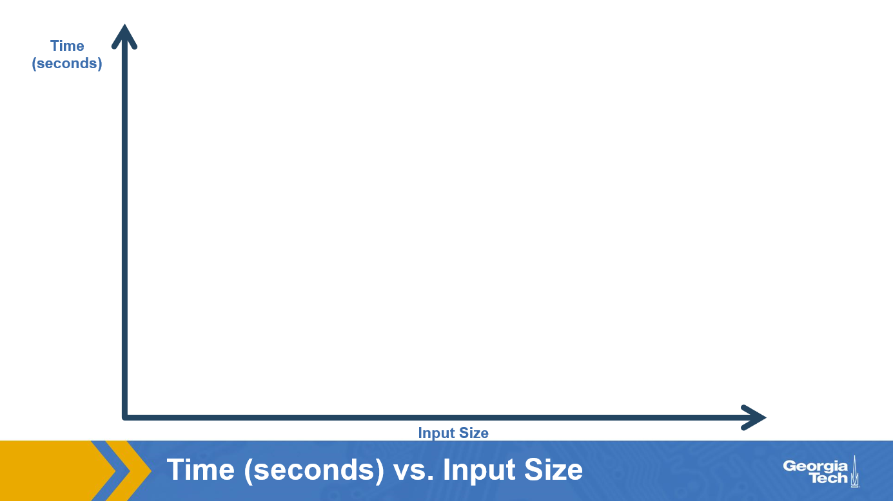
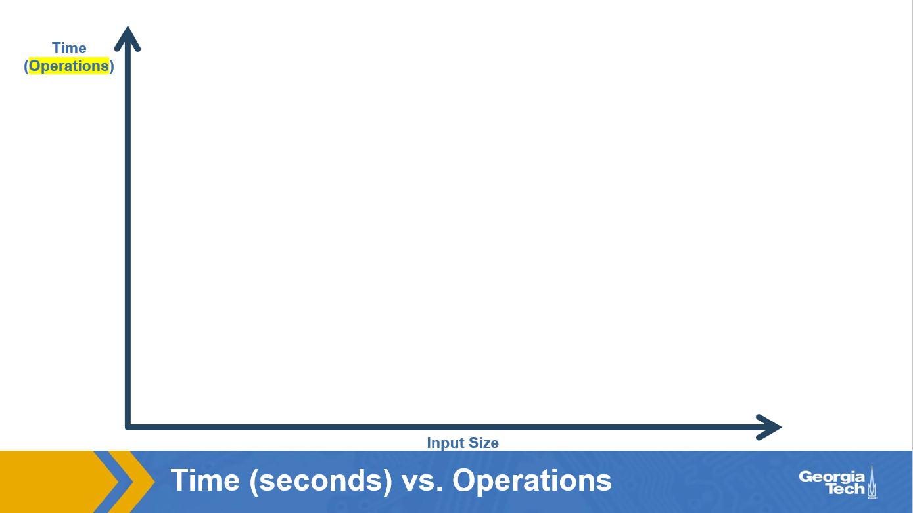
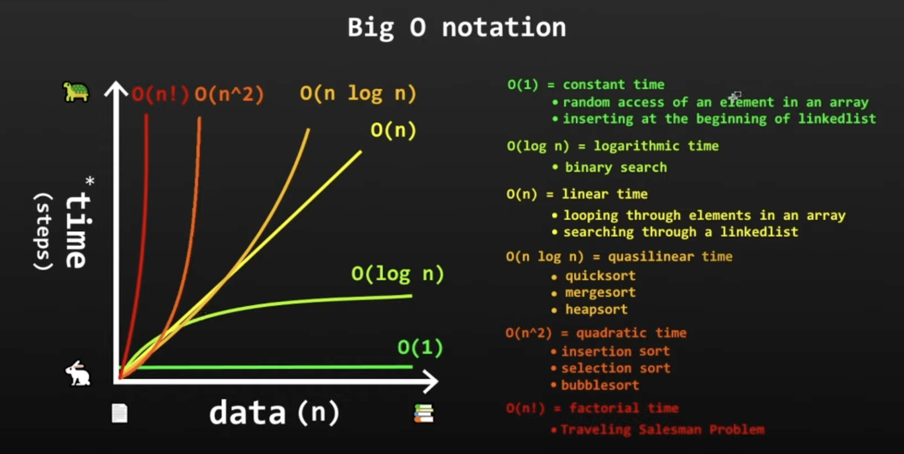

# Comparing Algorithms using Complexity Analysis

The recent walkthroughs of selection and merge sort should give you enough detail to form opinions about the two. In fact, suppose that you were somehow tasked with writing your own general-purpose array sorting method like `Arrays.sort()`. If you specifically had to pick one of the two algorithms for your implementation, which would you choose?

If you’re a beginner to intermediate programmer, which is typical for a student in this course, you might prefer selection sort because the translation from the walkthrough to the actual code (hopefully) wasn't too difficult to follow. With merge sort, on the other hand, you've already read that it uses a repetition concept called recursion that's more complex and less familiar than loops.

But now, let’s say that you have much more than a beginner's level of programming experience and you’re seeking to produce industrial-grade software. Your programs may be facing real-world (and sometimes hurried) users, so the efficiency of your code could easily trump other properties like how hard it is to write or follow it. As it turns out, it's typically the algorithms that are easiest to follow that perform the worst out of their competition.

Does that mean selection sort is less efficient? Let's analyze! Heads up, however, as this process will be a journey over the next few pages. Our first step is to settle on a framework for analysis.

## Analysis via Stopwatch

The efficiency of an algorithm is typically represented by how fast it is and/or how much space it uses. So we might ask, for example, does one algorithm finish a task like sorting an array of many ints in less time than another, and/or does it require less memory to do so? While both resources are important, we’ll focus on the former (i.e. runtime) in our discussion. As famously stated by Georgia Tech's own Professor Merrick Furst: "The biggest difference between time and space is that you can't reuse time."

To pick the fastest sorting algorithm, we could perform a stopwatch-based evaluation by collecting the time it takes each method to sort arrays of various sizes on our computers and then pick the one that minimizes runtime. Here’s some code that can print the number of nanoseconds it takes for the earlier `selectionSort()` method to sort an array called `input` for example:

```java
long start = System.nanoTime();
selectionSort(input); //you can change this to any code block to collect its runtime
long end = System.nanoTime();
System.out.println("Elapsed time in ns:" + (end - start));
```

Simply put, it:

- Gets a long-typed start time from the JVM's internal clock using the `nanoTime()` method of the `System` class.
- Calls `selectionSort()`.
- Gets the end time from the JVM's internal clock using `nanoTime()`.
- Calculates the elapsed time using the difference between the end and start times.

Using the kinds of timing statements above, we could fill out a table like the below for any algorithm:

| Input Size | Selection Sort (seconds) | Merge Sort (seconds) |
| ---------- | ------------------------ | -------------------- |
| 10         | ?                        | ?                    |
| 100        | ?                        | ?                    |
| 1,000      | ?                        | ?                    |
| 10,000     | ?                        | ?                    |
| 100,000    | ?                        | ?                    |
| 1,000,000  | ?                        | ?                    |

As illustrated, incorporating a variety of input sizes (particularly large ones) is important since not one input size fits all problems. One application might involve putting the test grades of as little as 100 students in order while another application may require sorting the friend-counts of billions of users on a social network to find the most popular people.

We live in a highly digital age with increasing computational power and human curiosity. Many computing problems that exist today were not even imagined in the past due to the limits at that time. The future may bring currently unknown applications and problems that require the ability to sort lists that are even several orders of magnitude larger than the largest we're dealing with today.

Therefore, while specific results in a table like the above can be helpful, it is more important to determine the overall behavior of runtime, especially as input sizes get larger and larger (towards infinity). In other words, we really want to know how quickly an algorithm collapses as a potential solution to current and future problems by asking questions like:

- Does the amount of time that an algorithm takes stay constant regardless of how big the input is? That would be really nice, right? We would expect to see no increase between the time it takes to sort the test grades of 100 students versus 100,000,000 for example!
- If the amount of time grows as input size increases, then is the growth a directly proportional one? Here, we would expect that doubling the input size from 100,000,000 grades to 200,000,000, for example, would also result in doubling the runtime. While direct proportionality is not as efficient as the above (constant-time) case, it still seems like a reasonable relationship between input size and time. Soon, we'll see that things could, in fact, be a lot worse.
- If things could be a lot worse, what might the rate of growth look like? For example, if doubling the input size from 100,000,000 to 200,000,000 does more than double the runtime, then by how much?

In computer science, answering such questions is called complexity analysis, where complexity is defined as the efficiency (time or space requirements) of an algorithm in terms of input size. Again, of particular interest here is the behavior of time (not space) as inputs get bigger.

Ostensibly, we could visualize an algorithm’s time complexity by filling in the empty graph below with actual plots of collected runtimes versus input size and then observe the growth rate of the line or curve that connects the dots.



Runtime results from selection sort could demonstrate one kind of growth rate while merge sort's data might show another.

## Analysis via Operation Counts

Even if we embarked on the kind of experiment just described, we must note that the resulting runtimes would only represent an algorithm's performance on the specific computer being used to execute and profile the methods. A stream of questions would immediately follow:

- What do the results say about the computers we did not use?
- Even for the one we did use, which operating systems did it run? A computer's performance can significantly vary depending on the operating system that it’s running.
- What Java version did the computer run? The language has included significant speed improvements over time, so different versions can offer different times.
- What about any other background programs that might have been running during the experiments? In fact, you should try opening up your operating system's task manager right now. You'll see that there's much more running than the browser you're using to view this lesson. These programs and services can consume varying amounts of processor resources during the experiment and thus affect the collected times.

This list of questions and variables could go on since today’s computers are much more than just laptops and desktops. There are even smartwatches, phones, tablets, and other devices with varying computational characteristics and are capable of running Java-based programs. Furthermore, the processing power between two versions of a particular kind of

device can significantly vary even if just a couple of years separate their release dates. Sometime in the future, there might even be a smartphone that takes seconds to sort data that would take hours for a high-end computer of today’s standards.

To avoid device-specific factors, computer scientists therefore represent an algorithm’s runtime using the number of operations it takes to complete a task rather than the elapsed time (e.g. in seconds). The key behind this approach is that the completion of each step of an algorithm during its execution serves as a marker of time passing. Just like it took us time to mentally evaluate each comparison of numbers during the selection sort walkthrough, it would take a computer processor some time to perform each comparison during an actual execution of the selection sort method. We’d expect the computer to be more consistent and faster at how long it takes to evaluate a comparison than us humans though!

Recall that there were more than comparisons involved in selection sort however. Here's the code again, now with highlights that raise the question of which parts represent an individual operation to count in an actual analysis and which might actually be compound:


Should each executed assignment statement be counted? What about the increments and decrements that occur in the for statements? To ensure that all algorithms are analyzed on a level playing field, computer scientists have identified a definitive list of countable operation types. These operation types not only have fixed and very short execution times for any processor but also serve as building blocks that any known algorithm can be broken down into.

Given the multiple references to the comparison operation in this lesson and the highlights above, it's likely no surprise that it is one such type. Assignment and arithmetic operations are other types. There are others. The access of an array element, which selection sort performs frequently is another. Just by looking at what is highlighted above and recalling the counting process we went through just for comparisons, however, you can imagine that a comprehensive operation count can get quite technical. The exercise gets even more tedious when considering complex algorithms and large size inputs, so we won't get in weeds so to speak.

Such a fine-grained analysis will be explored in a more advanced course like CS 1332 (Introduction to Algorithms and Data Structures). Here, we'll keep our discussion of complexity fairly high-level. Hmm. Was that an oxymoron?

Anyhow, here's a slight update to the earlier empty graph so that it now focuses on operation counts not seconds:



Similarly, we can revise our first set of questions concerning runtime growth as follows:

- Does the number of operations that an algorithm performs stay constant regardless of how big the input is?
- If the operation count grows as input size increases, then is the growth a directly proportional one?
- If things could be a lot worse, what might such growth rates look like?

In the next few pages, we’ll go on to answering such questions. While the answers will be centered on the selection versus merge sort match up, the goal (again) is to impress on you the notion that there's more to programming than just writing code that works--or is even well-organized. Seemingly small programming decisions can have significant long term affects.

\*Wow! That would be a very popular class.


