# 03 Wiring Beans
- We need to refer from one bean to another in a straightforward fashion—by telling Spring to provide a reference to an instance from its context where we need it. This way, we establish relationships among the beans (one bean will have a reference to another to delegate calls when it needs). As you probably already know, often in any object-oriented programming language, an object needs to delegate specific responsibilities to others when implementing their behavior, so you need to know how to establish such relationships among objects when you use Spring as a framework as well.
- We start by implementing a relationship between two beans you’ll define in the configuration class by using the **@Bean** annotation. Here we discuss two ways you can establish the relationships among beans:
	- Link the beans by directly calling the methods that create them (which we’ll call wiring).
	- Enable Spring to provide us a value using a method parameter (which we’ll call auto-wiring).
- We discuss a third approach, which is a technique supported by the IoC principle: dependency injection (DI). We’ll discuss how to use DI in Spring, applying the @Autowired annotation to implement the relationship between two beans (which is also an example of auto-wiring). You’ll use both these approaches together in real-world projects.
## Implementing relationships among beans defined in the configuration file
* * *
- In this section, you will learn to implement the relationship between two beans defined in the configuration class annotating methods with the @Bean annotation. You’ll often encounter this approach for establishing the relationships among beans using the Spring configuration. We discussed that we use the @Bean annotation to add beans to the Spring context in the cases in which we cannot change the class for which we want to add the bean, for example, if the class is part of the JDK or another dependency.
- Say we have two instances in the Spring context: a parrot and a person. We’ll create and add these instances to the context. We want to make the person own the parrot. In other words, we need to link the two instances. This straightforward example helps us discuss the two approaches for linking the beans in the Spring context without adding unnecessary complexity and enables you to focus on the Spring configurations only.
- So, for each of the two approaches (wiring and auto-wiring), we have two steps:
	- Add the person and parrot beans to the Spring context.
	- Establish a relationship between the person and the parrot.
- Having two beans in the Spring context, we want to establish a relationship between them. We do this so that one object can then delegate to the other in the implementation of their responsibilities. You can do this using a wiring approach, which implies directly calling the methods that declare the beans to establish the link between them, or through auto-wiring. You use the framework’s dependency injection capabilities.
	- 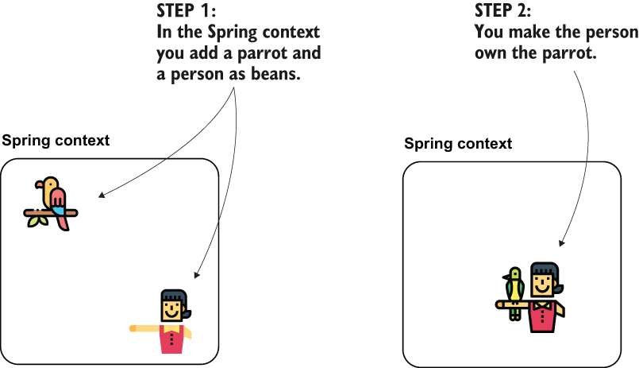
- Implementing the relationship between the beans. This is a simplified diagram representing the “has-A” relationship between the Person and the Parrot objects. We’ll implement this relationship through wiring and auto-wiring.
	- 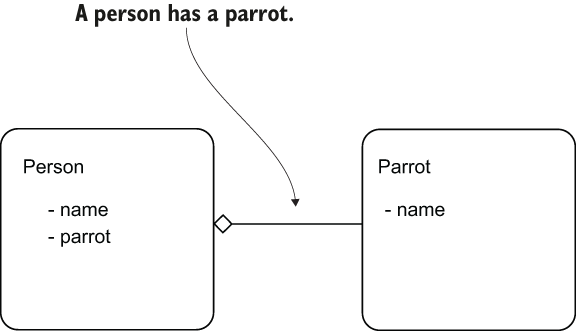
- Let’s start with the remembering how to add the beans into the Spring context using methods annotated with @Bean in the configuration class, as we discussed (step 1). We’ll add a parrot instance and a person instance. Once we have this project ready, we change it to establish the relationship between the two instances (step 2).
- In the pom.xml file of the Maven project, we add the dependency for Spring context as you find it in the next code snippet:
	```
	<dependency>
	   <groupId>org.springframework</groupId>
	   <artifactId>spring-context</artifactId>
	   <version>5.2.7.RELEASE</version>
	</dependency>
	```
- We then define a class to describe the Parrot object and one to describe the Person. In the next code snippet, you find the definition of the Parrot class:
	```
	public class Parrot {

	  private String name;

	  // Omitted getters and setters

	  @Override
	  public String toString() {
		return "Parrot : " + name;
	  }
	}
	```
- In the next code snippet, you find the definition of the Person class:
	```
	public class Person {

	  private String name;
	  private Parrot parrot;

	  // Omitted getters and setters
	}
	```
- The following listing shows you how to define the two beans using the @Bean annotation in the configuration class.
- Defining the Person and the Parrot beans
	```
	@Configuration
	public class ProjectConfig {

	  @Bean
	  public Parrot parrot() {
		Parrot p = new Parrot();
		p.setName("Koko");
		return p;
	  }

	  @Bean
	  public Person person() {
		Person p = new Person();
		p.setName("Ella");
		return p;
	  }
	}
	```
- You can now write a Main class, as presented in the following listing, and check that the two instances aren’t yet linked to one another.
- The definition of the Main class
	```
	public class Main {

	  public static void main(String[] args) {
		var context = new AnnotationConfigApplicationContext
		  (ProjectConfig.class);                      ❶

		Person person = 
		  context.getBean(Person.class);              ❷

		Parrot parrot = 
		  context.getBean(Parrot.class);              ❸

		System.out.println(
		  "Person's name: " + person.getName());      ❹

		System.out.println(
		  "Parrot's name: " + parrot.getName());      ❺

		System.out.println(
		  "Person's parrot: " + person.getParrot());  ❻
	  }}
	```
	❶ Creates an instance of the Spring context based on the configuration class
	❷ Gets a reference to the Person bean from the Spring context
	❸ Gets a reference to the Parrot bean from the Spring context
	❹ Prints the person’s name to prove that the Person bean is in the context
	❺ Prints the parrot’s name to prove that the Parrot bean is in the context
	❻ Prints the person’s parrot to prove that there’s not yet a relationship between the instances
- When running this app, you’ll see a console output similar to the one presented in the next code snippet:
	```
	Person's name: Ella     ❶
	Parrot's name: Koko     ❷
	Person's parrot: null   ❸
	```
	❶ The Person bean is in the Spring context.
	❷ The Parrot bean is in the Spring context.
	❸ The relationship between the person and the parrot isn’t established.
- The most important thing to observe here is that the person’s parrot (third output line) is null. Both the person and the parrot instances are in the context, however. This output is null, which means there’s not yet a relationship between the instances.
- We added the two beans in the context to configure the relationship between them further.
	- 
## Wiring the beans using a direct method call between the @Bean methods
* * *
- In this section, we establish the relationship between the two instances of Person and Parrot. The first way (wiring) to achieve this is to call one method from another in the configuration class. You’ll find this often used because it’s a straightforward approach. In the next listing, you find the small change I had to make in my configuration class to establish a link between the person and the parrot.
- We establish the relationship between the beans using **direct wiring**. This approach implies calling the method that returns the bean you want to set directly. You need to call this method from the one that defines the bean for which you set the dependency.
	- 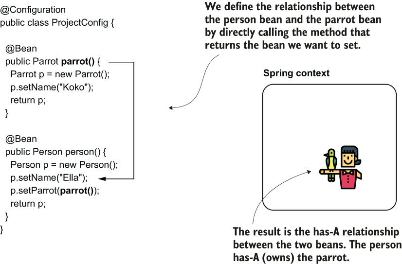
- Making a link between the beans with a direct method call
	```
	@Configuration
	public class ProjectConfig {

	  @Bean
	  public Parrot parrot() {
		Parrot p = new Parrot();
		p.setName("Koko");
		return p;
	  }

	  @Bean
	  public Person person() {
		Person p = new Person();
		p.setName("Ella");
		p.setParrot(parrot());     ❶
		return p;
	  }
	}
	```
	❶ Setting the reference of the parrot bean to the person’s parrot attribute
- Running the same app, you’ll observe the output changed in the console. Now you find (see next snippet) that the second line shows that Ella (the person in the Spring context) owns Koko (the parrot in the Spring context):
	```
	Person's name: Ella
	Person's parrot: Parrot : Koko    ❶
	```
	❶ We now observe the relationship between the person and the parrot has been established.
- Doesn’t this mean that we create two instances of Parrot —one instance Spring creates and adds into its context and another one when the person() method makes the direct call to the parrot() method? No, we actually have only one parrot instance in this application overall.
- Spring creates a parrot instance when it calls the first @Bean annotated method parrot(). Then, Spring creates a person instance when it calls the second @Bean annotated method person(). The second method, person(), directly calls the first method, parrot(). Does this mean two instances of type parrot are created?
	- 
- It might look strange at first, but Spring is smart enough to understand that by calling the parrot() method, you want to refer to the parrot bean in its context. When we use the **@Bean** annotation to define beans into the Spring context, Spring controls how the methods are called and can apply logic above the method call. For the moment, remember that when the person() method calls the parrot() method, Spring will apply logic, as described next.
- If the parrot bean already exists in the context, then instead of calling the parrot() method, Spring will directly take the instance from its context. If the parrot bean does not yet exist in the context, Spring calls the parrot() method and returns the bean.
- When two methods annotated with @Bean call each other, Spring knows you want to create a link between the beans. If the bean already exists in the context (3A), Spring returns the existing bean without forwarding the call to the @Bean method. If the bean doesn’t exist (3B), Spring creates the bean and returns its reference.
	- 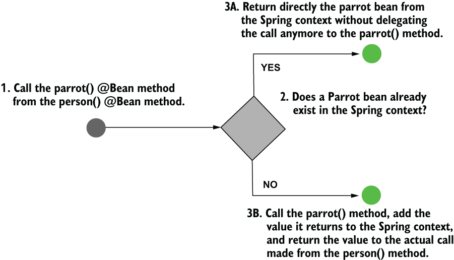
- It’s actually quite easy to test this behavior. Just add a no-args constructor to the Parrot class and print a message into the console from it. How many times will the message be printed in the console? If the behavior is correct, you’ll see the message only once. Let’s do this experiment. In the next code snippet, I’ve changed the Parrot class to add a no-args constructor:
	```
	public class Parrot {

	  private String name;

	  public Parrot() {
		System.out.println("Parrot created");
	  }

	  // Omitted getters and setters

	  @Override
	  public String toString() {
		return "Parrot : " + name;
	  }
	}
	```
- Rerun the app. The output changed (see next code snippet), and now the “Parrot created” message appears as well. You’ll observe it appears only once, which proves that Spring manages the bean creation and calls the parrot() method only once:
```
Parrot created
Person's name: Ella
Person's parrot: Parrot : Koko
```
## Wiring the beans using the @Bean annotated method’s parameters
* * *
In this section, I’ll show you an alternative approach to directly calling the **@Bean** method. Instead of directly calling the method that defines the bean we wish to refer to, we add a parameter to the method of the corresponding type of object, and we rely on Spring to provide us a value through that parameter.
- With this approach, it doesn’t matter if the bean we want to refer to is defined with a method annotated with @Bean or using a stereotype annotation like @Component.
- To demonstrate this approach where we use a parameter instead of calling the @Bean method directly, we’ll take the code and change it to establish the link between the two instances in the context.
- By defining a parameter to the method, we instruct Spring to provide us a bean of the type of that parameter from its context. We can then use the provided bean (parrot) when creating the second one (person). This way we establish the has-A relationship between the two beans.
	- 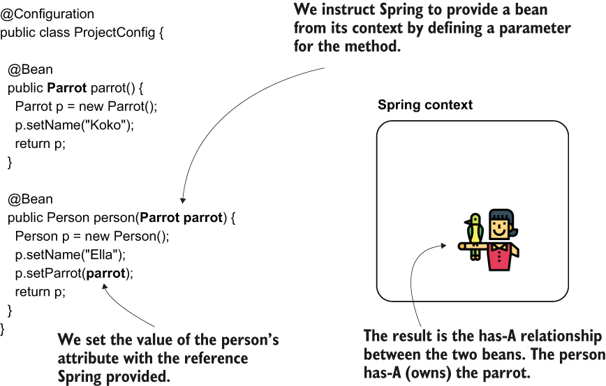
- In the next listing, you find the definition of the configuration class. Take a look at the person() method. It now receives a parameter of type Parrot, and I set the reference of that parameter to the returned person’s attribute. When calling the method, Spring knows it has to find a parrot bean in its context and inject its value into the parameter of the person() method.
	```
	@Configuration
	public class ProjectConfig {

	  @Bean
	  public Parrot parrot() {
		Parrot p = new Parrot();
		p.setName("Koko");
		return p;
	  }

	  @Bean
	  public Person person(Parrot parrot) {     ❶
		Person p = new Person();
		p.setName("Ella");
		p.setParrot(parrot);
		return p;
	  }
	}
	```
	❶ Spring injects the parrot bean into this parameter.
- I refer here to what we will from now on call dependency injection (DI). As its name suggests, DI is a technique involving the framework setting a value into a specific field or parameter. In our case, Spring sets a particular value into the parameter of the person() method when calling it and resolves a dependency of this method. DI is an application of the IoC principle, and IoC implies that the framework controls the application at execution.
- An application that’s not using the IoC principle controls the execution and makes use of various dependencies. An application using the IoC principle allows a dependency to control its execution. The DI is such an example of control. The framework (a dependency) sets a value into a field of an object of the app.
	- 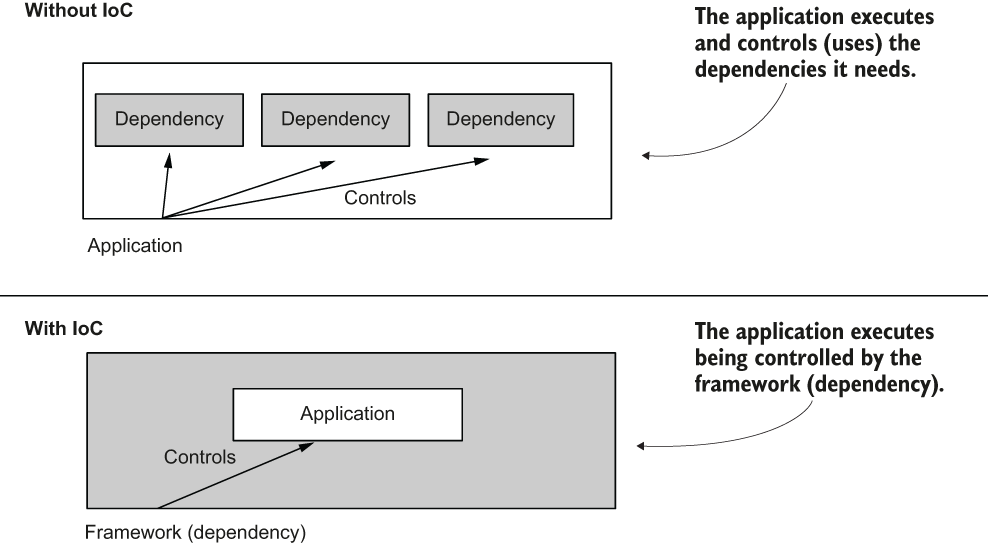
- You’ll often use DI (and not only in Spring) because it’s a very comfortable way to manage object instances that are created and help us minimize the code we write when developing our apps.
- When running the app, the output in your console will be similar to the next code snippet. You observe that the parrot Koko is indeed linked to the person Ella:
	```
	Parrot created
	Person's name: Ella
	Person's parrot: Parrot : Koko
	```
## Using the @Autowired annotation to inject beans
- In this section, we discuss another approach used to create a link between beans in the Spring context. You’ll often encounter this technique, which refers to an annotation named **@Autowired**, when you can change the class for which you define the bean (when this class is not part of a dependency). Using the **@Autowired** annotation, we mark an object’s property where we want Spring to inject a value from the context, and we mark this intention directly in the class that defines the object that needs the dependency. This approach makes it easier to see the relationship between the two objects than the alternatives.
- There are three ways we can use the @Autowired annotation:
	- Injecting the value in the field of the class, which you usually find in examples and proofs of concept
	- Injecting the value through the constructor parameters of the class approach that you’ll use most often in real-world scenarios
	- Injecting the value through the setter, which you’ll rarely use in production-ready code
### Using @Autowired to inject the values through the class fields
* * *
- In this section, we start by discussing the simplest of the three possibilities for using **@Autowired**, which is also the one developers often use in examples: using the annotation over the field.
- As you’ll learn, even if this approach is very straightforward, it has its sins, which is why we avoid using it when writing production code. However, you’ll see it often used in examples, proofs of concept, and in writing tests.
- Using the @Autowired annotation over the field, we instruct Spring to provide a value for that field from its context. Spring creates the two beans, person and parrot, and injects the parrot object to the field of the bean of type Person.
	- 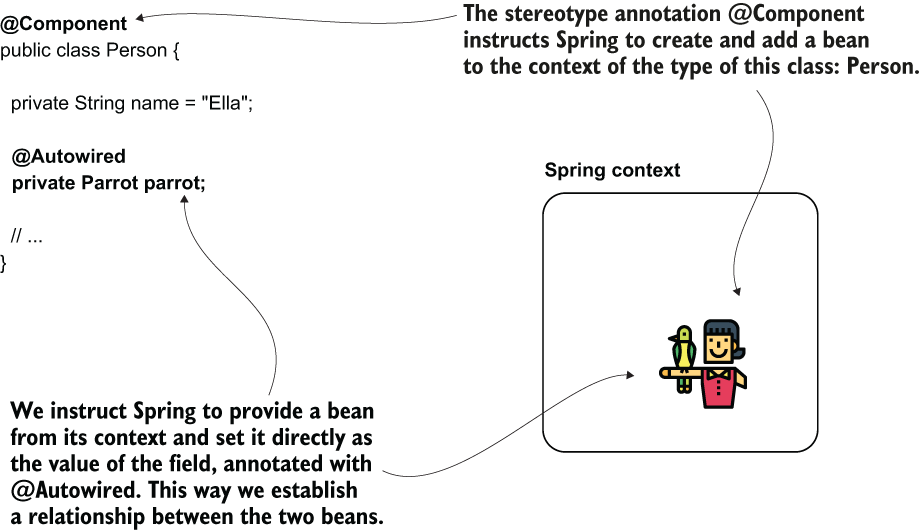
- Let’s start with the classes defining our two objects: Person and Parrot. You find the definition of the Parrot class in the next code snippet:
	```
	@Component
	public class Parrot {

	  private String name = "Koko";

	  // Omitted getters and setters

	  @Override
	  public String toString() {
		return "Parrot : " + name;
	  }
	}
	```
- We use the stereotype annotation as an alternative to creating the bean using the configuration class. When annotating a class with @Component, Spring knows it has to create an instance of that class and add it to its context. The next code snippet shows the definition of the Person class:
	```
	@Component
	public class Person {

	  private String name = "Ella";

	  @Autowired                   ❶
	  private Parrot parrot;

	  // Omitted getters and setters
	}
	```
	❶ Annotating the field with @Autowired, we instruct Spring to inject an appropriate value from its context.
- I’ve used stereotype annotations to add the beans in the Spring context for this example. I could have defined the beans using **@Bean**, but most often, in real-world scenarios, you’ll encounter **@Autowired** used together with stereotype annotations, so let’s focus on the approach that’s most useful for you.
- To continue our example, we define a configuration class. I’ll name the configuration class ProjectConfig. Over this class, I’ll use the @ComponentScan annotation to tell Spring where to find the classes I’ve annotated with @Component. The next code snippet shows the definition of the configuration class:
	```
	@Configuration
	@ComponentScan(basePackages = "beans")
	public class ProjectConfig {

	}
	```
- I’ll then use the main class, the same way I’ve used in the previous examples of this chapter, to prove that Spring injected the parrot bean’s reference correctly:
	```
	public class Main {

	  public static void main(String[] args) {
		var context = new AnnotationConfigApplicationContext
							(ProjectConfig.class);

		Person p = context.getBean(Person.class);

		System.out.println("Person's name: " + p.getName());
		System.out.println("Person's parrot: " + p.getParrot());
	  }
	}
	```
- This will print in the app’s console something similar to the output presented next. The second line of the output proves that the parrot (in my case, named Koko) belongs to the person bean (named Ella):
	```
	Person's name: Ella
	Person's parrot: Parrot : Koko
	```
- Why is this approach not desired in production code? It’s not totally wrong to use it, but you want to make sure you make your app maintainable and testable in production code. By injecting the value directly in the field:
	- **you don’t have the option to make the field final** (see next code snippet), and this way, make sure no one can change its value after initialization:
	- it’s **more difficult to manage the value yourself at initialization**.
	```
	@Component
	public class Person {

	  private String name = "Ella";

	  @Autowired   
	  private final Parrot parrot;     ❶

	}
	```
	❶ This doesn’t compile. You cannot define a final field without an initial value.
### Using @Autowired to inject the values through the constructor
* * *
- The second option you have for injecting values into the object’s attributes when Spring creates a bean is using the class’s constructor defining the instance.
- This approach is the one used most often in production code and the one I recommend. It enables you to define the fields as final, ensuring no one can change their value after Spring initializes them. The possibility to set the values when calling the constructor also helps you when writing specific unit tests where you don’t want to rely on Spring making the field injection for you (but more on this subject later).
- When you define a parameter of the constructor, Spring provides a bean from its context as a value to that parameter when calling the constructor.
	- 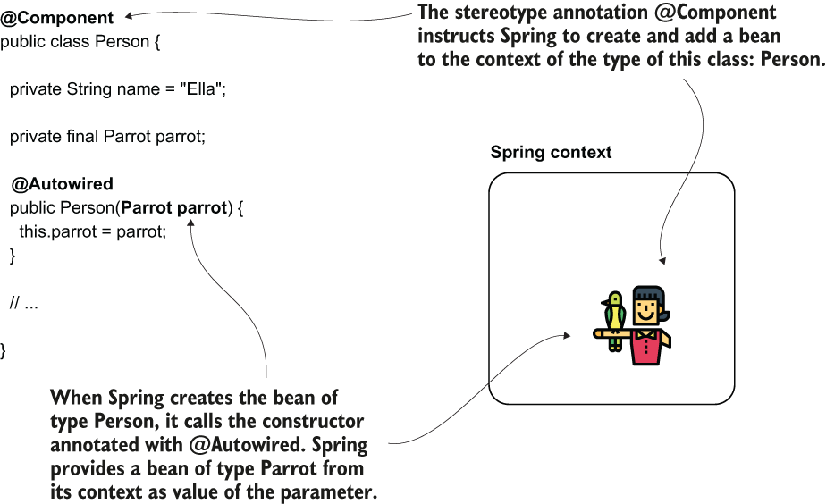
- You only need to change the Person class, as presented in the following listing. You need to define a constructor for the class and annotate it with @Autowired. Now we can also make the parrot field final. You don’t need to make any changes to your configuration class.
	```
	@Component
	public class Person {

	  private String name = "Ella";

	  private final Parrot parrot;    ❶

	  @Autowired                      ❷
	  public Person(Parrot parrot) {
		this.parrot = parrot;
	  }

	  // Omitted getters and setters

	}
	```
	❶ We can now make the field final to ensure its value cannot be changed after initialization.
	❷ We use the @Autowired annotation over the constructor.
- As you can see in the next code snippet, the person owns the parrot, so Spring established the link between the two instances correctly:
	```
	Person's name: Ella
	Person's parrot: Parrot : Koko
	```
- Starting with Spring version 4.3, when you only have one constructor in the class, you can omit writing the @Autowired annotation.
### Using dependency injection through the setter
* * *
- You won’t often find developers applying the approach of using the setter for dependency injection. This approach has more disadvantages than advantages: it’s more challenging to read, it doesn’t allow you to make the field final, and it doesn’t help you in making the testing easier. Even so, I wanted to mention this possibility. You might encounter it at some point, and I don’t want you to wonder about its existence then. Even if it’s not something I recommend, I have seen this used in a couple of old apps.
- You’ll find an example of using the setter injection. You’ll find that I only needed to change the Person class to implement this. In the next code snippet, I used the @Autowired annotation on the setter:
	```
	@Component
	public class Person {

	  private String name = "Ella";

	  private Parrot parrot;

	  // Omitted getters and setters

	  @Autowired
	  public void setParrot(Parrot parrot) {
		this.parrot = parrot;
	  }
	}
	```
- When running the app, you’ll get the same output as the previously discussed examples of this section.
## Dealing with circular dependencies
* * *
- Spring can also get confused in some cases. A scenario often encountered in practice is generating a circular dependency by mistake.
- A circular dependency is a situation in which, to create a bean (let’s name it Bean A), Spring needs to inject another bean that doesn’t exist yet (Bean B). But Bean B also requests a dependency to Bean A. So, to create Bean B, Spring needs first to have Bean A. Spring is now in a deadlock. It cannot create Bean A because it needs Bean B, and it cannot create Bean B because it needs Bean A.
- A circular dependency. Spring needs to create a bean of type Parrot. But because Parrot has as a dependency a Person, Spring needs first to create a Person. However, to create a Person, Spring already needs to have built a Parrot. Spring is now in a deadlock. It cannot create a Parrot because it needs a Person, and it cannot create a Person because it needs a Parrot.
	- 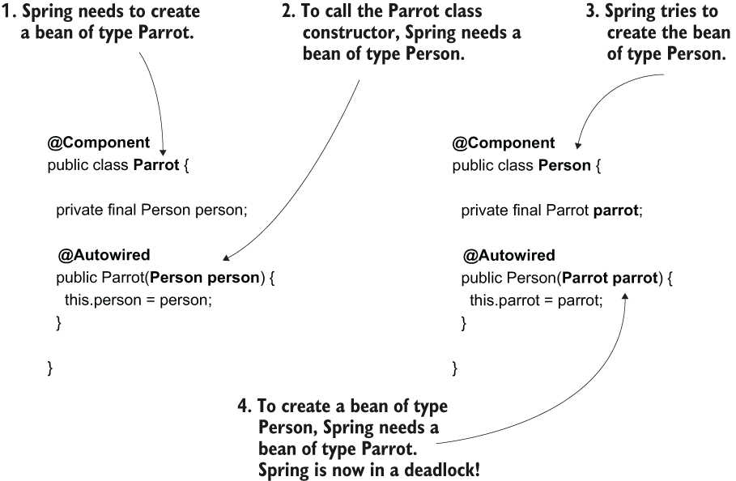
- A circular dependency is easy to avoid. You just need to make sure you don’t define objects whose creation depends on the other. Having dependencies from one object to another like this is a bad design of classes. In such a case, you need to rewrite your code.
- As presented in the next code snippets, I made the Parrot bean’s instantiation dependent on the Person bean and vice-versa.
- The Person class:
	```
	@Component
	public class Person {

	  private final Parrot parrot;

	  @Autowired
	  public Person(Parrot parrot) {    ❶
		this.parrot = parrot;
	  }

	  // Omitted code

	}
	```
	❶ To create the Person instance, Spring needs to have a Parrot bean.
- The Parrot class:
	```
	public class Parrot {

	  private String name = "Koko";

	  private final Person person;

	  @Autowired
	  public Parrot(Person person) {    ❶
		this.person = person;
	  }

	  // Omitted code
	}
	```
	❶ To create the Parrot instance, Spring needs to have a Person bean.
- Running the app with such a configuration will lead to an exception like the one presented in the next snippet:
	```
	Caused by: org.springframework.beans.factory.BeanCurrentlyInCreationException: Error creating bean with name 'parrot': Requested bean is currently in creation: Is there an unresolvable circular reference?
		at org.springframework.beans.factory.support.DefaultSingletonBeanRegistry.beforeSingletonCreation(DefaultSingletonBeanRegistry.java:347)
	```
- With this exception, Spring tries to tell you the problem it encountered. The exception message is quite clear: Spring deals with a circular dependency and the classes that caused the situation. Whenever you find such an exception, you need to go to the classes specified by the exception and eliminate the circular dependency.
## Choosing from multiple beans in the Spring context
* * *
- In this section, we discuss the scenario in which Spring needs to inject a value into a parameter or class field but has multiple beans of the same type to choose from. Say you have three Parrot beans in the Spring context. You configure Spring to inject a value of type Parrot into a parameter. How will Spring behave? Which of the beans of the same type would the framework choose to inject in such a scenario?
- Depending on your implementation, you have the following cases:
	- The identifier of the parameter matches the name of one of the beans from the context (which, remember, is the same as the name of the method annotated with @Bean that returns its value). In this case, Spring will choose the bean for which the name is the same as the parameter.
	- The identifier of the parameter doesn’t match any of the bean names from the context. Then you have the following options:
		- You marked one of the beans as primary (using the @Primary annotation). In this case, Spring will select the primary bean for injection.
		- You can explicitly select a specific bean using the @Qualifier annotation, which we discuss in this chapter.
		- If none of the beans is primary and you don’t use @Qualifier, the app will fail with an exception, complaining that the context contains more beans of the same type and Spring doesn’t know which one to choose.
- The next listing shows you a configuration class that defines two Parrot instances and uses injection through the method parameters.
	```
	@Configuration
	public class ProjectConfig {

	  @Bean
	  public Parrot parrot1() {
		Parrot p = new Parrot();
		p.setName("Koko");
		return p;
	  }

	  @Bean
	  public Parrot parrot2() {
		Parrot p = new Parrot();
		p.setName("Miki");
		return p;
	  }

	  @Bean
	  public Person person(Parrot parrot2) {     ❶
		Person p = new Person();
		p.setName("Ella");
		p.setParrot(parrot2);
		return p;
	  }
	}
	```
	❶ The name of the parameter matches the name of the bean representing parrot Miki.
- Running the app with this configuration, you’d observe a console output similar to the next code snippet. Observe that Spring linked the person bean to the parrot named Miki because the bean representing this parrot has the name parrot2.
	```
	Parrot created
	Person's name: Ella
	Person's parrot: Parrot : Miki
	```
- One way to instruct Spring to provide you a specific instance from its context, when the context contains more than one instance of the same type, is to rely on the name of this instance. Just name the parameter the same as the instance you’d like Spring to provide you.
	- 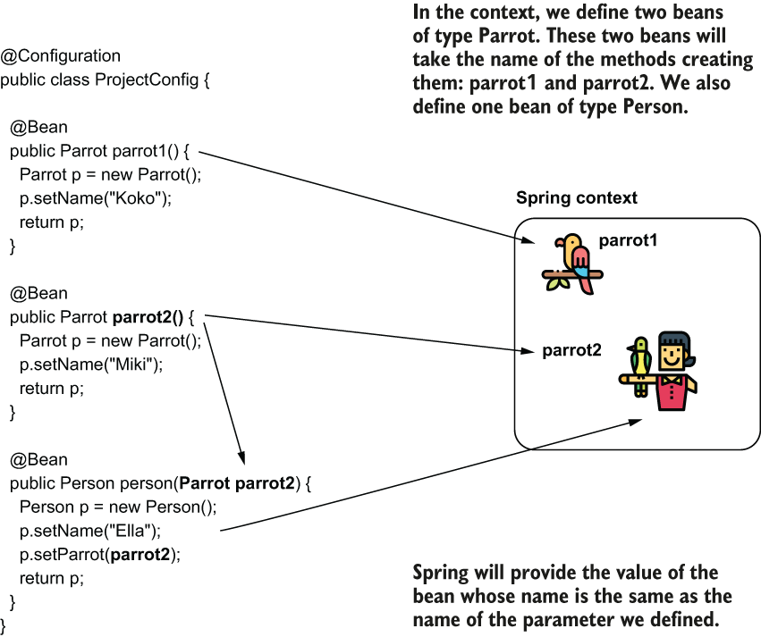
- In a real-world scenario, I prefer to avoid relying on the name of the parameter, which could be easily refactored and changed by mistake by another developer. To feel more comfortable, I usually choose a more visible approach to express my intention to inject a specific bean: using the **@Qualifier** annotation. Again, in my experience, I found developers arguing for and against using the **@Qualifier** annotation.
- The following listing provides an example using the @Qualifier annotation. Observe that instead of having a specific identifier of the parameter, I now specify the bean I want to inject using the value attribute of the @Qualifier annotation.
	```
	@Configuration
	public class ProjectConfig {

	  @Bean
	  public Parrot parrot1() {
		Parrot p = new Parrot();
		p.setName("Koko");
		return p;
	  }

	  @Bean
	  public Parrot parrot2() {
		Parrot p = new Parrot();
		p.setName("Miki");
		return p;
	  }

	  @Bean
	  public Person person(
		@Qualifier("parrot2") Parrot parrot) {    ❶

		Person p = new Person();
		p.setName("Ella");
		p.setParrot(parrot);
		return p;
	  }
	}
	```
	❶ Using the @Qualifier annotation, you clearly mark your intention to inject a specific bean from the context.
- Rerunning the application, the app prints the same result into the console:
	```
	Parrot created
	Person's name: Ella
	Person's parrot: Parrot : Miki
	```
- A similar situation can also happen when using the @Autowired annotation. We define two beans of type Parrot (using the @Bean annotation) and an instance of Person (using stereotype annotations). I’ll configure Spring to inject one of the two parrot beans in the bean of type Person.
- As presented in the next code snippet, I didn’t add the @Component annotation to the Parrot class because I intend to define the two beans of type Parrot using the @Bean annotation in the configuration class:
	```
	public class Parrot {

	  private String name;

	  // Omitted getters, setters, and toString()  
	}
	```
- We define a bean of type Person using the @Component stereotype annotation. Observe the identifier I gave to the parameter of the constructor in the next code snippet. The reason I gave the identifier “parrot2” is this is the name I’ll also configure for the bean in the context I want Spring to inject into that parameter:
	```
	@Component
	public class Person {

	  private String name = "Ella";

	  private final Parrot parrot;

	  public Person(Parrot parrot2) {
		this.parrot = parrot2;
	  }

	  // Omitted getters and setters

	}
	```
- I define two beans of type Parrot using the @Bean annotation in the configuration class. Don’t forget we still have to add @ComponentScan to tell Spring where to find the classes annotated with stereotype annotations. In our case, we annotated class Person with the @Component stereotype annotation. The next listing shows the definition of the configuration class.
	```
	@Configuration
	@ComponentScan(basePackages = "beans")
	public class ProjectConfig {

	  @Bean
	  public Parrot parrot1() {
		Parrot p = new Parrot();
		p.setName("Koko");
		return p;
	  }

	  @Bean    
	  public Parrot parrot2() {      ❶
		Parrot p = new Parrot();
		p.setName("Miki");
		return p;
	  }
	}
	```
	❶ With the current setup, the bean named parrot2 is the one that Spring injects into the Person bean.
- What happens if you run a main method as the one presented in the next code snippet? Our person owns which parrot? Because the name of the constructor’s parameter matches one of the bean’s names in the Spring context (parrot2), Spring injects that bean, so the name of the parrot the app prints in the console is Miki:
	```
	public class Main {

	  public static void main(String[] args) {
		var context = new 
			AnnotationConfigApplicationContext(ProjectConfig.class);

		Person p = context.getBean(Person.class);

		System.out.println("Person's name: " + p.getName());
		System.out.println("Person's parrot: " + p.getParrot());
	  }
	}
	```
- When the Spring context contains multiple beans of the same type, Spring will select the bean whose name matches the name of the parameter.
	- 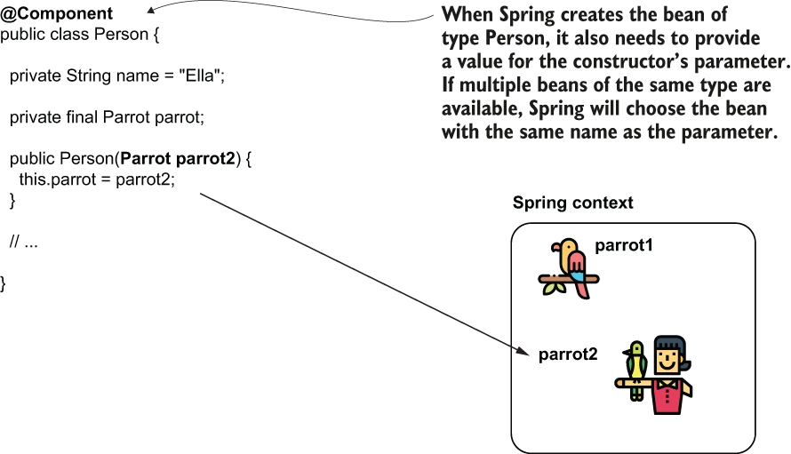
- Running this app, the console shows the following output:
	```
	Person's name: Ella
	Person's parrot: Parrot : Miki
	```
- As we discussed for the @Bean annotated method parameter, I recommend against relying on the name of the variable. Instead, I prefer using the **@Qualifier** annotation to express my intention clearly: I inject a specific bean from the context. This way, we minimize the chance that someone would refactor the name of the variable and thus affect how the app works.
- Look at the change I made to the Person class in the next code snippet. Using the @Qualifier annotation, I specify the name of the bean I want Spring to inject from the context, and I don’t rely on the identifier of the constructor’s parameter.
	```
	@Component
	public class Person {

	  private String name = "Ella";

	  private final Parrot parrot;

	  public Person(@Qualifier("parrot2") Parrot parrot) {
		this.parrot = parrot;
	  }

	 // Omitted getters and setters

	}
	```
- The behavior of the app doesn’t change, and the output remains the same. This approach makes your code less subject to mistakes.