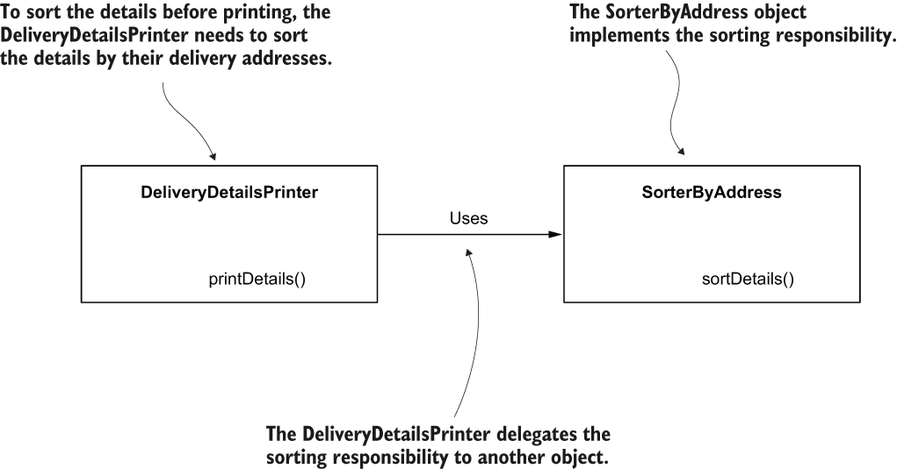
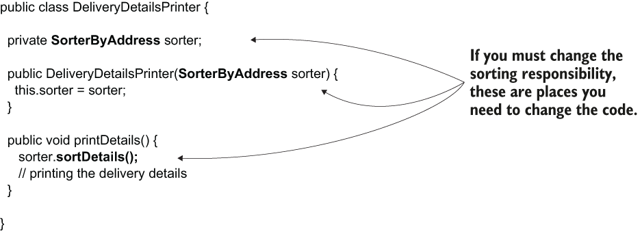
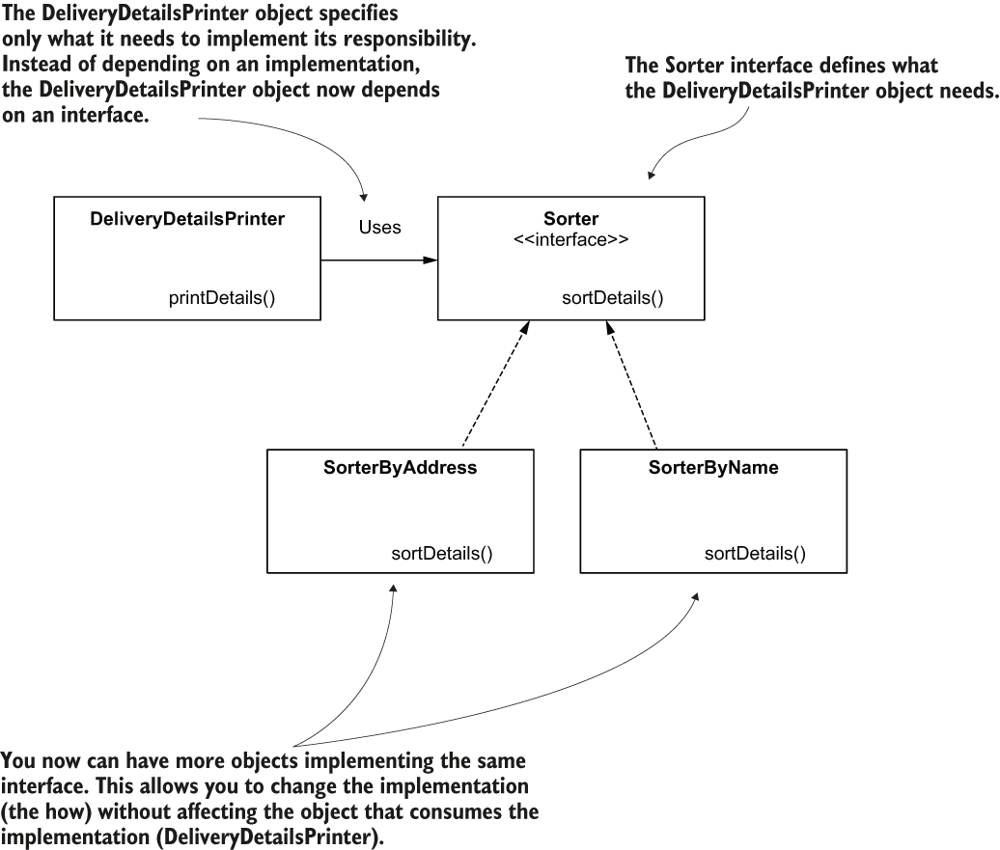
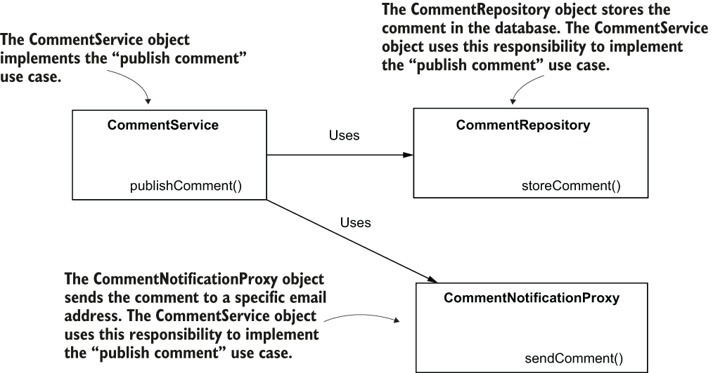
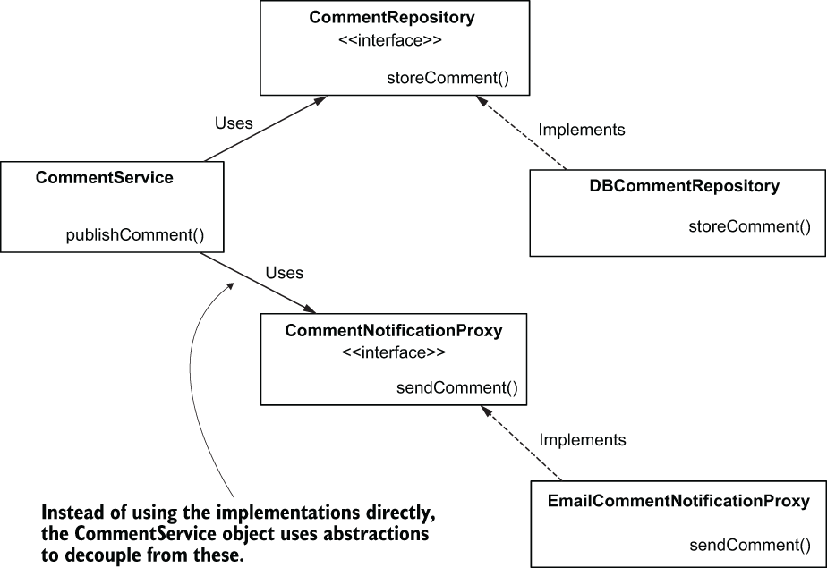
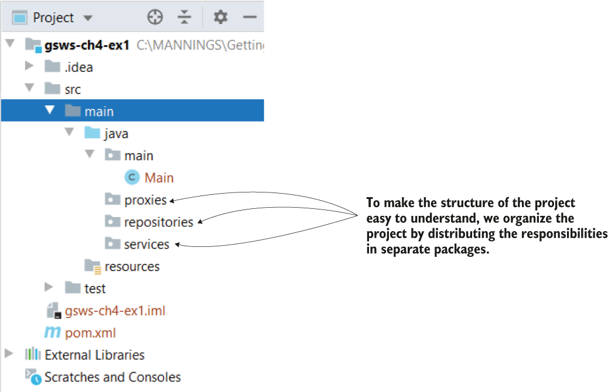
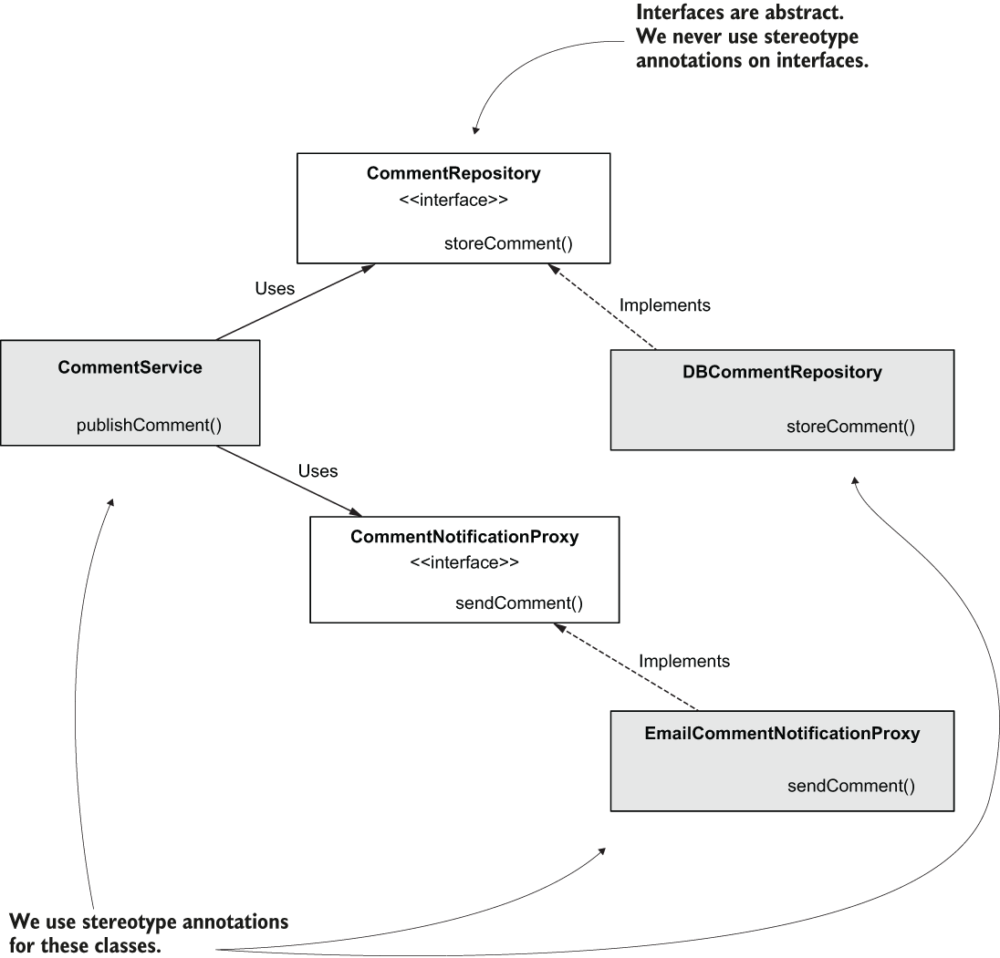
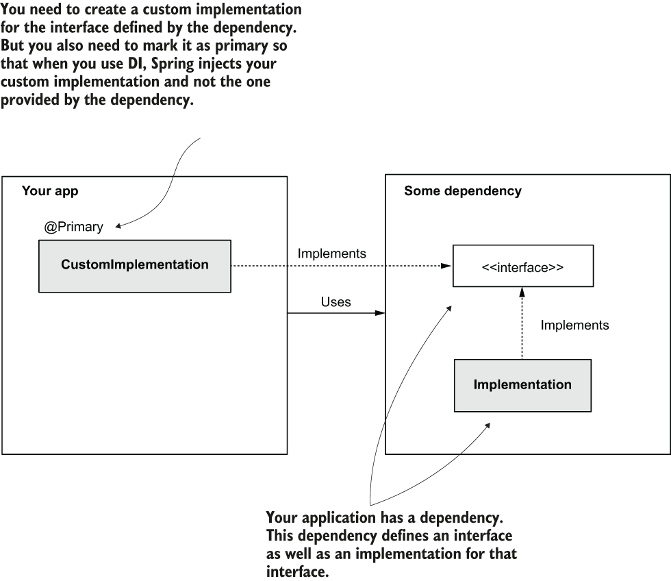
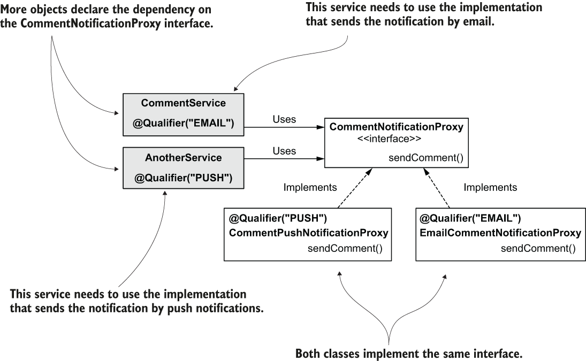
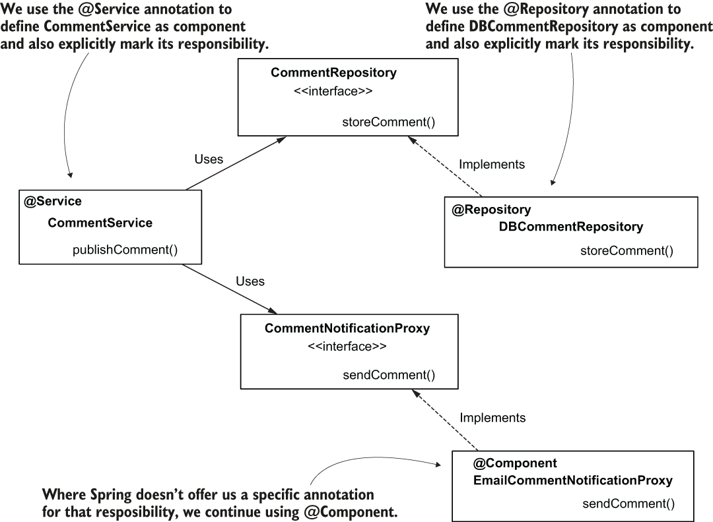

# 04 Using Abstractions
- In this chapter, we discuss using abstraction with Spring beans. This topic is essential because in real-world projects, we often use abstractions to decouple implementations. As you’ll learn in this chapter, we ensure our application is comfortable to maintain and test by decoupling implementations.
- we begin by discussing objects’ responsibilities and find out how they fit in a standard class design of an app.
## Using interfaces to define contracts
* * *
- In Java, the **interface** is an abstract structure you use to declare a specific responsibility. An object implementing the interface has to define this responsibility. More objects implementing the same interface can define the responsibility declared by that interface in different ways. We can say that the interface specifies the **“what needs to happen,”** while every object implementing the interface specifies the **“how it should happen.”**
### Using interfaces for decoupling implementations
- This section discusses what contracts are and how you can define them in a Java app using interfaces.
- **An analogy**: Suppose you use a ride-sharing app because you need to get somewhere. When you order a trip, you usually don’t care how the car looks or who the driver is. You just need to get somewhere. In my case, I don’t care whether a car or a spaceship comes to pick me up if I reach the destination in time. The ride-sharing app is an interface. The customer doesn’t request a car or a driver, but a trip. Any driver with a car who can offer the service can answer the customer’s request. The customer and the driver are decoupled through the app (interface); the customer doesn’t know who the driver is nor which car will pick them up before a car responds to their request, and the driver doesn’t need to know who they do the service for. Using this analogy, you can deduce the role of interfaces in relationship with objects in Java.
- **An implementation example**: Say you implement an object that needs to print packages’ details to be delivered for a shipping app. The printed details must be sorted by their destination address. The object dealing with printing the details needs to delegate to some other object the responsibility of sorting the packages by their delivery addresses
- The `DeliveryDetailsPrinter` object delegates the responsibility of sorting the delivery details by the delivery addresses to another object named `SorterByAddress`.
	- 
- The `DeliveryDetailsPrinter` directly delegates the sorting responsibility to the `SorterByAddress` object. If we keep this class design, we may face difficulties later if we need to change this functionality. Let’s imagine you need to change the printed details order later, and the new order is by the sender’s name. You’d need to replace the `SorterByAddress` object with another one implementing the new responsibility, but you’d also need to change the `DeliveryDetailsPrinter` object that uses the sorting responsibility.
- Because the two objects are strongly coupled, if you want to change the sorting responsibility, you also need to change the object using this responsibility. A better design would allow you to change the sorting responsibility without changing the object that uses the responsibility.
	- 
- How can we improve this design? **When changing an object’s responsibility, we want to avoid the need to change other objects using the changed responsibility.**
- This design’s problem occurs because the `DeliveryDetailsPrinter` object specifies both what it needs and how it needs. As discussed earlier, **an object only needs to specify what it needs and stay completely unaware of how the what is implemented.**
- We do this, of course, by using **interfaces**.
- I introduced an interface named `Sorter` to decouple the two objects. Instead of declaring a `SorterByAddress`, the `DeliveryDetailsPrinter` object only specifies it needs a `Sorter`. You can now have as many objects as you’d like to solve the what requested by the `DeliveryDetailsPrinter`. Any object implementing the Sorter interface can satisfy the dependency of the DeliveryDetailsPrinter object at any time.
- Using an interface to decouple the responsibilities. Instead of depending directly on an implementation, the `DeliveryDetailsPrinter` object depends on an interface (a contract). `DeliveryDetailsPrinter` can use any object implementing this interface instead of being stuck to a specific implementation.
	- 
- In the next code snippet, you find the Sorter interface definition:
	```
	public interface Sorter {
	  void sortDetails();
	}
	```
- Because the `DeliveryDetailsPrinter` object depends on the interface instead of the implementation directly, you don’t need to change it further if you change the way the delivery details are sorted.
- The `DeliveryDetailsPrinter` object depends on the `Sorter` interface. You can change the implementation of the `Sorter` interface and avoid making more changes to the object using this responsibility (`DeliveryDetailsPrinter`).
	- 
- With this theoretical introduction, you are now aware of why we use interfaces to decouple the objects that depend on each other in the class design.
- Next, we implement a requirement for a scenario. We’ll implement this requirement using plain Java, without any framework, and we’ll focus on objects’ responsibilities and using interfaces to decouple them. At the end of this section, we’ll have a project defining some objects that collaborate to implement a use case.
- Later, we’ll change the project and add Spring to it to manage the objects as well as the relationships among them with dependency injection. By taking this step-by-step approach, you’ll more easily observe the changes needed to add Spring to an app, as well as the benefits that would come with this change.
### The requirement of the scenario
* * *
- Say you are implementing an app a team uses to manage their tasks. One of the app’s features is allowing the users to leave comments for the tasks. When a user publishes a comment, it is stored somewhere (e.g., in a database), and the app sends an email to a specific address configured in the app.
- We need to design the objects and find the right responsibilities and abstractions for implementing this feature.
### Implementing the requirement without using a framework
* * *
- First, we need to identify the objects (responsibilities) to implement.
- In standard real-world applications, we usually refer to the objects implementing uses cases as services, and that’s what we’ll do here. We’ll need a service that implements the “publish comment” use case. Let’s name this object `CommentService`.
- When analyzing the requirement again, we observe that the use case consists of two actions: **storing the comment** and **sending the comment by mail**. As they are quite different from one another, we consider these actions to be two different responsibilities, and thus we need to implement two different objects.
- When we have an object working directly with a database, we generally name such an object **repository**. Sometimes you also find such objects referred to as **data access objects (DAO).** Let’s name the object that implements the storing comment responsibility `CommentRepository`.
- Finally, in a real-world app, when implementing objects whose responsibility is to establish communication with something outside the app, we name these objects **proxies**, so let’s name the object whose responsibility is sending the email `CommentNotificationProxy`.
- The `CommentService` object implements the “publish comment” use case. To do this, it needs to delegate to the responsibilities implemented by the `CommentRepository` and the `CommentNotificationProxy` objects.
	- 
- But wait! Didn’t we say **we shouldn’t use direct coupling between implementations**? **We need to make sure we decouple the implementations by using interfaces.**
- In the end, the `CommentRepository` might now use a database to store the comments. But in the future, maybe this needs to be changed to use some other technology or an external service.
- We can say the same for the `CommentNotificationProxy` object. Now it sends the notification by email, but maybe in a future version the comment notification needs to be sent through some other channel.
- We certainly want to make sure we decouple the `CommentService` from the implementations of its dependencies so that when we need to change the dependencies, we don’t need to change the object using them as well.
- The below figure shows how to decouple this class design by using **abstractions**. Instead of designing `CommentRepository` and `CommentNotificationProxy` as classes, we design them as **interfaces** that we can implement to define the functionality.
- The `CommentService` object depends on the abstractions provided by `CommentRepository` and `CommentNotificationProxy` interfaces. The classes `DBCommentRepository` and `EmailCommentNotificationProxy` further implement these interfaces. This design decouples the implementation of the “publish comment” use case from its dependencies and makes the application easier to change for future developments.
	- 
- Now that we have a clear picture of what we want to implement, let’s start coding it. For the moment, we create a plain Maven project, without adding any external dependencies to the pom.xml file.
- I’ll organize it as presented in figure below, separating the different responsibilities in their own packages.
- The project structure. We declare a separate package for each responsibility to make the structure of the project easy to read and understand.
	- 
- One thing I didn’t mention earlier (to allow you to focus on the main responsibilities of the app) is that we’ll also have to represent the comment somehow. We just need to write a small POJO class for defining the comment. We start the implementation of the use case with writing this POJO class.
- The responsibility of this type of object is simply to model the data the app uses, and we call it **model**.
- I’ll consider a comment that has two attributes: a text and an author. Let’s create a package model in which we define a class `Comment`. The following listing presents the definition of this class.
	```
	public class Comment {

	  private String author;
	  private String text;

	  // Omitted getters and setters
	}
	```
- A **POJO** is a simple object without dependencies, only described by its attributes and methods. In our case, the Comment class defines a POJO describing the details of a comment by its two attributes: author and text.
- We can now define the responsibilities of repository and proxy. In the next listing, you can see the definition of the `CommentRepository` interface. The contract defined by this interface declares the `storeComment(Comment comment)` method, which the `CommentService` object needs to implement the use case. We store this interface and the class implementing it in the **repositories** package of the project.
	```
	public interface CommentRepository {

	  void storeComment(Comment comment);
	}
	```
- The interface only gives the what the `CommentService` object needs for implementing the use case: store a comment. When you define an object that implements this contract, it needs to override the `storeComment(Comment comment)` method to define the how.
- In the next listing, you find the definition of the `DBCommentRepository` class. We don’t know yet how to connect to a database, so we’ll only write a text in the console to simulate this action.
	```
	public class DBCommentRepository implements CommentRepository {

	  @Override
	  public void storeComment(Comment comment) {
		System.out.println("Storing comment: " + comment.getText());
	  }
	}
	```
- Similarly, we define an interface for the second responsibility the `CommentService` object needs: `CommentNotificationProxy`. We define this interface and the class implementing it in the **proxies** package of the project. The following listing presents this interface.
	```
	public interface CommentNotificationProxy {

	  void sendComment(Comment comment);
	}
	```
- In the next listing, you find the implementation for this interface, which we’ll use in our demonstration.
	```
	public class EmailCommentNotificationProxy 
	  implements CommentNotificationProxy {

	  @Override
	  public void sendComment(Comment comment) {
		System.out.println("Sending notification for comment: " 
							 + comment.getText());
	  }
	}
	```
- We can now implement the object itself with the two dependencies of the `CommentService` object (the `CommentRepository` and the `CommentNotificationProxy`). In the **services** package, we write the `CommentService` class as presented in the following listing.
	```
	public class CommentService {

	  private final CommentRepository commentRepository;                  ❶
	  private final CommentNotificationProxy commentNotificationProxy;    ❶

	  public CommentService(                                              ❷
			   CommentRepository commentRepository,
			   CommentNotificationProxy commentNotificationProxy) {

		this.commentRepository = commentRepository;
		this.commentNotificationProxy = commentNotificationProxy;
	  }

	  public void publishComment(Comment comment) {                       ❸
		commentRepository.storeComment(comment);
		commentNotificationProxy.sendComment(comment);
	  }
	}
	```
	❶ We define the two dependencies as attributes of the class.
	❷ We provide the dependencies when the object is built through the parameters of the constructor.
	❸ We implement the use case that delegates the “store comment” and “send notification” responsibilities to the dependencies.
- Let’s now write a Main class, as presented in the next listing, and test the whole class design.
	```
	public class Main {

	  public static void main(String[] args) {
		var commentRepository = 
		  new DBCommentRepository();              ❶
		var commentNotificationProxy =            ❶
		  new EmailCommentNotificationProxy();    ❶

		var commentService = 
		  new CommentService(                     ❷
			  commentRepository, commentNotificationProxy);

		var comment = new Comment();              ❸
		comment.setAuthor("Laurentiu");           ❸
		comment.setText("Demo comment");          ❹

		commentService.publishComment(comment);   ❹
	  }
	}
	```
	❶ Creates the instance for the dependencies
	❷ Creates the instance of the service class and providing the dependencies
	❸ Creates an instance of comment to send as a parameter to the publish comment use case
	❹ Calls the publish comment use case
- When running this application, you’ll observe the two lines in the console printed by the `CommentRepository` and the `CommentNotificationProxy` objects. The next code snippet presents this output:
	```
	Storing comment: Demo comment
	Sending notification for comment: Demo comment
	```
## Using dependency injection with abstractions
* * *
- In this section, we apply the Spring framework over the class design we implemented.
- Using this example, we can discuss **how Spring manages dependency injection when using abstractions.** This subject is essential because in most projects, you’ll implement dependencies between objects using abstractions.
- We’ll start by adding the Spring dependency to our project, and then we’ll decide which of the objects of this application need to be managed by Spring. You’ll learn to decide which objects you need to make Spring aware of.
- We’ll focus on discussing various situations that can appear when using **dependency injection with abstractions.** At the end of the section, we’ll discuss more on the stereotype annotations. You’ll find out **@Component** is not the only stereotype annotation you can use and when you should use other annotations.
### Deciding which objects should be part of the Spring context
* * *
- Remember, you learned that the main reason to add an object to the Spring context is to allow Spring to control it and further augment it with functionalities the framework provides. So the decision should be easy and based on the question, **“Does this object need to be managed by the framework?”**
- It’s not difficult to answer this question for our scenario, as the only Spring feature we use is the DI.
- In our case, we need to add the object to the Spring context if it either has a **dependency we need to inject from the context** or if it’s **a dependency itself**. Looking at our implementation, you’ll observe that the only object that doesn’t have a dependency and is also not a dependency itself is `Comment`.
- The other objects in our class design are as follows:
	- `CommentService`—Has two dependencies, the `CommentRepository` and the `CommentNotificationProxy`
	- `DBCommentRepository`—Implements the `CommentRepository` interface and is a dependency of the `CommentService`
	- `EmailCommentNotificationProxy`—Implements the `CommentNotificationProxy` interface and is a dependency of the `CommentService`
- But **why not add the `Comment` instances as well?** I’m often asked this question when I teach Spring courses. Adding objects to the Spring context without needing the framework to manage them adds unnecessary complexity to your app, making the app both more challenging to maintain and less performant. When you add an object to the Spring context, you allow the framework to manage it with some specific functionality the framework provides. **If you add the object to be managed by Spring without getting any benefit from the framework, you just over-engineer your implementation.**
- We discussed that using stereotype annotations (`@Component`) is the most comfortable way to add beans to the Spring context when the classes belong to your project, and you can change them. We’ll use this approach here as well.
- I often see students confused about **where they should use the stereotype annotations when they also use interfaces in their implementations.** We use stereotype annotations for the classes that Spring needs to create instances and add these instances to its context. **It doesn’t make sense to add stereotype annotations on interfaces or abstract classes because these cannot be instantiated. Syntactically, you can do this, but it is not useful.**
- The classes we’ll mark with the `@Component` stereotype annotation are shaded gray. When the context is loaded, Spring creates instances of these classes and adds them to its context.
	- 
- Let’s change the code and add the `@Component` annotation to these classes. In the following listing, you find the change for the `DBCommentRepository` class.
	```
	@Component                                                      ❶
	public class DBCommentRepository implements CommentRepository {

	  @Override
	  public void storeComment(Comment comment) {
		System.out.println("Storing comment: " + comment.getText());
	  }
	}
	```
	❶ Marking the class with `@Component` instructs Spring to instantiate the class and add an instance as a bean in its context.
- In the next listing, you find the changes for the `EmailCommentNotificationProxy` class.
	```
	@Component
	public class EmailCommentNotificationProxy 
	  implements CommentNotificationProxy {

	  @Override
	  public void sendComment(Comment comment) {
		System.out.println(
		  "Sending notification for comment: " + 
			 comment.getText());
	  }
	}
	```
- In the next listing, we change the `CommentService` class as well by annotating it with `@Component`. The `CommentService` class declares the dependencies to the other two components through the interfaces `CommentRepository` and `CommentNotificationProxy`.
- Spring sees the attributes are defined with interface types and is smart enough to search in its context for beans created with classes that implement these interfaces. As we discussed earlier, because we have only one constructor in the class, the `@Autowired` annotation is optional.
	```
	@Component                                            ❶
	public class CommentService {

	  private final CommentRepository commentRepository;

	  private final CommentNotificationProxy commentNotificationProxy;

														  ❷
	  public CommentService(                              ❸
		CommentRepository commentRepository,
		CommentNotificationProxy commentNotificationProxy) {
		this.commentRepository = commentRepository;
		this.commentNotificationProxy = commentNotificationProxy;
	  }

	  public void publishComment(Comment comment) {
		commentRepository.storeComment(comment);
		commentNotificationProxy.sendComment(comment);
	  }
	}
	```
	❶ Spring creates a bean of this class and adds it to its context.
	❷ We would have to use `@Autowired` if the class had more than one constructor.
	❸ Spring uses this constructor to create the bean and injects references from its context in the parameters when creating the instance.
- We only need to tell Spring where to find the classes annotated with stereotype annotations and test the app. The next listing presents the project’s configuration class where we use the `@ComponentScan` annotation to tell Spring where to find the classes annotated with `@Component`.
	```
	@Configuration         ❶
	@ComponentScan(        ❷
	   basePackages = {"proxies", "services", "repositories"}
	)
	public class ProjectConfiguration {
	}
	```
	❶ The `@Configuration` annotation marks the configuration class.
	❷ We use the `@ComponentScan` annotation to tell Spring in which packages to search for the classes annotated with stereotype anno-tations. Observe that the model package is not specified because it doesn’t contain classes annotated with stereotype annotations.
- In this example, I use the `basePackages` attribute of the `@ComponentScan` annotation. Spring also offers the feature of directly specifying the classes (by using the `basePackageClasses` attribute of the same annotation). The advantage of defining the packages is that you only have to mention the package name. In case it contains 20 component classes, you write only one line (the name of the package) instead of 20. **The disadvantage is that if a developer renames the package, they might not realize they also have to change the value of the `@ComponentScan` annotation. Mentioning the classes directly, you might write more, but when someone changes the code, they immediately see they also need to change the `@ComponentScan` annotation; otherwise, the app doesn’t compile.** In a production application, you might find both approaches, and, in my experience, one is not better than the other.
- To test our setup, let’s create a new main method, as presented in the following listing. We’ll spin the Spring context, grab the bean of type `CommentService` out of it, and call the `publishComment(Comment comment)` method.
	```
	public class Main {

	  public static void main(String[] args) {
		var context = 
		  new AnnotationConfigApplicationContext(
			ProjectConfiguration.class);    

		var comment = new Comment();
		comment.setAuthor("Laurentiu");
		comment.setText("Demo comment");

		var commentService = context.getBean(CommentService.class);
		commentService.publishComment(comment);
	  }
	}
	```
- Running the application, you’ll observe the output presented in the following code snippet, which demonstrates that the two dependencies were accessed and correctly called by the CommentService object:
	```
	Storing comment: Demo comment
	Sending notification for comment: Demo comment
	```
- By using the **DI feature**, we don’t create the instance of the `CommentService` object and its dependencies ourselves, and we don’t need to explicitly make the relationship between them. In a real-world scenario, where you have more than three classes, letting Spring manage the objects and dependencies among them really makes a difference. It eliminates code that can be implied (which developers also name boilerplate code), which allows you to focus on what the application does. And remember that adding these instances to the context enables Spring to control and augment them with features.
- Of course, in the current section, I started with the most used approach in real-world examples, **constructor injection**. But I consider it essential for you to be aware of different approaches that you might encounter as well. In this sidebar, I’d like to highlight that **DI with abstractions** (as you saw in this section) works the same with all the DI fashions.
- To prove this, let’s try to change project and make it first use **field dependency injection** with `@Autowired`. We can then change the project again and test how DI with abstraction works if we use `@Bean` methods in the configuration class.
- Fortunately, the only thing we need to change is the `CommentService` class. We remove the constructor and mark the fields of the class with the `@Autowired` annotation, as presented by the next code snippet:
	```
	@Component
	public class CommentService {

	  @Autowired                                                     ❶
	  private CommentRepository commentRepository;                   ❶
	  @Autowired                                                     ❶
	  private CommentNotificationProxy commentNotificationProxy;     ❶

	  public void publishComment(Comment comment) {
		commentRepository.storeComment(comment);
		commentNotificationProxy.sendComment(comment);
	  }
	}
	```
	❶ Fields are no longer final, and they are marked with `@Autowired`. Spring uses the default constructor to create the instance of the class and then injects the two dependencies from its context
- As you probably expect now, you can use auto-wiring through the parameters of the `@Bean` annotated methods with abstractions as well. In this project, I completely removed the stereotype annotation (`@Component`) of the `CommentService` class and its two dependencies.
- Further, I changed the configuration class to create these beans and establish the relationships among them. The next code snippet shows the new look of the configuration class:
	```
	@Configuration                                             ❶
	public class ProjectConfiguration {

	  @Bean                                                    ❷
	  public CommentRepository commentRepository() {
		return new DBCommentRepository();
	  }

	  @Bean                                                    ❷
	  public CommentNotificationProxy commentNotificationProxy() {
		return new EmailCommentNotificationProxy();
	  }

	  @Bean
	  public CommentService commentService(
		CommentRepository commentRepository,                   ❸
		CommentNotificationProxy commentNotificationProxy) {
		return new CommentService(commentRepository, commentNotificationProxy);
	  }
	}
	```
	❶ Because we don’t use stereotype annotations, we no longer need to use the `@ComponentScan` annotation.
	❷ We create a bean for each of the two dependencies.
	❸ We use parameters of the `@Bean` method (which are now defined with the interface type) to instruct Spring to provide references for beans from its context, compatible with the type of the parameters
### Choosing what to auto-wire from multiple implementations of an abstraction
* * *
- Thus far, we have focused on Spring’s behavior when using DI with abstractions. But **we used an example in which we made sure to add only one instance for each kind of abstraction we requested for injection.**
- Let’s go one step further and discuss what happens if the **Spring context contains more instances that match a requested abstraction.** This scenario can happen in real-world projects, and you need to know how to handle these cases to make your app work as expected.
- Suppose we have two beans created with two different classes that implement the `CommentNotificationProxy` interface. Fortunately for us, **Spring uses a mechanism for deciding which bean to choose.** You learned that if more than one bean of the same type exists in the Spring context, you need to tell Spring which of these beans to inject. You also learned the following approaches:
	- Using the @Primary annotation to mark one of the beans for implementation as the default
	- Using the @Qualifier annotation to name a bean and then refer to it by its name for DI
- Sometimes, in real-world scenarios, we have multiple implementations of the same interface. When using dependency injection on the interface, you need to instruct Spring which is the implementation it should inject.
	- 
- Now we want now to prove that these two approaches work with abstractions as well. Let’s add a new class, `CommentPushNotificationProxy` (which implements the `CommentNotificationProxy` interface), to our application and test the approaches one by one, as shown in the following listing.
	```
	@Component
	public class CommentPushNotificationProxy
	  implements CommentNotificationProxy {      ❶

	  @Override
	  public void sendComment(Comment comment) {
		System.out.println(
		  "Sending push notification for comment: " 
			  + comment.getText());
	  }
	}
	```
	❶ The class implements the `CommentNotificationProxy` interface
- If you run this application as-is, you’ll get **an exception because Spring doesn’t know which of the two beans in its context to choose for injection.** I have extracted the most interesting part of the exception message in the next code snippet. The exception clearly states the problem Spring encounters. As you can see, it’s a `NoUniqueBeanDefinitionException` with the message **“expected single matching but found 2.”** This is how the framework tells us it needs guidance regarding the existing beans it should inject from the context:
	```
	Caused by: org.springframework.beans.factory.NoUniqueBeanDefinitionException: 

	No qualifying bean of type 'proxies.CommentNotificationProxy' available: expected single matching bean but found 2: 

	commentPushNotificationProxy,emailCommentNotificationProxy
	```
#### MARKING AN IMPLEMENTATION AS DEFAULT FOR INJECTION WITH @PRIMARY
* * *
- The first solution is using @Primary. The only thing you need to do is add @Primary near the @Component annotation to mark the implementation provided by this class as the default for implementation, as shown in the following listing.
	```
	@Component  
	@Primary                                    ❶
	public class CommentPushNotificationProxy
	  implements CommentNotificationProxy {    

	  @Override
	  public void sendComment(Comment comment) {
		System.out.println(
		  "Sending push notification for comment: " 
			  + comment.getText());
	  }
	}
	```
	❶ Using `@Primary`, we mark this implementation as a default for dependency injection.
- With just this small change, your app has a more friendly output, as presented in the next code snippet. Observe that Spring indeed injected the implementation provided by the newly created class:
	```
	Storing comment: Demo comment
	Sending push notification for comment: Demo comment    ❶
	```
	❶ Spring injected the new implementation because we marked it as primary.
- The question I usually hear at this moment is, **“Now we have two implementations, but Spring will always inject only one of them? Why have both classes in this case?”**
- Let’s discuss how you can get into such a situation in a real-world scenario. As you are already aware, apps are complex and use plenty of dependencies. I**t’s possible that, at some point, you use a dependency that provides an implementation for a specific interface, but the provided implementation is not suitable for your app, and you choose to define your custom implementation.** Then @Primary is your simplest solution.
- Sometimes you use dependencies that already provide implementations for specific interfaces. When you need to have custom implementations of those interfaces, you can use `@Primary` to mark your implementation as a default for DI. This way, Spring knows to inject the implementation you define and not the one provided by the dependency.
	- 
#### NAMING IMPLEMENTATION FOR DEPENDENCY INJECTION WITH @QUALIFIER
* * *
- Sometimes, in production apps, you need to define more implementations of the same interface, and different objects use these implementations. Imagine we need to have two implementations for comment notification: by email or by push notification. These are still implementations of the same interface, but they depend on different objects in the app.
- If different objects need to use different implementations of the same contract, we can use `@Qualifier` to name them and tell Spring where and what it needs to inject.
	- 
- Let’s change the code to test this approach. The following code snippets show you how to use the `@Qualifier` annotation to name specific implementations.
	```
	@Component
	@Qualifier("PUSH")                           ❶
	public class CommentPushNotificationProxy 
	  implements CommentNotificationProxy {
	  // Omitted code
	}
	```
	❶ Using @Qualifier, we name this implementation “PUSH.”
	```
	@Component
	@Qualifier("EMAIL")                          ❶
	public class EmailCommentNotificationProxy 
	  implements CommentNotificationProxy {
	  // Omitted code
	}
	```
	❶ Using @Qualifier, we name this implementation “EMAIL.”
- When you want Spring to inject one of these, you just need to specify the implementation’s name using the `@Qualifier` annotation again. In the next listing, you find out how to inject a specific implementation as a dependency of the `CommentService` object.
	```
	@Component
	public class CommentService {

	  private final CommentRepository commentRepository;

	  private final CommentNotificationProxy commentNotificationProxy;

	  public CommentService(                      ❶
		CommentRepository commentRepository,
		@Qualifier("PUSH") CommentNotificationProxy commentNotificationProxy) {

		this.commentRepository = commentRepository;
		this.commentNotificationProxy = commentNotificationProxy;
	  }

	  // Omitted code
	}
	```
	❶ For each parameter where we want to use a specific implementation, we annotate the parameter with @Qualifier.
- Spring injects the dependency you specified using `@Qualifier` when you run the app. Observe the output in the console:
	```
	Storing comment: Demo comment
	Sending push notification for comment: Demo comment    ❶
	```
	❶ Observe that Spring injected the implementation for push notifications.
## Focusing on object responsibilities with stereotype annotations
* * *
- Thus far, when discussing stereotype annotations, we have only used `@Component` in our examples. But with real-world implementations, you’ll find out that developers sometimes use other annotations for the same purpose. In this section, I’ll show you how to use two more stereotype annotations: `@Service` and `@Repository`.
- In real-world projects, **it’s a common practice to define the component’s purpose using the stereotype annotation explicitly.** Using `@Component` is generic and gives you no detail about the responsibility of the object you’re implementing. But developers generally use objects with some known responsibilities. Two of the responsibilities we discussed are the service and the repository.
- The **services are the objects with the responsibility of implementing the use cases**, while **repositories are the objects managing the data persistence.** Because these responsibilities are so common in projects, and they are important in the class design, having a distinctive way of marking them helps the developer better understand the app design.
- Spring offers us the `@Service` annotation to mark a component that takes the responsibility of a service and the `@Repository` annotation to mark a component that implements a repository responsibility. All three (`@Component`, `@Service`, and `@Repository`) are stereotype annotations and instruct Spring to create and add an instance of the annotated class to its context.
- We use the `@Service` and `@Repository` annotations to explicitly mark the responsibilities of the components in our class design. Where Spring doesn’t offer a specific annotation for that responsibility, we continue to use `@Component`.
	- 
- In the examples, you would mark the CommentService class with `@Service` instead of `@Component`. This way, you explicitly mark the object’s responsibility and make this aspect more visible for any developer reading the class. The next code snippet shows this class annotated with the `@Service` stereotype annotation:
	```
	@Service                     ❶
	public class CommentService {
	  // Omitted code
	}
	```
	❶ We use `@Service` to define this object as a component having the responsibility of service.
- Similarly, you explicitly mark the repository class’s responsibility using the `@Repository` annotation:
	```
	@Repository                                                     ❶
	public class DBCommentRepository implements CommentRepository {
	  // Omitted code
	}
	```
	❶ We use @Repository to define this object as a component with the responsibility of the repository.