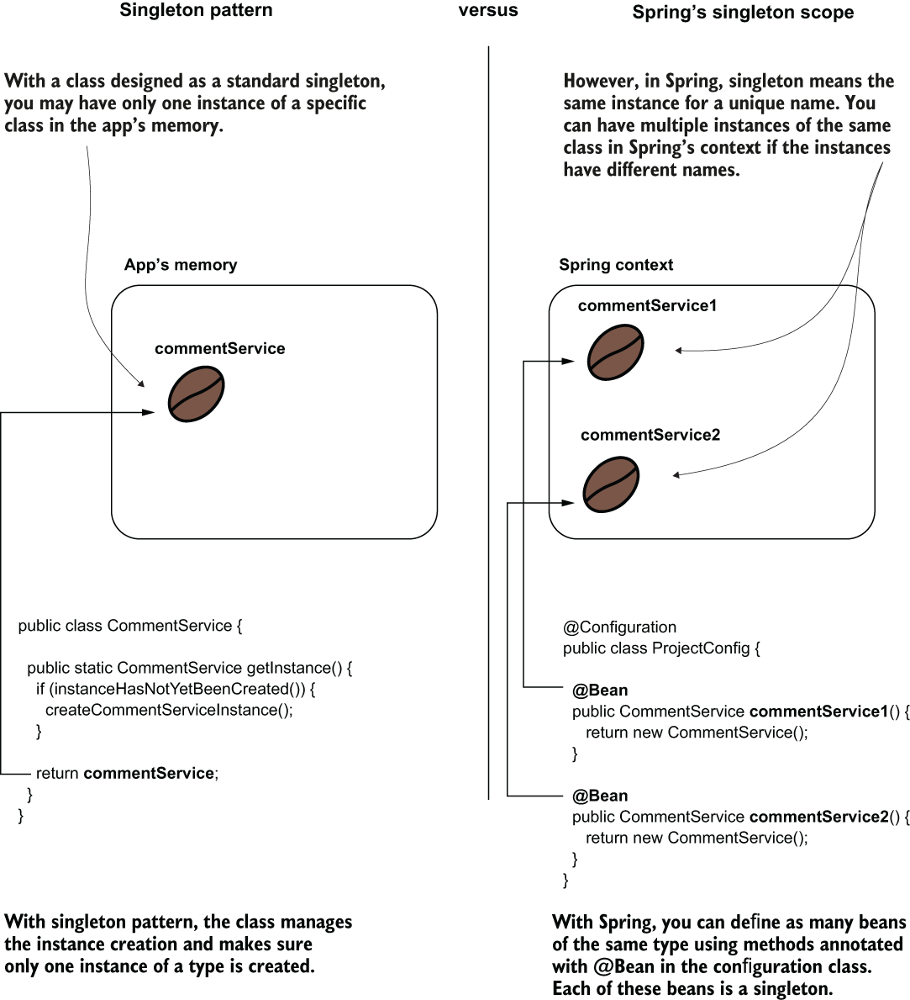
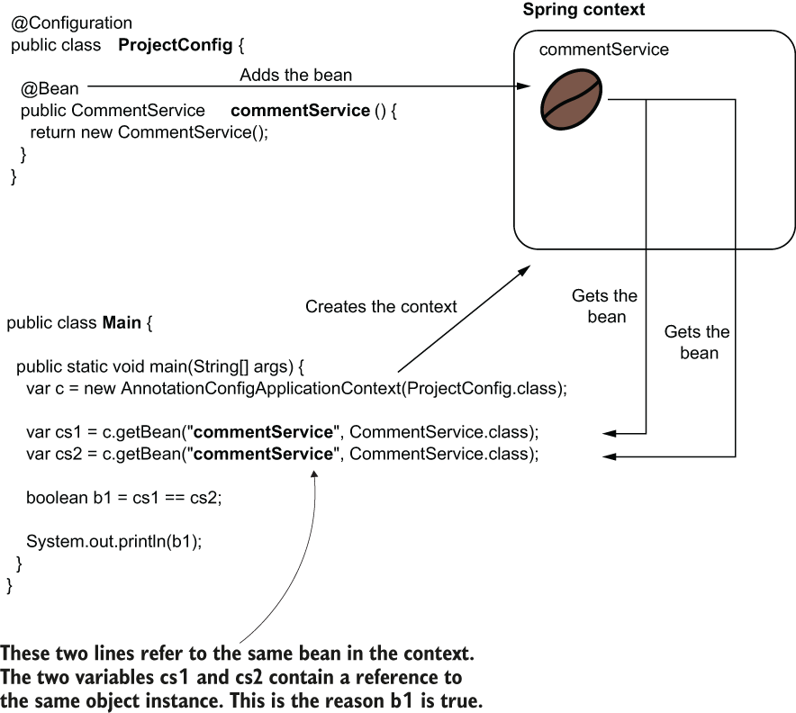
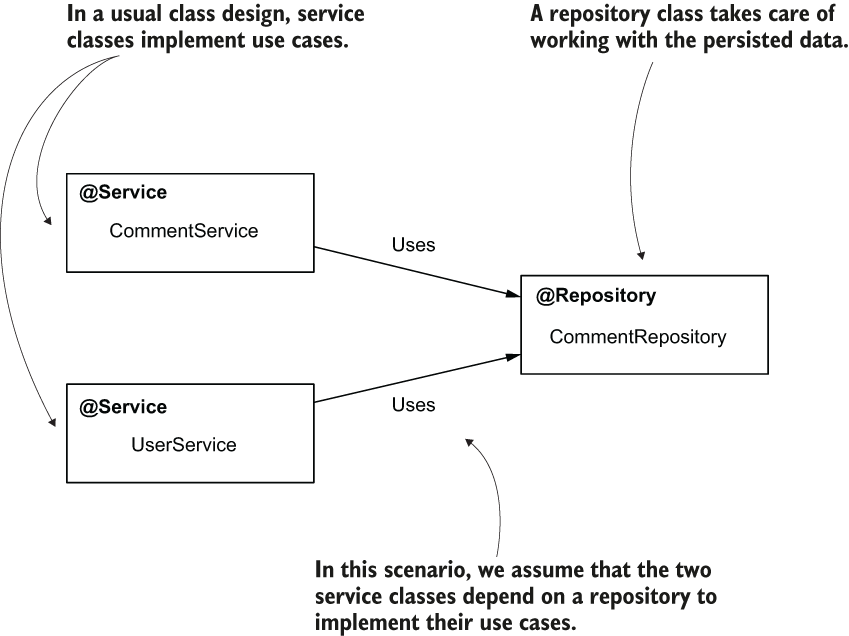
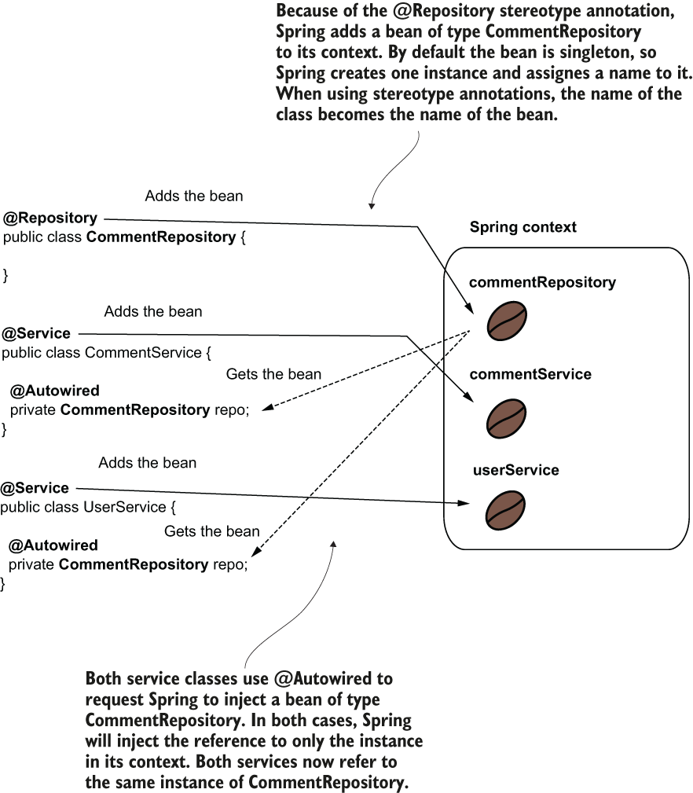
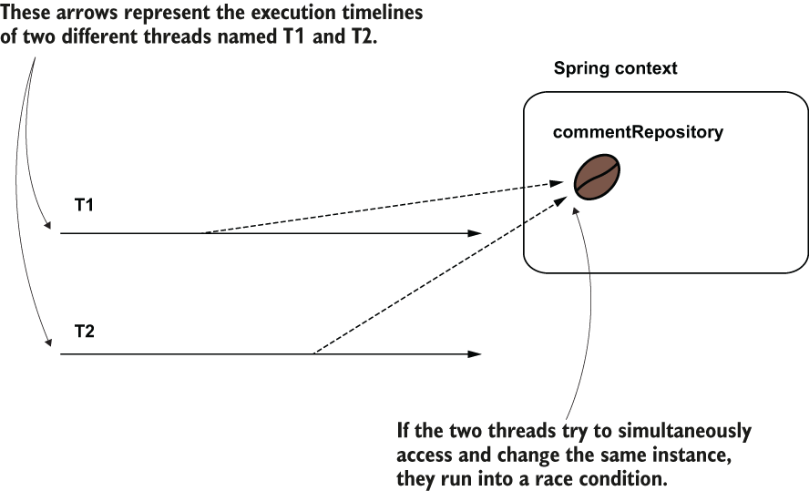
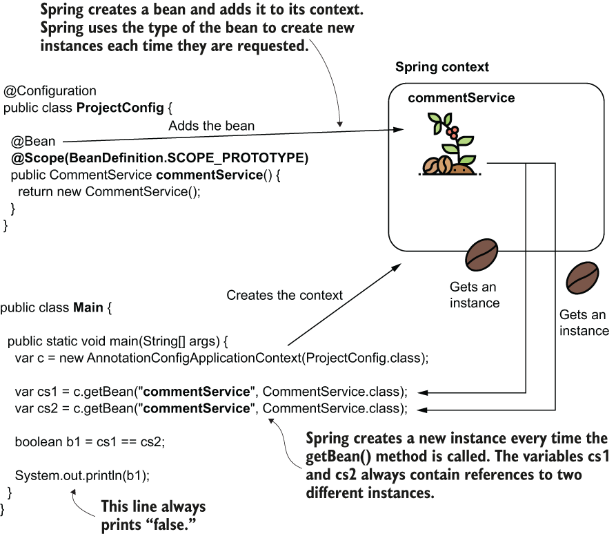
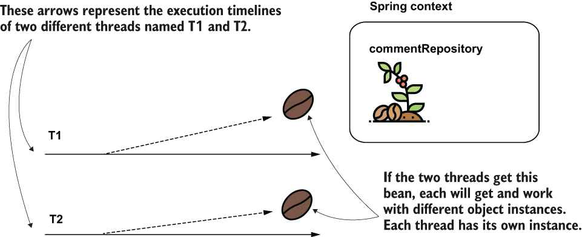
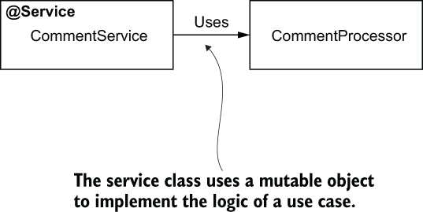
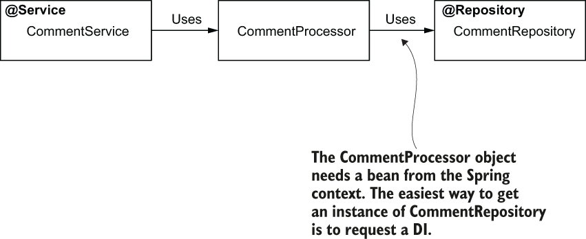

# 05 Bean scopes and lifecyle
- Thus far we have discussed several essential things about object instances managed by Spring (beans).
- But we didn’t focus on how and when Spring creates the beans. From this perspective, we’ve only relied on the framework’s default approaches.
- Production apps’ scenarios are complex, and sometimes relying on the framework’s default behavior is not enough. For this reason, in this chapter we need to go a bit deeper with our discussion on how Spring manages the beans in its context.
- Spring has multiple different approaches for creating beans and managing their life cycle, and in the Spring world we name these approaches **scopes**.
- In this chapter, we discuss two scopes you’ll often find in Spring apps: **singleton** and **prototype**.
- Later, in upcoming chapter, we discuss three more bean scopes that apply to web applications: **request**, **session**, and **application**.
- **Singleton is the default scope of a bean in Spring**, and it’s what we’ve been using up to now. We discuss the singleton bean scope. We’ll deal first with how Spring manages singleton beans and then discuss essential things you need to know about using the singleton scope in real-world apps.
- We continue by discussing the **prototype bean scope**. Our focus will be on how the prototype scope is different from singleton and real-world situations in which you’d need to apply one or another.
## Using the singleton bean scope
* * *
- **The singleton bean scope defines Spring’s default approach for managing the beans in its context.** It is also the bean scope you’ll most encounter in production apps.
- We start our discussion by learning **how Spring creates and manages singleton beans, which is essential for understanding where you should use them.** For this purpose, we’ll take two examples that employ the different approaches you can use to define beans (which you learned) and analyze Spring’s behavior for these beans. We’ll then discuss the critical aspects of using singleton beans in real-world scenarios. We end this section by discussing **two singleton bean instantiation approaches (eager and lazy) and where you should use them in production apps.**
### How singleton beans work
* * *
- Spring creates a **singleton bean** when it loads the context and assigns the bean a name (sometimes also referred to as bean ID).
- **We name this scope singleton because you always get the same instance when you refer to a specific bean.** But be careful! You can have more instances of the same type in the Spring context if they have different names.
- For Spring, **the singleton concept allows multiple instances of the same type, and singleton means unique per name but not unique per app.**
- When one refers to a singleton class in an app, they mean a class that offers only one instance to the app and manages the creation of that instance. **In Spring, however, singleton doesn’t mean the context has only one instance of that type. It just means that a name is assigned to the instance, and the same instance will always be referred through that name.**
	- 
#### DECLARING SINGLETON-SCOPED BEANS WITH @BEAN
* * *
- Let’s demonstrate a singleton bean’s behavior with an example using the `@Bean` annotation to add an instance to the Spring context and then simply refer to it multiple times in a main class. We do this to prove we get the same instance every time we refer to the bean.
- The below Figure is a visual representation of the context near the code that configures it. The coffee bean in the visual represents the instance that Spring adds to its context. Observe that the context contains only one instance (coffee bean) with an associated name. As we discussed earlier, when using the `@Bean` annotation approach to add a bean to the context, the name of the method annotated with `@Bean` becomes the bean’s name.
- **A singleton bean.** The app initializes the context when starting and adds a bean. In this case, we use the approach with the `@Bean` annotation to declare the bean. The name of the method becomes the identifier of the bean. Wherever you use that identifier, you get a reference to the same instance.
	- 
- In this example, I used the `@Bean` annotation approach to add the bean to the Spring context. But I don’t want you to think a singleton bean can only be created using the `@Bean` annotation. The result would have been the same if we used stereotype annotations (like `@Component`) to add the bean to the context. We’ll demonstrate this fact with the next example.
- Also, note that I’ve explicitly used the bean name when getting the bean from the Spring context in this demonstration. **You learned that when you have only one bean of a kind in the Spring context, you no longer need to use its name.** You can get that bean by its type. **In this example, I used the name simply to enforce that we refer to the same bean.** As we discussed, I could have just referred to the type, and in both cases where we get the bean from the context we would get the reference to the same (and only) instance of CommentService in the context.
- We need to define an empty `CommentService` class, as presented in the next code snippet. You then write the configuration class and the main class.
	```
	public class CommentService {
	}
	```
- In the next listing, you find the configuration class definition, which uses a method annotated with `@Bean` to add an instance of type `CommentService` to the Spring context.
	```
	@Configuration
	public class ProjectConfig {

	  @Bean                                       ❶
	  public CommentService commentService() {
		return new CommentService();
	  }
	}
	```
	❶ Adds the CommentService bean to the Spring context
- In the next listing, you find the `Main` class we use to test Spring’s behavior for our singleton bean. We get the reference to the `CommentService` bean twice, and we expect to get the same reference each time.
	```
	public class Main {

	  public static void main(String[] args) {
		var c = new AnnotationConfigApplicationContext(ProjectConfig.class);

		var cs1 = c.getBean("commentService", CommentService.class);
		var cs2 = c.getBean("commentService", CommentService.class);

		boolean b1 = cs1 == cs2;        ❶

		System.out.println(b1);   
	  }
	}
	```
	❶ Because the two variables hold the same reference, the result of this operation is true.
- Running the app will print “true” in the console because, being a singleton bean, Spring returns the same reference every time.
#### DECLARING SINGLETON BEANS USING STEREOTYPE ANNOTATIONS
* * *
- Consider a class design scenario where two service classes depend on a repository. Say we have both `CommentService` and UserService depending on a repository named `CommentRepository`
- A scenario class design. Two service classes depend on a repository to implement their use cases. When designed as singleton beans, Spring’s context will have one instance of each of these classes.
	- 
- The reason these classes are dependent on one another isn’t important, and our services won’t do anything (it’s just a scenario). We assume this class design is part of a more complicated app, and we focus on the relationship between beans and how Spring establishes the links in its context.
- **The beans are also singleton-scoped when using stereotype annotations to create them.** When using `@Autowired` to request Spring to inject a bean reference, the framework injects the reference to the singleton bean in all the requested places.
	- 
- Let’s prove this behavior by creating the three classes and comparing the references Spring injects in the service beans. **Spring injects the same reference in both service beans.**
- In the following code snippet, you find the definition of the `CommentRepository` class.
	```
	@Repository
	public class CommentRepository {
	}
	```
- The next code snippet presents the definition of the `CommentService` class. Observe that I used `@Autowired` to instruct Spring to inject an instance of type `CommentRepository` in an attribute declared in the class. I also defined a getter method that I intend to use later to prove Spring injects the same object reference in both service beans:
	```
	@Service
	public class CommentService {

	  @Autowired
	  private CommentRepository commentRepository;

	  public CommentRepository getCommentRepository() {
		return commentRepository;
	  }
	}
	```
- Following the same logic for `CommentService`, the `UserService` class is defined in the next code snippet:
	```
	@Service
	public class UserService {

	  @Autowired
	  private CommentRepository commentRepository;

	  public CommentRepository getCommentRepository() {
		return commentRepository;
	  }
	}
	```
- The configuration class remains empty in this project. We only need to tell Spring where to find the classes annotated with stereotype annotations. As discussed, to tell Spring where to find classes annotated with stereotype annotations we use the `@ComponentScan` annotation.
	```
	@Configuration
	@ComponentScan(basePackages = {"services", "repositories"})
	public class ProjectConfig {

	}
	```
- In the `Main` class, we get the references for the two services, and we compare their dependencies to prove that Spring injected the same instance in both. The following listing presents the main class.
	```
	public class Main {

	  public static void main(String[] args) {
		var c = new AnnotationConfigApplicationContext(                 ❶
		  ProjectConfig.class);

		var s1 = c.getBean(CommentService.class);                       ❷
		var s2 = c.getBean(UserService.class);                          ❷

		boolean b =                                                     ❸
		  s1.getCommentRepository() == s2.getCommentRepository();

		System.out.println(b);                                          ❹
	  }
	}
	```
	❶ Creates the Spring context based on the configuration class
	❷ Gets the references of the two service beans in the Spring context
	❸ Compares the references for the repository dependency injected by Spring
	❹ Because the dependency (CommentRepository) is singleton, both services contain the same reference, so this line always prints “true.”
### Singleton beans in real-world scenarios
* * *
- Let’s start by considering some scenarios where you should or shouldn’t use singleton beans.
- Because the singleton bean scope assumes that multiple components of the app can share an object instance, **the most important thing to consider is that these beans must be immutable.** Most often, **a real-world app executes actions on multiple threads (e.g., any web app). In such a scenario, multiple threads share the same object instance. If these threads change the instance, you encounter a race-condition scenario.**
- When multiple threads access a singleton bean, they access the same instance. If these threads try to change the instance simultaneously, they run into a race condition. The race condition causes unexpected results or execution exceptions if the bean is not designed for concurrency.
	- 
- **A race condition is a situation that can happen in multithreaded architectures when multiple threads try to change a shared resource.** In case of a race condition, the **developer needs to properly synchronize the threads to avoid unexpected execution results or errors.**
- If you want mutable singleton beans (whose attributes change), you need to make these beans concurrent by yourself (mainly by employing thread synchronization). But **singleton beans aren’t designed to be synchronized.**
- They’re commonly used to define an app’s backbone class design and delegate responsibilities one to another. **Technically, synchronization is possible, but it’s not a good practice.**
- **Synchronizing the thread on a concurrent instance can dramatically affect the app’s performance.** In most cases, you will find other means to solve the same problem and avoid thread concurrency.
- **One of the advantages of constructor injection is that it allows you to make the instance immutable (define the bean’s fields as final).**
- We can enhance the `CommentService` class’s definition by replacing the field injection with constructor injection. A better design of the class would look like the following code snippet:
	```
	@Service
	public class CommentService {

	  private final CommentRepository commentRepository;      ❶

	  public CommentService(CommentRepository commentRepository) {
		this.commentRepository = commentRepository;
	  }

	  public CommentRepository getCommentRepository() {
		return commentRepository;
	  }
	}
	```
	❶ Making the field final highlights that this field was intended not to be changed.
- Using beans boils down to three points
	- Make an object bean in the Spring context only if you need Spring to manage it so that the framework can augment that bean with a specific capability. If the object doesn’t need any capability offered by the framework, you don’t need to make it a bean.
	- If you need to make an object bean in the Spring context, it should be singleton only if it’s immutable. Avoid designing mutable singleton beans.
	- If a bean needs to be mutable, an option could be to use the prototype scope.
### Using eager and lazy instantiation
* * *
- In most cases, **Spring creates all singleton beans when it initializes the context—this is Spring’s default behavior. We’ve used only this default behavior, which is also called eager instantiation**.
- We discuss a different approach of the framework, **lazy instantiation**, and compare these two approaches.
- **With lazy instantiation, Spring doesn’t create the singleton instances when it creates the context. Instead, it creates each instance the first time someone refers to the bean.**
- In our initial scenario, we only need a bean to test the **default (eager) initialization.**
- I’ll name this class `CommentService`. You make this class a bean, either using the `@Bean` annotation approach or a stereotype annotation, as I’ve done in the next code snippet. But either way, make sure to add an output to the console in the class’s constructor. This way, we’ll easily observe if the framework calls it:
	```
	@Service
	public class CommentService {

	  public CommentService() {
		System.out.println("CommentService instance created!");
	  }
	}
	```
- If you use a stereotype annotation, don’t forget to add the `@ComponentScan` annotation in the configuration class. My configuration class in the next code snippet:
	```
	@Configuration
	@ComponentScan(basePackages = {"services"})
	public class ProjectConfig {

	}
	```
- In the `Main` class, we only instantiate the Spring context. A critical aspect to observe is that no one uses the `CommentService` bean. However, Spring will create and store the instance in the context. We know that Spring creates the instance because we’ll see the output from the `CommentService` bean class’s constructor when running the app. The next code snippet presents the Main class:
	```
	public class Main {

	  public static void main(String[] args) {            ❶
		var c = new AnnotationConfigApplicationContext(ProjectConfig.class);
	  }
	}
	```
	❶ This app creates the Spring context, but it doesn’t use the CommentService bean anywhere.
- Even if the app doesn’t use the bean anywhere, when running the app you’ll find the following output in the console:
	```
	CommentService instance created!
	```
- By adding the `@Lazy` annotation above the class (for stereotype annotations approach) or above the `@Bean` method (for the `@Bean` method approach). You’ll observe the output no longer appears in the console when running the app because we instructed Spring to create the bean only when someone uses it. And, in our example, nobody uses the `CommentService` bean.
	```
	@Service
	@Lazy                          ❶
	public class CommentService {

	  public CommentService() {
		System.out.println("CommentService instance created!");
	  }
	}
	```
	❶ The @Lazy annotation tells Spring that it needs to create the bean only when someone refers to the bean for the first time.
- Change the `Main` class and add a reference to the `CommentService` bean, as presented in the next code snippet:
	```
	public class Main {

	  public static void main(String[] args) {
		var c = new AnnotationConfigApplicationContext(ProjectConfig.class);

		System.out.println("Before retrieving the CommentService");
		var service = c.getBean(CommentService.class);                ❶
		System.out.println("After retrieving the CommentService");
	  }
	}
	```
	❶ At this line, where Spring needs to provide a reference to the CommentService bean, Spring also creates the instance.
- Rerun the app, and you’ll find the output again in the console. The framework creates the bean only if it’s used:
	```
	Before retrieving the CommentService
	CommentService instance created!
	After retrieving the CommentService
	```
- **When should you use eager instantiation and when should you use lazy?** In most cases, it’s more comfortable to let the framework create all the instances at the beginning when the context is instantiated (eager); this way, when one instance delegates to another, the second bean already exists in any situation.
- **In a lazy instantiation, the framework has to first check if the instance exists and eventually create it if it doesn’t, so from the performance point of view, it’s better to have the instances in the context already (eager) because it spares some checks the framework needs to do when one bean delegates to another.**
- Another advantage of eager instantiation is **when something is wrong and the framework cannot create a bean; we can observe this issue when starting the app.** With lazy instantiation, someone would observe the issue only when the app is already executing and it reaches the point that the bean needs to be created.
- But lazy instantiation is not all evil. Some time ago, I worked on a vast monolithic application. This app was installed in different locations where it was used in various scopes by its clients. **In most cases, a specific client didn’t use a big part of the functionality, so instantiating the beans together with the Spring context unnecessarily occupied a lot of memory. For that app, the developers designed most of the beans to be lazily instantiated so that the app would create only the necessary instances.**
- **My advice is to go with the default, which is an eager instantiation. This approach generally brings more benefits.** If you find yourself in a situation like the one I presented with the monolithic app, first see if you can do something about the app’s design.
- **Often, the need for using lazy instantiation is a sign something might be wrong with the app’s design.** For example, in my story, **it would have been better if the app had been designed in a modular way or as microservices. Such an architecture would have helped the developers deploy only what specific clients needed**, and then making the instantiation of the beans lazy wouldn’t have been necessary.
## Using the prototype bean scope
* * *
- In this section, we discuss the second bean scope Spring offers: prototype. In some cases, which we’ll analyze in this section, you’d go with prototype-scoped beans instead of singleton.
- We’ll discuss the framework’s behavior for beans declared as prototype.
- You’ll then learn how to change the bean’s scope to prototype, and we’ll try it with a couple of examples. Finally, we’ll discuss real-world situations you need to know when using the prototype scope.
### How prototype beans work
* * *
- As you’ll see, the idea is straightforward. **Every time you request a reference to a prototype-scoped bean, Spring creates a new object instance.**
- For prototype beans, Spring doesn’t create and manage an object instance directly. **The framework manages the object’s type and creates a new instance every time someone requests a reference to the bean.**
- In the below Figure, I represented the bean as a coffee plant (every time you request a bean, you get a new instance). We still use the bean terminology, but I use the coffee plant because I want to help you quickly understand and remember Spring’s behavior for prototype beans.
- We use the `@Scope` annotation to change the bean scope in prototype. The bean is now represented as a coffee plant because you get a new object instance each time you refer to it. For this reason, variables cs1 and cs2 will always contain different references, so the output of the code is always “false.”
	- 
- We need to use a new annotation named `@Scope` to change the bean’s scope. When you create the bean using the `@Bean` annotation approach, `@Scope` goes together with `@Bean` over the method that declares the bean. When declaring the bean with stereotype annotations, you use the `@Scope` annotation and the stereotype annotation over the class that declares the bean.
- With prototype beans, **we no longer have concurrency problems because each thread that requests the bean gets a different instance, so defining mutable prototype beans is not a problem.**
- When multiple threads request a certain prototype bean, each thread gets a different instance. This way, the threads cannot run into a race condition.
	- 
#### DECLARING PROTOTYPE-SCOPED BEANS WITH @BEAN
* * *
- We create a bean named `CommentService` and declare it as prototype to prove we get a new instance every time we request that bean. The next code snippet presents the `CommentService` class:
	```
	public class CommentService {
	}
	```
- We define a bean with the `CommentService` class in the configuration class, as presented in the following listing.
	```
	@Configuration
	public class ProjectConfig {

	  @Bean
	  @Scope(BeanDefinition.SCOPE_PROTOTYPE)     ❶
	  public CommentService commentService() {
		return new CommentService();
	  }
	}
	```
	❶ Makes this bean prototype-scoped
- To prove that every time we request the bean we get a new instance, we create a `Main` class and request the beans twice from the context. We observe that the references we get are different. You find the definition of the `Main` class in the following listing.
	```
	public class Main {

	  public static void main(String[] args) {
		var c = new AnnotationConfigApplicationContext(ProjectConfig.class);

		var cs1 = c.getBean("commentService", CommentService.class);
		var cs2 = c.getBean("commentService", CommentService.class);

		boolean b1 = cs1 == cs2;    ❶

		System.out.println(b1);     ❷
	  }
	}
	```
	❶ The two variables cs1 and cs2 contain references to different instances.
	❷ This line always prints “false” in the console.
- When you run the app, you’ll see it always displays “false” in the console. This output proves that the two instances received when calling the `getBean()` method are different.
#### DECLARING PROTOTYPE-SCOPED BEANS USING STEREOTYPE ANNOTATIONS
* * *
- We’ll define a `CommentRepository` prototype bean, and we inject the bean using `@Autowired` in two other service beans. We will observe that each service bean has a reference to a different instance of `CommentRepository`.
- Each service class requests an instance of `CommentRepository`. Because `CommentRepository` is a prototype bean, each service gets a different `CommentRepository` instance.
- The next code snippet gives definition of the `CommentRepository` class. Observe the `@Scope` annotation used over the class to change the scope of the bean to prototype:
	```
	@Repository
	@Scope(BeanDefinition.SCOPE_PROTOTYPE)
	public class CommentRepository {
	}
	```
- The two service classes request an instance of type `CommentRepository` using the `@Autowired` annotation. The next code snippet presents the `CommentService` class:
	```
	@Service
	public class CommentService {

	  @Autowired
	  private CommentRepository commentRepository;

	  public CommentRepository getCommentRepository() {
		return commentRepository;
	  }
	}
	```
- The next code snippet presents the `UserService` class:
	```
	@Service
	public class UserService {

	  @Autowired
	  private CommentRepository commentRepository;

	  public CommentRepository getCommentRepository() {
		return commentRepository;
	  }
	}
	```
- In the previous code snippet, the `UserService` class also requests an instance of the `CommentRepository` bean. In the configuration class, we need to use the `@ComponentScan` annotation to tell Spring where to find the classes annotated with stereotype annotations:
	```
	@Configuration
	@ComponentScan(basePackages = {"services", "repositories"})
	public class ProjectConfig {

	}
	```
- We add the `Main` class to our project and test how Spring injects the `CommentRepository` bean. The `Main` class is shown in the following listing.
	```
	public class Main {

	  public static void main(String[] args) {
		var c = new AnnotationConfigApplicationContext(ProjectConfig.class);

		var s1 = c.getBean(CommentService.class);   ❶
		var s2 = c.getBean(UserService.class);      ❶

		boolean b =                                 ❷
		  s1.getCommentRepository() == s2.getCommentRepository();

		System.out.println(b);
	  }
	}
	```
	❶ Gets references from the context for the service beans
	❷ Compares the references for the injected `CommentRepository` instances. Because `CommentRepository` is a prototype bean, the result of the comparison is always false.
### Prototype beans in real-world scenarios
* * *
- In this section, we focus more on the use cases and where you should use prototype-scoped beans in production apps.
- We’ll consider the discussed characteristics and analyze which scenarios prototype beans are good for and where should you avoid them (by using singleton beans).
- **You won’t find prototype beans as often as you’ll find singleton beans.** But there is a good pattern you can use to decide if a bean should be prototype. **Remember that singleton beans are not quite good friends with mutating objects.**
- Say you design an object named `CommentProcessor` that processes the comments and validates them.
- A service uses the `CommentProcessor` object to implement a use case. But the `CommentProcessor` object stores the comment to be processed as an attribute, and its methods change this attribute.
- A service class uses a mutable object to implement the logic of a use case.
    - 
- The next listing shows the implementation of the `CommentProcessor` bean.
    ```
    public class CommentProcessor {
      private Comment comment;

      public void setComment(Comment comment) {
        this.comment = comment;
      }

      public void getComment() {
        return this.comment;   
      }

      public void processComment() {      ❶
        // changing the comment attribute
      }

      public void validateComment() {     ❶
        // validating and changing the comment attribute
      }
    }
    ```
    ❶ These two methods alter the value of the Comment attribute.
- The next listing presents this service that uses the `CommentProcessor` class to implement a use case. The service method creates an instance of `CommentProcessor` using the class’s constructor and then uses the instance in the method’s logic.
    ```
    @Service
    public class CommentService {

      public void sendComment(Comment c) {
        CommentProcessor p = new CommentProcessor();  ❶

        p.setComment(c);                              ❷
        p.processComment(c);                          ❷
        p.validateComment(c);                         ❷

        c = p.getComment();                           ❸
        // do something further
      }
    }
    ```
    ❶ Creates a CommentProcessor instance
    ❷ Uses the CommentProcessor instance to alter the Comment instance
    ❸ Gets the modified Comment instance and uses it further
- The `CommentProcessor` object is not even a bean in the Spring context. **Does it need to be a bean? It’s critical you ask yourself this question before deciding to make any object a bean. Remember that an object needs to be a bean in the context only if Spring needs to manage it to augment the object with some capability the framework offers.** If we leave our scenario like this, the `CommentProcessor` object doesn’t need to be a bean at all.
- But let’s suppose further that the `CommentProcessor` bean needs to use an object `CommentRepository` to persist some data, and `CommentRepository` is a bean in the Spring context.
- If the `CommentProcessor` object needs to use an instance of `CommentRepository`, the easiest way to get an instance is to request a DI. But to do this, Spring needs to know about `CommentProcessor`, so the `CommentProcessor` object needs to be a bean in the context.
    - 
- In this scenario, the `CommentProcessor` bean needs to become a bean to benefit from the DI capability Spring offers. **In general, in any case where we want Spring to augment the object with a specific capability, it needs to be a bean.**
- We make `CommentProcessor` a bean in the Spring context. **But can it be singleton-scoped? No. If we define this bean as singleton and multiple threads use it concurrently, we get into a race condition.** We would not be sure which comment provided by which thread is processed and if the comment was processed correctly.
- In this scenario, we want each method call to get a different instance of the `CommentProcessor` object. We can change the `CommentProcessor` class to be a prototype bean, as presented in the next code snippet:
    ```
    @Component
    @Scope(BeanDefinition.SCOPE_PROTOTYPE)
    public class CommentProcessor {

      @Autowired
      private CommentRepository commentRepository;

      // Omitted code
    }
    ```
- You can now get an instance of `CommentProcessor` from the Spring context. But be careful! You need this instance for every call of the `sendComment()` method, so the request to the bean should be inside the method itself. To achieve such a result, you can directly inject the Spring context (`ApplicationContext`) into the `CommentService` bean using `@Autowired`. In the `sendComment()` method, you retrieve the `CommentProcessor` instance using `getBean()` from the application context, as presented in the next listing.
    ```
    @Service
    public class CommentService {

      @Autowired
      private ApplicationContext context;

      public void sendComment(Comment c) {
        CommentProcessor p = 
          context.getBean(CommentProcessor.class);     ❶

        p.setComment(c);   
        p.processComment(c);   
        p.validateComment(c);   

        c = p.getComment();   
        // do something further
      }
    }
    ```
    ❶ A new CommentProcessor instance is always provided here.
- Don’t make the mistake of injecting the `CommentProcessor` directly in the `CommentService` bean. **The `CommentService` bean is a singleton, which means that Spring creates only an instance of this class. As a consequence, Spring will also inject the dependencies of this class just once when it creates the `CommentService` bean itself.** In this case, you’ll end up with only an instance of the `CommentProcessor`. Each call of the `sendComment()` method will use this unique instance, so with multiple threads you’ll run into the same race condition issues as with a singleton bean. The next listing presents this approach. Use this as an exercise to try out and prove this behavior.
    ```
    @Service
    public class CommentService {

      @Autowired
      private CommentProcessor p;       ❶

      public void sendComment(Comment c) {

        p.setComment(c);   
        p.processComment(c);   
        p.validateComment(c);   

        c = p.getComment();   
        // do something further
      }
    }
    ```
    ❶ Spring injects this bean when creating the CommentService bean. But because CommentService is singleton, Spring will also create and inject the CommentProcessor just once.
- I conclude this section by giving you my opinion about using prototype beans. **I generally prefer to avoid using them, and mutable instances in general, in the apps I develop.**
- **But sometimes you need to refactor or work with old applications.** In my case, I faced such a scenario when I worked in an app refactoring for adding Spring to an old application. **That app used mutating objects in many places, and refactoring all these places in a short time was impossible. We needed to use prototype bean, which allowed the team to refactor each of these cases progressively.**
- A quick comparison between singleton and prototype bean scopes.

  | Singleton                                                                                           | Prototype                                                                                             |
  | --------------------------------------------------------------------------------------------------- | ----------------------------------------------------------------------------------------------------- |
  | The framework associates a name with an actual object instance.                                     | A name is associated with a type.                                                                     |
  | Every time you refer to a bean name you’ll get the same object instance.                            | Every time you refer to a bean name, you get a new instance.                                          |
  | You can configure Spring to create the instances when the context is loaded or when first referred. | The framework always creates the object instances for the prototype scope when you refer to the bean. |
  | Singleton is the default bean scope in Spring.                                                      | You need to explicitly mark a bean as a prototype.                                                    |
  | It’s not recommended that a singleton bean to have mutable attributes.                              | A prototype bean can have mutable attributes.                                                         |