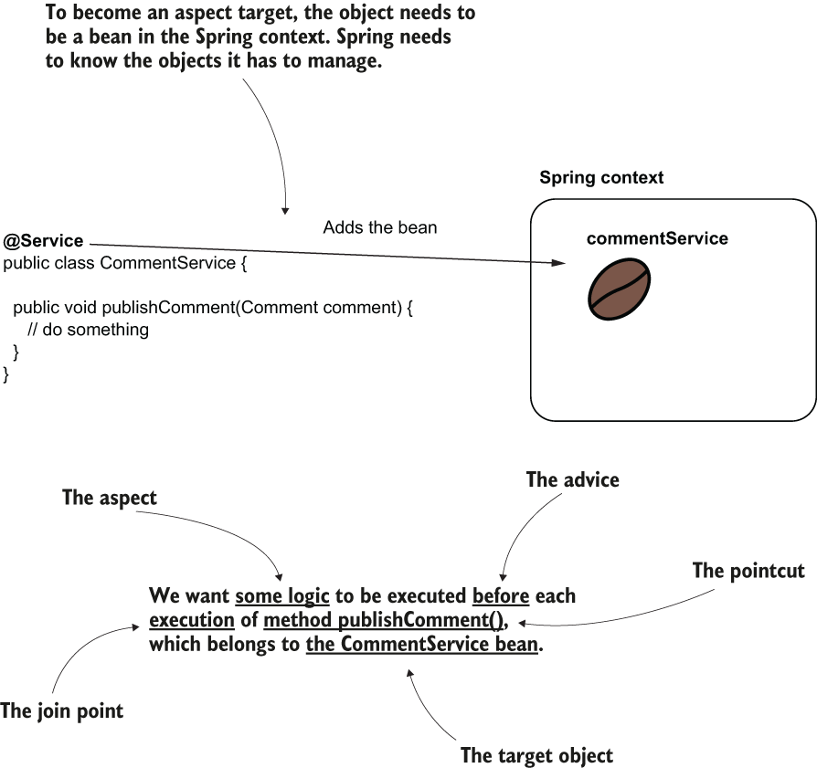

# 06 Using aspects with Spring AOP
- Thus far, we have discussed the **Spring context**, and the only Spring capability we have used is **DI, which is supported by the IoC principle.** With DI, the framework manages objects you define, and you can request to use these objects where you need them.
- To request a bean’s reference, in most cases, you use the `@Autowired` annotation. When you request such an object from the Spring context, we say that **Spring “injects” the object where you requested it.**
- **Aspects** are a way the framework intercepts method calls and possibly alters the execution of methods.
- You can affect the execution of specific method calls you select. This technique helps you extract part of the logic belonging to the executing method.
- In certain scenarios, decoupling a part of the code helps make that method easier to understand. It allows the developer to focus only on the relevant details discussed when reading the method logic.
- Aspects are a powerful tool, and If you don’t use aspects carefully, you might end up with a less maintainable app, which is quite the opposite of what you want to achieve. This approach is called **aspect-oriented programming (AOP).**
- **Sometimes it’s not relevant to have parts of the code in the same place with the business logic because it makes the app more difficult to understand. A solution is to move part of the code aside from the business logic implementation using aspects.** In this scene, Jane, the programmer, is discouraged by the logging lines written together with the business code. Count Dracula shows her the magic of aspects by decoupling the logs into an aspect.
	- 
- Another important reason for learning aspects is that Spring uses them in implementing a lot of the crucial capabilities it offers.
- Understanding how the framework works can save you many hours of debugging later when you face a specific problem.
- **A pertinent example of Spring capability that uses aspects is transactionality**. Transactionality is one of the main capabilities most apps use today to keep the persisted data’s consistency.
- **Another important capability relying on aspects is security configurations**, which help your app protect its data and make sure data cannot be seen or changed by unwanted individuals.
- We’ll start with a theoretical introduction to aspects. You’ll learn how aspects work. Once you understand these basics, you’ll learn how to implement an aspect. We’ll start with a scenario, and we’ll develop an example that we’ll use to discuss the most practical syntaxes for using aspects. You’ll learn what happens when you define multiple aspects to intercept the same method and deal with such scenarios.
## How aspects work in Spring
* * *
- In this section, you’ll learn how aspects work and the essential terminology you’ll encounter when using aspects.
- By learning to implement aspects, you’ll be able to use new techniques to make your app more maintainable. Moreover, you’ll also understand how certain Spring features are plugged into apps.
- **An aspect is simply a piece of logic the framework executes when you call specific methods of your choice.** When designing an aspect, you define the following:
	- What code you want Spring to execute when you call specific methods. This is named an **aspect**.
	- When the app should execute this logic of the aspect (e.g., before or after the method call, instead of the method call). This is named the **advice**.
	- Which methods the framework needs to intercept and execute the aspect for them. This is named a **pointcut**.
- With aspects terminology, you’ll also find the concept of a **join point**, which defines the event that triggers the execution of an aspect. **But with Spring, this event is always a method call.**
- As in the case of the dependency injection, **to use aspects you need the framework to manage the objects for which you want to apply aspects.**
- You’ll use the approaches you learned to add beans to the Spring context to enable the framework to control them and apply aspects you define.
- The bean that declares the method intercepted by an aspect is named the **target object**.
- The aspect terminology. Spring executes some logic (the aspect) when someone calls a specific method (the pointcut). We need to specify when the logic is executed according to the pointcut (e.g., before). The when is the advice. For Spring to intercept the method, the object that defines the intercepted method needs to be a bean in the Spring context. So, the bean becomes the target object of the aspect.
	- 
- But how does Spring intercept each method call and apply the aspect logic? A**s discussed earlier in this section, the object needs to be a bean in the Spring context.**
- But because you made the object an aspect target, **Spring won’t directly give you an instance reference for the bean when you request it from the context. Instead, Spring gives you an object that calls the aspect logic instead of the actual method.**
- We say that **Spring gives you a proxy object instead of the real bean.** You will now receive the proxy instead of the bean anytime you get the bean from the context, either if you directly use the `getBean()` method of the context or if you use DI. This approach is named **weaving**.
- Weaving an aspect. Instead of giving you a reference to the real bean, Spring gives you a reference to a proxy object, intercepts the method calls, and manages the aspect logic.
	- 
- In below figure, you find **a comparison between calling the method when it isn’t intercepted by an aspect versus an aspect intercepting the method call.** You observe that **calling an aspected method assumes you call the method through the proxy object provided by Spring.** The proxy applies the aspect logic and delegates the call to the actual method.
- When a method isn’t aspected, the call goes directly to that method. **When we define an aspect for a method, the call goes through the proxy object. The proxy object applies the logic defined by the aspect and then delegates the call to the real method.**
	- 
## Implementing aspects with Spring AOP
* * *
- In this section, you’ll learn the most relevant aspect syntaxes used in real-world examples.
- Suppose you have an application that implements multiple use cases in its service classes. Some new regulations require your app to store the time it started and ended for each use case execution. In your team, you decided to take responsibility for implementing a functionality to log all the events where a use case begins and ends.
- We’ll use an aspect to solve this scenario in the simplest way possible. By doing so, you’ll learn what you need to implement an aspect.
- Further, in this chapter, I’ll progressively add more details in regard to using aspects.
- We’ll discuss how an aspect uses or even alters the intercepted method’s parameters or the value returned by the method.
- You’ll learn how to use annotations to mark methods you want to intercept for a specific purpose. Developers often use annotations to mark the method an aspect needs to intercept.
### Implementing a simple aspect
* * *
- We’ll create a new project and define a service class containing a method that we’ll use to test our implementation and prove the aspect we define works as desired in the end.
- In addition to the **spring-context** dependency, for this example we also need the **spring-aspects** dependency. Make sure to update your pom.xml file and add the needed dependencies, as presented in the next code snippet:
	```
	<dependency>
	   <groupId>org.springframework</groupId>
	   <artifactId>spring-context</artifactId>
	   <version>5.2.8.RELEASE</version>
	</dependency>
	<dependency>                               ❶
	   <groupId>org.springframework</groupId>
	   <artifactId>spring-aspects</artifactId>
	   <version>5.2.8.RELEASE</version>
	</dependency>
	```
	❶ We need this dependency to implement the aspects.
- To make our example shorter and allow you to focus on the syntax related to aspects, we’ll only consider one service object named `CommentService` and a use case it defines named `publishComment(Comment comment)`.
- This method, defined in the `CommentService` class, receives a parameter of type `Comment`. `Comment` is a model class and is presented in the next code snippet:
	```
	public class Comment {

	  private String text;
	  private String author;

	  // Omitted getters and setters
	}
	```
- A **model class** is a class that models the data processed by the app. In our case, the `Comment` class describes a comment with its attributes: `text` and `author`.
- A **service class** implements use cases of an app.
- In the below listing, you find the definition of the `CommentService` class. We annotate the `CommentService` class with the `@Service` stereotype annotation to make it a bean in the Spring context. The `CommentService` class defines the `publishComment(Comment comment)` method, representing our scenario’s use case.
- You also observe in this example that instead of using System.out, I used an object of type Logger to write messages in the console.
- In real-world apps, you don’t use System.out to write messages in the console. You’ll generally use a logging framework that offers you more flexibility in customizing the logging features and standardizing the logging messages.
- Some good options for a logging framework are as follows:
	- Log4j
	- Logback
	- Java Logging API, which comes with the JDK
- The logging frameworks are compatible with any Java app, whether it’s using Spring or not. As they are not related to Spring, I haven’t use them in our examples to avoid distracting you.
- But we are far enough now with Spring that we can start to use these additional frameworks in our examples to familiarize you with syntaxes closer to production-ready apps.
	```
	@Service                                                   ❶
	public class CommentService {

	  private Logger logger =                                  ❷
		Logger.getLogger(CommentService.class.getName());

	  public void publishComment(Comment comment) {            ❸
		logger.info("Publishing comment:" + comment.getText());
	 }
	}
	```
	❶ We use the stereotype annotation to make this a bean in the Spring context.
	❷ To log a message in the app’s console every time someone calls the use case, we use a logger object.
	❸ This method defines the use case for our demonstration.
- In this example, I use the JDK logging capabilities to avoid adding other dependencies to our project. When declaring a logger object, you need to give it a name as a parameter.
- This name then appears in the logs and makes it easy for you to observe the log message source. Often, we use the class name, which I did in our example: `CommentService.class.getName()`.
- We also need to add a configuration class to tell Spring where to look for the classes annotated with stereotype annotations. In my case, I added the service class in the package named "services", and this is what I need to specify with the `@ComponentScan` annotation, as you observe from the next code snippet:
	```
	@Configuration
	@ComponentScan(basePackages = "services")   ❶
	public class ProjectConfig {

	}
	```
	❶ We use `@ComponentScan` to tell Spring where to search for classes annotated with stereotype annotations.
- Let’s write the `Main` class that calls the `publishComment()` method in the service class and observe the current behavior, as shown in the following listing.
	```
	public class Main {

	  public static void main(String[] args) {
		var c = new AnnotationConfigApplicationContext(ProjectConfig.class);

		var service = c.getBean(CommentService.class);    ❶

		Comment comment = new Comment();                  ❷
		comment.setText("Demo comment");
		comment.setAuthor("Natasha");

		service.publishComment(comment);                  ❸
	  }
	}
	```
	❶ Gets the CommentService bean from the context
	❷ Creates a Comment instance to give as a parameter to the publishComment() method
	❸ Calls the publishComment() method
- If you run the app, you’ll observe an output in the console similar to what you see in the next snippet:
	```
	Sep 26, 2020 12:39:53 PM services.CommentService publishComment
	INFO: Publishing comment:Demo comment
	```
- You will see the output generated by the `publishComment()` method. This is how the app looks before we solve the example we discussed. Remember, we need to print messages in the console before and after the service method call.
- Let’s now enhance the project with an aspect class that intercepts the method call and adds an output before and after the call.
- To create an aspect, you follow these steps:
	- Enable the aspect mechanism in your Spring app by annotating the configuration class with the `@EnableAspectJAutoProxy` annotation.
	- Create a new class, and annotate it with the `@Aspect` annotation. Using either `@Bean` or stereotype annotations, add a bean for this class in the Spring context.
	- Define a method that will implement the aspect logic and tell Spring when and which methods to intercept using an advice annotation.
	- Implement the aspect logic.
- To implement an aspect, you follow four easy steps. First, you need to enable the aspect capability in your app. Then you create an aspect class, define a method, and instruct Spring when and what to intercept. Finally, you implement the aspect logic.
	- 
#### STEP 1: ENABLING THE ASPECTS MECHANISM FOR YOUR APPLICATION
* * *
- For the first step, you need to tell Spring you’ll use aspects in your app. **Whenever you use a specific mechanism provided by Spring, you have to explicitly enable it by annotating your configuration class with a particular annotation.**
- n most cases, the names of these annotations start with **“Enable.”**
- In this example, we need to use the `@EnableAspectJAutoProxy` annotation to enable the aspect capabilities. The configuration class needs to look like the one presented in the following listing.
	```
	@Configuration
	@ComponentScan(basePackages = "services")
	@EnableAspectJAutoProxy                     ❶
	public class ProjectConfig {
	}
	```
	❶ Enables the aspects mechanism in our Spring app
#### STEP 2: CREATE A CLASS THAT DEFINES THE ASPECT, AND ADD AN INSTANCE FOR THIS CLASS IN THE SPRING CONTEXT
* * *
- We need to create a new bean in the Spring context that defines the aspect. This object holds the methods, which will intercept specific method calls and augment them with specific logic. In the next listing, you find the definition of this new class.
	```
	@Aspect
	public class LoggingAspect {
	  public void log() {
		// To implement later
	  }
	}
	```
- You can use any of the approaches you learned to add an instance of this class to the Spring context. If you decide to use the `@Bean` annotation, you have to change the configuration class, as presented in the next code snippet. Of course, you can also use stereotype annotations if you’d like:
	```
	@Configuration
	@ComponentScan(basePackages = "services")
	@EnableAspectJAutoProxy
	public class ProjectConfig {

	  @Bean                            ❶
	  public LoggingAspect aspect() {
		return new LoggingAspect();
	  }
	}
	```
	❶ Adds an instance of the LoggingAspect class to the Spring context
- Remember, you need to make this object a bean in the Spring context because Spring needs to know about any object it needs to manage. This is why I strongly emphasized the approaches to manage the Spring context. You’ll use these skills almost everywhere when developing a Spring app.
- Also, the `@Aspect` annotation isn’t a stereotype annotation. Using `@Aspect`, you tell Spring that the class implements the definition of an aspect, but Spring won’t also create a bean for this class. You need to explicitly use one of the syntaxes you learned to create a bean for your class and allow Spring to manage it this way.
- It’s a common mistake to forget that annotating the class with `@Aspect` doesn’t also add a bean to the context, and I’ve seen much frustration caused by forgetting this.
#### STEP 3: USE AN ADVICE ANNOTATION TO TELL SPRING WHEN AND WHICH METHOD CALLS TO INTERCEPT
* * *
- Now that we have defined the aspect class, we choose the advice and annotate the method accordingly. In the next listing, you see how I annotated the method with the `@Around` annotation.
	```
	@Aspect
	public class LoggingAspect {

	  @Around("execution(* services.*.*(..))")            ❶
	  public void log(ProceedingJoinPoint joinPoint) {   
		joinPoint.proceed();                              ❷
	  }
	}
	```
	❶ Defines which are the intercepted methods
	❷ Delegates to the actual intercepted method
- Other than using the `@Around` annotation, you also observe I’ve written an unusual string expression as the value of the annotation, and I have added a parameter to the aspect method. What are these?
- The peculiar expression used as a parameter to the `@Around` annotation tells Spring which method calls to intercept. Don’t be intimidated by this expression! This expression language is called **AspectJ pointcut language**, and you won’t need to learn it by heart to use it. In practice, you don’t use complex expressions.
- When I need to write such an expression, I always refer to the [documentation](https://docs.spring.io/spring-framework/docs/current/reference/html/core.html#aop-ataspectj).
- Theoretically, you can write very complex AspectJ pointcut expressions to identify a particular set of method calls to be intercepted. This language is really powerful.
- It’s always better to avoid writing complex expressions. In most cases, you can find simpler alternatives.
- Look at the expression I used. It means Spring intercepts any method defined in a class that is in the services package, regardless of the method’s return type, the class it belongs to, the name of the method, or the parameters the method receives.
- The AspectJ pointcut expression used in the example. It tells Spring to intercept the calls for all the methods in the services package, regardless of their return type, the class they belong to, name, or the parameters they receive.
	- 
- Now let’s look at the second element I’ve added to the method: the `ProceedingJoinPoint` parameter, which **represents the intercepted method**. The main thing you do with this parameter is tell the aspect when it should delegate further to the actual method.
#### STEP 4: IMPLEMENT THE ASPECT LOGIC
* * *
- In the below listing, I’ve added the logic for our aspect. Now the aspect
	- Intercepts the method
	- Displays something in the console before calling the intercepted method
	- Calls the intercepted method
	- Displays something in the console after calling the intercepted method
	```
	@Aspect
	public class LoggingAspect {

	  private Logger logger = Logger.getLogger(LoggingAspect.class.getName());

	  @Around("execution(* services.*.*(..))")
	  public void log(ProceedingJoinPoint joinPoint) throws Throwable {
		logger.info("Method will execute");                              ❶
		joinPoint.proceed();                                             ❷
		logger.info("Method executed");                                  ❸
	  }
	}
	```
	❶ Prints a message in the console before the intercepted method’s execution
	❷ Calls the intercepted method
	❸ Prints a message in the console after the intercepted method’s execution
- The aspect behavior. LoggingAspect wraps the method execution by displaying something before and after the method call. This way, you observe a simple implementation of an aspect.
	- 
- The method `proceed()` of the `ProceedingJoinPoint` parameter calls the intercepted method, `publishComment()`, of the `CommentService` bean. If you don’t call `proceed()`, the aspect never delegates further to the intercepted method.
- If you don’t call the `proceed()` method of the `ProceedingJoinPoint` parameter of the aspect, the aspect never delegates further to the intercepted method. In this case, the aspect simply executes instead of the intercepted method. The caller of the method doesn’t know that the real method is never executed.
	- 
- **You can even implement logic where the actual method isn’t called anymore.** For example, an aspect that applies some authorization rules decides whether to delegate further to a method the app protects. If the authorization rules aren’t fulfilled, the aspect doesn’t delegate to the intercepted method it protects.
- An aspect can decide not to delegate at all to the method it intercepts. This behavior looks like the aspect applies a mind trick to the caller of the method. The caller ends up executing another logic than the one it actually called.
	- 
- Also, observe that the `proceed()` method throws a `Throwable`. The method `proceed()` is designed to throw any exception coming from the intercepted method. In this example, I chose the easy way to propagate it further, but you can use a `try-catch-finally` block to treat this throwable if you need it.
- Rerun the application. In the console output, you’ll find the logs from both the aspect and the intercepted method. The output you see should look similar to the one presented in the following snippet:
	```
	Sep 27, 2020 1:11:11 PM aspects.LoggingAspect log
	INFO: Method will execute                                       ❶
	Sep 27, 2020 1:11:11 PM services.CommentService publishComment
	INFO: Publishing comment:Demo comment                           ❷
	Sep 27, 2020 1:11:11 PM aspects.LoggingAspect log
	INFO: Method executed 
	```
	❶ This line is printed from the aspect.
	❷ This line is printed from the actual method.
	❸ This line is printed from the aspect.
### Altering the intercepted method’s parameters and the returned value
* * *
- Not only can they intercept a method and alter its execution, but they can also **intercept the parameters used to call the method and possibly alter them or the value the intercepted method returns.**
- In this section, we’ll change the example we’ve been working on to prove how an aspect can affect the parameters and the value returned by the intercepted method. Knowing how to do this gives you even more opportunities in what you can implement using aspects.
- Suppose you want to log the parameters used to call the service method and what the method returned.
- Because we also refer to what the method returns, I changed the service method and made it return a value, as presented in the next code snippet:
	```
	@Service
	public class CommentService {

	  private Logger logger = Logger.getLogger(CommentService.class.getName());

	  public String publishComment(Comment comment) {
		logger.info("Publishing comment:" + comment.getText());
		return "SUCCESS";                                          ❶
	  }
	}
	```
	❶ For our demonstration, the method now returns a value.
- The aspect can easily find the name of the intercepted method and the method parameters. Remember that the `ProceedingJoinPoint` parameter of the aspect method represents the intercepted method.
- You can use this parameter to get **any information related to the intercepted method (parameters, method name, target object, and so on).** The next code snippet shows you how to get the method name and the parameters used to call the method before intercepting the call:
	```
	String methodName = joinPoint.getSignature().getName();
	Object [] arguments = joinPoint.getArgs();
	```
- Now we can change the aspect also to log these details. In the next listing, you find the change you need to make to the aspect method.
	```
	@Aspect
	public class LoggingAspect {

	  private Logger logger = Logger.getLogger(LoggingAspect.class.getName());

	  @Around("execution(* services.*.*(..))")
	  public Object log(ProceedingJoinPoint joinPoint) throws Throwable {
		String methodName =                                                ❶
		  joinPoint.getSignature().getName();                              ❶
		Object [] arguments = joinPoint.getArgs();                         ❶

		logger.info("Method " + methodName +                               ❷
			" with parameters " + Arrays.asList(arguments) +
			" will execute");

		Object returnedByMethod = joinPoint.proceed();                     ❸

		logger.info("Method executed and returned " + returnedByMethod);

		return returnedByMethod;                                           ❹
	  }
	}
	```
	❶ Obtains the name and parameters of the intercepted method
	❷ Logs the name and parameters of the intercepted method
	❸ Calls the intercepted method
	❹ Returns the value returned by the intercepted method
- The aspect intercepts the method call, so it can access the parameters and the value returned by the intercepted method after execution. For the `main()` method, it looks like it directly calls the `publishComment()` method of the `CommentService` bean. The caller isn’t aware that an aspect intercepted the call.
	- 
- I’ve changed the `main()` method to print the value returned by publishComment(), as presented in the following listing.
	```
	public class Main {

	  private static Logger logger = Logger.getLogger(Main.class.getName());

	  public static void main(String[] args) {
		var c = new AnnotationConfigApplicationContext(ProjectConfig.class);

		var service = c.getBean(CommentService.class);

		Comment comment = new Comment();
		comment.setText("Demo comment");
		comment.setAuthor("Natasha");

		String value = service.publishComment(comment);

		logger.info(value);     ❶
	  }
	}
	```
	❶ Prints the value returned by the publishComment() method
- When running the app, in the console you see the values logged from the aspect and the returned value logged by the `main()` method:
	```
	Sep 28, 2020 10:49:39 AM aspects.LoggingAspect log                        ❶
	INFO: Method publishComment with parameters [Comment{text='Demo comment', ❶
	➥ author='Natasha'}] will execute                                        ❶
	Sep 28, 2020 10:49:39 AM services.CommentService publishComment
	INFO: Publishing comment:Demo comment                                     ❷
	Sep 28, 2020 10:49:39 AM aspects.LoggingAspect log
	INFO: Method executed and returned SUCCESS                                ❸
	Sep 28, 2020 10:49:39 AM main.Main main
	INFO: SUCCESS
	```
	❶ Parameters printed by the aspect
	❷ Message printed by the intercepted method
	❸ Returned value printed by the aspect
	❹ Returned value printed in main
- But aspects are even more powerful. They can alter the execution of the intercepted method by
	- Changing the value of the parameters sent to the method
	- Changing the returned value received by the caller
	- Throwing an exception to the caller or catching and treating an exception thrown by the intercepted method
- You can be extremely flexible in altering the call of an intercepted method. You can even change its behavior completely.
- But be careful! When you alter the logic through an aspect, you make a part of the logic transparent. Make sure you don’t hide things that aren’t obvious.
- **The whole idea of decoupling a part of the logic is to avoid duplicating code and hide what’s irrelevant**, so a developer can easily focus on the business logic code.
- When considering writing an aspect, put yourself in the developer’s shoes. **Someone who needs to understand the code should easily realize what’s happening.**
- An aspect can change the parameters used to call the intercepted method and the returned value received by the intercepted method’s caller. This approach is powerful, and it gives flexible control of the intercepted method.
	- 
- We can demonstrate how aspects can alter the call by changing the parameters or the value returned by the intercepted method.
- The following listing shows that **when you call the proceed() method without sending any parameters, the aspect sends the original parameters to the intercepted method.**
- But you can choose to provide a parameter when calling the proceed() method. **This parameter is an array of objects that the aspect sends to the intercepted method instead of the original parameter values.**
- The aspect logs the value returned by the intercepted method, but it returns to the caller a different value.
	```
	@Aspect
	public class LoggingAspect {

	  private Logger logger = 
	  Logger.getLogger(LoggingAspect.class.getName());

	  @Around("execution(* services.*.*(..))")
	  public Object log(ProceedingJoinPoint joinPoint) throws Throwable {
		String methodName = joinPoint.getSignature().getName();
		Object [] arguments = joinPoint.getArgs();


		logger.info("Method " + methodName +
			" with parameters " + Arrays.asList(arguments) +
			" will execute");

		Comment comment = new Comment();
		comment.setText("Some other text!");
		Object [] newArguments = {comment};

		Object returnedByMethod = joinPoint.proceed(newArguments);    ❶

		logger.info("Method executed and returned " + returnedByMethod);

		return "FAILED";                                              ❷
	  }
	} 
	```
	❶ We send a different comment instance as a value to the method’s parameter.
	❷ We log the value returned by the intercepted method, but we return a different value to the caller.
- Running the app generates an output like the one in the next snippet. The values of the parameters received by the `publishComment()` method are different than the ones sent when calling the method. The `publishComment()` method returns a value, but `main()` gets a different one:
	```
	Sep 29, 2020 10:43:51 AM aspects.LoggingAspect log
	INFO: Method publishComment with parameters [Comment{text='Demo comment', 
	➥ author='Natasha'}] will execute                                ❶
	Sep 29, 2020 10:43:51 AM services.CommentService publishComment
	INFO: Publishing comment:Some other text!                         ❷
	Sep 29, 2020 10:43:51 AM aspects.LoggingAspect log
	INFO: Method executed and returned SUCCESS                        ❸
	Sep 29, 2020 10:43:51 AM main.Main main
	INFO: FAILED  
	```
	❶ The publishComment() method is called with a comment having the text “Demo comment.”
	❷ The publishComment() method receives a comment with the text “Some other text!”
	❸ The method publishComment() returns “SUCCESS.”
	❹ The returned value main() receives is “FAILED.”
- I know I repeat myself, but this point is quite important. Be careful with using aspects! **You should only use them to hide irrelevant lines of code that can easily be implied.** Aspects are so powerful they can bring you to the “dark side” of hiding relevant code and make your app more difficult to maintain. **Use aspects with caution!**
- Okay, but **would we ever want to have an aspect that changes the parameters of the intercepted method? Or its returned value? Yes.** Sometimes it happens that such an approach is useful.
- **Transactions in Spring rely on aspects.** When we get to that subject, you’ll find understanding aspects very useful.
- **By first understanding how aspects work you gain a significant advantage in understanding Spring.** I often see developers starting to use a framework without understanding what’s behind the functionalities they use. Not surprisingly, in many cases, these developers introduce bugs or vulnerabilities to their apps, or they make them less performant and maintainable. **My advice is to always learn how things work before using them.**
### Intercepting annotated methods
* * *
- In this section, we discuss an important approach, often used in Spring apps, for marking the methods that need to be intercepted by aspects: using annotations.
- **Annotations are comfortable to use, and since they appeared with Java 5, they became the de facto approach in configuring apps that use specific frameworks.**
- You can also use them to **mark the methods you want an aspect to intercept with a comfortable syntax that allows you also to avoid writing complex AspectJ pointcut expressions.**
- In the `CommentService` class, we’ll add three methods: `publishComment()`, `deleteComment()`, and `editComment()`.
- We want to define a custom annotation and log only the execution of the methods we mark using the custom annotation. To achieve this objective, you need to do the following:
	- Define a custom annotation, and make it accessible at runtime. We’ll call this annotation `@ToLog`.
	- Use a different `AspectJ pointcut expression` for the aspect method to tell the aspect to intercept the methods annotated with the custom annotation.
- We don’t need to change the logic of the aspect. For this example, our aspect does the same thing as the previous examples: logs the intercepted method’s execution.
- The steps for intercepted annotated methods. You need to create a custom annotation you want to use to annotate the methods your aspect needs to intercept. Then you use a different AspectJ pointcut expression to configure the aspect to intercept the methods annotated with the custom annotation you created.
	- 
- In the next code snippet, you find the declaration of the custom annotation.
- The definition of the retention policy with `@Retention(RetentionPolicy.RUNTIME)` is critical. By default, in Java annotations cannot be intercepted at runtime. You need to explicitly specify that someone can intercept annotations by setting the retention policy to `RUNTIME`.
- The `@Target` annotation specifies which language elements we can use this annotation for. By default, you can annotate any language elements, but it’s always a good idea to restrict the annotation to only what you make it for in our case, methods:
	```
	@Retention(RetentionPolicy.RUNTIME)         ❶
	@Target(ElementType.METHOD)                 ❷
	public @interface ToLog {
	}
	```
	❶ Enables the annotation to be intercepted at runtime
	❷ Restricts this annotation to only be used with methods
- In the following listing, you find the definition of the `CommentService` class, which now defines three methods. We annotated only the `deleteComment()` method, so we expect the aspect will intercept only this one.
	```
	@Service
	public class CommentService {

	  private Logger logger = Logger.getLogger(CommentService.class.getName());

	  public void publishComment(Comment comment) {
		logger.info("Publishing comment:" + comment.getText());
	  }

	  @ToLog                                         ❶
	  public void deleteComment(Comment comment) {
		logger.info("Deleting comment:" + comment.getText());
	  }

	  public void editComment(Comment comment) {
		logger.info("Editing comment:" + comment.getText());
	  }
	}
	```
	❶ We use the custom annotation for the methods we want the aspect to intercept
- To weave the aspect to the methods annotated with the custom annotation, we use the following AspectJ pointcut expression: `@annotation(ToLog)`. This expression refers to any method annotated with the annotation named `@ToLog` (which is, in this case, our custom annotation).
- In the next listing, you now find the aspect class, which uses the new pointcut expression to weave the aspect logic to the intercepted methods. Pretty simple, isn’t it?
	```
	@Aspect
	public class LoggingAspect {

	  private Logger logger = Logger.getLogger(LoggingAspect.class.getName());

	  @Around("@annotation(ToLog)")                                        ❶
	  public Object log(ProceedingJoinPoint joinPoint) throws Throwable {
		// Omitted code
	  }
	}
	```
	❶ Weaving the aspect to the methods annotated with @ToLog
- Using an AspectJ pointcut expression, we weave the aspect logic to any method annotated with the custom annotation we defined. This is a comfortable way to mark the methods to which specific aspect logic applies.
	- 
- When you run the app, only the annotated method (`deleteComment()`, in our case) is intercepted, and the aspect logs the execution of this method in the console. You should see an output in the console similar to the one presented in the next snippet:
```
Sep 29, 2020 2:22:42 PM services.CommentService publishComment
INFO: Publishing comment:Demo comment
Sep 29, 2020 2:22:42 PM aspects.LoggingAspect log                          ❶
INFO: Method deleteComment with parameters [Comment{text='Demo comment',   ❶
➥ author='Natasha'}] will execute                                         ❶
Sep 29, 2020 2:22:42 PM services.CommentService deleteComment              ❶
INFO: Deleting comment:Demo comment                                        ❶
Sep 29, 2020 2:22:42 PM aspects.LoggingAspect log                          ❶
INFO: Method executed and returned null                                    ❶
Sep 29, 2020 2:22:42 PM services.CommentService editComment
INFO: Editing comment:Demo comment
```
❶ The aspect intercepts only the deleteComment() method, which we annotated with the custom @ToLog annotation.
### Other advice annotations you can use
* * *
- So far in this chapter, we’ve used the advice annotation `@Around`. This is indeed the most used of the advice annotations in Spring apps because you can cover any implementation case: **you can do things before, after, or even instead of the intercepted method. You can alter the logic any way you want from the aspect.**
- But you don’t necessarily always need all this flexibility. A good idea is to look for the most straightforward way to implement what you need to implement. **Any app implementation should be defined by simplicity.**
- By avoiding complexity, you make the app easier to maintain. For simple scenarios, Spring offers four alternative advice annotations that are less powerful than `@Around`.
- It’s recommended you use these when their capabilities are enough to keep the implementation simple.
- Other than `@Around`, Spring offers the following advice annotations:
	- `@Before` - Calls the method defining the aspect logic before the execution of the intercepted method.
	- `@AfterReturning` - Calls the method defining the aspect logic after the method successfully returns, and provides the returned value as a parameter to the aspect method. The aspect method isn’t called if the intercepted method throws an exception.
	- `@AfterThrowing` - Calls the method defining the aspect logic if the intercepted method throws an exception, and provides the exception instance as a parameter to the aspect method.
	- `@After` - Calls the method defining the aspect logic only after the intercepted method execution, whether the method successfully returned or threw an exception.
- You use these advice annotations the same way as for `@Around`. You provide them with an AspectJ pointcut expression to weave the aspect logic to specific method executions.
- **The aspect methods don’t receive the ProceedingJoinPoint parameter**, and they cannot decide when to delegate to the intercepted method.
- This event already happens based on the annotation’s purpose (for example, for `@Before`, the intercepted method call will always happen after the aspect logic execution).
- In the next code snippet, you find the `@AfterReturning` annotation used. Observe that we use it the same way we did with `@Around`.
	```
	@Aspect
	public class LoggingAspect {

	  private Logger logger = Logger.getLogger(LoggingAspect.class.getName());

	  @AfterReturning(value = "@annotation(ToLog)",                    ❶
					  returning = "returnedValue")                     ❷
	  public void log(Object returnedValue) {                          ❸
		logger.info("Method executed and returned " + returnedValue);
	  }
	}
	```
	❶ The AspectJ pointcut expression specifies which methods this aspect logic weaves to.
	❷ Optionally, when you use @AfterReturning, you can get the value returned by the intercepted method. In this case, we add the “returning” attribute with a value that corresponds to the name of the method’s parameter where this value will be provided.
	❸ The parameter name should be the same as the value of the “returning” attribute of the annotation or missing if we don’t need to use the returned value.
## The aspect execution chain
* * *
- In all our examples thus far, we discussed what happens when one aspect intercepts a method. **In a real-world app, a method is often intercepted by more than one aspect.**
- For example, we have a method for which we want to log the execution and apply some security constraints. We often have aspects taking care of such responsibilities, so we have two aspects acting on the same method’s execution in this scenario.
- There’s nothing wrong with having as many aspects as we need, but when this happens, we need to ask ourselves the following questions:
	- In which order does Spring execute these aspects?
	- Does the execution order matter?
- In this section, we’ll analyze an example to answer these two questions.
- Suppose, for a method, we need to apply some security restrictions as well as log its executions. We have two aspects that take care of these responsibilities:
	- `SecurityAspect`—Applies the security restrictions. This aspect intercepts the method, validates the call, and in some conditions doesn’t forward the call to the intercepted method (the details about how the SecurityAspect works aren’t relevant for our current discussion; just remember that sometimes this aspect doesn’t call the intercepted method).
	- `LoggingAspect`—Logs the beginning and end of the intercepted method execution.
- When you have multiple aspects weaved to the same method, they need to execute one after another.
- One way is to have the `SecurityAspect` execute first and then delegate to the `LoggingAspect`, which further delegates to the intercepted method.
- The second option is to have the `LoggingAspect` execute first and then delegate to the `SecurityAspect`, which eventually delegates further to the intercepted method. This way, the aspects create an execution chain.
- **The order in which the aspects execute is important because executing the aspects in different orders can have different results.**
- Take our example: we know that the `SecurityAspect` doesn’t delegate the execution in all the cases, so if we choose this aspect to execute first, sometimes the `LoggingAspect` won’t execute.
- If we expect the `LoggingAspect` to log the executions that failed due to security restrictions, this isn’t the way we need to go.
- The aspect execution order matters. Depending on your app’s requirements, you need to choose a specific order for the aspects to execute. In this scenario, the `LoggingAspect` cannot log all the method executions if the `SecurityAspect` executes first.
	- 
- **By default, Spring doesn’t guarantee the order in which two aspects in the same execution chain are called.** If the execution order is not relevant, then you just need to define the aspects and leave the framework to execute them in whatever order.
- If you need to define the aspects’ execution order, you can use the `@Order` annotation.
- This annotation receives an ordinal (a number) representing the order in the execution chain for a specific aspect. The smaller the number, the earlier that aspect executes.
- If two values are the same, the order of execution is again not defined.
- I define two aspects that intercept the `publishComment()` method of a `CommentService` bean. In the next listing, you find the aspect named `LoggingAspect`. We don’t initially define any order for our aspects.
	```
	@Aspect
	public class LoggingAspect {

	  private Logger logger = 
		Logger.getLogger(LoggingAspect.class.getName());

	  @Around(value = "@annotation(ToLog)")
	  public Object log(ProceedingJoinPoint joinPoint) throws Throwable {
		logger.info("Logging Aspect: Calling the intercepted method");

		Object returnedValue = joinPoint.proceed();     ❶

		logger.info("Logging Aspect: Method executed and returned " + 
					returnedValue);

		return returnedValue;
	  }
	}
	```
	❶ The proceed() method here delegates further in the aspect execution chain. It can either call the next aspect or the intercepted method
- The second aspect we define for our example is named `SecurityAspect`, as shown in the following listing. To keep our example simple and allow you to focus on the discussion, this aspect doesn’t do anything special. Like the `LoggingAspect`, it prints a message in the console, so we easily observe when it is executed.
	```
	@Aspect
	public class SecurityAspect {

	  private Logger logger =   
		Logger.getLogger(SecurityAspect.class.getName());

	  @Around(value = "@annotation(ToLog)")
	  public Object secure(ProceedingJoinPoint joinPoint) throws Throwable {
		logger.info("Security Aspect: Calling the intercepted method");

		Object returnedValue = joinPoint.proceed();           ❶

		logger.info("Security Aspect: Method executed and returned " + 
					 returnedValue);

		return returnedValue;
	  }
	}
	```
	❶ The proceed() method here delegates further in the aspect execution chain. It can call either the next aspect or the intercepted method.
- The `CommentService` class is similar to the one we defined in the previous examples. But to make your reading more comfortable, you can also find it in the following listing.
	```
	@Service
	public class CommentService {

	  private Logger logger = 
		Logger.getLogger(CommentService.class.getName());

	  @ToLog
	  public String publishComment(Comment comment) {
		logger.info("Publishing comment:" + comment.getText());
		return "SUCCESS";
	  }

	}
	```
- Also, remember that both aspects need to be beans in the Spring context. For this example, I chose to use the `@Bean` approach to add the beans in the context. My configuration class is presented next.
	```
	@Configuration
	@ComponentScan(basePackages = "services")
	@EnableAspectJAutoProxy
	public class ProjectConfig {

	  @Bean                                   ❶
	  public LoggingAspect loggingAspect() {
		return new LoggingAspect();
	  }

	  @Bean                                   ❶
	  public SecurityAspect securityAspect() {
		return new SecurityAspect();
	  }
	}
	```
	❶ Both aspects need to be added as beans in the Spring context.
- The `main()` method calls the `publishComment()` method of the `CommentService` bean. In my case, the output after the execution looks like the one in the next code snippet:
	```
	Sep 29, 2020 6:04:22 PM aspects.LoggingAspect log                ❶
	INFO: Logging Aspect: Calling the intercepted method             ❶
	Sep 29, 2020 6:04:22 PM aspects.SecurityAspect secure            ❷
	INFO: Security Aspect: Calling the intercepted method            ❷
	Sep 29, 2020 6:04:22 PM services.CommentService publishComment   ❸
	INFO: Publishing comment:Demo comment                            ❸
	Sep 29, 2020 6:04:22 PM aspects.SecurityAspect secure            ❹
	INFO: Security Aspect: Method executed and returned SUCCESS      ❹
	Sep 29, 2020 6:04:22 PM aspects.LoggingAspect log                ❺
	INFO: Logging Aspect: Method executed and returned SUCCESS 
	```
	❶ The `LoggingAspect` is called first and delegates to the `SecurityAspect`.
	❷ The `SecurityAspect` is called second and delegates to the intercepted method.
	❸ The intercepted method executes.
	❹ The intercepted method returns to the `SecurityAspect`.
	❺ The SecurityAspect returns to the `LoggingAspect`.
- The execution flow. The `LoggingAspect` was first to intercept the method call. The `LoggingAspect` delegates further in the execution chain to the `SecurityAspect`, which further delegates the call to the intercepted method. The intercepted method returns to the `SecurityAspect`, which returns further to the `LoggingAspect`.
- To reverse the order in which `LoggingAspect` and `SecurityAspect` execute, we use the `@Order` annotation. Observe in the next code snippet how I used the `@Order` annotation to specify an execution position for `SecurityAspect`.
	```
	@Aspect
	@Order(1)                        ❶
	public class SecurityAspect {

	  // Omitted code
	}
	```
	❶ Gives an execution order position to the aspect
- For the `LoggingAspect`, I use `@Order` to place the aspect in a higher order position, as presented in the next snippet:
	```
	@Aspect
	@Order(2)                     ❶
	public class LoggingAspect {
	  // Omitted code
	}
	```
	❶ Places the LoggingAspect as second to be executed
- Rerun the application and observe that the order in which the aspects execute has changed. The logging should now look like the one in the next snippet:
	```
	Sep 29, 2020 6:38:20 PM aspects.SecurityAspect secure           ❶
	INFO: Security Aspect: Calling the intercepted method           ❶
	Sep 29, 2020 6:38:20 PM aspects.LoggingAspect log               ❷
	INFO: Logging Aspect: Calling the intercepted method            ❷
	Sep 29, 2020 6:38:20 PM services.CommentService publishComment  ❸
	INFO: Publishing comment:Demo comment                           ❸
	Sep 29, 2020 6:38:20 PM aspects.LoggingAspect log               ❹
	INFO: Logging Aspect: Method executed and returned SUCCESS      ❹
	Sep 29, 2020 6:38:20 PM aspects.SecurityAspect secure           ❺
	INFO: Security Aspect: Method executed and returned SUCCESS 
	```
	❶ The `SecurityAspect` is first to intercept the method call and delegates further in the execution chain to `LoggingAspect`.
	❷ The `LoggingAspect` executes and delegates further to the intercepted method.
	❸ The intercepted method executes and returns to the `LoggingAspect`.
	❹ The LoggingAspect executes and returns to the `SecurityAspect`.
	❺ The `SecurityAspect` returns to the `main()` method, which made the initial call.
- The execution flow after changing the order of the aspects. The `SecurityAspect` was first to intercept the method call and delegates further in the execution chain to the `LoggingAspect`, which further delegates the call to the intercepted method. The intercepted method returns to the `LoggingAspect`, which returns further to the `SecurityAspect`.