# 07 Understanding Spring Boot and Spring MVC
- Now that you know all the needed Spring basics, let’s focus on web apps and how you use Spring to implement them. You can use all the Spring capabilities we’ve discussed to implement any kind of app. But often with Spring, the applications you implement are web apps.
- Spring makes web app development straightforward. We’ll start this chapter by discussing what web apps are and how they work.
- To implement web apps, we’ll use **a project in the Spring ecosystem named Spring Boot.**
- We’ll discuss Spring Boot and why it’s essential in app implementations. We’ll discuss the standard architecture of a simple Spring web app, and we’ll implement a web app using Spring Boot.
- At the end of this chapter, you’ll understand how a web app works, and you’ll be able to implement a basic web app with Spring.
## What is a web app?
* * *
- **Any app you access through your web browser is a web app.**
- Years ago, we used desktop apps installed on our computers for almost anything we were doing. With time, most of these apps became accessible via a web browser. Accessing an app in a browser makes it more comfortable to use. You don’t have to install anything, and you can use it from any device that has access to the internet, such as a tablet or smartphone.
- Times change. In the 1990s, we used a desktop app for everything. Today, almost any application we use is a web app. As developers, it’s essential you learn how to implement web apps.
	- 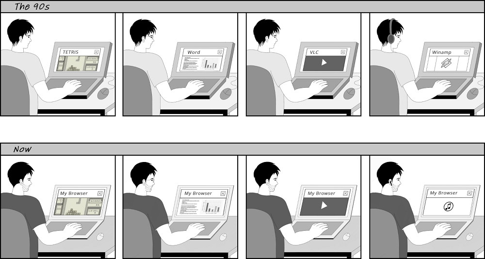
### A general overview of a web app
* * *
- First, a web app is composed of two parts:
	- The **client side** is what the user directly interacts with. A web browser represents the client side of a web app. The browser sends requests to a web server, receives responses from it, and **provides a way for the user to interact with the app.** We also refer to the client side of a web app as the **frontend**.
	- The **server side** receives requests from the client and sends back data in response. **The server side implements logic that processes and sometimes stores the client requested data before sending a response.** We also refer to the server side of a web app as the **backend**.
- The big picture of a web app. The user interacts with the app through its frontend. The frontend communicates with the backend to execute logic at the user’s request and get the data to display. The backend executes business logic and sometimes persists data in a database or communicates with other external services.
	- 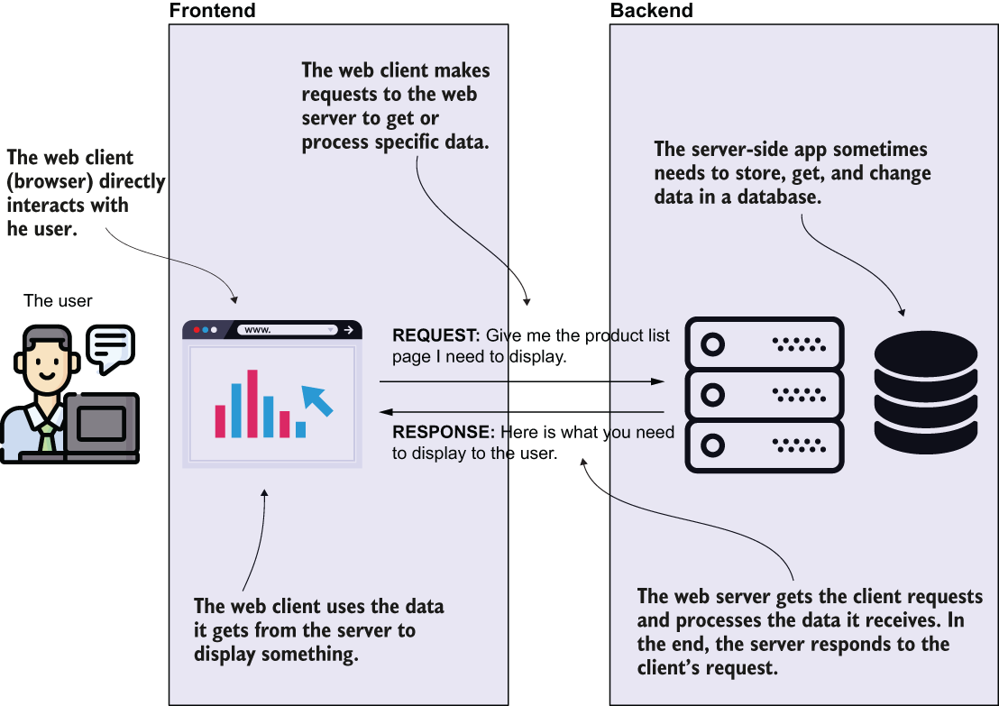
- When discussing web apps, we usually refer to a client and a server, but **it’s important to keep in mind that the backend serves multiple clients concurrently.**
- Numerous people may use the same app at the same time on different platforms. Users can access the app through a browser on a computer, phone, tablet, and so on.
- When discussing web apps, we refer to the client as being one instance, but keep in mind that multiple users access a browser and use the same web app concurrently. Each user makes their own requests on specific actions they need to execute. **This is important because it means that some operations on the backend execute concurrently. If you write code that accesses and changes the same resource, your app might wrongly behave because of race condition scenarios.**
	- 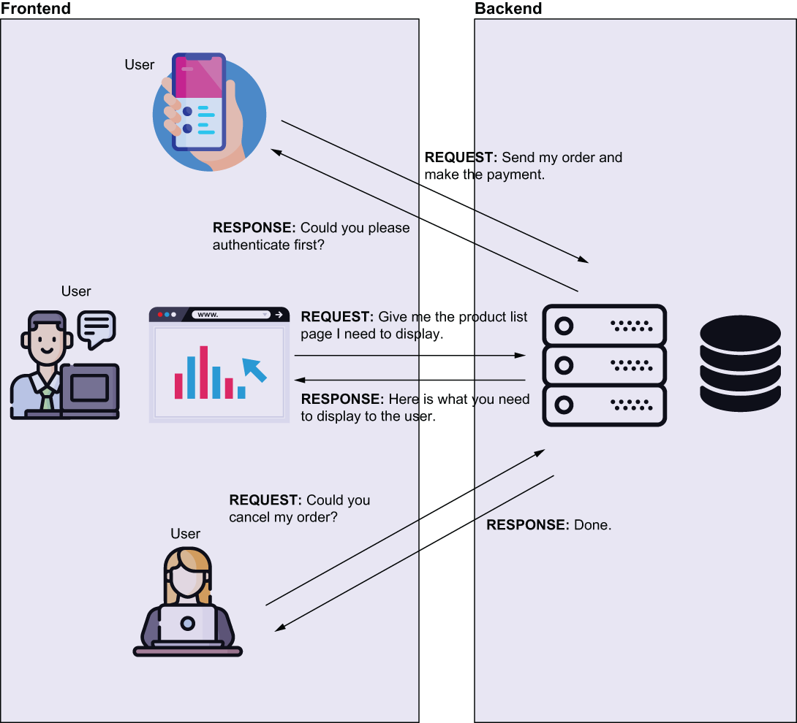
### Different fashions of implementing a web app with Spring
* * *
- We discuss the two main designs you can use to implement a web application. We’ll implement apps in both these ways in upcoming chapters,
- It’s important to know how you can create your web app to avoid getting confused later when implementing examples.
- We classify the approaches of creating a web app as the following:
	- **Apps where the backend provides the fully prepared view in response to a client’s request.** The browser directly interprets the data received from the backend and displays this information to the user in these apps. We discuss this approach and implement a simple app to prove it in this chapter. We then continue our discussion with more complex details relevant to production apps in upcoming chapters.
	- **Apps using frontend-backend separation. For these apps, the backend only serves raw data.** The browser doesn’t display the data in the backend’s response directly. The browser runs a separate frontend app that gets the backend responses, processes the data, and instructs the browser what to display. We discuss this approach and implement examples of it in upcoming chapter.
- The below figure presents the first approach in which the app doesn’t use a frontend-backend separation. For these apps, **almost everything happens on the backend side.**
- The backend gets requests representing user actions and executes some logic. In the end, the server responds with what the browser needs to display.
- The backend responds with the data in formats that the browser can interpret and display, such as **HTML, CSS, images, and so on.**
- It can also **send scripts written in languages that the browser can understand** and execute (such as **JavaScript**).
- When a web app doesn’t provide frontend-backend separation, the browser precisely displays what it gets from the server. The server gets requests from the browser, executes some logic, and then responds. In response, the backend provides content formatted as HTML, CSS, and other fashions that the browser interprets to display.
	- 
- The below figure shows an app using frontend-backend separation. Instead of telling the browser precisely what to display, **the server now only sends raw data.**
- The browser runs an independent frontend app it loads at an initial request from the server. **This frontend app takes the server’s raw response, interprets it, and decides how the information is displayed.**
- Using frontend-backend separation. The server doesn’t respond with the exact data that needs to be displayed by the browser. The backend sends the data to the client but doesn’t tell the browser how to display this data or what to do with it. The backend now only sends raw data (usually in an easily parsable format like JSON or XML). The browser executes a frontend app that takes the server’s raw response and processes it to display the data.
	- 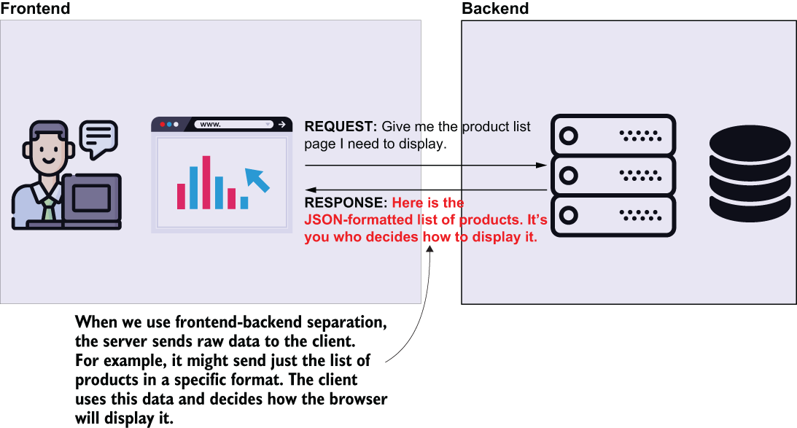
- Sometimes developers refer to the frontend-backend separation approach as being a modern approach.
- **The separation of front- and backend helps in making the development easier to manage for larger apps.** Different teams take the responsibility of implementing the back- and frontend, allowing more developers to collaborate to develop the apps. Also, the deployment of the front- and the backend can be independently managed. **For a larger app, this flexibility is also a nice benefit.**
- The other approach that doesn’t use frontend-backend separation **is mostly for small apps.**
### Using a servlet container in web app development
* * *
- Thus far we’ve seen that a web app has a frontend and a backend. But we didn’t explicitly discuss implementing a web app with Spring.
- Our purpose is **to learn Spring and to implement apps with it, so we have to take a step forward and find out what we need to implement web apps with the framework.**
- One of the most important things to consider is **the communication between the client and the server.**
- A web browser uses **a protocol named Hypertext Transfer Protocol (HTTP) to communicate with the server over the network.** This protocol accurately describes how the client and the server exchange data over the network.
- As a software developer, you’re expected to know that **the web app components use this protocol to exchange data in a request-response fashion.**
- The client sends a request to the server, and the server responds. The client waits for the response after every request it sends.
- **But does that mean your app needs to know how to process the HTTP messages?** Well, you can implement this capability if you wish, but unless you want to have some fun writing low-level functionalities, you’ll use **a component already designed to understand HTTP.**
- In fact, what you need is not only something that understands HTTP, but **something that can translate the HTTP request and response to a Java app.**
- This something is **a servlet container (sometimes referred to as a web server): a translator of the HTTP messages for your Java app.**
- This way, your Java app **doesn’t need to take care of implementing the communication layer.**
- One of the **most appreciated servlet container implementations is Tomcat**, which is also the dependency we’ll use for the examples.
- We use Tomcat for the examples, but you can use its alternatives for your Spring app. The list of solutions used in real-world apps is long. Among these, you find [Jetty](https://www.eclipse.org/jetty/), [JBoss](https://www.jboss.org/), and [Payara](https://www.payara.fish/).
- **A servlet container (e.g., Tomcat) speaks HTTP. It translates the HTTP request to our Spring app and the app’s response into an HTTP response.** This way, we don’t need to care about the protocol used for communication on the network, as **we simply write everything as Java objects and methods.**
- What is a servlet? **A servlet is nothing more than a Java object that directly interacts with the servlet container.**
- **When the servlet container gets an HTTP request, it calls a servlet object’s method and provides the request as a parameter.**
- **The same method also gets a parameter representing the HTTP response used by the servlet to set the response sent back to the client that made the request.**
- Some time ago, **the servlet was the most critical component of a backend web app from the developer’s point of view.**
- Suppose a developer had to implement a new page accessible at a specific path in the URL (e.g., /home/profile/edit, etc.) for a web app. **The developer needed to create a new servlet instance, configure it in the servlet container, and assign it to a specific path.**
- **The servlet contained the logic associated with the user’s request and the ability to prepare a response, including info for the browser on how to display the response.**
- For any path the web client could call, the developer needed to add the instance in the servlet container and configure it. Because such a component manages servlet instances you add into its context, we name it a servlet container.
- It basically has **a context of servlet instances it controls, just as Spring does with its beans.** For this reason, **we call a component such as Tomcat a servlet container.**
- The servlet container (Tomcat) registers multiple servlet instances. Each servlet is associated with a path. When the client sends a request, Tomcat calls a method of the servlet associated with the path the client requested. The servlet gets the values on the request and builds the response that Tomcat sends back to the client.
	- 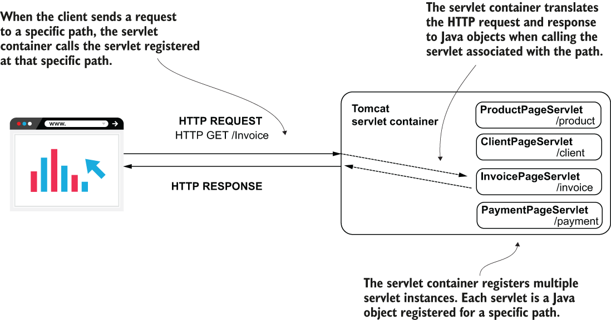
- We don’t typically create servlet instances. **We’ll use a servlet with the Spring apps we develop with Spring, but you won’t need to write this yourself, so you don’t have to focus on learning to implement servlets.** But you do need to remember the servlet is the entry point to your app’s logic.
- **It’s the component the servlet container (Tomcat, in our case) directly interacts with.** It’s how the request data enters your app and how the response goes through Tomcat back to the client.
- The **Spring app defines a servlet object and registers it into the servlet container.** Now **both Spring and the servlet container know this object and can manage it. The servlet container calls this object for any client request, allowing the servlet to manage the request and the response.**
	- 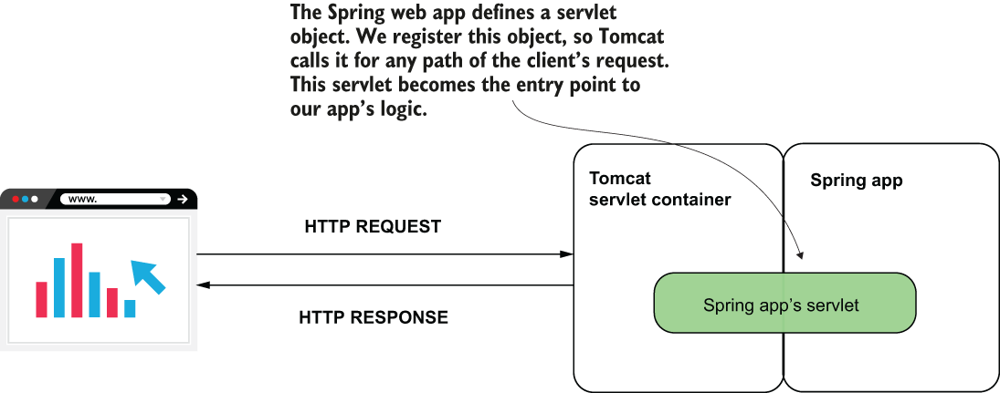
## The magic of Spring Boot
* * *
- To create a Spring web app, **we need to configure a servlet container, create a servlet instance, and then make sure we correctly configure this servlet instance such that Tomcat calls it for any client request. What a headache to write so many configurations!**
- In this section, we’ll discuss **Spring Boot, a tool for implementing modern Spring apps.**
- **Spring Boot is now one of the most appreciated projects in the Spring ecosystem.** It helps you create Spring apps more efficiently and focus on the business code you write by **eliminating a huge part of the code you used to write for configurations.**
- Especially in a world of service-oriented architectures (SOA) and microservices, where you create apps more often, **avoiding the pain of writing configurations is helpful.**
- Listed here are what I consider **the most critical Spring Boot features**, and what they offer:
	- Simplified project creation—You can use a project initialization service to get an empty but configured skeleton app.
	- Dependency starters—Spring Boot groups certain dependencies used for a specific purpose with dependency starters. You don’t need to figure out all the must-have dependencies you need to add to your project for one particular purpose nor which versions you should use for compatibility.
	- Autoconfiguration based on dependencies—Based on the dependencies you added to your project, Spring Boot defines some default configurations. Instead of writing all the configurations yourself, you only need to change the ones provided by Spring Boot that don’t match what you need. Changing the configs likely requires less code (if any).
### Using a project initialization service to create a Spring Boot project
* * *
- In this section, we discuss using a project initialization service to create a Spring Boot project.
- To learn how it can help you, let’s use a project initialization service to create a project.
- Some IDEs integrate directly with a project initialization service, and some don’t. For example, in IntelliJ Ultimate or STS, you’ll find this feature available when creating a new project—but if you use IntelliJ Community, you don’t.
- If your IDE supports this feature, you’ll probably find it named Spring Initializr in your project creation menu.
- Some IDEs integrate with a project initializer service directly. For example, in IntelliJ Ultimate, you can select Spring Initializr from the New Project menu to create a Spring Boot app with a project initializer service.
	- 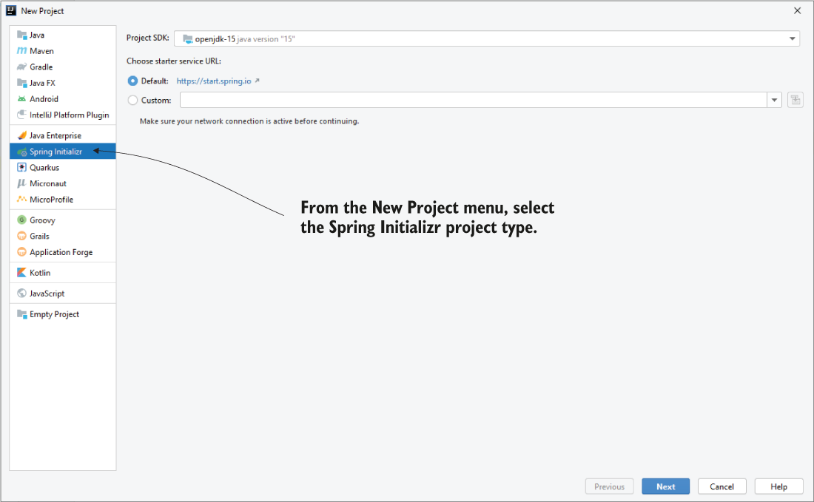
- But if your IDE doesn’t support direct integration with a Spring Boot project initialization service, you can use this feature by accessing [https://start.spring.io](https://start.spring.io) directly in your browser.
- This service will help you create a project you can import into any IDE. Let’s use this approach to create our first project.
- The following list summarizes the steps we’ll take to create the Spring Boot project using start.spring.io
	- Access `start.spring.io` in a web browser.
	- Select the project properties (language, the version, the build tool, and so on).
	- Select the needed dependencies you want to add to your project.
	- Use the Generate button to download the archived project.
	- Unarchive the project and open it in your IDE.
- Steps to generate a Spring Boot project using `start.spring.io`. Access `start.spring.io` in your browser, select the properties and the needed dependencies, and download the archived project. Then open the project in your browser.
	- 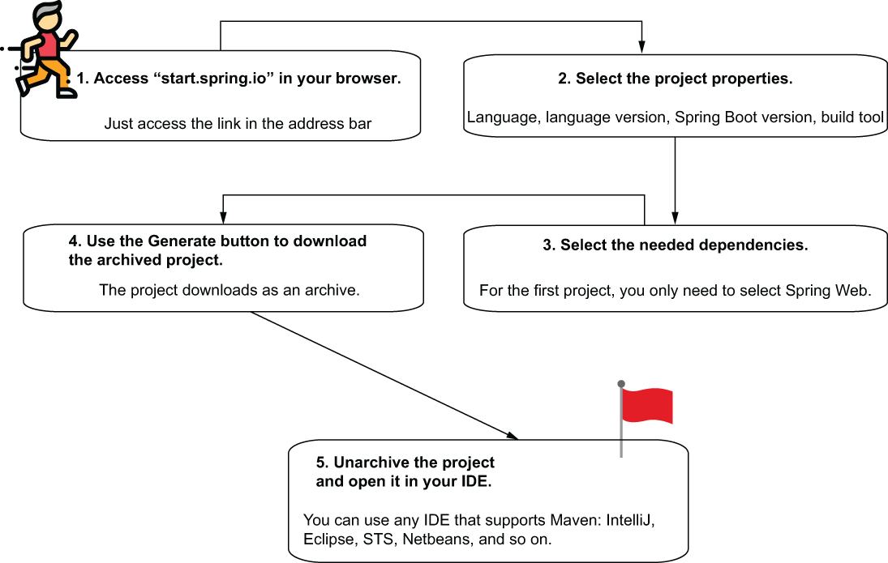
- Once you access `start.spring.io` in a web browser, you’ll find an interface similar to the one in below figure. You have to specify some project properties, like the build tool you prefer between Maven and Gradle and the Java version you want to use. Spring Boot even offers you the possibility to change the syntax of your app to Kotlin or Groovy.
- The `start.spring.io` interface. After accessing `start.spring.io`, you can specify your project’s main configurations, select the dependencies, and download the archived project.
	- 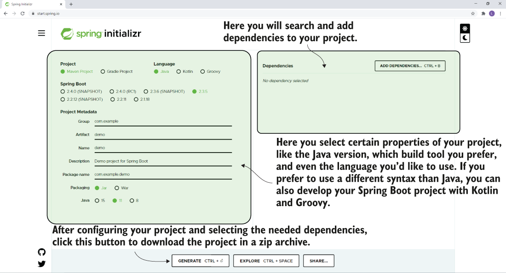
- Spring Boot offers us many options, but we’ll continue using Maven and Java 11 throughout the book to keep the examples consistent.
- The below figure shows you an example of filling the fields for generating a new Spring Boot project for our example. In this example, we only need to add a dependency named Spring Web. This dependency adds everything our project needs to become a Spring web app.
- For our example, we need to add the Spring Web dependency. You can add it using the Add Dependencies button on the right upper-hand side of the window. You also need to give a name to your project.
	- 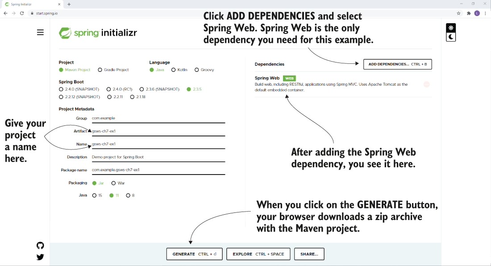
- When you click the Generate button, the browser downloads a zip archive containing a Spring Boot project. Now we discuss the main things Spring Initializr configured into your Maven project.
	- The Spring app main class
	- The Spring Boot POM parent
	- The dependencies
	- The Spring Boot Maven plugin
	- The properties file
- When generating a Spring Boot project with Spring Initializr, it makes some configurations to the project that you don’t find in a plain Maven project.
	- 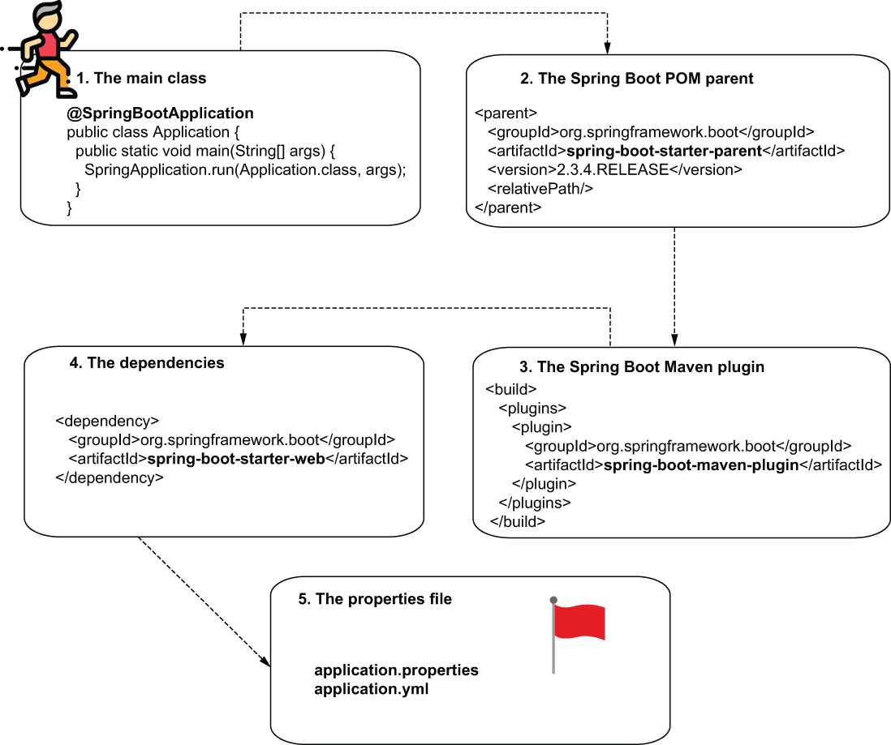
#### THE APP’S MAIN CLASS CREATED BY START.SPRING.IO
* * *
- The first thing to look at is the application’s main class. Unarchive the downloaded file and open it in your IDE. You can observe that Spring Initializr added the `Main` class to your app and also some configurations in the `pom.xml` file. The `Main` class of a Spring Boot app is annotated with the `@SpringBootApplication` annotation, and it looks similar to the next code snippet:
	```
	@SpringBootApplication      ❶
	public class Main {

	  public static void main(String[] args) {
		SpringApplication.run(Main.class, args);
	  }

	}
	```
	❶ This annotation defines the Main class of a Spring Boot app.
- Spring Initializr generated all this code. In this book, we’ll only focus on what’s relevant to our examples. For example, I won’t detail what the `SpringApplication.run()` method does and how precisely Spring Boot uses the `@SpringBootApplication` annotation. These details aren’t relevant to what you’re learning now. Spring Boot is a subject for a whole book.
- You’ll undoubtedly want to understand how Spring Boot apps work in detail, and for this I recommend you read **Craig Walls’s Spring Boot in Action (Manning, 2015)** and **Mark Heckler’s Spring Boot: Up and Running O’Reilly Media, 2021).**
#### THE SPRING BOOT MAVEN PARENT CONFIGURED BY START.SPRING.IO
* * *
- Second, we look at the pom.xml file. If you open your project’s pom.xml file, you’ll find that the project initialization service also added some details here. One of the most important details you’ll find is the Spring Boot parent node, which looks similar to the next code snippet:
	```
	<parent>
	   <groupId>org.springframework.boot</groupId>
	   <artifactId>spring-boot-starter-parent</artifactId>
	   <version>2.3.4.RELEASE</version>
	   <relativePath/> 
	</parent>
	```
- One of the essential things this parent does is **provide you with compatible versions for the dependencies you’ll add to your project.** You’ll observe that we don’t specify a version for a dependency we use in most cases. **We let (and it’s recommended) Spring Boot choose the version of a dependency to make sure we don’t run into incompatibilities.**
#### THE SPRING BOOT MAVEN PLUGIN CONFIGURED BY START.SPRING.IO
* * *
- Next we look at the Spring Boot Maven plugin configured by `start.spring.io` when creating the project. You find this plugin also configured in the `pom.xml` file.
- The next code snippet shows the plugin declaration, which you usually find at the end of the `pom.xml` file inside the `<build> <plugins> ... </plugins></build>` tags. This plugin is responsible for adding part of the default configurations you’ll observe in your project:
	```
	<build>
	   <plugins>
		  <plugin>
			 <groupId>org.springframework.boot</groupId>
			 <artifactId>spring-boot-maven-plugin</artifactId>
		  </plugin>
	   </plugins>
	 </build>
	```
#### THE MAVEN DEPENDENCIES ADDED BY START.SPRING.IO WHEN CREATING THE PROJECT
* * *
- Also in the `pom.xml` file, you find the dependency you added when creating the project in `start.spring.io`, **Spring Web**.
- You’ll find this dependency provided, as shown in the next code snippet. It is a dependency starter named `spring-boot-starter-web`. We discuss what a dependency starter is in detail. For now, know that it doesn’t specify a version.
- For all the examples we have written, we also specified a version for each dependency. The reason you don’t specify one now is to let Spring Boot choose the right one for you. As we discussed earlier in this section, this is why we need the Spring Boot parent to the `pom.xml` file:
	```
	<dependency>
	   <groupId>org.springframework.boot</groupId>
	   <artifactId>spring-boot-starter-web</artifactId>
	</dependency>
	```
#### THE APPLICATION PROPERTIES FILE
* * *
- The last essential thing Spring Initializr added to your project is a file named “`application.properties`.” You find this file in the resources folder of your Maven project. Initially, this file is empty, and for this first example we’ll keep it this way. Later, we’ll discuss using this file to configure property values your app needs during its execution.
### Using dependency starters to simplify the dependency management
* * *
- Let’s focus on the second essential advantage Spring Boot offers: **dependency starters**. Dependency starters **save you plenty of time, and they’re an invaluable feature Spring Boot offers.**
- A dependency starter is **a group of dependencies you add to configure your app for a specific purpose.**
- In your project’s `pom.xml` file, the starter looks like a normal dependency, as presented in the next code snippet. Observe the name of the dependency: A starter name usually starts with “`spring-boot-starter-`” followed by a relevant name that describes the capabilities it added to the app:
```
<dependency>
   <groupId>org.springframework.boot</groupId>
   <artifactId>spring-boot-starter-web</artifactId>
</dependency>
```
- In the past, to configure a Spring web app you had to add all the needed dependencies to your `pom.xml` file yourself and make sure their versions were compatible one with the other. Configuring all the dependencies you need is not an easy job. Taking care of the version compatibility is even more complicated.
- With dependency starters, **we don’t request dependencies directly.** We request capabilities.
- You add a dependency starter for **a particular capability you need, say web functionalities, a database, or security.** Spring Boot makes sure to add the right dependencies to your app with the proper compatible version for your requested capability.
- We can say that dependency starters are capability-oriented groups of compatible dependencies.
- Using dependency starters. Instead of individually referring to specific dependencies, the app now depends on only a starter. The starter contains all the needed dependencies for implementing a specific capability. The starter also makes sure these dependencies are compatible with one another.
	- 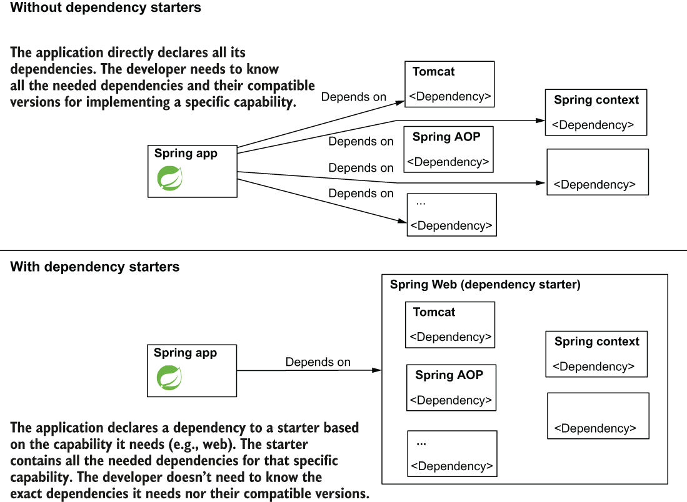
- Look at your `pom.xml` file. You only added the spring-boot-starter-web dependency, no Spring context, no AOP, no Tomcat! But, if you look in the “External Libraries” folder of your app, you’ll find JAR archives for all these. Spring Boot knew you would need them and downloaded them with specific versions it knows are compatible.
### Using autoconfiguration by convention based on dependencies
* * *
- Spring Boot also provides autoconfiguration for your application. We say that it applies the **convention-over-configuration** principle.
- In this section, we discuss what **convention-over-configuration** is and how Spring Boot helps us by applying this principle.
- Out of all the previous Spring Boot features discussed in this chapter, the **autoconfiguration** is probably **the most appreciated and the most known.**
- Just start your app, and you’ll understand why. Yes, I know, you didn’t even write anything yet—only downloaded the project and opened it in your IDE. But you can start the app, and you’ll find your app boots a Tomcat instance by default accessible on port 8080. In your console, you find something similar to the next snippet:
	```
	Tomcat started on port(s): 8080 (http) with context path ''   ❶
	Started Main in 1.684 seconds (JVM running for 2.306)
	```
	❶ Spring Boot configured Tomcat and starts it by default on port 8080.
- Based on the dependencies you added, **Spring Boot realizes what you expect from your app and provides you some default configurations.** Spring Boot gives you the configurations, which are generally used for the capabilities you requested when adding the dependencies.
- For example, **Spring knows when you added the web dependency you need for a servlet container and configures you a Tomcat instance** because, in most cases, developers use this implementation. For Spring Boot, **Tomcat is the convention for a servlet container.**
- The **convention represents the most-used way to configure the app for a specific purpose.** Spring Boot c**onfigures the app by convention such that you now only need to change those places where your app needs a more particular configuration.** With this approach, you’ll write less code for configuration (if any).
## Implementing a web app with Spring MVC
* * *
- In this section, we’ll implement our first web page in a Spring web app. It’s true we already have a Spring Boot project with the default configurations, but this app only starts a Tomcat server.
- These configurations don’t make our app a web app yet! We still have to implement the pages that someone can access using a web browser.
- We continue implementing the project to add a web page with static content. With these changes, you’ll learn to implement a web page and how your Spring app works behind the scenes.
- To add a web page to your app, you follow two steps:
	- Write an HTML document with the content you want to be displayed by the browser.
	- Write a controller with an action for the web page created at point 1.
- The steps for adding a static web page to your application. Add the HTML document containing the information the browser will display and then write a controller with an action assigned to it.
	- 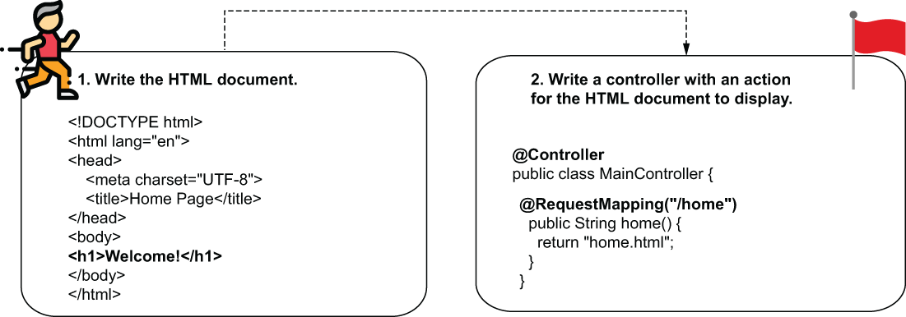
- In the project, we first start adding a static web page with the content we want to display in the browser.
- This web page is just an HTML document, and for our example the page only displays a short text in a heading.
- The following listing shows you what the content of this file should look like. You need to add the file in the “`resources/static`” folder of your Maven project. This folder is the default place where the Spring Boot app expects to find the pages to render.
	```
	<!DOCTYPE html>
	<html lang="en">
	<head>
		<meta charset="UTF-8">
		<title>Home Page</title>
	</head>
	<body>
		<h1>Welcome!</h1>      ❶
	</body>
	</html>
	```
	❶ In a standard HTML document, we display a heading text.
- The second step you take is writing **a controller with a method that links the HTTP request to the page you want your app to provide in response.**
- The controller is **a component of the web app that contains methods (often named actions) executed for a specific HTTP request.** In the end, the controller’s action returns a reference to the web page the app returns in response.
- We’ll keep our first example simple, and we won’t make the controller execute any specific logic for the request for now. We’ll just configure an action to return in response to the content of the `home.html` document we created and stored in the “`resources/static`” folder in the first step.
- To mark a class as a controller, you only need to use the `@Controller` annotation, a stereotype annotation (like `@Component` and `@Service`, discussed in earlier chapter).
- This means that Spring will also add a bean of this class to its context to manage it. Inside this class, you can define controller actions, which are methods associated with specific HTTP requests.
- Say you want the browser to display this page’s content when the user accesses the `/home` path.
- To achieve this result, you annotate the action method with the `@RequestMapping` annotation specifying the path as a value of the annotation: `@RequestMapping("/home")`. The method needs to return, as a string, the name of the document you want the app to send as a response. The following listing shows the controller class and the action it implements.
	```
	@Controller                         ❶
	public class MainController {

	  @RequestMapping("/home")          ❷
	  public String home() {
	"home.html";             ❸
	  }
	}
	```
	❶ We annotate the class with the @Controller stereotype annotation.
	❷ We use the @RequestMapping annotation to associate the action with an HTTP request path.
	❸ We return the HTML document name that contains the details we want the browser to display.
- I know you have plenty of questions now! All my students do at this point when I teach Spring in class—questions such as these:
	- Can this method do something other than return the HTML file name?
	- Can it get parameters?
	- I saw examples on the web using annotations other than @RequestMapping; are they better?
	- Can the HTML page contain dynamic content?
- We will answer all these questions with examples in next chapter. But for the moment, I ask that you focus on this simple app to understand what we just wrote.
- First, you need to know how Spring manages the request and calls this controller action we implemented. Correctly understanding the framework’s way of managing the web request is a valuable skill that will help you later learn the details faster and implement any feature you need in a web app.
- We now start the application, analyze its behavior, and discuss, with visuals, the mechanism behind the app that makes this result possible.
- When starting the app, you will see the log. It tells you Tomcat started and the port it uses in the app console. If you use the default (you didn’t configure something not explained in this chapter), Tomcat uses port 8080.
	```
	Tomcat started on port(s): 8080 (http) with context path ''
	```
- Open a browser window on the same computer where you run the app and write the following address in the address bar: `http://localhost:8080/home`
- Do not forget to write the path `/home` you mapped with the controller’s action; otherwise, you’ll get an error and an HTTP response with the status “`404 Not Found`.”
- Testing the implementation. Using a browser, send a request to the backend app. You need to use the port Tomcat opened and the path you specified with the `@RequestMapping` annotation.
	- 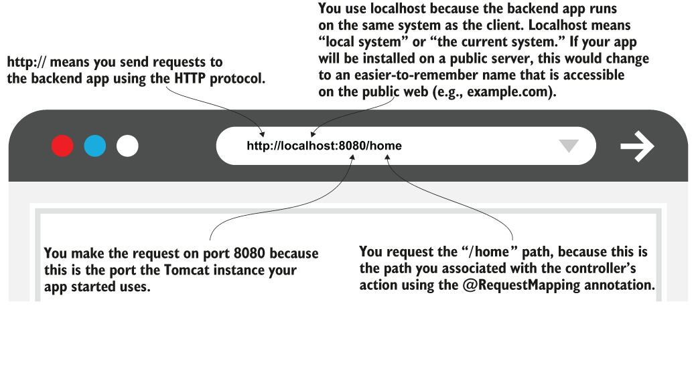
- Accessing the page in a browser, you’ll see the heading text “Welcome!” The browser interprets and displays the HTML received in response from the backend.
	- 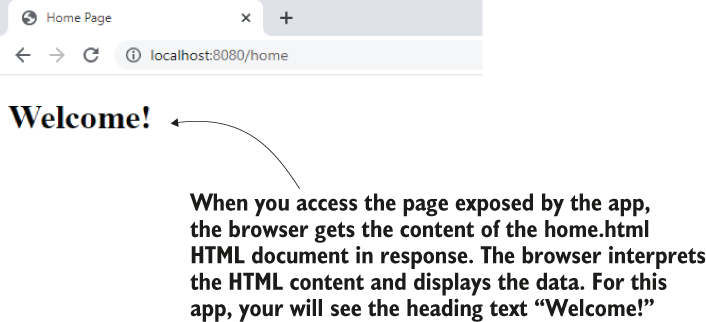
- Now that you’ve seen the app’s behavior, let’s discuss the mechanism behind it. Spring has a set of components that interact with each other to get the result you observed. The below figure presents these components and the flow in which they manage an HTTP request.
- The **Spring MVC** architecture. In the diagram, you find the main components of Spring MVC. These components and the way they collaborate are responsible for a web app’s behavior. The controller (shaded differently) is the only component you implement. Spring Boot configures the other components.
	- 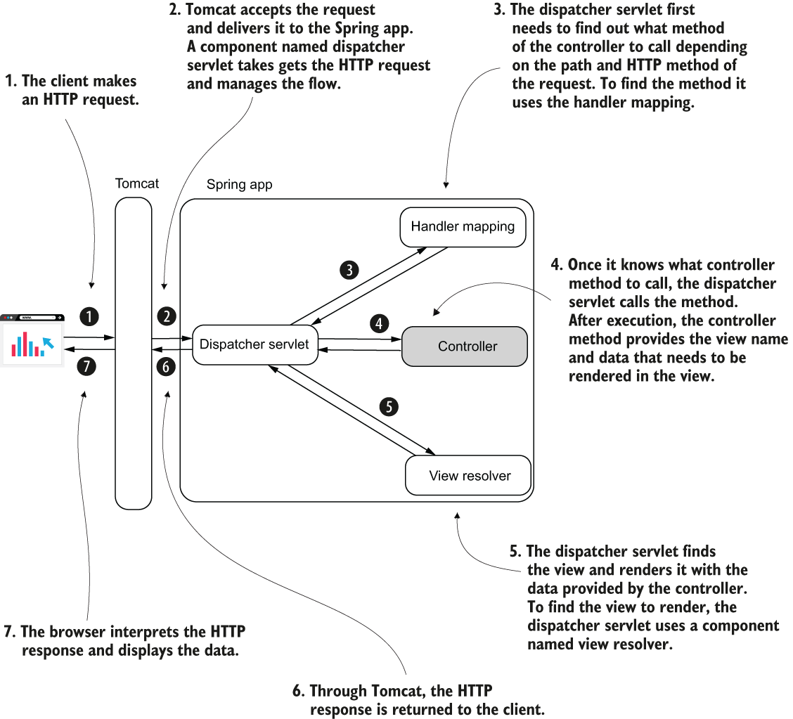
	1. The client makes an HTTP request.
	2. Tomcat gets the client’s HTTP request. Tomcat has to call a servlet component for the HTTP request. In the case of Spring MVC, Tomcat calls a servlet Spring Boot configured. We name this servlet dispatcher servlet.
	3. The dispatcher servlet is the entry point of the Spring web app. (It’s that servlet we discussed in figure 7.8 earlier in this chapter; it’s also in figure 7.18.) Tomcat calls the dispatcher servlet for any HTTP request it gets. Its responsibility is to manage the request further inside the Spring app. It has to find what controller action to call for the request and what to send back in response to the client. This servlet is also referred to as a “front controller.”
	4. The first thing the dispatcher servlet needs to do is find a controller action to call for the request. To find out which controller action to call, the dispatcher servlet delegates to a component named handler mapping. The handler mapping finds the controller action you associated with the request with the @RequestMapping annotation.
	5. After finding out which controller action to call, the dispatcher servlet calls that specific controller action. If the handler mapping couldn’t find any action associated with the request, the app responds to the client with an HTTP “404 Not Found” status. The controller returns the page name it needs to render for the response to the dispatcher servlet. We refer to this HTML page also as “the view.”
	6. At this moment, the dispatcher servlet needs to find the view with the name received from the controller to get its content and send it as response. The dispatcher servlet delegates the responsibility of getting the view content to a component named “View Resolver.”
	7. The dispatcher servlet returns the rendered view in the HTTP response.
- In this chapter, I described the handler mapping as the component that finds the controller action by the HTTP request path. The handler mapping also searches by something named the HTTP method, which I left it out of my explanations for the moment so that you can more easily focus on the flow. We’ll discuss HTTP methods in more detail in next chapter.
- Spring (with Spring Boot) considerably simplifies the development of a web app by arranging this setup. **You only need to write controller actions and map them to requests using annotations. A large part of the logic is hidden in the framework, and this helps you write the apps faster and cleaner.**
- In next chapter, we continue with more details on what you can do with a controller class.
- Real-world apps are often more complex than just returning the content of a static HTML page. In most cases, the page displays dynamic details processed by the app before rendering the HTTP response.
- **“Don’t rush into learning details before properly understanding the basics”** is a rule of thumb I use when learning any technology.