# 08 Implementing web apps with Spring Boot and Spring MVC
- This chapter covers
	- Using a **template engine** to implement dynamic views
	- Sending data from client to server through **HTTP requests**
	- Using **GET and POST HTTP methods** for your HTTP requests
- We start with implementing pages whose content changes according to how your app processes the data for specific requests.
- Today we rarely see static pages on websites.
- You probably think, “There has to be a way to decide what content to add on the pages before delivering the HTTP response back to the browser.” There are ways you can do this!
- We’ll implement dynamic views using **template engines**. A template engine is **a dependency that allows you to easily get and display variable data the controller sends.**
- You’ll learn how to send data from the client to the server through the **HTTP request**. We’ll use that data in the controller’s method and create the dynamic content on the view.
- We discuss **HTTP methods**, and you’ll learn that the request path isn’t enough to identify a client’s request. Together with the request path, the client uses an HTTP method represented with a verb (**GET, POST, PUT, DELETE, PATCH**, etc.), which expresses the client’s intention.
- In our example, we’ll implement an HTML form that someone can use to send values the backend has to process.
## Implementing web apps with a dynamic view
* * *
- Suppose you implement the cart page of an online shop. This page shouldn’t display the same data for everyone. It also doesn’t even show the same information every time for the same user. This page shows precisely the products a particular user has added to their cart.
- In below figure, you find an example of a dynamic view presented with the Manning website’s cart functionality. Observe how requests to the same page manning.com/ cart receive different data in response. The information displayed is different, even if the page is the same. The page has dynamic content!
- A dynamic view presented with the Manning shopping cart functionality. Even if the requested page is the same, the content of the page is different. The backend sent different data in the response before and after adding one more product to the cart.
	- 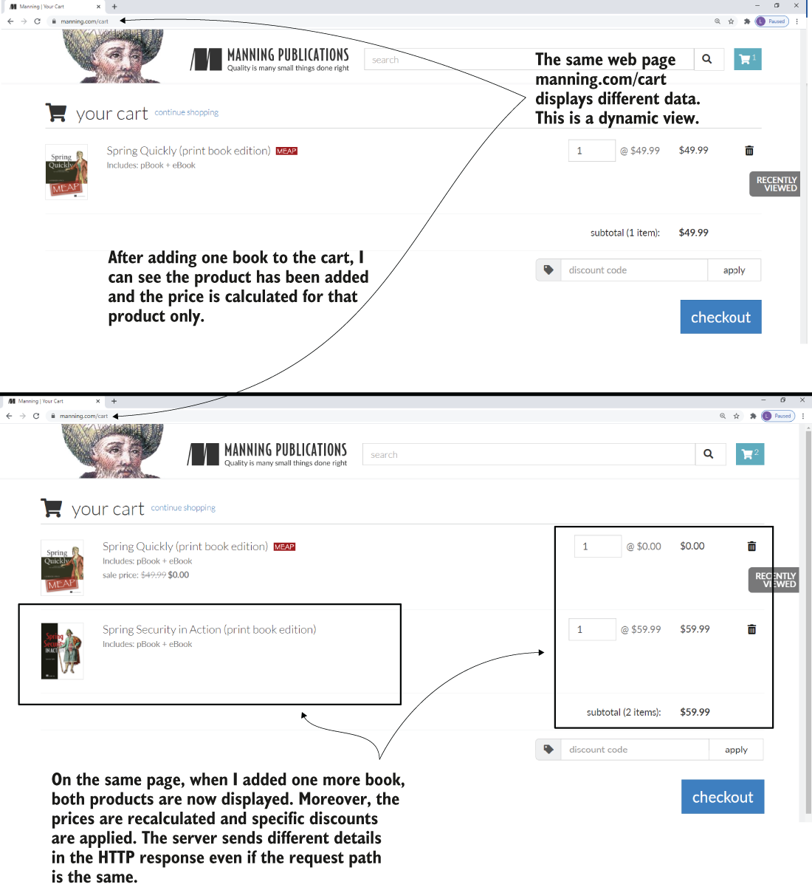
- In this section, we implement a web app with a dynamic view. Most apps today need to display dynamic data to the user. Now, for **a user’s request expressed through an HTTP request sent by the browser, the web app receives some data, processes it, and then sends back an HTTP response that the browser needs to display**.
- We’ll review the Spring MVC flow and then work on an example to demonstrate how the view can get dynamic values from the controller.
- A client sends data through the HTTP request. The backend processes this data and builds a response to send back to the client. Depending on how the backend processed the data, different requests may result in other data displayed to the user.
	- 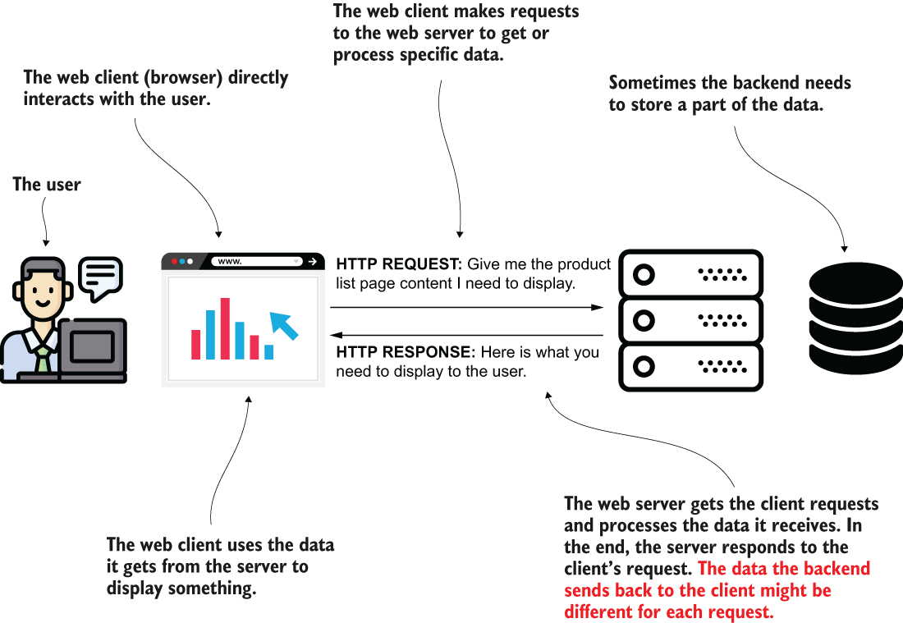
- In the example we implemented at the end of previous chapter, the browser’s content was the same for every HTTP request for our page. Remember the Spring MVC flow:
	- The client sends an HTTP request to the web server.
	- The dispatcher servlet uses the handler mapping to find out what controller action to call.
	- The dispatcher servlet calls the controller’s action.
	- After executing the action associated with the HTTP request, the controller returns the view name the dispatcher servlet needs to render into the HTTP response.
	- The response is sent back to the client.
- The Spring MVC flow. To define a dynamic view, the controller needs to send data to the view. The data the controller sends can be different for each request. For example, in an online shop’s cart functionality, the controller initially sends a list of one product to the view. After the user adds more products, the list the controller sends contains all the products in the cart. The same view shows different information for these requests.
	- 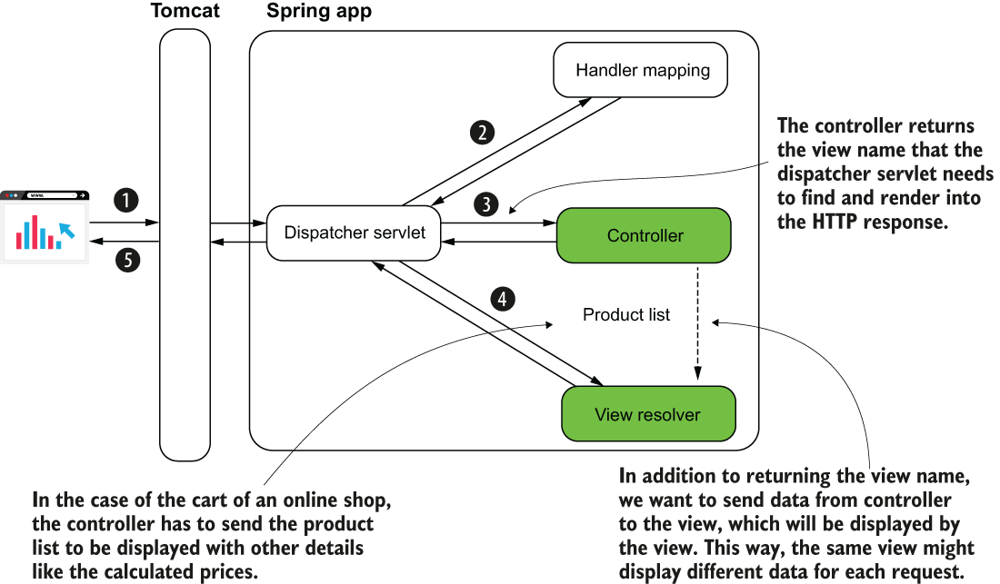
- We want the controller not only to return the view name but somehow also send data to the view.
- The view will incorporate this data to define the HTTP response. This way, if the server sends a list of one product, and the page displays the list, the page will display one product. If the controller sends two products for the same view, now the displayed data will be different because the page will show two products.
- Let me show you how to send data from the controller to the view in a project now. This example is simple to allow you to focus on the syntax. But you can use this approach to send any data from the controller to the view.
- Let’s assume for now we want to send a name and print it with a specific color.
- In a real-world scenario, you’d maybe need to print the name of the user somewhere on the page. How you do that? How do you get data that could be different from one request to another and print it on the page?
- We’ll create a Spring Boot project and add a template engine to the dependencies in the `pom.xml` file. We’ll use a template engine named **Thymeleaf**.
- The template engine is a dependency that allows us to easily send data from the controller to the view and display this data in a specific way.
- As you’ll observe in our example, the templates used with Thymleaf are simple HTML static files. The next code snippet shows the dependency you need to add to the `pom.xml` file:
	```
	<dependency>
	   <groupId>org.springframework.boot</groupId>
	   <artifactId>spring-boot-starter-thymeleaf</artifactId>  ❶
	</dependency>
	<dependency>
	   <groupId>org.springframework.boot</groupId>
	   <artifactId>spring-boot-starter-web</artifactId>        ❷
	</dependency>
	```
	❶ The dependency starter that needs to be added to use Thymeleaf as a template engine
	❷ Though you’re building a web app, you still need to add the dependency starter for web apps.
- In below listing, you find the definition of the controller. We annotate the method to map the action to a specific request path using `@RequestMapping`.
- We now also define a parameter to the method. This parameter of type Model stores the data we want the controller to send to the view. In this Model instance, we add the values we want to send to the view and identify each of them with a unique name (also referred to as key).
- To add a new value that the controller sends to the view, we call the `addAttribute()` method.
- The first parameter of the `addAttribute()` method is the key; the second parameter is the value you send to the view.
	```
	@Controller                                 ❶
	public class MainController {

	  @RequestMapping("/home")                  ❷
	  public String home(Model page) {          ❸
		page.addAttribute("username", "Katy");  ❹
		page.addAttribute("color", "red");      ❹
		return "home.html";                     ❺
	  }
	}
	```
	❶ The @Controller stereotype annotation marks this class as Spring MVC controller and adds a bean of this type to the Spring context.
	❷ We assign the controller’s action to an HTTP request path.
	❸ The action method defines a parameter of type Model that stores the data the controller sends to the view.
	❹ We add the data we want the controller to send to the view.
	❺ The controller’s action returns the view to be rendered into the HTTP response.
- Students sometimes ask me why they get an error if they directly add to the browser’s address bar “localhost:8080” without a path like “/home.” It’s correct that an error appears. The error is a default page you see displayed by a Spring Boot app when you get an HTTP 404 (Not Found) response status. When you call directly “localhost:8080” you refer to the path “/.” Because you didn’t assign any controller action to this path, it’s normal to get an HTTP 404. If you wish to see something else instead, assign a controller action to this path as well using the `@RequestMapping` annotation.
- To define the view, you need to add a new “home.html” file to your Spring Boot project’s “resources/templates” folder. Be attentive to the small difference: in previous chapter, we added the HTML file in the “resources/static” folder because we created a static view. Now that we’re using a template engine to create a dynamic view, you need to add the HTML file to the “resources/templates” folder instead.
- The below listing shows the content of the “home.html” file I added to the project. The first important thing to notice in the file’s content is the `<html>` tag where I added the attribute `xmlns:th="http://www.thymeleaf.org"`. This definition is equivalent to an import in Java. It allows us further to use the prefix **“th”** to refer to specific features provided by Thymeleaf in the view.
- A little bit further in the view, you find two places where I used this **“th”** prefix to refer to the controller’s data to the view.
- With the `${attribute_key}` syntax, you refer to any of the attributes you send from the controller using the `Model` instance.
- For example, I used the `${username}` to get the value of the “**username**” attribute and `${color}` to get the value of the “**color**” attribute.
	```
	<!DOCTYPE html>
	<html lang="en" xmlns:th="http://www.thymeleaf.org">   ❶

	  <head>
		<meta charset="UTF-8">
		<title>Home Page</title>
	  </head>

	  <body>
		<h1>Welcome 
		<span th:style="'color:' + ${color}"               ❷
			  th:text="${username}"></span>!</h1>          ❷
	  </body>

	</html>
	```
	❶ Defines the Thymeleaf “th” prefix
	❷ Uses the “th” prefix to use the values sent by the controller
- To test if everything works, start the application and access the web page in a browser. Your page will look like the one in below figure.
- The result. Running the app and accessing the page in a browser, you observe the view that uses the values the controller sent.
	- 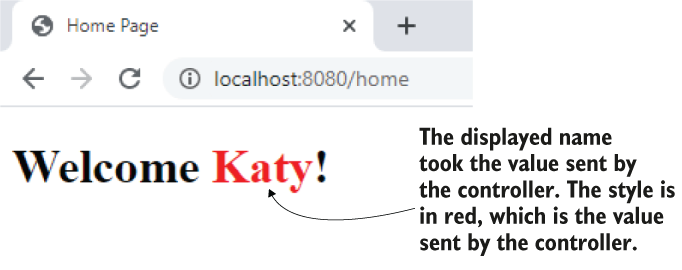
- Now, whatever your controller sends, the view uses.
### Getting data on the HTTP request
* * *
- In this section, we discuss how the client sends data to the server through HTTP requests.
- In apps, we often need to give the client the ability to send information to the server. This data gets processed and then displayed on the view, as you learned in previous section.
- Here are some examples of use cases where the client has to send data to the server:
	- You implement the order functionality of an online shop. The client needs to send to the server the products that the user orders. Further, the server takes care of the order.
	- You implement a web forum where you allow users to add and edit new posts. The client sends the post details to the server, which stores or changes the details in a database.
	- You implement the login functionality of an app. Users write their credentials, which need to be validated. The client sends the credentials to the server, and the server validates these credentials.
	- You implement the contact page of a web app. The page displays a form where the user can write a message subject and body. These details need to be sent in an email to a specific address. The client sends these values to the server, and the server takes care of processing them and sending an email to the desired email address.
- In most cases, to send data through the HTTP request you use one of the following ways:
	- An **HTTP request parameter** represents a simple way to send values from client to server in a **key-value(s) pair format**. To send HTTP request parameters, you append them to the URI in a request query expression. They are also called **query parameters**. You should use this approach only **for sending a small quantity of data**.
	- An **HTTP request header** is similar to the **request parameters in that the request headers are sent through the HTTP header**. The big difference is that they don’t appear in the URI, but you still **cannot send large quantities of data using HTTP headers**.
	- A **path variable** sends data through **the request path itself**. It is the **same as for the request parameter approach**: you use a path variable to s**end a small quantity of data**. But we should **use path variables when the value you send is mandatory**.
	- The **HTTP request body** is mainly used to **send a larger quantity of data (formatted as a string, but sometimes even binary data such as a file)**. We’ll discuss this approach in upcoming chapter, where you’ll learn to implement REST endpoints.
### Using request parameters to send data from client to server
* * *
- We implement an example to demonstrate the use of HTTP request parameters—simple ways to send data from the client to the backend. You often encounter this approach in production apps.
- You use request parameters in the following scenarios:
	- The quantity of **data you send is not large**. You set the request parameters using query variables (as shown in this section’s example). This approach limits you to about 2,000 characters.
	- You need to **send optional data**. A request parameter is a clean way to deal with a value the client might not send. The server can expect to not get a value for specific request parameters.
- An often-encountered use case for request parameters used is defining some **search and filtering criteria**.
- Say your app displays product details in a table. Each product is identified by a name, a price, and a brand. You want to allow the user to search for products by any of these.
- The user might decide to search by price or by name and brand. Any combination is possible. For such a scenario, request parameters are the right choice for implementation.
- The app sends each of these values (name, price, and brand) in optional request parameters. The client only needs to send the values by which the user decides to search.
- A request parameter can be optional. A common scenario for using request parameters is implementing a search functionality where the search criteria are optional. The client sends only some of the request parameters, and the server knows to use only the values it receives. You implement the server to consider it might not get values for some of the parameters.
	- 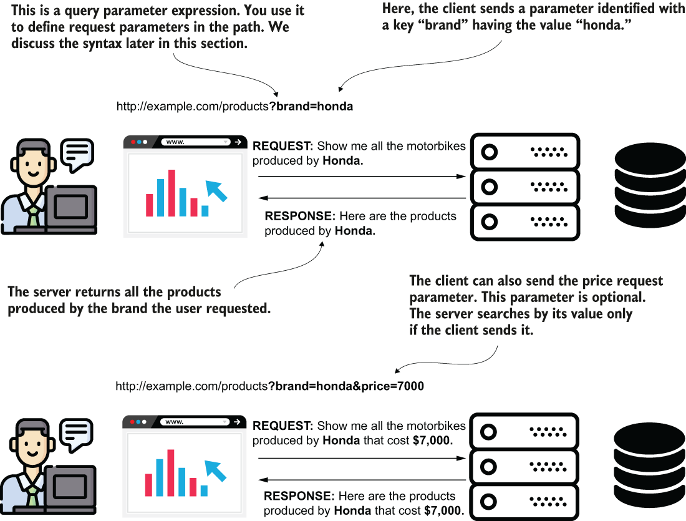
- The below listing shows you how to change the controller class to get the client’s color value in a request parameter.
- To get the value from a request parameter, you need to add one more parameter to the controller’s action method and annotate that parameter with the `@RequestParam` annotation.
- The `@RequestParam` annotation tells Spring it needs to get the value from the HTTP request parameter with the same name as the method’s parameter name.
	```
	@Controller
	public class MainController {

	  @RequestMapping("/home")
	  public String home(
		  @RequestParam String color,              ❶
		  Model page) {                            ❷
		page.addAttribute("username", "Katy");
		page.addAttribute("color", color);         ❸
		return "home.html";
	  }
	}
	```
	❶ We define a new parameter for the controller’s action method and annotate it with `@RequestParam`.
	❷ We also add the Model parameter that we use to send data from the controller to the view.
	❸ The controller passes the color sent by the client to the view.
- The value sent by the client from the Spring MVC perspective. The controller action gets the request parameters the client sends and can use them. In our example, the value is set on the Model and delivered to the view.
	- 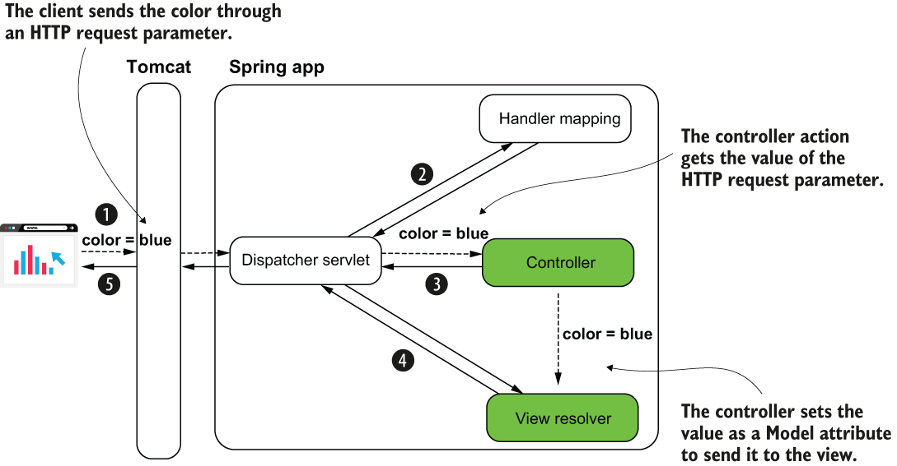
- Run the application and access the `/home` path. To set the request parameter’s value, you need to use the next snippet’s syntax:
	`http://localhost:8080/home?color=blue`
- When setting HTTP request parameters, you extend the path with a `?` symbol followed by pairs of **key=value** parameters separated by the `&` symbol. For example, if I want to also send the name as a request parameter, I write:
`http://localhost:8080/home?color=blue&name=Jane`
- You can add a new parameter to the controller’s action to get this parameter as well. The next code snippet shows this change.
	```
	@Controller
	public class MainController {

	  @RequestMapping("/home")
	  public String home(
		  @RequestParam(required = false) String name,     ❶
		  @RequestParam(required = false) String color,
		  Model page) {
		page.addAttribute("username", name);               ❷
		page.addAttribute("color", color);
		return "home.html";
	  }
	}
	```
	❶ Gets the new request parameter “name”
	❷ Sends the “name” parameter’s value to the view
- In the group `key=value` (for example, `color=blue`), “key” is the name of the request parameter, and its value is written right after the `=` symbol.
- Sending data through request parameters. Each request parameter is a key-value pair. You provide the request parameters with the path in a query starting with the question mark symbol. If you set more than one request parameter, you separate each key-value pair with the “and” (`&`) symbol.
	- 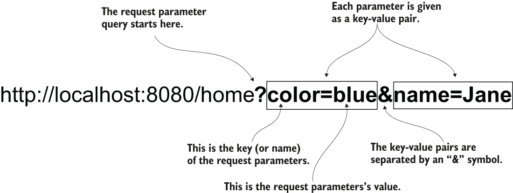
- A request parameter is **mandatory by default**. If the client doesn’t provide a value for it, the server sends back a response with the status HTTP “400 Bad Request.” If you wish the value to be optional, you need to explicitly specify this on the annotation using the optional attribute: `@RequestParam(optional=true)`.
### Using path variables to send data from client to server
* * *
- Using path variables is also a way of sending data from client to server. But instead of using the HTTP request parameters, you **directly set variable values in the path**, as presented in the next snippets.
- Using request parameters:
	`http://localhost:8080/home?color=blue`
- Using path variables:
	`http://localhost:8080/home/blue`
- You don’t identify the value with a key anymore. You just take that value from a precise position in the path.
- On the server side, you **extract that value from the path from the specific position**. You may have more than one value provided as a path variable, but it’s generally better to **avoid using more than a couple**. You’ll observe that the path becomes more challenging to read if you go with more than two path variables. I **prefer using request parameters for more than two values** instead of path variables.
- Also, you **shouldn’t use path variables for optional values**. I recommend you **use path variables only for mandatory parameters**. If you have optional values to send in the HTTP request, you should use request parameters.
- A quick comparison of the request parameters and path variables approaches.

	| Request parameters                                                                                                                                                                                       | Path variables                                                                                                                                                                                                               |
	| -------------------------------------------------------------------------------------------------------------------------------------------------------------------------------------------------------- | ---------------------------------------------------------------------------------------------------------------------------------------------------------------------------------------------------------------------------- |
	| Can be used with optional values.                                                                                                                                                                        | Should not be used with optional values.                                                                                                                                                                                     |
	| It is recommended that you avoid a large number of parameters. If you need to use more than three, I recommend you use the request body. Avoid sending more than three query parameters for readability. | Always avoid sending more than three path variables. It’s even better if you keep a maximum of two.                                                                                                                          |
	| Some developers consider the query expression more difficult to read than the path expression.                                                                                                           | Easier to read than a query expression. For a publicly exposed website, it’s also easier for search engines (e.g., Google) to index the pages. This advantage might make the website easier to find through a search engine. |
- When the page you write depends on only one or two values that are the core of the end result, it’s better to write them directly in the path to make the request easier to read.
- The URL is also easier to find when you bookmark it in your browser and easier to index with a search engine (if it matters for your app).
- Let’s write an example to demonstrate the syntax you need to write in your controller for getting values as path variables.
- To reference a path variable in the controller’s action, you **simply give it a name and add it to the path between curly braces**.
- You then use the `@PathVariable` annotation to mark the controller’s action parameter to get the path variable’s value.
- The below listing shows you how to change the controller action to get the color value with a path variable.
	```
	@Controller
	public class MainController {

	  @RequestMapping("/home/{color}")   ❶
	  public String home(
		  @PathVariable String color,    ❷
		  Model page) {
		page.addAttribute("username", "Katy");
		page.addAttribute("color", color);
		return "home.html";
	  }
	}
	```
	❶ To define a path variable, you assign it a name and put it in the path between curly braces.
	❷ You mark the parameter where you want to get the path variable value with the `@PathVariable` annotation. The name of the parameter must be the same as the name of the variable in the path.
- Run the app and access the page in your browser with different values for the color.
	```
	http://localhost:8080/home/blue
	http://localhost:8080/home/red
	http://localhost:8080/home/green
	```
- Each request colors the name displayed by the page in the given color. The below figure visually represents the link between the code and the request path.
- Using path variables. To get a value from a path variable, you give the variable a name between curly braces when defining the path on the controller action. You use a parameter annotated with `@PathVariable` to get the value of the path variable.
	- 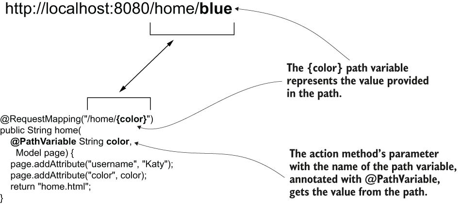
## Using the GET and POST HTTP methods
* * *
- In this section, we discuss **HTTP methods** and how the client uses them to express what action (create, change, retrieve, delete) it will apply to the requested resource.
- A path and a verb identify an HTTP request.
- Thus far we have only referred to the path, and, without noticing, we used the **HTTP GET** method.
- Its purpose is to define **what action the client requests**. For example, by using GET, we represent **an action that only retrieves data**. It’s a way for the client to say it wants to obtain something from the server, but **the call won’t change data**.
- But you’ll need more than this. An app also needs to **change, add, or delete data**.
- Be careful! **You can use an HTTP method against its designed purpose, but this is incorrect.** For example, you could use HTTP GET and implement a functionality that changes data. Technically, this is possible, but it’s a bad, bad choice. **Never use an HTTP method against its designed purpose.**
- We’ve **relied on the request path to reach a specific action of the controller**, but **in a more complex scenario you can assign the same path to multiple actions of the controller as long as you use different HTTP methods**.
- The HTTP method is **defined by a verb and represents the client’s intention**. If the client’s request only retrieves data, we implement the endpoint with **HTTP GET**. But if the client’s request somehow changes data on the server side, we use other verbs to represent the client’s intention clearly.
- Basic HTTP methods you’ll often encounter in web apps

	| HTTP method | Description                                                              |
	| ----------- | ------------------------------------------------------------------------ |
	| GET         | The client’s request only retrieves data.                                |
	| POST        | The client’s request sends new data to be added by the server.           |
	| PUT         | The client’s request changes a data record on the server side.           |
	| PATCH       | The client’s request partially changes a data record on the server side. |
	| DELETE      | The client’s request deletes data on the server side.                    |
- The basic HTTP methods. You use GET for retrieving data, POST for adding data, PUT for changing a record, PATCH for changing a part of the record, and DELETE to remove data. The client must use the appropriate HTTP method to express the action executed by a specific request.
	- 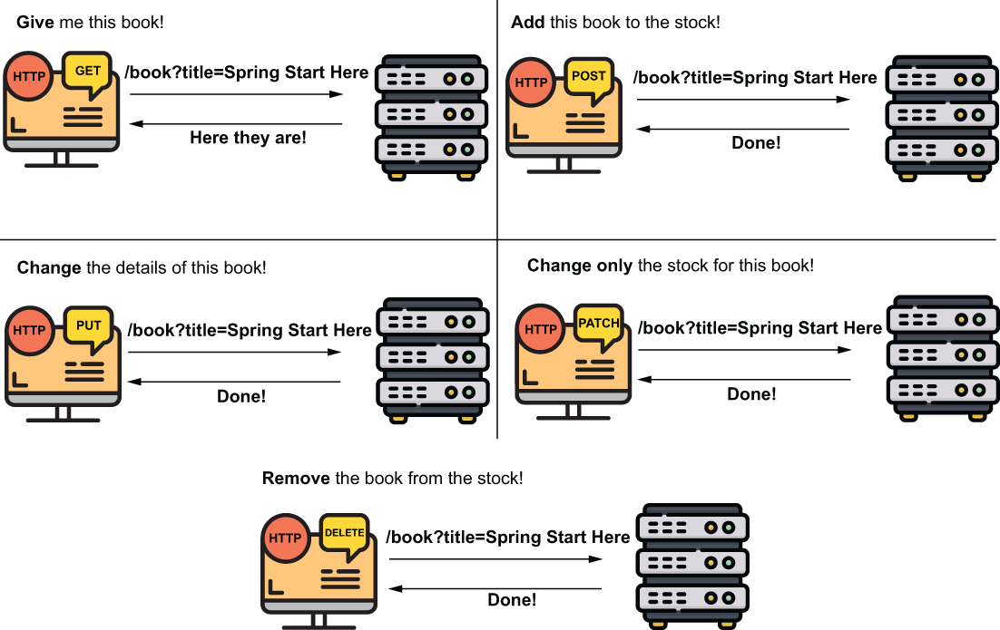
- Even if it’s a good practice to make a distinction between entirely replacing a record (PUT) and changing only a part of it (PATCH) in production apps, this distinction is not always made.
- Now let’s implement an example that uses more than just HTTP GET. The scenario is the following: We have to create an app that stores a list of products. Each product has a name and a price. The web app displays a list of all products and allows the user to add one more product through an HTML form.
- Observe the two use cases described by the scenario. The user needs to do the following:
	- View all products in the list; here, we’ll continue using **HTTP GET**.
	- Add products to the list; here, we’ll use **HTTP POST**.
- We create a new project, with the dependencies (in the `pom.xml` file) for web and Thymeleaf, as described by the next code snippet:
	```
	<dependency>
	   <groupId>org.springframework.boot</groupId>
	   <artifactId>spring-boot-starter-thymeleaf</artifactId>
	</dependency>
	<dependency>
	   <groupId>org.springframework.boot</groupId>
	   <artifactId>spring-boot-starter-web</artifactId>
	</dependency>
	```
- In the project, we create a `Product` class to describe a product with its name and price attributes. The `Product` class is a model class, so we’ll create it in a package named “model.” The following listing presents the `Product` class.
	```
	public class Product {

	  private String name;
	  private double price;

	  // Omitted getters and setters
	}
	```
- Now that we have a way to represent a product, let’s create the list where the app stores the products. The web app will display the product in this list on a web page, and in this list the user can add more products.
- We will implement the two use cases (**getting the list of products to display** and **adding a new product**) as methods in a service class. Let’s create a new service class named `ProductService` in a package named “service.”
- The next listing presents the service class, which instantiates a list and defines two methods for adding a new product and getting it.
	```
	@Service
	public class ProductService {

	  private List<Product> products = new ArrayList<>();

	  public void addProduct(Product p) {
		products.add(p);
	  }

	  public List<Product> findAll() {
		return products;
	  }

	}
	```
- This design is a simplification to allow you to focus on the discussion of the HTTP methods. Remember that **a Spring bean’s scope by default is singleton**, and **a web application implies multiple threads (one for each request)**. Changing a list defined as **an attribute of the bean would cause race condition situations in a real-world app where more clients add products simultaneously**. For now, we’ll keep our simplification, because **in the next chapters we’ll replace the list with a database, so this problem will no longer occur**. But keep in mind **this is a vicious approach, and, you shouldn’t use something similar in a production-ready app**. **Singleton beans aren’t thread-safe!**
- A **controller will call the use cases implemented by the service**. The controller **gets data about a new product from the client and adds it to the list by calling the service**, and the controller **gets the list of products and sends it to the view**.
- First, let’s create a `ProductController` class in a package named “controllers” and allow this controller to **inject the service bean**. The following listing shows you the definition of the controller.
	```
	@Controller
	public class ProductsController {

	  private final ProductService productService;

	  public ProductsController(
		ProductService productService) {       ❶
		this.productService = productService;
	  }

	}
	```
	❶ We use DI through the controller’s constructor parameters to get the service bean from the Spring context.
- Now we expose the first use case: **displaying the product list on a page**. This functionality should be straightforward. We use a Model parameter to send the data from the controller to the view. The following listing presents the implementation for the controller action.
	```
	@Controller
	public class ProductsController {

	  private final ProductService productService;

	  public ProductsController(ProductService productService) {
		this.productService = productService;
	  }

	  @RequestMapping("/products")                  ❶
	  public String viewProducts(Model model) {     ❷
		var products = productService.findAll();    ❸
		model.addAttribute("products", products);   ❹

		return "products.html";                     ❺
	  }
	}
	```
	❶ We map the controller action to the `/products` path. The `@RequestMapping` annotation, by default, uses the HTTP GET method.
	❷ We define a Model parameter that we use to send the data to the view.
	❸ We get the product list from the service.
	❹ We send the product list to the view.
	❺ We return the view name, which will be taken and rendered by the dispatcher servlet.
- To display the products in the view, we define the `products.html` page in the “**resources/templates**” folder of the project. The following listing shows you the content of the “**products.html**” file, which takes the list of products the controller sends and displays it in an HTML table.
	```
	<!DOCTYPE html>
	<html lang="en" xmlns:th="http://www.thymeleaf.org">    ❶
		<head>
			<meta charset="UTF-8">
			<title>Home Page</title>
		</head>
		<body>
			<h1>Products</h1>

			<h2>View products</h2>

			<table>
				<tr>                                        ❷
					<th>PRODUCT NAME</th>                   ❷
					<th>PRODUCT PRICE</th>                  ❷
				</tr>                                       ❷
				<tr th:each="p: ${products}" >              ❸
					<td th:text="${p.name}"></td>           ❹
					<td th:text="${p.price}"></td>          ❹
				</tr>
			</table>
		</body>
	</html>
	```
	❶ We define the “th” prefix to use the Thymeleaf capabilities.
	❷ We define a static header for our table.
	❸ We use the th:each feature from Thymeleaf to iterate on the collection and display a table row for each product in the list.
	❹ We display the name and the price of each product on one row.
- The below figure presents the flow for calling the /products path with HTTP GET on the Spring MVC diagram:
- When calling /products with HTTP GET, the controller gets the product list from the service and sends it to the view. The HTTP response contains the HTML table with the products from the list.
	- 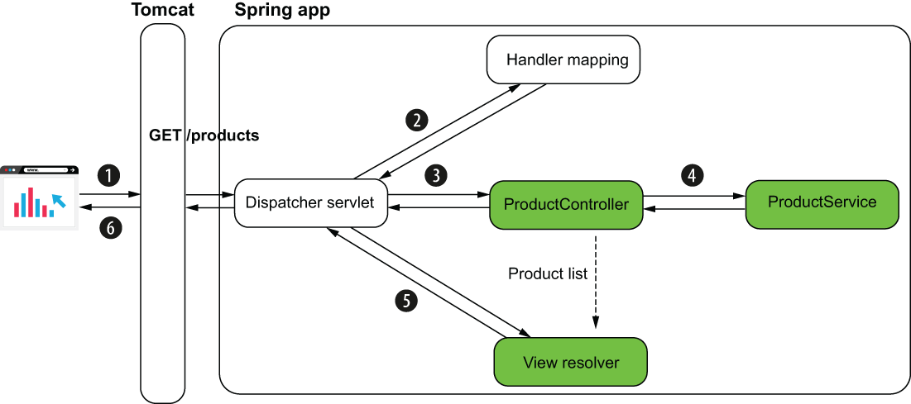
	1. The client sends an HTTP request for the /products path.
	2. The dispatcher servlet uses the handler mapping to find the controller’s action to call for the /products path.
	3. The dispatcher servlet calls the controller’s action.
	4. The controller requests the product list from the service and sends it to be rendered with the view.
	5. The view is rendered into an HTTP response.
	6. The HTTP response is sent back to the client.
- We’ll see nothing more than an empty table if we don’t have an option to add a product to the list. Let’s change the controller and add an action to allow adding a product to the product list. The below listing presents the definition of this action.
	```
	@Controller
	public class ProductsController {

	  // Omitted code

	  @RequestMapping(path = "/products", 
					  method = RequestMethod.POST)     ❶
	  public String addProduct(
		  @RequestParam String name,                   ❷
		  @RequestParam double price,                  ❷
		  Model model
	  ) {
		Product p = new Product();                     ❸
		p.setName(name);                               ❸
		p.setPrice(price);                             ❸
		productService.addProduct(p);                  ❸

		var products = productService.findAll();       ❹
		model.addAttribute("products", products);      ❹

		return "products.html";                        ❺
	  }
	}
	```
	❶ We map the controller action to the `/products` path. We use the method attribute of the `@RequestMapping` annotation to change the HTTP method to POST.
	❷ We get the name and the price for the product to add using request parameters.
	❸ We build a new Product instance and add it to the list by calling the service use case method.
	❹ We get the list of products and send it to the view.
	❺ We return the name of the view to be rendered.
- We used the attribute method of the `@RequestMapping` annotation to specify the HTTP method. If you don’t set a method, by default `@RequestMapping` uses HTTP GET.
- But because both the path and the method are essential for any HTTP call, we want to always confirm both. For this reason, developers usually use **dedicated annotations for each HTTP method** instead of `@RequestMapping`.
- For apps, you’ll often find developers using `@GetMapping` to map a GET request to an action, `@PostMapping` for a request using HTTP POST, and so on.
- We’ll also change our example to use these dedicated annotations for HTTP methods. The following listing presents the controller class’s full content, including the changes on the mapping annotations for the actions.
	```
	@Controller
	public class ProductsController {

	  private final ProductService productService;

	  public ProductsController(ProductService productService) {
		this.productService = productService;
	  }

	  @GetMapping("/products")                    ❶
	  public String viewProducts(Model model) {
		var products = productService.findAll();
		model.addAttribute("products", products);

		return "products.html";
	  }

	  @PostMapping("/products")                   ❷
	  public String addProduct(
		  @RequestParam String name,
		  @RequestParam double price,
		  Model model
	  ) {
		Product p = new Product();
		p.setName(name);
		p.setPrice(price);
		productService.addProduct(p);

		var products = productService.findAll();
		model.addAttribute("products", products);

		return "products.html";
	  }
	}
	```
	❶ @GetMapping maps the HTTP GET request with a specific path to the controller’s action.
	❷ @PostMapping maps the HTTP POST request with a specific path to the controller’s action.
- We can also change the view to allow the user to call the controller’s HTTP POST action and add a product to the list. We’ll use an HTML form to make this HTTP request.
- The following listing presents the changes we need to make on the `products.html` page (our view) to add the HTML form. The result of the page designed with below listing is shown in below figure.
	```
	<!DOCTYPE html>
	<html lang="en" xmlns:th="http://www.thymeleaf.org">
	   <head>
		  <meta charset="UTF-8">
		  <title>Home Page</title>
	   </head>
	   <body>

		  <!-- Omitted code -->       

		  <h2>Add a product</h2>
		  <form action="/products" method="post">         ❶
			Name: <input 
					  type="text" 
					  name="name"><br />                  ❷
			Price: <input 
					  type="number" 
					  step="any" 
					  name="price"><br />                 ❸
			<button type="submit">Add product</button>    ❹
		   </form>
	   </body>
	</html>
	```
	❶ When submitted, the HTML form makes a POST request for path `/products`.
	❷ An input component allows the user to set the name of the product. The value in the component is sent as a request parameter with the key “name.”
	❸ An input component allows the user to set the price of the product. The value in the component is sent as a request parameter with the key “price.”
	❹ The user uses a submit button to submit the form.
- Run and test the app. You access the page in your browser on `http://localhost:8080/` products, and you should be able to add new products and see those already added. The below figure shows the result.
- The final result. A user sees the products in the HTML table on the page and can add a new product through the HTML form.
	- 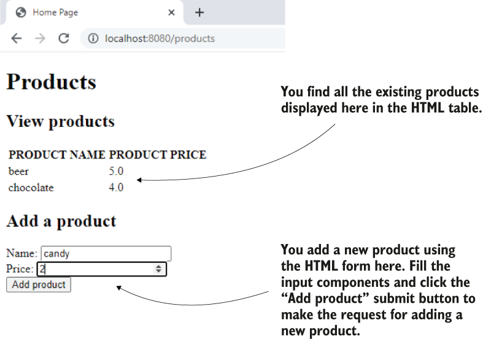
- In our example, I used the @RequestParameter annotation. I used this annotation here to make it clear how the client sends the data. But sometimes Spring allows you to omit code. For example, you could use **a Product as a parameter of the controller’s action directly**. Because **the request parameters’ names are the same as the Product class attributes’ names, Spring knows to match them and automatically creates the object**.
- For someone who already knows Spring, this is excellent because it spares you from writing code lines. But **beginners might get confused by all these details**. Say you find an example in an article that uses this syntax. It might be unclear where the Product instance comes from.
- If you’ve just begun learning Spring and find yourself in such a situation, my advice is to **be aware that Spring tends to have plenty of syntaxes to hide as much code as possible**. Whenever you find a syntax you don’t clearly understand in an example or article, **try finding the framework specification details**.
	```
	@Controller
	public class ProductsController {

	  // Omitted code

	"/products")
	  public String addProduct(
		  Product p,                ❶
		  Model model
	  ) {
		productService.addProduct(p);

		var products = productService.findAll();
		model.addAttribute("products", products);

		return "products.html";
	  }
	}
	```
	❶ You can use the model class as a parameter of the controller’s action directly. Spring knows to create the instance based on the request attributes. The model class needs to have a default constructor to allow Spring to create the instance before calling the action method.