# 09 Using the Spring web scopes
- You learned that **Spring manages a bean’s life cycle differently depending on how you declare the bean in the Spring context**. In this chapter, we’ll add some new ways Spring manages the beans in the context. You’ll learn S**pring has custom ways to manage instances for web apps by using the HTTP request as a point of reference**.
- In any Spring app, you can choose to declare a bean as one of the following:
	- **Singleton**—The default bean scope in Spring, for which the framework uniquely identifies each instance with a name in the context
	- **Prototype**—The bean scope in Spring, for which the framework only manages the type and creates a new instance of that class every time someone requests it (directly from the context or through wiring or auto-wiring).
- In this chapter, you’ll learn that in web apps you can use other bean scopes that are **relevant only to web applications**. We call them **web scopes**:
	- **Request scope**—Spring creates an instance of the bean class for every HTTP request. The instance exists only for that specific HTTP request.
	- **Session scope**—Spring creates an instance and keeps the instance in the server’s memory for the full HTTP session. Spring links the instance in the context with the client’s session.
	- **Application scope** —The instance is unique in the app’s context, and it’s available while the app is running.
- To teach you how these web scopes work in a Spring application, we’ll work on an example in which we implement a login functionality. Most of the web apps today offer their users the possibility to log in and access an account, so the example is also relevant from a real-world perspective.
- First, we’ll use a request-scoped bean to take the user’s credentials for login and make sure the app uses them only for the login request.
- Then, we’ll use a session-scoped bean to store all the relevant details we need to keep for the logged-in user as long as the user remains logged in.
- After that, we’ll use the application-scoped bean to add a capability to count logins.
- We’ll implement the login functionality in three steps. For each step we implement, we’ll need to use a different bean scope. First, we’ll use a request-scoped bean to implement the login logic without risking storing the credentials for longer than the login request. We’ll then decide what details we need to store for the authenticated user in a session-scoped bean. Finally, we’ll implement a feature to count all the login requests, and we’ll use an application-scoped bean to keep the number.
	- 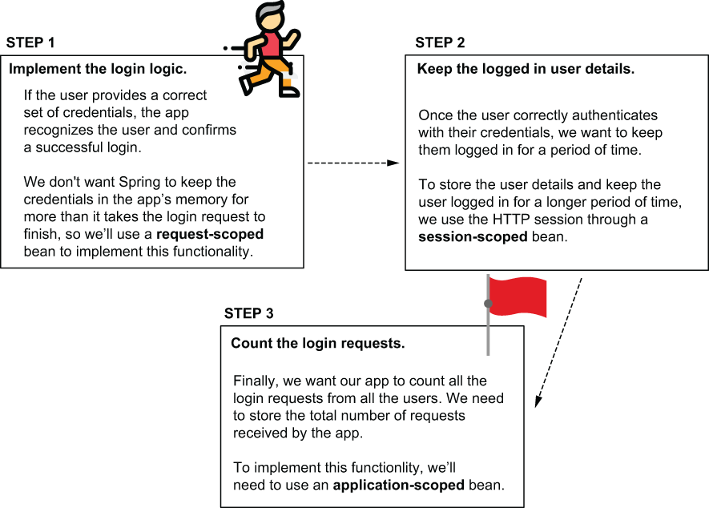
## Using the request scope in a Spring web app
* * *
- As you learned, web apps are focused on HTTP requests and responses. For this reason, and often in web apps, certain functionalities are easier to manage if Spring offers you a way to manage the bean life cycle in relationship with the HTTP request.
- A request-scoped bean is **an object managed by Spring, for which the framework creates a new instance for every HTTP request**. The app can use the instance only for the request that created it. **Any new HTTP request (from the same or other clients) creates and uses a different instance of the same class**.
- For every HTTP request, Spring provides a new instance for the request-scoped bean. When using a request-scoped bean, you can be sure the data you add on the bean is available only on the HTTP request that created the bean. Spring manages the bean type (the plant) and uses it to get instances (coffee beans) for each new request.
	- 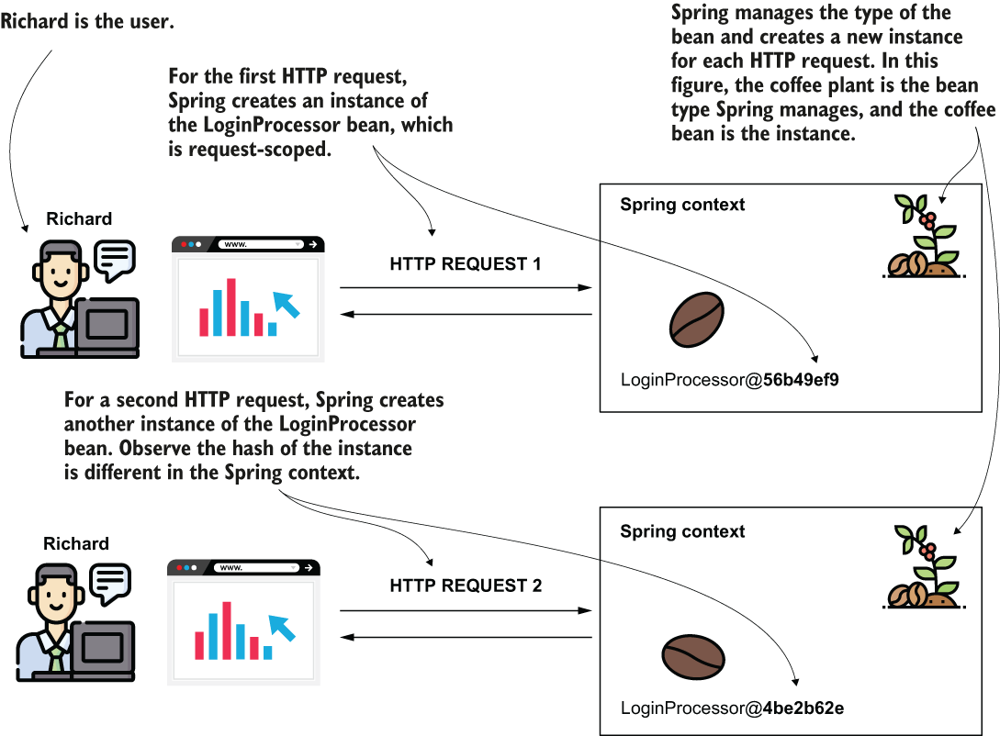
- We’ll implement a web application’s login functionality, and we’ll use a request-scoped bean to manage the user’s credentials for the login logic.
- Before diving into implementing a Spring app that uses request-scoped beans, I’d like to shortly enumerate here **the key aspects of using this bean scope**. These aspects will help you analyze whether a request-scoped bean is the right approach in a real-world scenario. Keep in mind the very relevant aspects of request-scoped beans, explained in the following table.

	| Fact                                                                  | Consequence                                                                                                                                | To consider                                                                                                                                                                                                                                                                         | To avoid                                                                                                                                                                                                                                                                     |
	| --------------------------------------------------------------------- | ------------------------------------------------------------------------------------------------------------------------------------------ | ----------------------------------------------------------------------------------------------------------------------------------------------------------------------------------------------------------------------------------------------------------------------------------- | ---------------------------------------------------------------------------------------------------------------------------------------------------------------------------------------------------------------------------------------------------------------------------- |
	| Spring creates a new instance for every HTTP request from any client. | Spring creates a lot of instances of this bean in the app’s memory during its execution.                                                   | The number of instances is usually not a big problem because these instances are short-lived. The app doesn’t need them for more than the time the HTTP request needs to complete. Once the HTTP request completes, the app releases the instances, and they are garbage-collected. | However, make sure you don’t implement a time-consuming logic Spring needs to execute to create the instance (like getting data from a database or implementing a network call). Avoid writing logic in the constructor or a @PostConstruct method for request-scoped beans. |
	| Only one request can use an instance of a request-scoped bean.        | Instances of request-scoped beans are not prone to multithread-related issues as only one thread (the one of the request) can access them. | You can use the instance’s attributes to store data used by request.                                                                                                                                                                                                                | Don’t use synchronization techniques for the attributes of these beans. These techniques would be redundant, and they only affect the performance of your app.                                                                                                               |
- A login example, such as this one, is excellent for didactic purposes. However, in a production-ready app, **it’s better to avoid implementing authentication and authorization mechanisms yourself**. In a real-world Spring app, **we use Spring Security to implement anything related to authentication and authorization**. Using Spring Security (which is also part of the Spring ecosystem) simplifies your implementations and ensures you don’t (by mistake) introduce vulnerabilities when writing the application-level security logic.
- To make things straightforward, we will consider a set of credentials that we bake into our application. In a real-world app, **the app stores the users in a database. It also encrypts the passwords to protect them**. For now, we focus only on the purpose of this chapter: discussing the Spring web bean scopes.
- Let’s create a Spring Boot project and add the needed dependencies. You can add the dependencies directly when creating the project (for example, using `start.spring.io`) or afterward in your `pom.xml`. For this example, we will use the web dependency and Thymeleaf as a templating engine. The next code snippet shows the dependencies you need to have in your `pom.xml` file:
	```
	<dependency>
	   <groupId>org.springframework.boot</groupId>
	   <artifactId>spring-boot-starter-thymeleaf</artifactId>
	</dependency>
	<dependency>
	   <groupId>org.springframework.boot</groupId>
	   <artifactId>spring-boot-starter-web</artifactId>
	</dependency>
	```
- We’ll create a page that contains a login form asking for a user’s name and password. The app compares the username and the paword with a set of credentials it knows (in my case, user “natalie” with password “password”). If we provide correct credentials (they match with the credentials the app knows), then the page displays a message “You are now logged in” under the login form. If the credentials we provide are not correct, then the app displays a message: “Login failed.”
- We need to implement a page (representing our view) and a controller class. The controller sends the message it needs to display to the view according to the login’s result.
- We need to implement the controller and the view. In the controller, we implement an action that finds out if the credentials sent in the login request are valid. The controller sends a message to the view, and the view displays this message.
	- 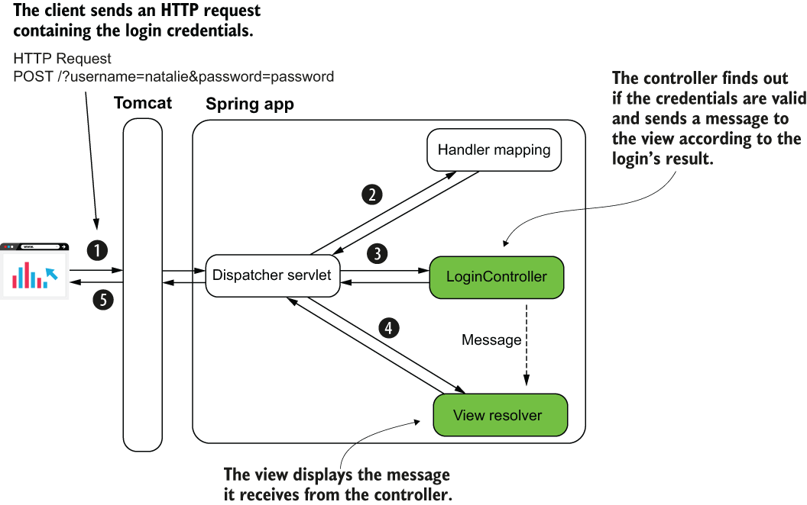
- The below listing shows the HTML login page that defines the view in our app. As you learned, you have to store the page in the `resources/templates` folder of your Spring Boot project. Let’s name the page “login.html.” To display the message with the logic’s result, we need to send a parameter from the controller to the view. I named this parameter “message,” as you can see in the following listing, where I used the syntax `${message}` to display this in a paragraph under the login form.
	```
	<!DOCTYPE html>
	<html lang="en" xmlns:th="http://www.thymeleaf.org">            ❶
	<head>
	  <meta charset="UTF-8">
	  <title>Login</title>
	</head>
	<body>
	  <form action="/" method="post">                               ❷
		 Username: <input type="text" name="username" /><br />      ❸
		 Password: <input type="password" name="password" /><br />  ❸
		 <button type="submit">Log in</button>                      ❹
	  </form>

	  <p th:text="${message}"></p>                                  ❺
	</body>
	</html>
	```
	❶ We define the “th” Thymeleaf prefix to use the templating engine’s capabilities.
	❷ We define an HTML form to send the credentials to the server.
	❸ The input fields are used to write the credentials, username, and password.
	❹ When the user clicks the Submit button, the client makes an HTTP POST request with the credentials.
	❺ We display a message with the result of the login request under the HTML form.
- A controller action needs to get the HTTP request (from the dispatcher servlet), so let’s define the controller and the action that receives the HTTP request for the login page.
- In below listing, you find the definition of the controller class. We map the controller’s action to the web app’s root path ("/"). I will name the controller `LoginController`.
	```
	@Controller                      ❶
	public class LoginController {


	  @GetMapping("/")               ❷
	  public String loginGet() {
		return "login.html";         ❸
	  }
	}
	```
	❶ We use the @Controller stereotype annotation to define the class as a Spring MVC controller.
	❷ We map the controller’s action to the root ("/ ") path of the application.
	❸ We return the view name we want to be rendered by the app.
- Now that we have a login page, we want to implement the login logic. When a user clicks on the Submit button, we want the page to display a proper message under the login form. If the user submitted the correct set of credentials, the message is “You are now logged in”; otherwise, the displayed message will be “Login failed”.
- The functionality we implement in this section. The page displays a login form for the user. Then the user provides valid credentials, and the app displays a message that they successfully logged in. If the user provides incorrect credentials, the app tells the user that the login failed.
	- 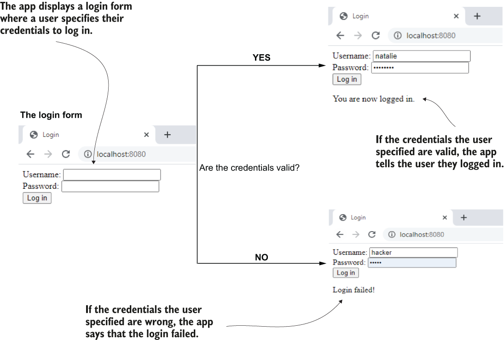
- To process the HTTP POST request that the HTML form creates when the user clicks on the Submit button, we need to add one more action to our LoginController. This action takes the client’s request parameters (the username and the password) and sends a message to the view according to the login result.
- Notice that we haven’t implemented the login logic. In the next listing, we take the request and send a message in response according to a variable representing the request’s result. But this variable `loggedIn` is always “false.”
	```
	@Controller
	public class LoginController {

	  @GetMapping("/")
	  public String loginGet() {
		return "login.html";
	  }

	  @PostMapping("/")                                              ❶
	  public String loginPost(
		  @RequestParam String username,                             ❷
		  @RequestParam String password,                             ❷
		  Model model                                                ❸
	  ) {
		boolean loggedIn = false;                                    ❹

		if (loggedIn) {                                              ❺
		  model.addAttribute("message", "You are now logged in.");   ❺
		} else {                                                     ❺
		  model.addAttribute("message", "Login failed!");            ❺
		}                                                            ❺

		return "login.html";                                         ❻
	  }
	}
	```
	❶ We are mapping the controller’s action to the HTTP POST request of the login page.
	❷ We get the credentials from the HTTP request parameters
	❸ We declare a Model parameter to send the message value to the view.
	❹ When we later implement the login logic, this variable will store the login request result.
	❺ Depending on the result of the login, we send a specific message to the view.
	❻ We return the view name, which is still login.html, so we remain on the same page.
-  In the next listings in this section, we complete this action by adding a call to the login logic. This login logic will return the login result based on the credentials the client sent in the request.
-  The dispatcher servlet calls the controller’s action when someone submits the HTML login form. The controller’s action gets the credentials from the HTTP request parameters. According to the login result, the controller sends a message to the view, and the view displays this message under the HTML form.
	-  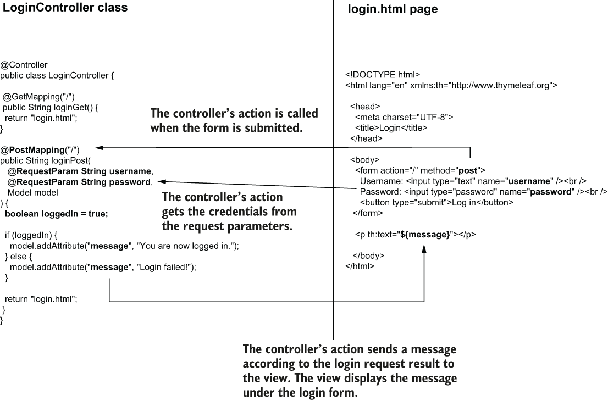
-  Now we have a controller and a view, but where is the request scope in all of this? The only class we wrote is the `LoginController`, and we left it a singleton, which is the default Spring scope. We don’t need to change the scope for `LoginController` as long as it doesn’t store any detail in its attributes. But remember, we need to implement the login logic. The login logic depends on the user’s credentials, and we have to take into consideration two things about these credentials:
	1. The credentials are sensitive details, and you don’t want to store them in the app’s memory for longer than the login request.
	2. More users with different credentials might attempt to log in simultaneously.
- Considering these two points, we need to make sure that if we use a bean for implementing the login logic, each instance is unique for each HTTP request. We need to use a **request-scoped bean**.
- We add a request-scoped bean `LoginProcessor`, which takes the credentials on the request and validates them.
- The `LoginProcessor` bean is request-scoped. Spring makes sure to create a new instance for each HTTP request. The bean implements the login logic. The controller calls a method it implements. The method returns true if the credentials are valid and false otherwise. Based on the value the `LoginProcessor` returns, the `LoginController` sends the right message to the view.
- To change the scope of the bean, we use the `@RequestScoped` annotation. Of course, we still need to make a bean of this class type in the Spring context by using the `@Bean` annotation in either a configuration class or a stereotype annotation. I chose to annotate the class with the `@Component` stereotype annotation.
	```
	@Component                                   ❶
	@RequestScope                                ❷
	public class LoginProcessor {

	  private String username;                   ❸
	  private String password;                   ❸

	  public boolean login() {                   ❹
		String username = this.getUsername();
		String password = this.getPassword();

		if ("natalie".equals(username) && "password".equals(password)) {
		  return true;
		} else {
		  return false;
		}
	  }

	  // omitted getters and setters
	}
	```
	❶ We annotate the class with a stereotype annotation to tell Spring this is a bean.
	❷ We use the @RequestScope annotation to change the bean’s scope to request scope. This way, Spring creates a new instance of the class for every HTTP request.
	❸ The bean stores the credentials as attributes.
	❹ The bean defines a method for implementing the login logic.
- You can run the application and access the login page using the `localhost:8080` address in your browser’s address bar.
- When accessing the page in a browser, the app shows a login form. You can use valid credentials, and the app displays a successful login message. If you use incorrect credentials, the app displays a “Login failed!” message.
	- 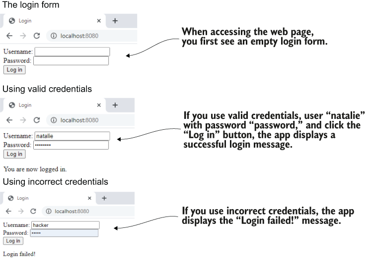
## Using the session scope in a Spring web app
* * *
- In this section, we discuss session-scoped beans. When you enter a web app and log in, you expect to then surf through that app’s pages, and the app still remembers you’ve logged in.
- A session-scoped bean is **an object managed by Spring, for which Spring creates an instance and links it to the HTTP session**. Once a client sends a request to the server, the server reserves a place in the memory for this request, for the whole duration of their session.
- Spring creates an instance of a session-scoped bean when the HTTP session is created for a specific client. That instance can be reused for the same client while it still has the HTTP session active. **The data you store in the session-scoped bean attribute is available for all the client’s requests throughout an HTTP session**. This approach of storing the data allows you to store information about what users do while they’re surfing through the pages of your app.
- The session-scoped bean is used to keep a bean in the context throughout the client’s full HTTP session. Spring creates an instance of a session-scoped bean for each HTTP session a client opens. The client accesses the same instance for all the requests sent through the same HTTP session. **Each user has their own session and accesses different instances of the session-scoped bean**.
	- 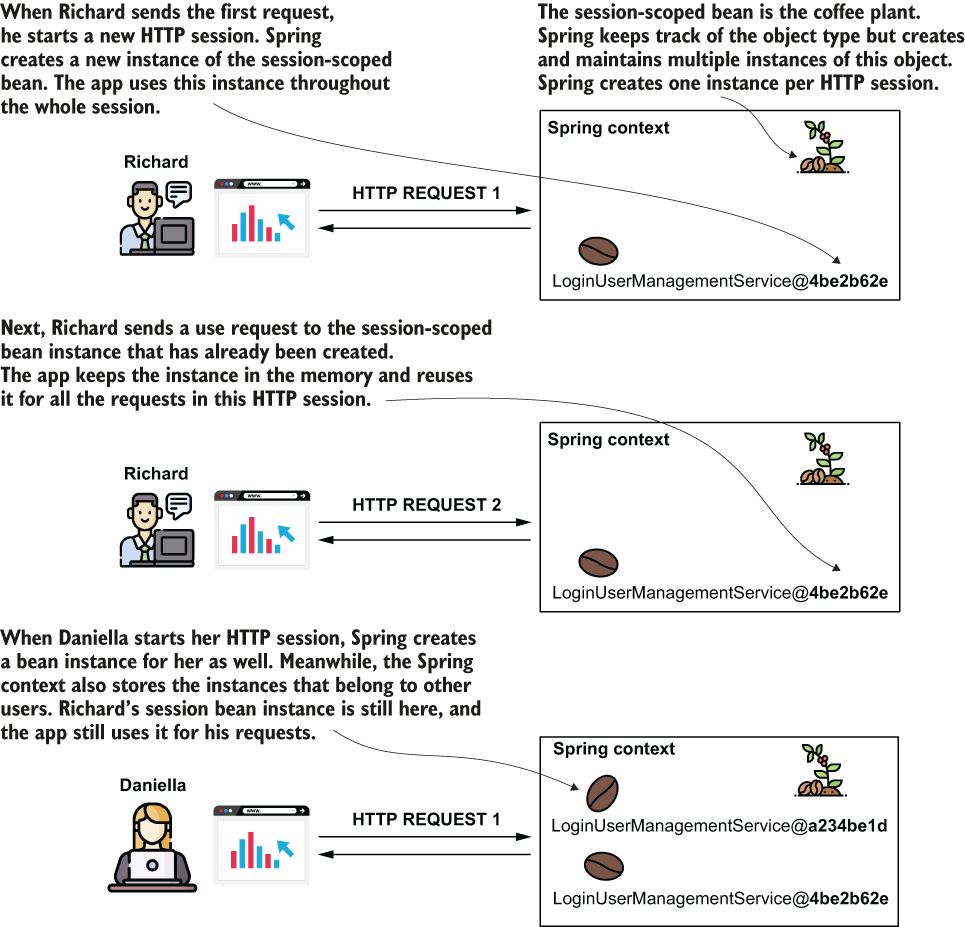
- While for a request-scoped bean Spring creates a new instance for every HTTP request, for a session-scoped bean, Spring creates only one instance per HTTP session. A session-scoped bean allows us to store data shared by multiple requests of the same client.
- A comparison between the request-scoped and session-scoped beans to help you visualize the differences between these two web bean scopes. You use request-scoped beans when you want Spring to create a new instance for each request. You use a session-scoped bean when you want to keep the bean (together with any details it holds) throughout the client’s HTTP session.
	- 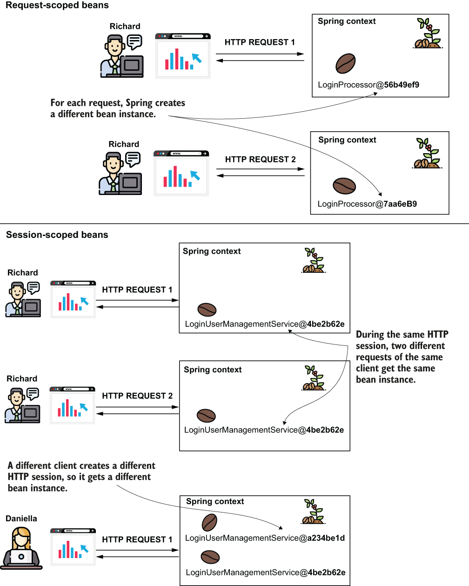
- A couple of features you can implement using session-scoped beans include the following examples:
	- **A login**—Keeps details of the authenticated user while they visit different parts of your app and send multiple requests
	- **An online shopping cart**—Users visit multiple places in your app, searching for products they add to the cart. The cart remembers all the products the client added.
- Like we did for the request-scoped beans, let’s analyze the key characteristics of the session-scoped beans you need to consider when planning to use them in a production app.

	| Fact                                                                                                    | Consequence                                                                                                                                                        | To consider                                                                                                                                                                                                                                                                                                                                                        | To avoid                                                                                                                                                                                                                    |
	| ------------------------------------------------------------------------------------------------------- | ------------------------------------------------------------------------------------------------------------------------------------------------------------------ | ------------------------------------------------------------------------------------------------------------------------------------------------------------------------------------------------------------------------------------------------------------------------------------------------------------------------------------------------------------------ | --------------------------------------------------------------------------------------------------------------------------------------------------------------------------------------------------------------------------- |
	| The session-scoped bean instances are kept for the entire HTTP session.                                 | They have a longer life, and they are less frequently garbage-collected than the request-scoped beans.                                                             | The app keeps the data you store in the session-scoped beans for a more extended period.                                                                                                                                                                                                                                                                           | Avoid keeping too much data on the session. It can potentially become a performance problem. Moreover, never store sensitive details (like passwords, private keys, or any other secret detail) in session-bean attributes. |
	| Multiple requests can share the session-scoped bean instance.                                           | If the same client issues multiple concurrent requests that change the data on the instance, you may encounter multithreading-related issues like race conditions. | When you know such a scenario is possible, you might need to use synchronization techniques to avoid concurrency. However, I generally recommend you see if this can be avoided and keep synchronization only as a last resort when it can’t be avoided.                                                                                                           |                                                                                                                                                                                                                             |
	| The session-scoped beans are a way to share data among requests by keeping the data on the server side. | The logic you implement might imply requests become dependent one on the other.                                                                                    | When keeping details stateful in one app’s memory, you make clients dependent on that specific app instance. Before deciding to implement some feature with a session-scoped bean, consider alternatives, such as storing the data you want to share in a database instead of the session. This way, you can leave the HTTP requests independent one from another. |                                                                                                                                                                                                                             |
- We continue to use a session-scoped bean to make our app aware that a user logged in and recognize them as a logged-in user while they access different pages of the app. This way, the example teaches you all the relevant details you need to know when working with production applications.
- Let’s change the application we implemented to display a page that only logged-in users can access. Once a user logs in, the app redirects them to this page, which displays a welcome message containing the logged-in username and offers the user the option to log out by clicking a link.
- These are the steps we need to take to implement this change (figure 9.10):
	1. Create a session-scoped bean to keep the logged-in user’s details.
	2. Create the page a user can only access after login.
	3. Make sure a user cannot access the page created at point 1 without logging in first.
	4. Redirect the user from login to the main page after successful authentication.
- We use a session-bean to implement a section of the app that only a logged-in user can access. Once the user authenticates, the app redirects them to a page they can only access once authenticated. If the user tries to access this page before authentication, the app redirects them to the login form.
	- 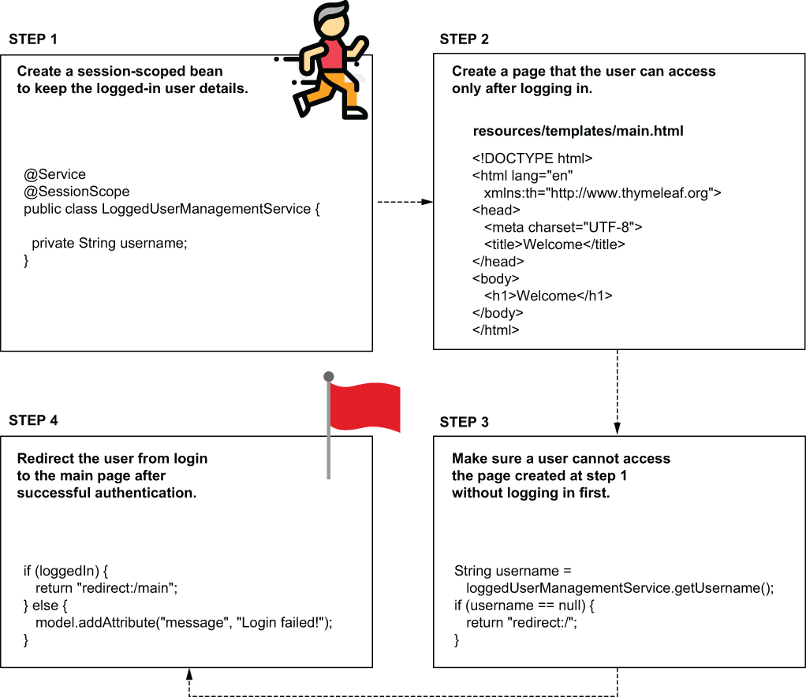
- Fortunately, creating a session-scoped bean in Spring is as simple as using the `@SessionScope` annotation with the bean class. Let’s create a new class, `LoggedUserManagementService`, and make it session-scoped, as presented in the following listing.
	```
	@Service                                    ❶
	@SessionScope                               ❷
	public class LoggedUserManagementService {

	  private String username;

	  // Omitted getters and setters
	}
	```
	❶ We add the @Service stereotype annotation to instruct Spring to manage this class as a bean in its context.
	❷ We use the @SessionScope annotation to change the scope of the bean to session.
- Every time a user successfully logs in, we store its name in this bean’s `username` attribute. We auto-wire the `LoggedUserManagementService` bean in the `LoginProcessor` class, to take care of the authentication logic, as shown in the following listing.
	```
	@Component
	@RequestScope
	public class LoginProcessor {

	  private final LoggedUserManagementService loggedUserManagementService;

	  private String username;
	  private String password;

	  public LoginProcessor(                                          ❶
		LoggedUserManagementService loggedUserManagementService) {
		this.loggedUserManagementService = loggedUserManagementService;
	  }

	  public boolean login() {
		String username = this.getUsername();
		String password = this.getPassword();

		boolean loginResult = false;
		if ("natalie".equals(username) && "password".equals(password)) {
		  loginResult = true;
		  loggedUserManagementService.setUsername(username);          ❷
		}

		return loginResult;
	  }

	  // Omitted getters and setters
	}
	```
	❶ We auto-wire the `LoggedUserManagementService` bean.
	❷ We store the `username` on the `LoggedUserManagementService` bean.
- Observe that the `LoginProcessor` bean stays request-scoped. We still use Spring to create this instance for each login request. We only need the `username` and `password` attributes’ values during the request to execute the authentication logic.
- Because the `LoggedUserManagementService` bean is session-scoped, the `username` value will now be accessible throughout the entire HTTP session. You can use this value to know if someone is logged in, and who. You don’t have to worry about the case where multiple users are logged in; the application framework makes sure to link each HTTP request to the correct session.
- The login flow implemented in the example. When the user submits their credentials, the login process begins. If the user's credentials are correct, the `username` is stored in the session-scoped bean, and the app redirects the user to the `main` page. If the credentials are not valid, the app redirects the user back to the `login` page and displays a failed login message.
	- 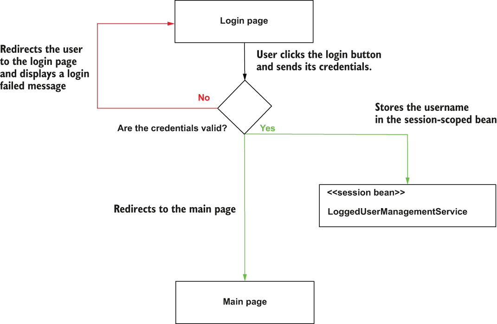
- Now we create a new page and make sure a user can access it only if they have already logged in. We define a new controller (that we’ll call `MainController`) for the new page.
- We’ll define an action and map it to the `/main` path. To make sure a user can access this path only if they logged in, we check if the `LoggedUserManagementService` bean stores any username. If it doesn’t, we redirect the user to the `login` page.
- To redirect the user to another page, the controller action needs to return the string “redirect:” followed by the path to which the action wants to redirect the user.
- Someone can access the main page only after they are authenticated. When the app authenticates the user, it stores the `username` in the session-scoped bean. This way, the app knows the user had already logged in. When someone accesses the main page, and the username is not in the session-scoped bean (they did not authenticate), the app redirects them to the `login` page.
	- 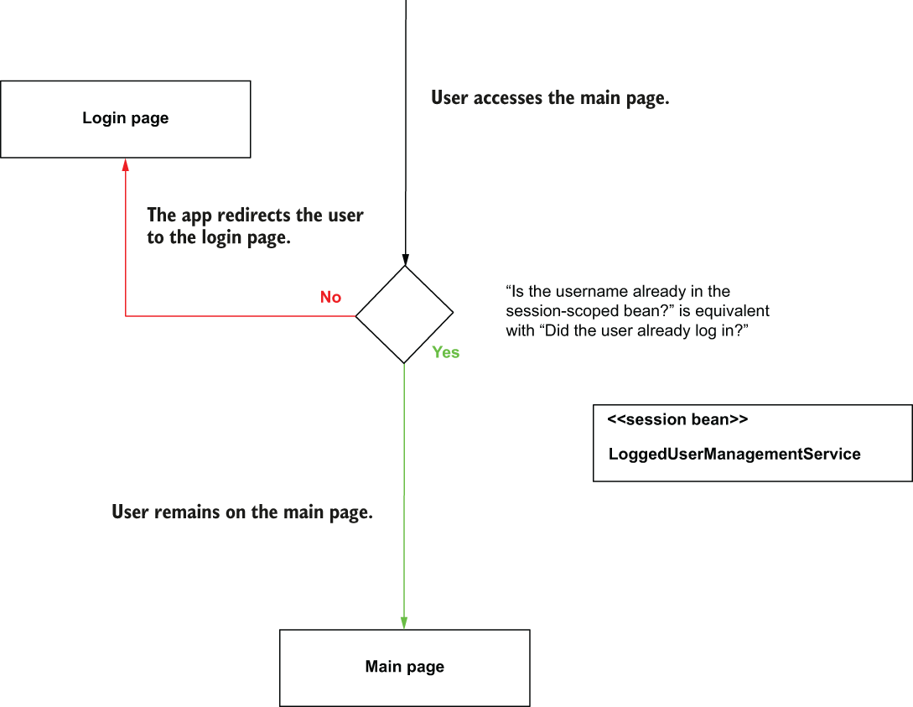
- The following listing shows the `MainController` class.
	```
	@Controller
	public class MainController {

	  private final LoggedUserManagementService loggedUserManagementService;

	  public MainController(                                         ❶
		LoggedUserManagementService loggedUserManagementService) {
		this.loggedUserManagementService = loggedUserManagementService;
	  }

	  @GetMapping("/main")
	  public String home() {
		String username =                                            ❷
		  loggedUserManagementService.getUsername();

		if (username == null) {                                      ❸
		  return "redirect:/";
		}

		return "main.html";                                          ❹
	  }
	}
	```
	❶ We auto-wire the LoggedUserManagementService bean to find out if the user already logged in.
	❷ We take the username value, which should be different than null if someone logged in.
	❸ If the user is not logged in, we redirect the user to the login page.
	❹ If the user is logged in, we return the view for the main page.
- You need to add the `main.html` that defines the view in the “resources/templates” folder of your Spring Boot project. The following listing shows the content of the `main.html` page.
	```
	<!DOCTYPE html>
	<html lang="en" xmlns:th="http://www.thymeleaf.org">
	<head>
		<meta charset="UTF-8">
		<title>Welcome</title>
	</head>
	<body>
		<h1>Welcome</h1>
	</body>
	</html>
	```
- To allow the user to log out is also easy. You just need to set the `username` in the `LoggedUserManagementService` session bean as `null`. Let’s create a `logout` link on the page and also add the logged-in `username` in the welcome message. The following listing shows the changes to the main.html page that defines our view.
	```
	<!DOCTYPE html>
	<html lang="en" xmlns:th="http://www.thymeleaf.org">
	<head>
		<meta charset="UTF-8">
		<title>Login</title>
	</head>
	<body>
		<h1>Welcome, <span th:text="${username}"></span></h1>    ❶
		<a href="/main?logout">Log out</a>                       ❷
	</body>
	</html>
	```
	❶ We get the username from the controller and display it on the page in the welcome message.
	❷ We add a link on the page that sets an HTTP request parameter named “logout.” When the controller gets this parameter, it will erase the value of the username from the session.
- These `main.html` page changes also assume some changes in the controller for the functionality to be complete. The next listing shows how to get the `logout` request parameter in the controller’s action and send the `username` to the view where it is displayed on the page.
	```
	@Controller
	public class MainController {

	  // Omitted code 

	  @GetMapping("/main")    
	  public String home(
		  @RequestParam(required = false) String logout,           ❶
		  Model model                                              ❷
	  ) {
		if (logout != null) {                                      ❸
		  loggedUserManagementService.setUsername(null);
		}

		String username = loggedUserManagementService.getUsername();

		if (username == null) {
		  return "redirect:/";
		}

		model.addAttribute("username" , username);                 ❹
		return "main.html";
	  }
	}
	```
	❶ We get the `logout` request parameter if present.
	❷ We add a `Model` parameter to send the `username` to the view.
	❸ If the `logout` parameter is present, we erase the `username` from the `LoggedUserManagementService` bean.
	❹ We send the `username` to the view.
- To complete the app, we’d like to change the `LoginController` to redirect users to the `main` page once they authenticate. To achieve this result, we need to change the `LoginController`’s action, as presented in the following listing.
	```
	@Controller
	public class LoginController {

	  // Omitted code

	  @PostMapping("/")
	  public String loginPost(
		  @RequestParam String username,
		  @RequestParam String password,
		  Model model
	  ) {
		loginProcessor.setUsername(username);
		loginProcessor.setPassword(password);
		boolean loggedIn = loginProcessor.login();

		if (loggedIn) {                  ❶
		  return "redirect:/main";
		} 

		model.addAttribute("message", "Login failed!");
		return "login.html";
	  }
	}
	```
	❶ When the user successfully authenticates, the app redirects them to the `main` page.
- Now you can start the application and test the login. When you provide the correct credentials, the app redirects you to the `main` page. Click the `Logout` link, and the app redirects you back to the `login`. If you try to access the `main` page without authenticating, the app redirects you to log in.
- This flow between the two pages. When the user logs in, the app redirects them to the main page. The user can click on the logout link, and the app redirects them back to the login form.
	- 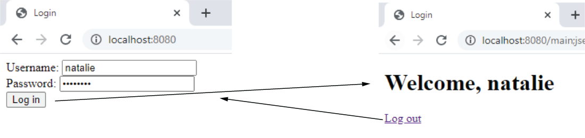
## Using the application scope in a Spring web app
* * *
- In this section, we discuss the application scope. I want to mention its existence, make you aware of how it works, and emphasize that **it’s better not to use it in a production app**.
- All client requests share an application-scoped bean.
- Understanding the application scope in a Spring web app. The instance of an application-scoped bean is shared by all the HTTP requests from all clients. The Spring context provides only one instance of the bean’s type, used by anyone who needs it.
	- 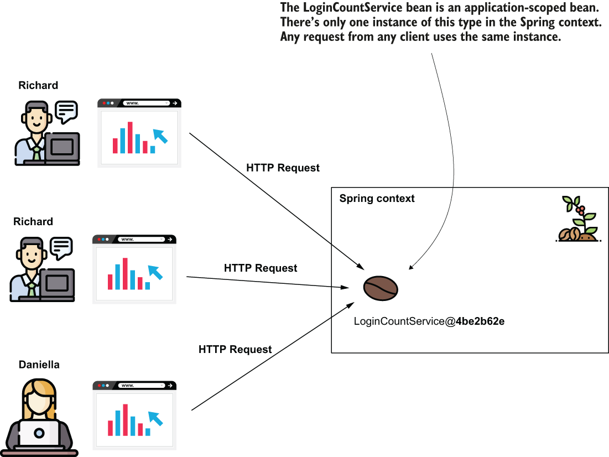
- The application scope is close to how a singleton works. The difference is that you can’t have more instances of the same type in the context and that we always use the HTTP requests as a reference point when discussing the life cycle of web scopes (including the application scope).
- We face the same **concurrency problems** we discussed in for the singleton beans for application-scoped beans: it’s **better to have immutable attributes for the singleton beans**. The same advice is applicable to an application-scoped bean. But if you make the attributes immutable, then **you can directly use a singleton bean instead**.
- Generally, I recommend developers avoid using application-scoped beans. It’s better to directly **use a persistence layer, such as a database**.
- It’s always best to see an example to understand the case. Let’s change the application we worked on in this chapter and add a feature that counts the login attempts.
- Because we have to count the login attempts from all users, we’ll store the count in an application-scoped bean. Let’s create a `LoginCountService` application-scoped bean that stores the count in an attribute. The following listing shows the definition of this class.
	```
	@Service
	@ApplicationScope                 ❶
	public class LoginCountService {

	  private int count;

	  public void increment() {
		count++;
	  }

	  public int getCount() {
		return count;
	  }
	}
	```
	❶ The @ApplicationScope annotation changes the scope of this bean to the application scope.
- The `LoginProcessor` can then auto-wire this bean and call the `increment()` method for any new login attempt, as presented in the following listing.
	```
	@Component
	@RequestScope
	public class LoginProcessor {

	  private final LoggedUserManagementService loggedUserManagementService;
	  private final LoginCountService loginCountService;

	  private String username;
	  private String password;

	  public LoginProcessor(                                     ❶
		LoggedUserManagementService loggedUserManagementService,  
		LoginCountService loginCountService) {
		this.loggedUserManagementService = loggedUserManagementService;
		this.loginCountService = loginCountService;
	  }

	  public boolean login() {
		loginCountService.increment();                           ❷

		String username = this.getUsername();
		String password = this.getPassword();

		boolean loginResult = false;
		if ("natalie".equals(username) && "password".equals(password)) {
		  loginResult = true;
		  loggedUserManagementService.setUsername(username);
		}

		return loginResult;
	  }

	  // Omitted code
	}
	```
	❶ We inject the `LoginCountService` bean through the constructor’s parameters.
	❷ We increment the `count` for each login attempt.
- The last thing you need to do is to display this value. As you’ve already learned in the examples we worked on, you can use a `Model` parameter in the controller’s action to send the `count` value to the view. You can then use Thymeleaf to display the value in the view. The following listing shows you how to send the value from the controller to the view.
	```
	@Controller
	public class MainController {

	  // Omitted code

	  @GetMapping("/main")
	  public String home(
		  @RequestParam(required = false) String logout,
		  Model model
	  ) {
		if (logout != null) {
		  loggedUserManagementService.setUsername(null);
		}

		String username = loggedUserManagementService.getUsername();
		int count = loginCountService.getCount();     ❶

		if (username == null) {
		  return "redirect:/";
		}

		model.addAttribute("username" , username);
		model.addAttribute("loginCount", count);      ❷

		return "main.html";
	  }
	}
	```
	❶ Gets the count from the application-scoped bean
	❷ Sends the count value to the view
- The following listing shows you how to display the count value on the page.
	```
	<!DOCTYPE html>
	<html lang="en" xmlns:th="http://www.thymeleaf.org">
	<head>
		<meta charset="UTF-8">
		<title>Login</title>
	</head>
	<body>
		<h1>Welcome, <span th:text="${username}"></span>!</h1>
		<h2>
		  Your login number is 
		  <span th:text="${loginCount}"></span>     ❶
		</h2>
		<a href="/main?logout">Log out</a>
	</body>
	</html>
	```
	❶ Displays the count on the page
- When you run the app, you find the total number of login attempts on the `main` page.
- The result of the application is a web page that displays the total number of logins for all the users. This `main` page displays the total number of login attempts.
	- 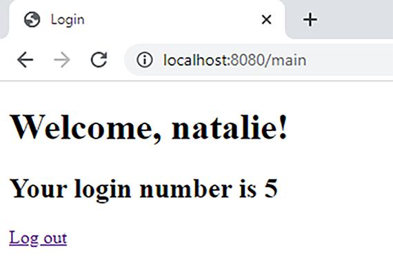