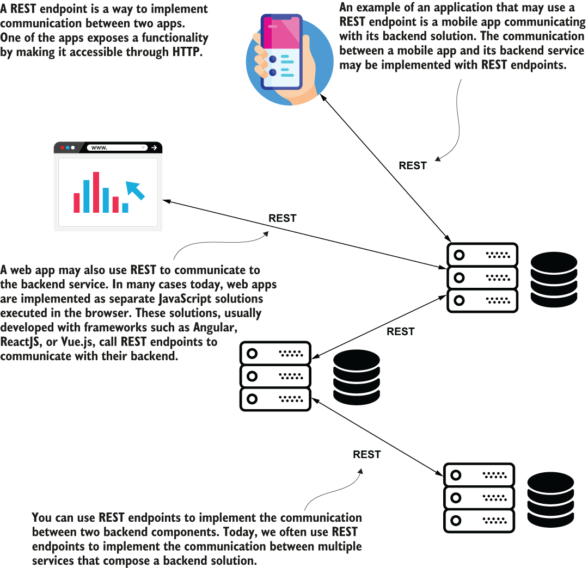
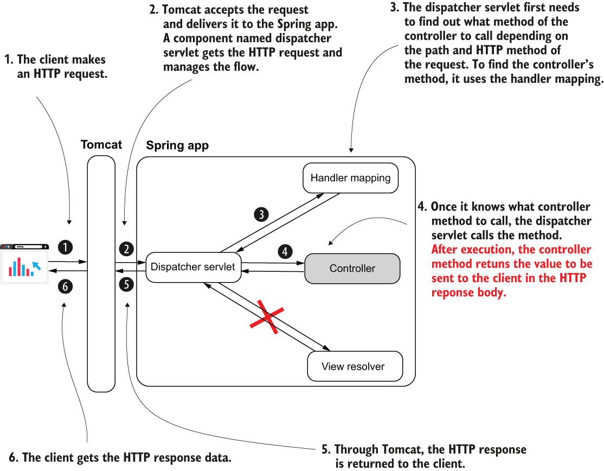
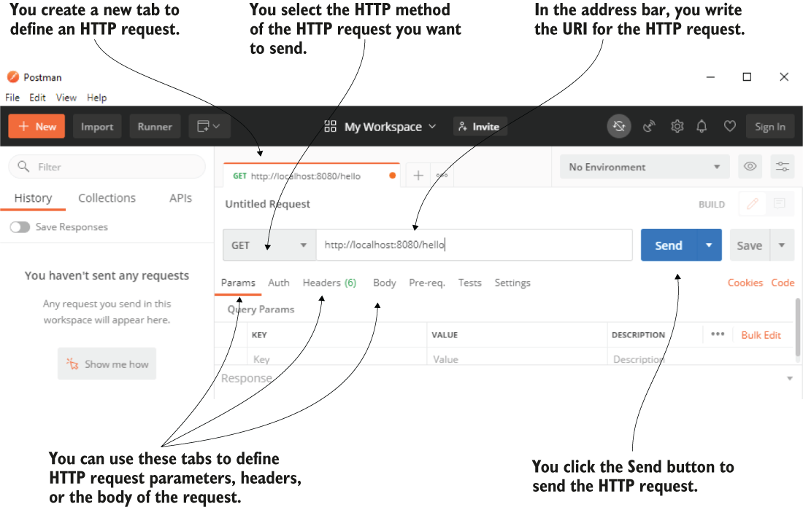
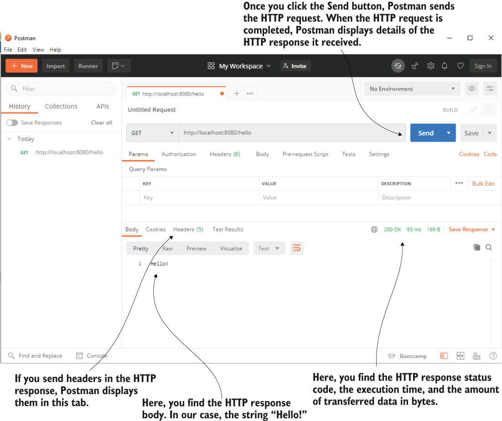
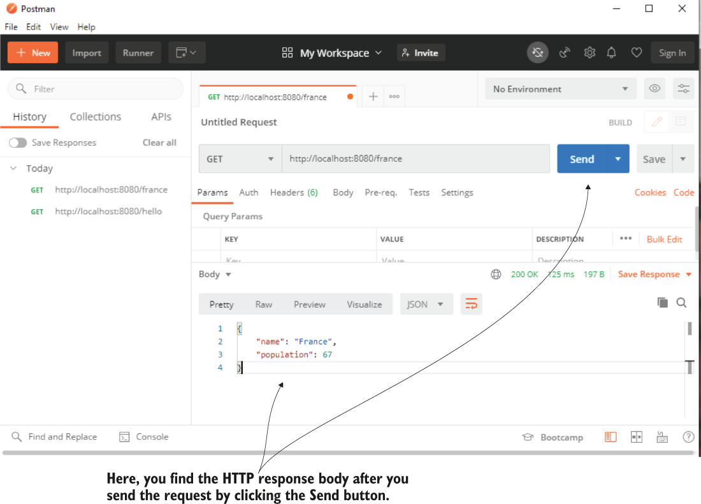
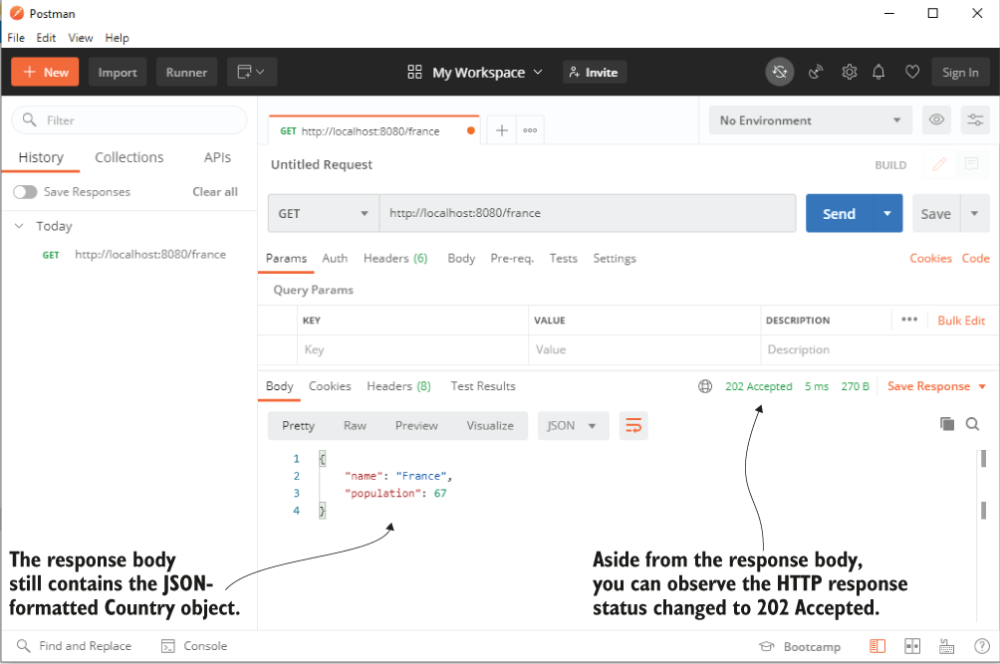
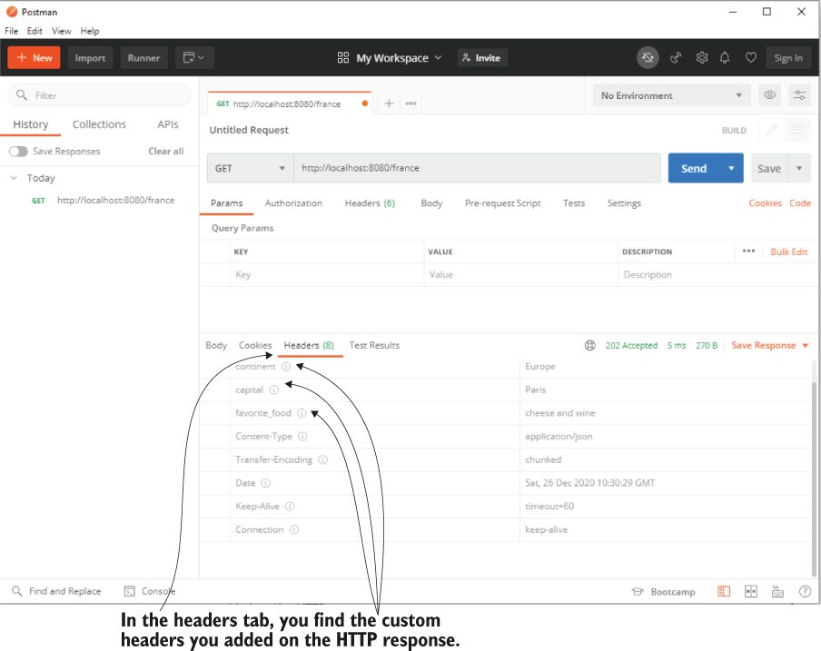
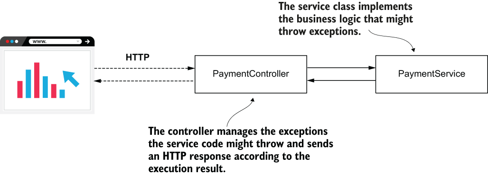
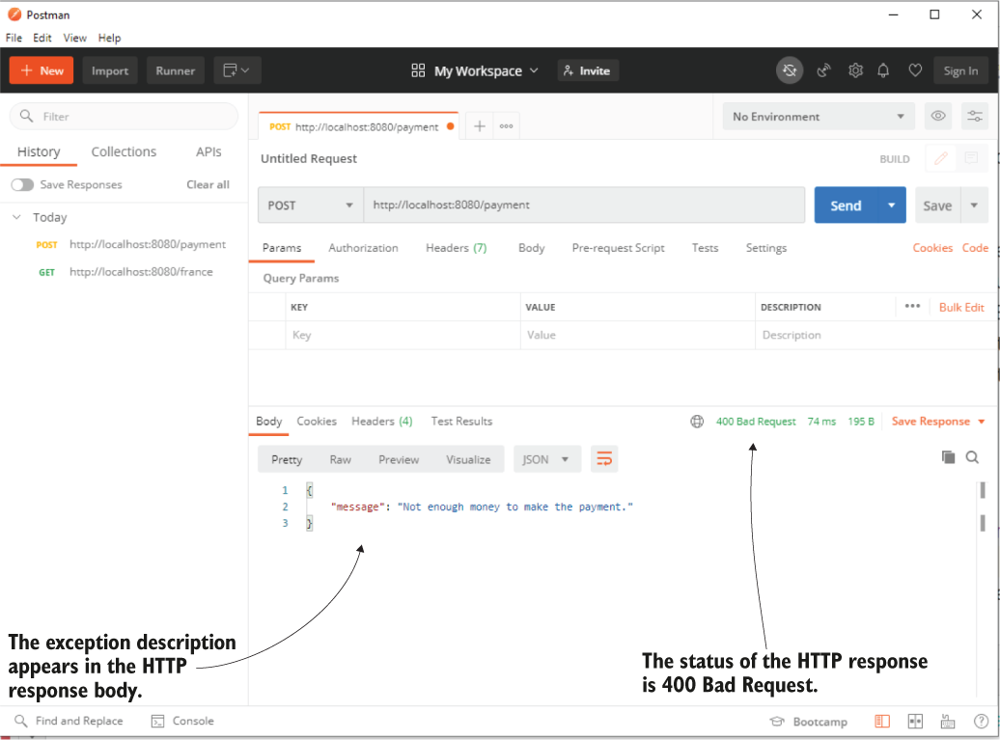
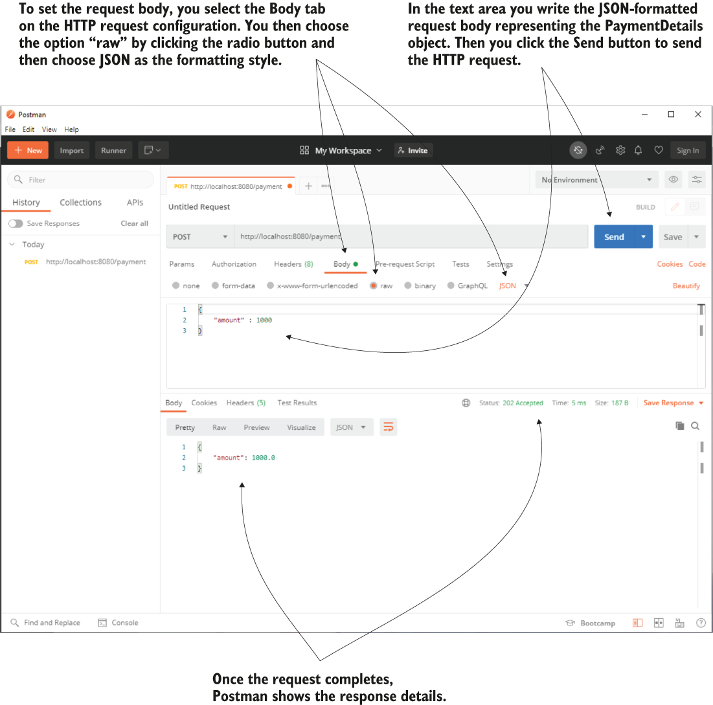

# 10 Implementing REST services
- This chapter covers
	- Understanding REST services
	- Implementing REST endpoints
	- Managing the data that the server sends to the client in the HTTP response
	- Obtaining data from the client in the HTTP request body
	- Managing exceptions at the endpoint level
- I mentioned **representational state transfer** (REST) services a few times concerning web applications. In this chapter, we extend the discussion on REST services, and you’ll learn they are not just related to web apps.
- REST services are **one of the most often encountered ways to implement communication between two apps**. REST **offers access to functionality the server exposes through endpoints a client can call**.
- You use REST services to **establish the communication between a client and a server in a web app**. But you can also use REST services **to develop the communication between a mobile app and a backend** or even **two backend services**.
- REST services are **a communication method between two apps**. Today, you can find REST services in many places. A **web client app or mobile app may call its backend solution through REST endpoints, but even backend services might communicate using REST web service calls**.
	- 
- Because in many Spring apps today you have chances to encounter and work on REST services, I consider this subject **a must-learn for every Spring developer**.
- We’ll start by discussing what exactly REST services are. You’ll learn that Spring supports REST services with the same Spring MVC mechanism.
- We discuss the essential syntaxes you need to know when working with REST endpoints. We’ll work on several examples to elaborate on the critical aspects any Spring developer needs to know when implementing communication between two apps with REST services.
## Using REST services to exchange data between apps
* * *
- In this section, we discuss REST services and the way Spring supports implementing them through Spring MVC.
- REST endpoints are simply a way for implementing communication between two apps.
- REST endpoints are as simple as implementing a controller action mapped to an HTTP method and a path.
- An app calls this controller action through HTTP. Because it’s how an app exposes a service through a web protocol, we call this endpoint a **web service**.
- In the end, in Spring **a REST endpoint is still a controller action mapped to an HTTP method and path**. Spring uses the same mechanism you learned for web apps for exposing REST endpoints. The **only difference is that for REST services we’ll tell the Spring MVC dispatcher servlet not to look for a view**.
- In the Spring MVC diagram, the view resolver disappears. The server sends back, in the HTTP response to the client, directly what the controller’s action returns.
- When implementing REST endpoints, the Spring MVC flow changes. The app no longer needs a view resolver because the client needs the data returned by the controller’s action directly. **Once the controller’s action completes, the dispatcher servlet returns the HTTP response without rendering any view**.
	- 
- You’ll find REST services are comfortable to use. Their simplicity is one reason they’re so often used today, and Spring makes their implementation straightforward.
- But before starting with our first example, I’d like to make you aware of some communication issues the REST endpoint might bring:
	- If the controller’s action takes a long time to complete, the HTTP call to the endpoint might time out and break the communication.
	- Sending a large quantity of data in one call (through the HTTP request) might cause the call to time out and break the communication. Sending more than a few megabytes through a REST call usually isn’t the right choice.
	- Too many concurrent calls on an endpoint exposed by a backend component might put too much pressure on the app and cause it to fail.
	- The network supports the HTTP calls, and the network is never 100% reliable. There’s always a chance a REST endpoint call might fail because of the network.
- When you implement the communication between two apps using REST, you always need to consider what should happen if a call fails and how it might affect the app.
- Ask yourself **if the data could be affected in any way**. Could the way you designed your app **lead to data inconsistencies if an endpoint call fails**? In case the app needs to **display an error to the user, how would you do that**? These are complex issues and require architectural knowledge outside the scope of this book, but I recommend **J. J. Geewax’s API Design Patterns (Manning, 2021)**, an excellent guide discussing the best practices of designing APIs.
## Implementing a REST endpoint
* * *
- In this section, you’ll learn to implement REST endpoints with Spring. The good news is that **Spring uses the same Spring MVC mechanism behind REST endpoints**, so you already know a big part of how they work.
- I’ll build my example over what we already discussed in previous chapters, and you’ll learn how to transform a simple web controller into a REST controller to implement REST web services.
- The below listing shows you a controller class that implements a simple action. As you learned, we annotate the controller class with the `@Controller` stereotype annotation. This way, an instance of the class becomes a bean in the Spring context, and Spring MVC knows this is a controller that maps its methods to specific HTTP paths.
- Also, we used the `@GetMapping` annotation to specify the action path and HTTP method. The only new thing you find in this listing is the use of the `@ResponseBody` annotation. The `@ResponseBody` annotation tells the dispatcher servlet that the controller’s action doesn’t return a view name but the data sent directly in the HTTP response.
	```
	@Controller                     ❶
	public class HelloController {

	  @GetMapping("/hello")         ❷
	  @ResponseBody                 ❸
	  public String hello() {
		return "Hello!";
	  }
	}
	```
	❶ We use the @Controller annotation to mark the class as a Spring MVC controller
	❷ We use the @GetMapping annotation to associate the GET HTTP method and a path with the controller’s action.
	❸ We use the @ResponseBody annotation to inform the dispatcher servlet that this method doesn’t return a view name but the HTTP response directly.
- But look what happens if we add more methods to the controller, shown in the following listing. Repeating the `@ResponseBody` annotation on every method becomes annoying.
	```
	@Controller
	public class HelloController {

	  @GetMapping("/hello")
	  @ResponseBody
	  public String hello() {
		return "Hello!";
	  }

	  @GetMapping("/ciao")
	  @ResponseBody
	  public String ciao() {
		return "Ciao!";
	  }
	}
	```
- A best practice is avoiding code duplication. We want to somehow prevent repeating the `@ResponseBody` annotation for each method. To help us with this aspect, Spring offers the `@RestController` annotation, a combination of `@Controller` and `@ResponseBody`. You use `@RestController` to instruct Spring that all the controller’s actions are REST endpoints.
- This way, you avoid repeating the `@ResponseBody` annotation. The below listing shows what you need to change in the controller to use `@RestController` once for the class instead of `@ResponseBody` for each method.
	```
	@RestController                 ❶
	public class HelloController {

	  @GetMapping("/hello")
	  public String hello() {
		return "Hello!";
	  }

	  @GetMapping("/ciao")
	  public String ciao() {
		return "Ciao!";
	  }
	}
	```
	❶ Instead of repeating the `@ResponseBody` annotation for each method, we replace `@Controller` with `@RestController`.
- It was indeed easy to implement a couple of endpoints. But how do we validate they work correctly? In this section, you’ll learn to call your endpoints using two tools you’ll often encounter in real-world scenarios:
	- **Postman**—Offers a nice GUI and is comfortable to use
	- **cURL**—A command-line tool useful in cases where you don’t have a GUI (e.g., when you connect to a virtual machine via SSH or when you write a batch script)
- Both these tools are a must-learn for any developer. In upcoming chapter, you’ll learn a third approach for validating that an endpoint behaves as expected by writing an integration test.
- First, start the application. By default, the Spring Boot app configures a Tomcat servlet container to be accessible on port 8080.
- Let’s discuss Postman first. You need to install the tool on your system as presented on their official website: [https://www.postman.com/](https://www.postman.com/). Once you have Postman installed, when you open it, you’ll find it has an interface like the one presented in below figure.
- Postman offers a friendly interface to configure and send an HTTP request. You select the HTTP method, set the HTTP request URI, and then press the Send button to send an HTTP request. You can also define other configurations such as the request parameters, headers, or the request body if needed.
	- 
- Once you press the Send button, Postman sends the HTTP request. When the request completes, Postman displays the HTTP response details, as presented in figure.
- Once the HTTP request completes, Postman displays the HTTP response details. You find the response status, the time it took the request to complete, the amount of transferred data in bytes, and the response body and the headers.
	- 
- In case you don’t have a GUI, you can use a command-line tool to call an endpoint. You’ll also find articles and books often use command-line tools for demonstrations rather than GUI tools because it’s a shorter way to represent the command.
- If you choose to use cURL as a command-line tool like in the case of Postman, you need first to make sure you install it. You install cURL according to your operating system as described on the tool’s official web page: [https://curl.se/](https://curl.se/)
- Once you have it installed and configured, you can use the `curl` command to send HTTP requests. The following snippet shows you the command you can use to send the HTTP request to test the `/hello` endpoint exposed by our app:
	`curl http://localhost:8080/hello`
- Upon completing the HTTP request, the console only displays the HTTP response body presented in the next snippet:
	`Hello!`
- If the HTTP method is HTTP GET, you don’t need to specify it explicitly. When the method is not HTTP GET, or if you want to specify it explicitly, you can use the `-X` flag, as presented in the next snippet:
	`curl -X GET http://localhost:8080/hello`
- If you want to get more details of the HTTP request, you can add the `-v` option to the command, as presented in the next snippet:
	`curl -v http://localhost:8080/hello`
- The next snippet presents the result of this command, which is a bit more complicated. You also find details like the status, the amount of data transferred, and headers through the lengthy response:
	 ```
	Trying ::1:8080...
	* Connected to localhost (::1) port 8080 (#0)
	> GET /hello HTTP/1.1
	> Host: localhost:8080
	> User-Agent: curl/7.73.0
	> Accept: */*
	>
	* Mark bundle as not supporting multiuse
	< HTTP/1.1 200                             ❶
	< Content-Type: text/plain;charset=UTF-8
	< Content-Length: 6
	< Date: Fri, 25 Dec 2020 23:11:02 GMT
	<
	{ [6 bytes data]
	100     6  100     6    0     0    857      0 --:--:-- --:--:-- --:--:--  
	1000
	Hello!                                     ❷
	* Connection #0 to host localhost left intact
	```
	❶ The HTTP response status
	❷ The HTTP response body
## Managing the HTTP response
* * *
- In this section, we discuss managing the HTTP response in the controller’s action. The HTTP response is how the backend app sends data back to the client due to a client’s request. The HTTP response holds data as the following:
	- Response headers—Short pieces of data in the response (usually not more than a few words long)
	- The response body—A larger amount of data the backend needs to send in the response
	- The response status—A short representation of the request’s result
### Sending objects as a response body
* * *
- In this section, we discuss sending object instances in the response body. The only thing you need to do to send an object to the client in a response is make the controller’s action return that object.
- we define a model object named `Country` with the attributes `name` (representing the country name) and `population` (representing the number of millions of people located in that country). We implement a controller action to return an instance of type `Country`.
- When we use an object (such as `Country`) to model the data transferred between two apps, we name this object a **data transfer object (DTO)**. We can say that `Country` is our DTO, whose instances are returned by the REST endpoint we implement in the HTTP response body.
	```
	public class Country {

	  private String name;
	  private int population;


	  public static Country of(      ❶
		String name, 
		int population) {
		  Country country = new Country();
		  country.setName(name);
		  country.setPopulation(population);
		  return country;
	  }

	  // Omitted getters and setters
	}
	```
	❶ To make a Country instance simpler, we define a static factory method that receives the name and the population. This method returns a Country instance with the provided values set.
- The following listing shows the implementation of a controller’s action that returns an instance of type `Country`.
	```
	@RestController                 ❶
	public class CountryController {

	  @GetMapping("/france")        ❷
	  public Country france() {
		Country c = Country.of("France", 67);
		return c;                   ❸
	  }
	}
	```
	❶ Marking the class as a REST controller to add a bean in the Spring context and also inform the dispatcher servlet not to look for a view when this method returns
	❷ Mapping the controller’s action to the HTTP GET method and `/france` path
	❸ Returning an instance of type `Country`
- What happens when you call this endpoint? How would the object look in the HTTP response body? By default, Spring creates a string representation of the object and formats it as JSON. JavaScript Object Notation (JSON) is a simple way to format strings as attribute-value pairs. There’s a good chance you’ve seen JSON already.
- When calling the `/france` endpoint, the response body looks as presented in the next snippet:
	```
	{
		"name": "France",
		"population": 67
	}
	```
- Once you press the Send button, Postman sends the request. When the request completes, Postman displays the response details, including the response body.
	- 
- You could also send object collection instances in the response body. The next listing shows that we added a method that returns a `List` of `Country` objects.
	```
	@RestController
	public class CountryController {

	  // Omitted code

	  @GetMapping("/all")
	  public List<Country> countries() {
		Country c1 = Country.of("France", 67);
		Country c2 = Country.of("Spain", 47);

		return List.of(c1,c2);    ❶
	  }

	}
	```
	❶ Returns a collection in the HTTP response body
- When you call this endpoint, the response body looks as presented in the next snippet:
	```
	[                               ❶
		{                           ❷
			"name": "France",       ❷
			"population": 67        ❷
		},                          ❷
		{
			"name": "Spain",
			"population": 47
		}
	]
	```
	❶ In JSON, the list is defined with brackets.
	❷ Each object is between curly braces, and the objects are separated with commas.
- Using JSON is the most common way to represent objects when working with REST endpoints. Although you aren’t constrained to use JSON as an object representation, you’ll probably never see someone using something else.
- Spring offers the possibility of using other ways to format the response body (like **XML** or **YAML**) if you’d like, by plugging in **a custom converter for your objects**. However, the chances you’ll need this in a real-world scenario are so small that we will skip this discussion and go directly to the next relevant topic you need to learn.
### Setting the response status and headers
* * *
- In this section, we discuss setting the **response status** and **response headers**. Sometimes it’s more comfortable to send part of the data in the response headers.
- The **response status is also an essential flag in the HTTP response you use to signal the request’s result**. By default, Spring sets some common HTTP statuses:
	- **200 OK** if no exception was thrown on the server side while processing the request.
	- **404 Not Found** if the requested resource doesn’t exist.
	- **400 Bad Request** if a part of the request could not be matched with the way the server expected the data.
	- **500 Error on server** if an exception was thrown on the server side for any reason while processing the request. Usually, for this kind of exception, the client can’t do anything, and it’s expected someone should solve the problem on the backend.
- However, in some cases, the requirements ask you to configure a custom status. How could you do that? The easiest and most common way to customize the HTTP response is using the `ResponseEntity` class.
- This class provided by Spring allows you to specify the **response body**, **status**, and **headers** on the HTTP response.
- In the below listing, a controller action returns a `ResponseEntity` instance instead of the object you want to set on the response body directly. The `ResponseEntity` class allows you to set the **response body’s value** and the **response status** and **headers**. We set three headers and change the response status to “202 Accepted.”
	```
	@RestController
	public class CountryController {

	  @GetMapping("/france")
	  public ResponseEntity<Country> france() {
		Country c = Country.of("France", 67);
		return ResponseEntity
				.status(HttpStatus.ACCEPTED)                   ❶
				.header("continent", "Europe")                 ❷
				.header("capital", "Paris")                    ❷
				.header("favorite_food", "cheese and wine")    ❷
				.body(c);                                      ❸
	  }
	}
	```
	❶ Changes the HTTP response status to 202 Accepted
	❷ Adds three custom headers to the response
	❸ Sets the response body
- Once you send the HTTP request by pressing the Send button and get the HTTP response, you observe the HTTP response status is 202 Accepted. You can still see the response body as a JSON formatted string.
	- 
- In the Headers tab of the HTTP response in Postman, you also find the three custom response headers you added.
- To see the customer headers in Postman, you have to navigate to the Headers tab of the HTTP response.
	- 
### Managing exceptions at the endpoint level
* * *
- It’s essential to consider what happens if the controller’s action throws an exception. In many cases, we use exceptions to signal specific situations, some of these related to the business logic.
- Suppose you create an endpoint the client calls to make a payment. If the user doesn’t have enough money in their account, the app might represent this situation by throwing an exception. In this case, you’ll probably want to set some details on the HTTP response to inform the client of the specific situation that occurred.
- One of the ways you can manage exceptions is catching them in the controller’s action and using the `ResponseEntity` class to send a different configuration of the response when the exception occurs.
- We’ll start by demonstrating this approach with an example. I’ll then show you an alternative approach I prefer by using a REST controller advice class: an aspect that intercepts an endpoint call when it throws an exception, and you can specify a custom logic to be executed for that specific exception.
- For our scenario, we define an exception named `NotEnoughMoneyException`, and the app will throw this exception when it cannot fulfill the payment because the client doesn’t have enough money in their account. The next code snippet shows the class defining the exception:
	```
	public class NotEnoughMoneyException extends RuntimeException {
	}
	```
- We also implement a service class that defines the use case. For our test, we directly throw this exception. In a real-world scenario, the service would implement the complex logic for making the payment. The next code snippet shows the service class we use for our test:
	```
	@Service
	public class PaymentService {

	  public PaymentDetails processPayment() {
		throw new NotEnoughMoneyException();
	  }
	}
	```
- `PaymentDetails`, the returned type of the `processPayment()` method, is just a model class describing the response body we expect the controller’s action to return for a successful payment. The next code snippet presents the `PaymentDetails` class:
	```
	public class PaymentDetails {

	  private double amount;

	  // Omitted getters and setters
	}
	```
- When the app encounters an exception, it uses another model class named `ErrorDetails` to inform the client of the situation. The `ErrorDetails` class is also simple and only defines the error message as an attribute. The next code snippet presents the `ErrorDetails` model class:
	```
	public class ErrorDetails {

	  private String message;

	  // Omitted getters and setters
	}
	```
- How could the controller decide what object to send back depending on how the flow executed? When there’s no exception (the app successfully completes the payment), we want to return an HTTP response with the status “Accepted” of type `PaymentDetails`.
- Suppose the app encountered an exception during the execution flow. In that case, the controller’s action returns an HTTP response with the status “400 Bad Request” and an `ErrorDetails` instance containing a `message` that describes the issue.
- The `PaymentService` class implements the business logic that might throw exceptions. The `PaymentController` class manages the exception and sends the client an HTTP response according to the execution result.
	- 
- The next listing shows this logic implemented by the controller’s method.
	```
	@RestController
	public class PaymentController {

	  private final PaymentService paymentService;

	  public PaymentController(PaymentService paymentService) {
		this.paymentService = paymentService;
	  }

	  @PostMapping("/payment")
	  public ResponseEntity<?> makePayment() {
		try {
		  PaymentDetails paymentDetails =               ❶
			paymentService.processPayment();
		  return ResponseEntity                         ❷
				  .status(HttpStatus.ACCEPTED)
				  .body(paymentDetails);
		} catch (NotEnoughMoneyException e) {     
		  ErrorDetails errorDetails = new ErrorDetails();
		  errorDetails.setMessage("Not enough money to make the payment.");
		  return ResponseEntity                         ❸
				  .badRequest()
				  .body(errorDetails);
		}
	  }
	}
	```
	❶ We try calling the `processPayment()` method of the service.
	❷ If calling the service method succeeds, we return an HTTP response with status Accepted and the `PaymentDetails` instance as a response body.
	❸ If an exception of type `NotEnoughMoneyException` is thrown, we return an HTTP response with status Bad Request and an `ErrorDetails` instance as a body.
- Start the application and call the endpoint using Postman or cURL. We know that we made the service method to always throw the `NotEnoughMoneyException`, so we expect to see the response status message is “400 Bad Request,” and the body contains the error message.
- The below figure presents the result of sending a request to the `/payment` endpoint in Postman.
- Calling the `/payment` endpoint, the HTTP response status is “400 Bad Request” and the exception message appears in the response body.
	- 
- This approach is good, and you’ll often find developers using it to manage the exception cases.
- However, in a more complex application, you would find it more comfortable to separate the responsibility of exception management.
- First, sometimes **the same exception has to be managed for multiple endpoints**, and, as you guessed, we don’t want to introduce duplicated code. Second, **it’s more comfortable to know you find the exception logic all in one place when you need to understand how a specific case works**.
- For these reasons, I prefer using a **REST controller advice**, **an aspect that intercepts exceptions thrown by controllers’ actions and applies custom logic you define according to the intercepted exception**.
- Instead of managing the exception cases, the controller now only takes care of the happy flow. We added a controller advice named `ExceptionControllerAdvice` to take care of the logic that will be implemented if the controller’s action throws an exception.
- The controller action is much simplified because it no longer treats the exception case, as presented in the following listing.
	```
	@RestController
	public class PaymentController {

	  private final PaymentService paymentService;

	  public PaymentController(PaymentService paymentService) {
		this.paymentService = paymentService;
	  }

	  @PostMapping("/payment")
	  public ResponseEntity<PaymentDetails> makePayment() {
		  PaymentDetails paymentDetails = paymentService.processPayment();
		  return ResponseEntity
				  .status(HttpStatus.ACCEPTED)
				  .body(paymentDetails);
	  }
	}
	```
- Instead, we created a separate class named `ExceptionControllerAdvice` that implements what happens if the controller’s action throws a `NotEnoughMoneyException`. The `ExceptionControllerAdvice` class is a REST controller advice.
- To mark it as a REST controller advice, we use the `@RestControllerAdvice` annotation. The method the class defines is also called an exception handler. You specify what exceptions trigger a controller advice method using the `@ExceptionHandler` annotation over the method.
- The following listing shows the REST controller advice class’s definition and the exception handler method that implements the logic associated with the `NotEnoughMoneyException` exception.
	```
	@RestControllerAdvice                                    ❶
	public class ExceptionControllerAdvice {

	  @ExceptionHandler(NotEnoughMoneyException.class)       ❷
	  public ResponseEntity<ErrorDetails> exceptionNotEnoughMoneyHandler() {
		ErrorDetails errorDetails = new ErrorDetails();
		errorDetails.setMessage("Not enough money to make the payment.");
		return ResponseEntity
			.badRequest()
			.body(errorDetails);
	  }
	}
	```
	❶ We use the `@RestControllerAdvice` annotation to mark the class as a REST controller advice.
	❷ We use the `@ExceptionHandler` method to associate an exception with the logic the method implements.
- In production apps, you sometimes need to send information about the exception that occurred, from the controller’s action to the advice. In this case, you can add a parameter to the advice’s exception handler method of the type of the handled exception. Spring is smart enough to pass the exception reference from the controller to the advice’s exception handler method. You can then use any details of the exception instance in the advice’s logic.
## Using a request body to get data from the client
* * *
- In this section, we discuss getting data from the client in the HTTP request body. You can send data in the HTTP request using request parameters and path variables.
- Because REST endpoints rely on the same Spring MVC mechanism, nothing from the syntaxes you learned in previous chapter changes regarding sending data in request parameters and path variables.
- You can use the same annotations and implement the REST endpoints identically as you were implementing the controller actions for your web pages.
- However, we didn’t discuss one essential thing: the HTTP request has a request body, and you can use it to send data from the client to the server. The HTTP request body is often used with REST endpoints.
- when you need to send a larger quantity of data (my recommendation is anything that takes **more than 50 to 100 characters**), you use the request body.
- To use the request body, you just need to annotate a parameter of the controller’s action with `@RequestBody`. By default, Spring assumes you used JSON to represent the parameter you annotated and will try to decode the JSON string into an instance of your parameter type.
- In the case Spring cannot decode the JSON-formatted string into that type, the app sends back a response with the status “400 Bad Request.”
- We implement a simple example of using the request body. The controller defines an action mapped to the `/payment` path with HTTP POST and expects to get a request body of `PaymentDetails` type. The controller prints the amount of the `PaymentDetails` object in the server’s console and sends the same object in the response body back to the client.
	```
	@RestController
	public class PaymentController {

	  private static Logger logger =
		Logger.getLogger(PaymentController.class.getName());

	  @PostMapping("/payment")
	  public ResponseEntity<PaymentDetails> makePayment(
		  @RequestBody PaymentDetails paymentDetails) {   ❶

		  logger.info("Received payment " + 
		  paymentDetails.getAmount());                    ❷

		  return ResponseEntity                           ❸
				  .status(HttpStatus.ACCEPTED)
				  .body(paymentDetails);
	  }}
	```
	❶ We get the payment details from the HTTP request body.
	❷ We log the amount of the payment in the server’s console.
	❸ We send back the payment details object in the HTTP response body, and we set the HTTP response status to 202 ACCEPTED.
- Using Postman to call the endpoint and specify the request body. You need to fill the JSON-formatted request body in the request body text area and select the data encoding as JSON. Once the request completes, Postman displays the response details.
	- 
- If you prefer using cURL, you can use the command presented by the next snippet:
	`curl -v -X POST http://127.0.0.1:8080/payment -d '{"amount": 1000}' -H "Content-Type: application/json"`
- Can an HTTP GET endpoint use a request body?
- I often hear this question from students. Why is using HTTP GET with a request body the subject of confusion? Before 2014, the HTTP protocol specification didn’t allow a request body for HTTP GET calls. No implementation for the client or server side allowed you to use a request body with an HTTP GET call.
- **The HTTP specification changed in 2014, and it now allows the use of the request body with an HTTP GET call**. But sometimes students find old articles on the internet or read book editions that were not updated, and this seems to create confusion years later.