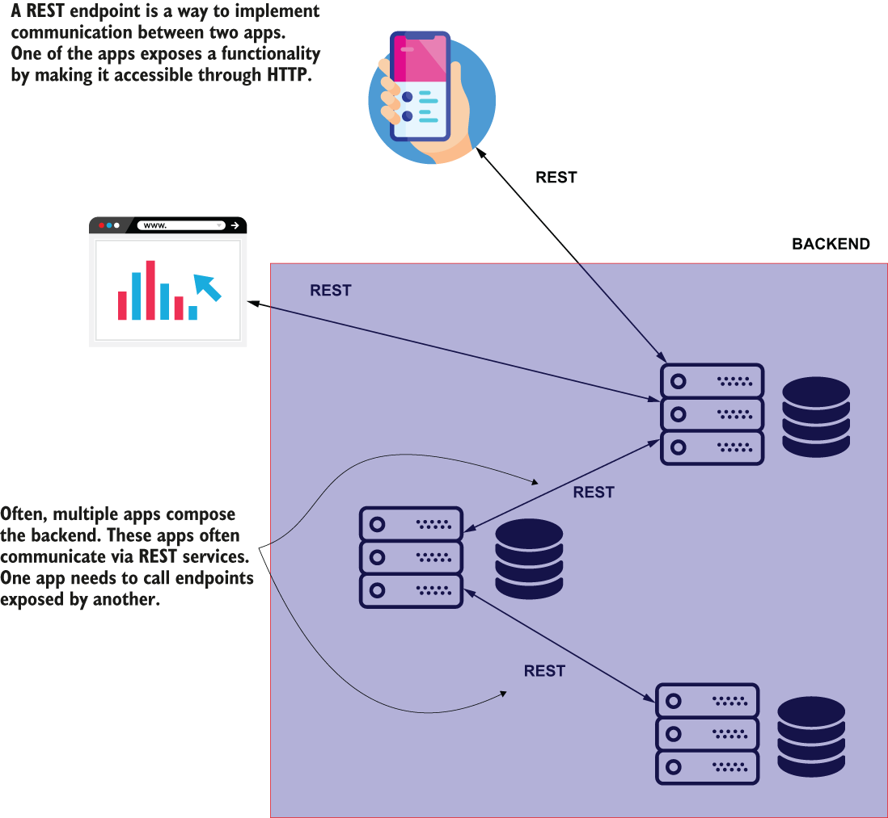
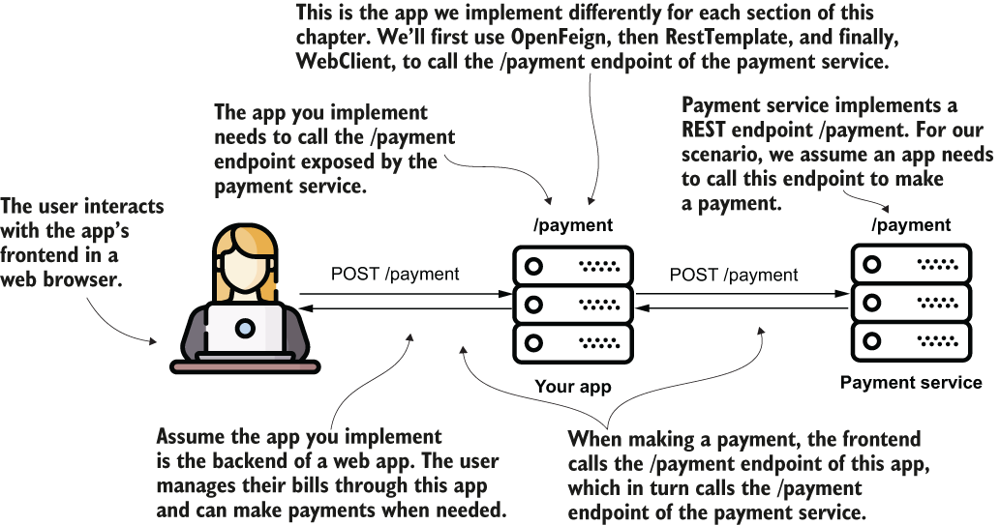
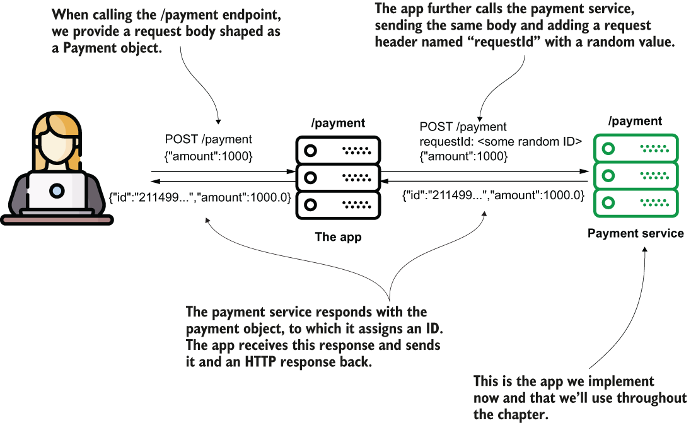
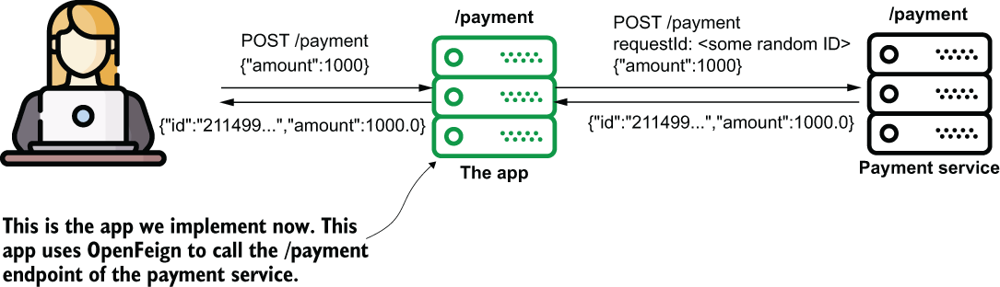
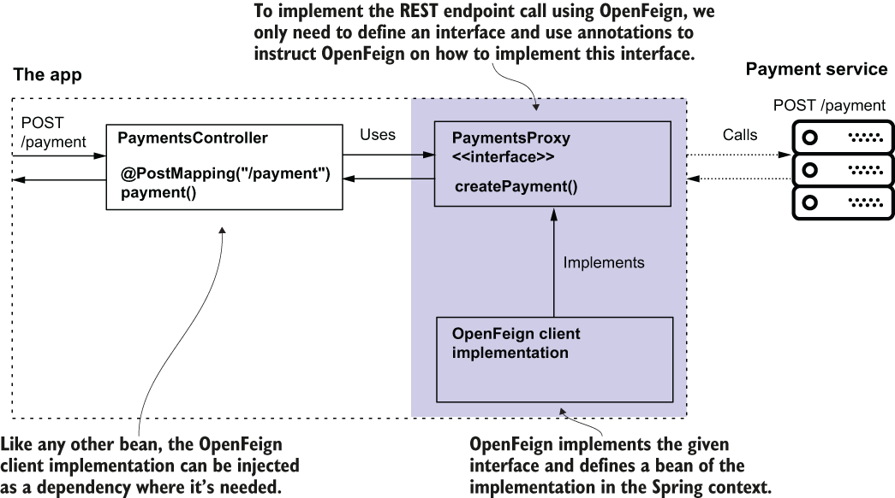
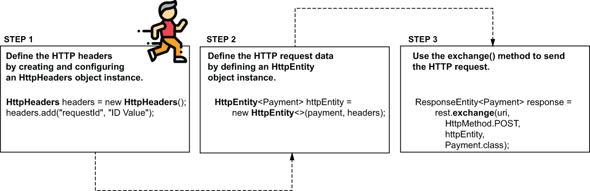
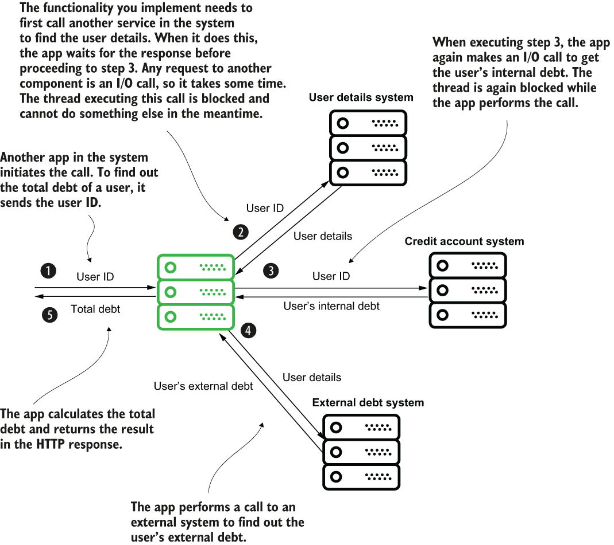
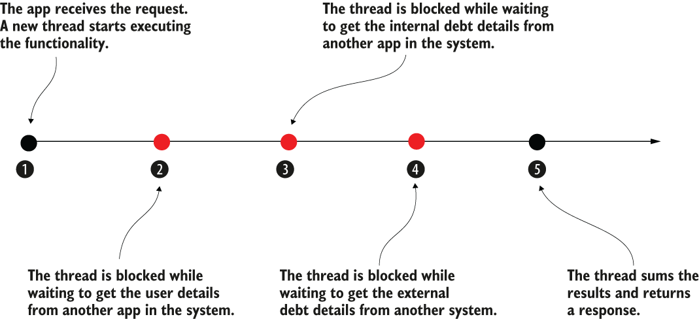
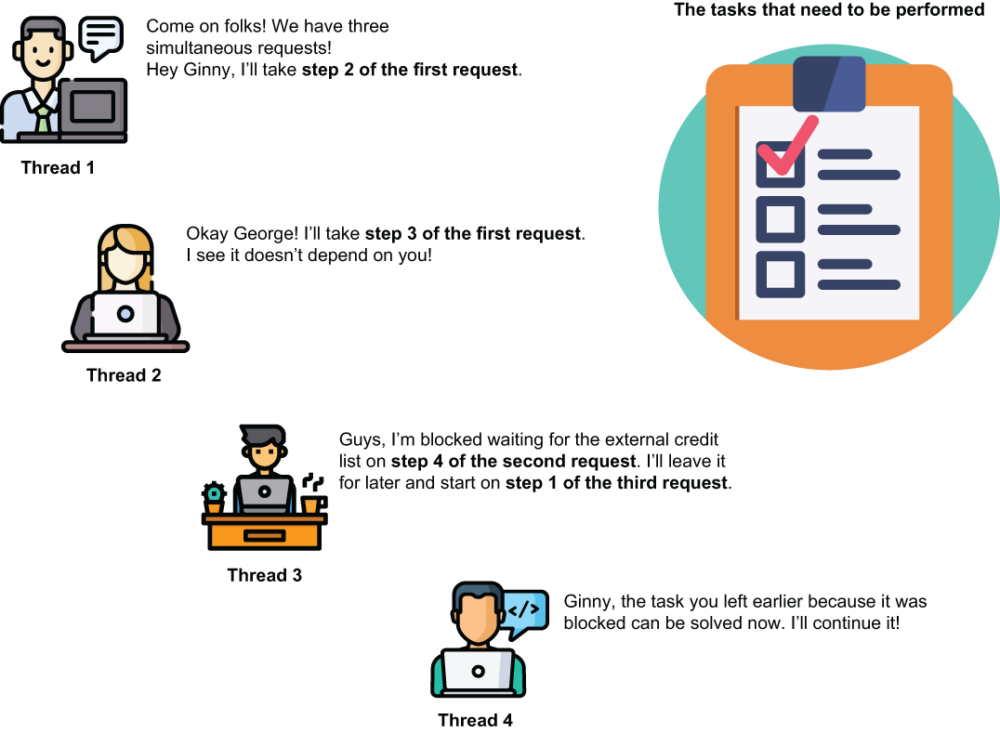
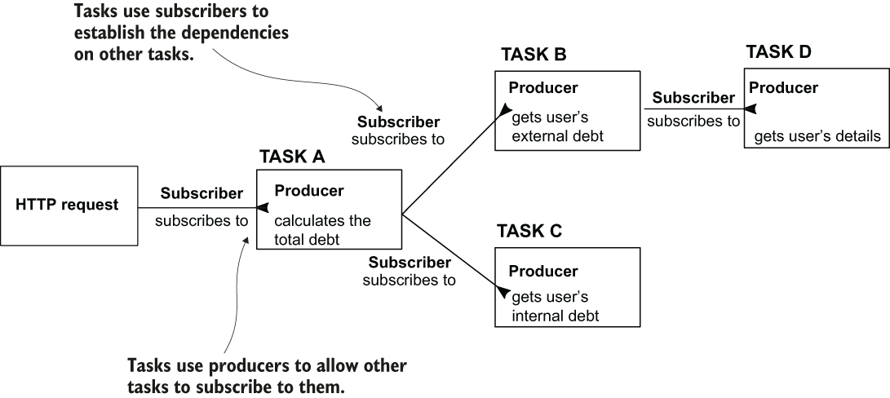

# 11 Consuming REST endpoints
- REST services are a common way to implement the communication between two system components.
- The client of a web app can call the backend, and so can another backend component. In a backend solution composed of multiple services, these components need to “speak” to exchange data, so when you implement such a service using Spring, you need to know how to call a REST endpoint exposed by another service.
- Often, a backend app needs to act as a client for another backend app, and calls exposed REST endpoints to work with specific data.
	- 
- In this chapter, you’ll learn three ways to call REST endpoints from a Spring app:
	- **OpenFeign**—A tool offered by the Spring Cloud project. I recommend developers use this feature in new apps for consuming REST endpoints.
	- **RestTemplate**—A well-known tool developers have used since Spring 3 to call REST endpoints. RestTemplate is often used today in Spring apps. However, as we’ll discuss in this chapter, **OpenFeign is a better alternative to RestTemplate**, so if you work on a new app, you’ll probably **avoid RestTemplate and use OpenFeign instead**.
	- **WebClient**—A Spring feature presented as an alternative to RestTemplate. This feature uses a different programming approach named reactive programming.
- **OpenFeign**, which is part of the Spring Cloud family and a feature I recommend for all new implementations today. As you’ll learn, OpenFeign **offers a simple syntax and makes calling a REST endpoint from a Spring app straightforward**.
- **RestTemplate** has been put in maintenance mode starting with Spring 5, and **it will eventually be deprecated**. Most of today’s Spring projects use RestTemplate to call REST endpoints because they started when this was the only or the best solution for implementing such a capability.
- For some of these apps, RestTemplate’s capabilities are enough and work fine, so replacing them makes no sense. Sometimes the time needed to replace **RestTemplate** with a newer solution might be too costly, so learning it is still a must for a Spring developer.
- Here’s an interesting fact that usually creates confusion for students. In the RestTemplate documentation (https://docs.spring.io/spring-framework/docs/current/javadoc-api/org/springframework/web/client/RestTemplate.html), **WebClient** is given as a recommendation for replacing the use of RestTemplate. I’ll explain why using **WebClient** is not always the best alternative to RestTemplate. We’ll discuss **WebClient** and clarify when it’s best to use this capability.
- To teach you these three fundamental ways, we’ll write an example for each. We’ll first implement a project that exposes an endpoint. Our purpose is to call the endpoint in each approach we discuss in this chapter: **OpenFeign**, **RestTemplate**, and **WebClient**.
- To properly teach you how to call REST endpoints, we’ll implement several examples. For each example, we implement two projects. One exposes a REST endpoint. The second demonstrates the implementation for calling that REST endpoint using **OpenFeign**, **RestTemplate**, and **WebClient**.
	- 
- The payment service exposes an endpoint that requires an HTTP request body. The app uses **OpenFeign**, **RestTemplate**, or **WebClient** to send requests to the endpoint the payment service exposes.
	- 
- Let’s create the project, which represents the payments service. It’s a web app, so, like all the projects we discussed, we need to add to the `pom.xml` file the web dependency, as presented in the next code snippet:
	```
	<dependency>
	   <groupId>org.springframework.boot</groupId>
	   <artifactId>spring-boot-starter-web</artifactId>
	</dependency>
	```
- We’ll model the payment with the `Payment` class, as presented in the next code snippet:
	```
	public class Payment {
	  private String id;
	  private double amount;

	 // Omitted getters and setters
	}
	```
- The above listing shows the endpoint’s implementation in the controller class. Technically, it doesn’t do much. The method receives a Payment instance and sets a random ID to the payment before returning it. The endpoint is simple but good enough for our demonstration. We use HTTP POST. We need to specify a request header and the request body. The endpoint returns a header in the HTTP response and the Payment object in the response body when called.
	```
	@RestController
	public class PaymentsController {

	  private static Logger logger =                            ❶
		Logger.getLogger(PaymentsController.class.getName());

	  @PostMapping("/payment")                                  ❷
	  public ResponseEntity<Payment> createPayment(
		  @RequestHeader String requestId,                      ❸
		  @RequestBody Payment payment                          ❸
	  ) {
		logger.info("Received request with ID " + requestId +
			" ;Payment Amount: " + payment.getAmount());

		payment.setId(UUID.randomUUID().toString());            ❹

		return ResponseEntity                                   ❺
			.status(HttpStatus.OK)
			.header("requestId", requestId)
			.body(payment);
	  }

	}
	```
	❶ We use a logger to prove the right controller’s method gets the correct data when the endpoint is called.
	❷ The app exposes the endpoint with HTTP POST at the path /payment.
	❸ The endpoint needs to get a request header and the request body from the caller. The controller method gets these two details as parameters.
	❹ The method sets a random value for the payment’s ID.
	❺ The controller action returns the HTTP response. The response has a header and the response body that contains the payment with the random ID value set.
## Calling REST endpoints using Spring Cloud OpenFeign
* * *
- In this section, we discuss a modern approach for calling REST endpoints from a Spring app. In most apps, developers have used **RestTemplate**. As mentioned earlier in this chapter, **RestTemplate** is in maintenance mode starting with Spring 5. Moreover, **RestTemplate** will be deprecated soon, so I prefer to begin this chapter by discussing the alternative to **RestTemplate** I recommend you use: **OpenFeign**.
- With **OpenFeign**, as you’ll find out in the example we write in this section, you only need to write an interface, and the tool provides you with the implementation.
- To teach you how **OpenFeign** works, we’ll create the project and implement an app that uses **OpenFeign** to call the endpoint app “payments” exposes.
- We now implement the app that consumes the `/payment` endpoint the payment service exposes. We use **OpenFeign** to implement the functionality that consumes the REST endpoint.
	- 
- We’ll **define an interface where we declare the methods that consume REST endpoints**. The only thing we need to do is a**nnotate these methods to define the path, the HTTP method, and eventually parameters, headers, and the body of the request**. The interesting thing is that **we don’t need to implement the methods ourselves**. You define with the interface methods based on the annotations, and Spring knows to implement them. We rely again on the excellent magic of Spring.
- With **OpenFeign**, you only need to **define an interface (a contract) and tell OpenFeign where to find this contract to implement it**. **OpenFeign** implements the interface and **provides the implementation as a bean in the Spring context based on configurations you define with annotations**. You can **inject the bean from the Spring context anywhere you need it in your app**.
	- 
- Your `pom.xml` file needs to define the dependency, as shown by the next code snippet:
	```
	<dependency>
	   <groupId>org.springframework.cloud</groupId>
	   <artifactId>spring-cloud-starter-openfeign</artifactId>
	</dependency>
	```
- Once you have the dependency in place, you can create the proxy interface. In OpenFeign terminology, we also name this interface the **OpenFeign client**. **OpenFeign** implements this interface, so you don’t have to bother writing the code that calls the endpoint. **You only need to use a few annotations to tell OpenFeign how to send the request**. The following listing shows you how simple the definition of the request is with **OpenFeign**.
	```
	@FeignClient(name = "payments",           ❶
				 url = "${name.service.url}")
	public interface PaymentsProxy {

	  @PostMapping("/payment")                ❷
	  Payment createPayment(
		  @RequestHeader String requestId,    ❸
		  @RequestBody Payment payment);      ❸

	}
	```
	❶ We use the `@FeignClient` annotation to configure the REST client. A minimal configuration defines a name and the endpoint base URI.
	❷ We specify the endpoint’s path and HTTP method.
	❸ We define the request headers and body.
- The first thing to do is annotate the interface with the `@FeignClient` annotation to tell OpenFeign it has to provide an implementation for this contract.
- We have to assign a name to the proxy using the name attribute of the `@FeignClient` annotation, which OpenFeign internally uses. The name uniquely identifies the client in your app. The `@FeignClient` annotation is also where we specify the base URI of the request. You can define the base URI as a string using the url attribute of `@FeignClient`.
- Ensure you **always store URIs and other details that might differ from one environment to another in the properties files and never hardcode them in the app**. You can define a property in the project’s “`application.properties`” file and refer it from the source code using the following syntax: `${property_name}`. Using this practice, you don’t need to recompile the code when you want to run the app in different environments.
- Each method you declare in the interface represents a REST endpoint call. You use the same annotations you learned for the controller’s actions to expose REST endpoints:
	- To specify the path and HTTP method: `@GetMapping`, `@PostMapping`, `@PutMapping`, and so on
	- To specify a request header: `@RequestHeader`
	- To specify the request body: `@RequestBody`
- I find this aspect of reusing the annotation beneficial. Here, by “**reusing the annotation**,” I mean OpenFeign uses the same annotations we use when we define the endpoints. **You don’t have to learn something specific to OpenFeign**. Just use the same annotations as for exposing the REST endpoints in the Spring MVC controller classes.
- **OpenFeign** needs to know where to find the interfaces defining the client contracts. We use the `@EnableFeignClients` annotation on a configuration class to enable the OpenFeign functionality and tell OpenFeign where to search for the client contracts. In the following listing, you find the project’s configuration class where we enable the OpenFeign clients.
	```
	@Configuration
	@EnableFeignClients(                     ❶
	   basePackages = "com.example.proxy")
	public class ProjectConfig {
	}
	```
	❶ We enable the OpenFeign clients and tell the OpenFeign dependency where to search for the proxy contracts.
- You can now inject the OpenFeign client through the interface. Once you enable OpenFeign, it knows to implement the interfaces annotated with `@FeignClient`. We discussed that Spring is smart enough to provide you with a bean instance from its context when you use an abstraction, and this is exactly what you do here. The following listing shows you the controller class that injects the **FeignClient**.
	```
	@RestController
	public class PaymentsController {

	  private final PaymentsProxy paymentsProxy;

	  public PaymentsController(PaymentsProxy paymentsProxy) {
		this.paymentsProxy = paymentsProxy;
	  }

	  @PostMapping("/payment")
	  public Payment createPayment(
		  @RequestBody Payment payment
		  ) {
		String requestId = UUID.randomUUID().toString();
		return paymentsProxy.createPayment(requestId, payment);
	  }
	}
	```
- Now start both projects (the payments service and this section’s app) and call the app’s `/payment` endpoint using `cURL` or Postman. Using `cURL`, the request command looks the following snippet:
	`curl -X POST -H 'content-type:application/json' -d '{"amount":1000}'  http://localhost:9090/payment`
- In the console where you executed the `cURL` command, you’ll find a response, as presented in the next snippet:
	`{"id":"1c518ead-2477-410f-82f3-54533b4058ff","amount":1000.0}`
- In the payment service’s console, you find the log proving that the app correctly sent the request to the payment service:
	`Received request with ID 1c518ead-2477-410f-82f3-54533b4058ff ;Payment Amount: 1000.0`
## Calling REST endpoints using RestTemplate
* * *
- In this section, we again implement the app that calls the `/payment` endpoint of the payment service, but this time we use a different approach: RestTemplate.
- I don’t want you to conclude that **RestTemplate** has any problems. It is being put to sleep not because it’s not working properly or because it’s not a good tool. But **as apps evolved, we started to need more capabilities**. Developers wanted to be able to benefit from different things that aren’t easy to implement with **RestTemplate**, such as the following:
	- Calling the endpoints both synchronously and asynchronously
	- Writing less code and treating fewer exceptions (eliminate boilerplate code)
	- Retrying call executions and implementing fallback operations (logic performed when the app can’t execute a specific REST call for any reason)
- In other words, developers prefer to get more things out of the box rather than implement them wherever possible. Remember that reusing code and avoiding boilerplate code is one of the primary purposes of frameworks.
- You’ll get the chance to compare the examples we implement and observe that using OpenFeign is much easier than using RestTemplate.
- Here is a good lesson I learned in my experience: When something is called “deprecated” or “legacy,” it doesn’t necessarily mean you shouldn’t learn it. Sometimes, deprecated technologies are still used in projects many years after being declared deprecated, including **RestTemplate** and the **Spring Security OAuth** project.
- The steps for defining the call are as follows:
	- Define the HTTP headers by creating and configuring an HttpHeaders instance.
	- Create an HttpEntity instance that represents the request data (headers and body).
	- Send the HTTP call using the exchange() method and get the HTTP response.
-  To define a more complex HTTP request, you have to use the `HttpHeaders` class to define the headers, then the `HttpEntity` class to represent the full request data. Once you defined the data on the request, you call the `exchange()` method to send it.
	-  
-  We start implementing this example in the project. In below listing, you find the definition of the proxy class.
-  Observe how the `createPayment()` method defines the header by creating an `HttpHeaders` instance and adding the needed header “requestId” to this instance using the `add()` method.
-  It then creates a `HttpEntity` instance based on the headers and the body (received by the method as a parameter). The method then sends the HTTP request using RestTemplate’s `exchange()` method. The `exchange()` method’s parameters are the URI and the HTTP method, followed by the `HttpEntity` instance (that holds the request data) and the type expected for the response body.
	```
	@Component
	public class PaymentsProxy {

	  private final RestTemplate rest; 

	  @Value("${name.service.url}")
	  private String paymentsServiceUrl;                  ❶

	  public PaymentsProxy(RestTemplate rest) {           ❷
		this.rest = rest;
	  }

	  public Payment createPayment(Payment payment) {
		String uri = paymentsServiceUrl + "/payment";

		HttpHeaders headers = new HttpHeaders();          ❸
		headers.add("requestId",                          ❸
					UUID.randomUUID().toString());        ❸

		HttpEntity<Payment> httpEntity =                  ❹
		  new HttpEntity<>(payment, headers);

		ResponseEntity<Payment> response =                ❺
			rest.exchange(uri,                            ❺
				HttpMethod.POST,                          ❺
				httpEntity,                               ❺
				Payment.class);                           ❺

		return response.getBody();                        ❻
	  }
	}
	```
	❶ We take the URL to the payment service from the properties file.
	❷ We inject the RestTemplate from the Spring context using constructor DI.
	❸ We build the HttpHeaders object to define the HTTP request headers.
	❹ We build the HttpEntity object to define the request data.
	❺ We send the HTTP request and retrieve the data on the HTTP response.
	❻ We return the HTTP response body.
- We define a simple endpoint to call this implementation. The next listing shows you how to define the controller class.
	```
	@RestController
	public class PaymentsController {

	  private final PaymentsProxy paymentsProxy;

	  public PaymentsController(PaymentsProxy paymentsProxy) {
		this.paymentsProxy = paymentsProxy;
	  }

	  @PostMapping("/payment")                         ❶
	  public Payment createPayment(
		  @RequestBody Payment payment                 ❷
		  ) {
		return paymentsProxy.createPayment(payment);   ❸
	  }
	}
	```
	❶ We define a controller action and map it to the `/payment` path.
	❷ We get the payment data as a request body.
	❸ We call the proxy method, which in turn calls the endpoint of the payments service. We get the response body and return the body to the client.
- We run both apps, on different ports to validate our implementation works as expected. For this example, I kept the same configuration port 8080 for the payment service and port 9090 for this section’s app.
- Using `cURL`, you can call the app’s endpoint, as presented in the next snippet:
	`curl -X POST -H 'content-type:application/json' -d '{"amount":1000}' http://localhost:9090/payment`
- In the console where you executed the `cURL` command, you’ll find a response, as presented in the next snippet:
	```
	{
	  "id":"21149959-d93d-41a4-a0a3-426c6fd8f9e9",
	  "amount":1000.0
	}
	```
- In the payment service’s console, you find the log proving that the app correctly sent the payment service request:
	`Received request with ID e02b5c7a-c683-4a77-bd0e-38fe76c145cf ;Payment Amount: 1000.0`
## Calling REST endpoints using WebClient
* * *
- In this section, we discuss using **WebClient** to call REST endpoints.
- **WebClient** is a tool used in different apps and is built on a methodology we call a reactive approach. The reactive methodology is an advanced approach, and I recommend studying it once you know the basics well.
- Spring’s documentation recommends using WebClient, but that’s only **a valid recommendation for reactive apps**.
- If you aren’t writing a reactive app, use **OpenFeign** instead.
- Like anything else in software, it fits well for some cases, but might complicate things for others. **Choosing WebClient to implement the REST endpoint calls is strongly coupled to making your app reactive**.
- If you decide not to implement a reactive app, use OpenFeign to implement the REST client capabilities. If you implement a reactive app, you should use a proper reactive tool: **WebClient**.
- Even though reactive apps are a bit beyond the basics, I’d like to make sure you know what using **WebClient** looks like and how this tool differs from others we have discussed so that you can compare the approaches. Let me tell about reactive apps and then use WebClient to call the `/payment` endpoint.
- In a **nonreactive app**, a thread executes a business flow. **Multiple tasks compose a business flow, but these tasks are not independent**. **The same thread executes all the tasks composing a flow**. Let’s take an example to observe where this approach might face issues and how we can enhance it.
- Suppose you implement a banking application where a bank’s client has one or more credit accounts. The system component you implement calculates the total debt of a bank’s client. To use this functionality, other system components make a REST call to send a unique ID to the user. To calculate this value, the flow you implement includes the following steps:
	- The app receives the user ID.
	- It calls a different service of the system to find out if the user has credits with other institutions.
	- It calls a different service of the system to get the debt for internal credits.
	- If the user has external debts, it calls an external service to find out the external debt.
	- The app sums the debts and returns the value in an HTTP response.
- A functionality scenario for demonstrating the usefulness of a reactive approach. A banking app needs to call several other apps to calculate the total debt of a user. Due to these calls, the thread executing the request is blocked several times while waiting for I/O operations to finish.
	- 
- These are just five steps of functionality, but I designed them to prove where using a reactive app could be helpful. Let’s analyze these steps deeper. The below figure presents the execution of the scenario from the thread’s point of view. The app creates a new thread for each request, and this thread executes the steps one by one. The thread has to wait for a step to finish before proceeding to the next one and is blocked every time it waits for the app to perform an I/O call.
- The execution of the scenario functionality from the thread point of view. The arrow represents the timeline of the thread. Some of the steps cause details to block the thread, which needs to wait for the task to finish before proceeding.
	- 
- We observe two significant issues here:
	- The thread is idle while an I/O call blocks it. Instead of using the thread, we allow it to stay and occupy the app’s memory. We consume resources without gaining any benefit. With such an approach, you could have cases where the app gets 10 requests simultaneously, but all the threads are idle simultaneously while waiting for details from other systems.
	- Some of the tasks don’t depend on one another. For example, the app could execute step 2 and step 3 at the same time. There’s no reason for the app to wait for step 2 to end before executing step 3. The app just needs, in the end, the result of both to calculate the total debt.
- **Reactive apps change the idea of having one atomic flow in which one thread executes all its tasks from the beginning to the end**. With reactive apps, **we think of tasks as independent, and multiple threads can collaborate to complete a flow composed of multiple tasks**.
- Instead of imagining this functionality as steps on a timeline, imagine it as a backlog of tasks and a team of developers solving them. With this analogy, I’ll help you imagine how a reactive app works: the developers are threads, and the tasks in the backlog are the steps of a functionality.
- Two developers can implement two different tasks simultaneously if they don’t depend on one another. If a developer gets stuck on a task because of an external dependency, they can leave it temporarily and work on something else. The same developer can get back to the task once it’s not blocked anymore, or another developer can finish solving it.
- An analogy of the way a reactive app works. A thread doesn’t take a request’s tasks in order and wait when it’s blocked. Instead, all tasks from all requests are on a backlog. Any available thread can work on tasks from any request. This way, independent tasks can be solved in parallel, and the threads don’t stay idle.
	- 
- Using this approach, you don’t need one thread per each request. You can solve multiple requests with fewer threads because the threads don’t have to stay idle. When blocked on a certain task, the thread leaves it and works on some other task that isn’t blocked.
- Technically, in a reactive app, we implement a flow by defining the tasks and the dependencies between them. The reactive app specification offers us two components: the producer and the subscriber to implement the dependencies between tasks.
- A task returns a producer to allow other tasks to subscribe to it, marking the dependency they have on the task. A task uses a subscriber to attach to a producer of another task and consume that task’s result once it ends.
- The below figure shows the discussed scenario implemented in a reactive approach. Instead of being steps on a timeline, the tasks are independent of any thread and declare their dependencies. Multiple threads can execute these tasks, and no thread has to wait for a task when an I/O communication blocks it. The thread can begin executing another task.
- Moreover, tasks that are not dependent on one another can be simultaneously executed. In figure, tasks C and D, which were initially steps 2 and 3 in the nonreactive design, can now be executed simultaneously, which helps make the app more performant.
- In a reactive app, the steps become tasks. Each task marks its dependencies on other tasks and allows other tasks to depend on them. Threads are free to execute any task.
	- 
- For this section’s app, we use **WebClient** to send requests to the endpoint the payment service exposes.
- Because **WebClient** imposes a reactive approach, we need to add a dependency named **WebFlux** instead of the standard web dependency. The next code snippet shows the **WebFlux** dependency, which you can add to your `pom.xml` file or choose where you build the project using `start.spring.io`:
	```
	<dependency>
	   <groupId>org.springframework.boot</groupId>
	   <artifactId>spring-boot-starter-webflux</artifactId>
	</dependency>
	```
- To call the REST endpoint, you need to use a **WebClient** instance. The best way to create easy access is to put it in the Spring context using the `@Bean` annotation with a configuration class method. The following listing shows you the app’s configuration class.
	```
	@Configuration
	public class ProjectConfig {

	  @Bean
	  public WebClient webClient() {
		return WebClient
				.builder()        ❶
				.build();
	  }
	}
	```
	❶ Creates a WebClient bean and adds it in the Spring context
- The below list shows the proxy class’s implementation, which uses **WebClient** to call the endpoint the app exposes. The logic is similar to what you’ve learned for **RestTemplate**. You take the base URL from the `properties` file; specify the HTTP method, headers, and body; and execute the call. WebClient’s methods’ names differ, but it’s quite easy to understand what they’re doing after reading their names.
	```
	@Component
	public class PaymentsProxy {

	  private final WebClient webClient;

	  @Value("${name.service.url}")                          ❶
	  private String url;

	  public PaymentsProxy(WebClient webClient) {
		this.webClient = webClient;
	  }

	  public Mono<Payment> createPayment(
		String requestId, 
		Payment payment) {
		return webClient.post()                              ❷
				  .uri(url + "/payment")                     ❸
				  .header("requestId", requestId)            ❹
				  .body(Mono.just(payment), Payment.class)   ❺
				  .retrieve()                                ❻
				  .bodyToMono(Payment.class);                ❼
	  }
	}
	```
	❶ We take the base URL from the properties file.
	❷ We specify the HTTP method we use when making the call.
	❸ We specify the URI for the call.
	❹ We add the HTTP header value to the request. You can call the header() method multiple times if you want to add more headers.
	❺ We provide the HTTP request body.
	❻ We send the HTTP request and obtain the HTTP response.
	❼ We get the HTTP response body.
- In our demonstration, we use a class named `Mono`. This class defines a producer. In listing above, you find this case, where the method performing the call doesn’t get the input directly. Instead, we send a `Mono`. This way, we can create an independent task that provides the request body value. The **WebClient** subscribed to this task becomes dependent on it.
- The method also doesn’t return a value directly. Instead, it returns a `Mono`, allowing another functionality to subscribe to it. This way, the app builds the flow, not by chaining them on a thread, but by linking the dependencies between tasks through producers and consumers.
- The tasks chain in a reactive app. When building a reactive web app, we define the tasks and the dependencies between them. The **WebFlux** functionality initiating the HTTP request subscribes to the task we create through the producer the controller’s action returns. In our case, this producer is the one we get by sending the HTTP request with **WebClient**. For **WebClient** to make the request, it subscribes to another task that provides the request body.
- The below listing also shows the proxy method that consumes a `Mono` producing the HTTP request body and returns it to what the **WebFlux** functionality subscribes.
- To prove the call works correctly, as we did in this chapter’s previous examples, we implement a controller class that uses the `proxy` to expose an endpoint we’ll call to test our implementation’s behavior. The following listing shows the implementation of the `controller` class.
	```
	@RestController
	public class PaymentsController {

	  private final PaymentsProxy paymentsProxy;

	  public PaymentsController(PaymentsProxy paymentsProxy) {
		this.paymentsProxy = paymentsProxy;
	  }

	  @PostMapping("/payment")
	  public Mono<Payment> createPayment(
		  @RequestBody Payment payment
		  ) {
		String requestId = UUID.randomUUID().toString();
		return paymentsProxy.createPayment(requestId, payment);
	  }
	}
	```
- You can test the functionality of both apps, by calling the `/payment` endpoint with `cURL` or Postman. Using `cURL`, the request command looks like the following snippet:
	`curl -X POST -H 'content-type:application/json' -d '{"amount":1000}' http://localhost:9090/payment`
- In the console where you executed the `cURL` command, you’ll find a response like the next snippet:
	```
	{
	  "id":"e1e63bc1-ce9c-448e-b7b6-268940ea0fcc",
	  "amount":1000.0
	}
	```
- In the payment service console, you find the log proving that this section’s app correctly sends the request to the payment service:
	`Received request with ID e1e63bc1-ce9c-448e-b7b6-268940ea0fcc ;Payment Amount: 1000.0`

