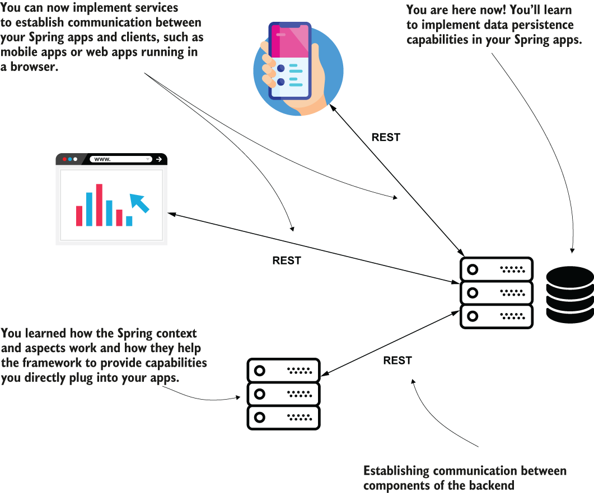
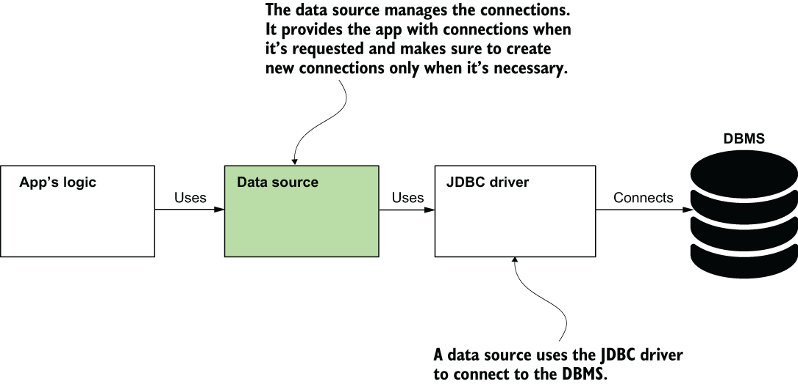
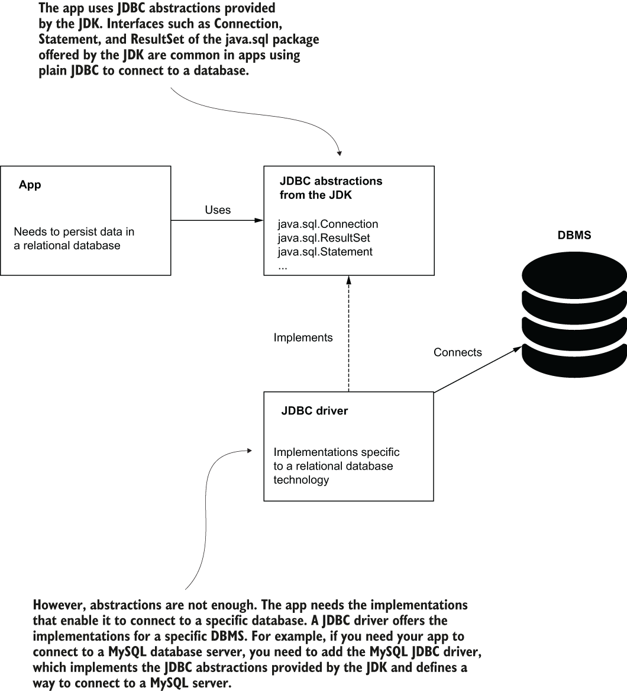
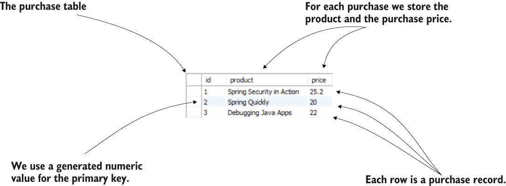
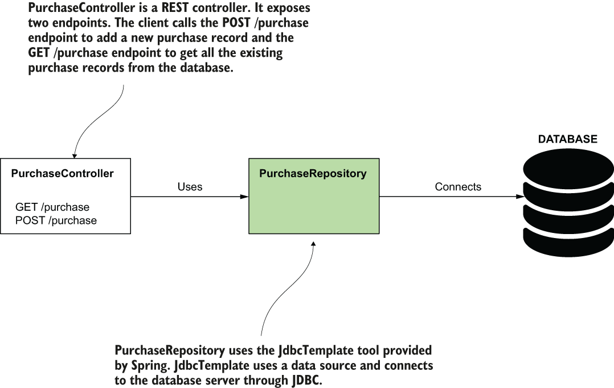
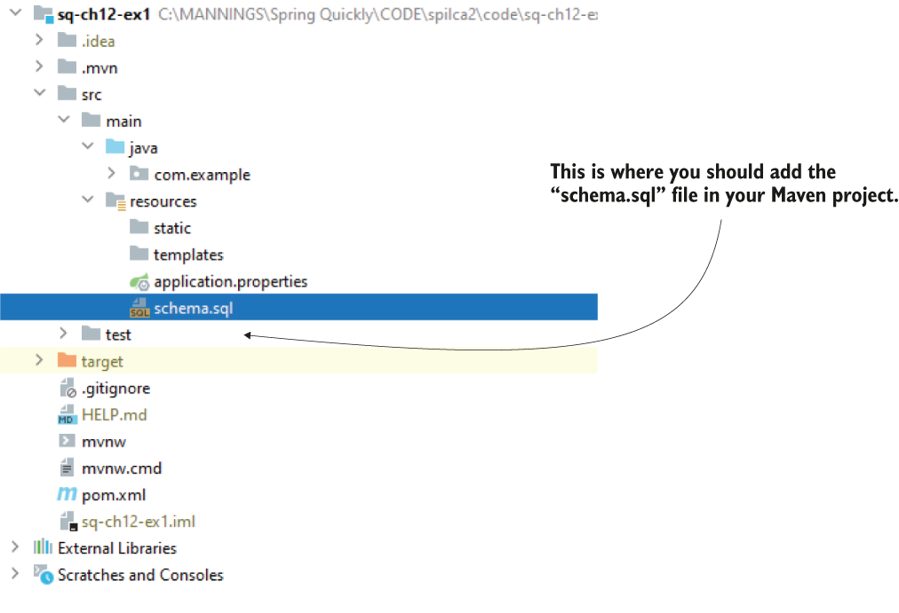

## 12 Using data sources in Spring apps
- This chapter covers
	- What a data source is
	- Configuring a data source in a Spring app
	- Using JdbcTemplate to work with a database
- Almost every app today needs to store data it works with, and often apps use databases to manage the data they persist. For many years, relational databases have provided applications with a simple and elegant way to store data you can successfully apply in many scenarios.
- Spring apps, like other apps, often need to use databases to persist data, and for this reason, you need to learn how to implement such capabilities for your Spring apps.
- In this chapter, we discuss what a data source is and the most straightforward way to make your Spring app work with a database. That straightforward way is the **JdbcTemplate** tool that Spring offers.
- You now start your journey in learning the valuable skills of making your Spring app work with persisted data.
	- 
- The above figure shows your progress in previous chapters on learning to use Spring to implement various fundamental capabilities in a system. We have made good progress, and you can now use Spring to implement capabilities in various parts of a system.
## What a data source is
* * *
- In this section, we discuss an essential component your Spring app needs to access a database: **the data source**. The **data source** is a component that manages connections to the server handling the database (the database management system, also known as DBMS).
- The **data source** is a component that manages connections to the database management systems (DBMS). The data source uses the JDBC driver to get the connections it manages. The data source aims to improve the app’s performance by allowing its logic to reuse connections to the DBMS and request new connections only when it needs them. The data source also makes sure to close the connections when it releases them.
	- 
- DBMS is software whose responsibility is to allow you to efficiently manage persisted data (add, change, retrieve) while keeping it secure. A DBMS manages the data in databases. A database is a persistent collection of data.
- Without an object taking the responsibility of a data source, the app would need to request a new connection for each operation with the data. This approach is not realistic in a production scenario because communicating through the network for establishing a new connection for each operation would dramatically slow down the application and cause performance issues. The **data source makes sure your app only requests a new connection when it really needs it**, improving the app’s performance.
- When working with any tool related to data persistence in a relational database, Spring expects you to define a data source. For this reason, it’s important we first discuss where a data source fits in the app’s persistence layer and then demonstrate how to implement a data persistence layer in examples.
- In a Java app, **the language’s capabilities to connect to a relational database is named Java Database Connectivity (JDBC)**. JDBC offers you a way to connect to a DBMS to work with a database. However, the JDK doesn’t provide a specific implementation for working with a particular technology (such as MySQL, Postgres, or Oracle). The **JDK only gives you the abstractions for objects an app needs to work with a relational database**.
- To gain the implementation of this abstraction and enable your app to connect to a certain DBMS technology, you add a runtime dependency named the JDBC driver. **Every technology vendor provides the JDBC driver you need to add to your app to enable it to connect to that specific technology**. The JDBC driver is not something that comes either from the JDK or from a framework such as Spring.
- When connecting to a database, a Java app uses JDBC. The JDK provides a set of abstractions, but the app needs a certain implementation that depends on the relational database technology the app connects to. A runtime dependency named JDBC driver offers these implementations. For each specific technology, such a driver exists, and the app needs the exact driver that offers the implementations for the server technology it needs to connect to.
	- 
- The JDBC driver gives you a way to obtain a connection to the DBMS. A first option is **to use the JDBC driver directly and implement your app to require a connection each time it needs to execute a new operation on the persisted data**. You’ll often find this approach in Java fundamentals tutorials. When you learn JDBC in a Java fundamentals tutorial, the examples generally use a class named DriverManager to get a connection, as presented in the following code snippet:
	`Connection con = DriverManager.getConnection(url, username, password);`
- The `getConnection()` method uses the URL provided as a value for the first parameter to identify the database your app needs to access and the username and password to authenticate the access to the database. But requesting a new connection and authenticating each operation again and again for each is a waste of resources and time for both the client and the database server. Imagine you go into a bar and ask for a beer; you look young, so the barman asks for your ID. This is fine, but it would become tedious if the barman asked you for the ID again when you ordered the second and the third beer (hypothetically, of course).
- Your app can reuse connections to the database server. If it doesn’t request new connections, the app becomes less performant by executing unnecessary operations. To achieve this behavior, the app needs an object responsible for managing the connections—a data source.
	- 
- A data source object can **efficiently manage the connections to minimize the number of unnecessary operations**. Instead of using the JDBC driver manager directly, we use a data source to retrieve and manage the connections.
- Adding a data source to the class design **helps the app spare the time for unnecessary operations**. The data source **manages the connections, provides the app with connections when requested, and creates new connections only when needed**.
	- 
- A data source is an object whose responsibility is to manage the connections to a database server for the app. It makes sure your app efficiently requests connections from the database, improving the persistence layer operations’ performance.
- For Java apps, you have multiple choices for data source implementations, but the most commonly used today is the **HikariCP (Hikari connection pool)** data source. The convention configuration of Spring Boot also considers **HikariCP** the default data source implementation too, and this is what we’ll use in the examples. You can find out more about this data source here: [https://github.com/brettwooldridge/HikariCP](https://github.com/brettwooldridge/HikariCP). **HikariCP** is open source, and you can help contribute to its development.
## Using JdbcTemplate to work with persisted data
* * *
- In this section, we implement our first Spring app that uses a database, and we discuss the advantages Spring provides for implementing the persistence layer.
- Your app can use a data source to obtain connections to the database server efficiently. But how easily can you write code to work with the data? **Using JDBC classes provided by the JDK has not proven to be a comfortable way to work with persisted data**. You have to write verbose blocks of code even for the simplest operations. In Java fundamentals examples, you might have seen code like that presented in the next snippet:
	```
	String sql = "INSERT INTO purchase VALUES (?,?)";
	try (PreparedStatement stmt = con.prepareStatement(sql)) {
	  stmt.setString(1, name);
	  stmt.setDouble(2, price);
	  stmt.executeUpdate();
	} catch (SQLException e) {
	  // do something when an exception occurs
	}
	```
- Such a lengthy block of code for a simple operation of adding a new record to a table! And consider that I skipped the logic in the `catch` block.
- But Spring helps us minimize the code we write for such operations. With Spring apps, we can use various alternatives to implement the persistence layer, and the most important such alternatives we’ll discuss in this chapter and in next chapters. In this section, we’ll use a tool named **JdbcTemplate** that allows you to work with a database with JDBC in a simplified fashion.
- **JdbcTemplate** is the simplest of the tools Spring offers for using a relational database, but it’s an excellent choice for small apps as it doesn’t force you to use any other specific persistence framework. **JdbcTemplate** is the best Spring choice to implement a persistence layer when you don’t want your app to have any other dependency. I also consider it an excellent way to start learning how to implement the persistence layer of Spring apps.
- To demonstrate how **JdbcTemplate** is used, we’ll implement an example. We’ll follow these steps:
	- Create a connection to the DBMS.
	- Code the repository logic.
	- Call the repository methods in methods that implement REST endpoints’ actions.
- For this app, we have a table “purchase” in a database. This table stores details about the products bought from an online shop and the price of the purchase. The columns of this table are as follows:
	- id—An auto-incrementing unique value that also takes the responsibility of the primary key of the table
	- product—The name of the purchased product
	- price—The purchase price
- The purchase table. Each purchase is stored as a row in the table. The attributes we store for a purchase are the purchased product and the purchase price. The primary key of the table (ID) is a numeric generated value.
	- 
- This book’s examples don’t depend on the relational database technology you choose. You can use the same code with a technology of your choice. However, I had to choose certain technology for the examples. In this book, we’ll use H2 (an in-memory database, excellent for examples, and, for implementing integration tests) and MySQL (a free and light technology you can easily install locally to prove the examples work with something other than an in-memory database).
- You can choose to implement the examples with some other relational database technology you prefer, like Postgres, Oracle, or MS SQL. In such a case, you will have to use a proper JDBC driver for your runtime (as mentioned earlier in this chapter and as you know from Java fundamentals). Also, the SQL syntaxes might be different between two different relational-database technologies. You’ll have to adapt them to the technology of your choice if you choose to use something else.
- Your app uses a JDBC driver for the H2 database as well. But for H2, you don’t have to add it separately because it comes with the H2 database dependency you added in the `pom.xml` file.
- For this book’s examples, I assume you already know SQL basics and you understand simple SQL query syntaxes. I also assume you have worked with JDBC in at least theoretical examples because you learn this in Java fundamentals—a mandatory prerequisite for learning Spring. But you might want to refresh your knowledge in this area before going further. I recommend **chapter 21 of OCP Oracle Certified Professional Java SE 11 Developer Complete Study Guide by Jeanne Boyarsky and Scott Selikoff (Sybex, 2020)** for the JDBC part. For a refresher on SQL, I recommend **Learning SQL, 3rd ed., by Alan Beaulieu (O’Reilly Media, 2020)**.
- The requirements for the app we implement are simple. We’ll develop a backend service that exposes two endpoints. Clients call one endpoint to add a new record in the purchase table and a second endpoint to get all the records from the purchase table.
- When working with a database, we implement all the capabilities related to the persistence layer in classes we (by convention) name repositories.
- A REST controller implements two endpoints. When a client calls the endpoints, the controller delegates to a repository object to use the database.
	- 
- A repository is a class responsible with working with a database.
- We start the implementation as usual, by adding the necessary dependencies. The next code snippet shows you the dependencies you need to add as they appear in the project’s `pom.xml` file:
	```
	<dependency>                                             ❶
	   <groupId>org.springframework.boot</groupId>           ❶
	   <artifactId>spring-boot-starter-web</artifactId>      ❶
	</dependency>                                            ❶
	<dependency>                                             ❷
	   <groupId>org.springframework.boot</groupId>           ❷
	   <artifactId>spring-boot-starter-jdbc</artifactId>     ❷
	</dependency>                                            ❷
	<dependency>                                             ❸
	   <groupId>com.h2database</groupId>                     ❸
	   <artifactId>h2</artifactId>                           ❸
	   <scope>runtime</scope>                                ❹
	</dependency>
	```
	❶ We use the same web dependency as we did in previous chapters to implement the REST endpoints.
	❷ We add the JDBC starter to get all the needed capabilities to work with databases using JDBC.
	❸ We add the H2 dependency to get both an in-memory database for this example and a JDBC driver to work with it.
	❹ The app only needs the database and the JDBC driver at runtime. The app doesn’t need them for compilation. To instruct Maven we only want these dependencies at runtime, we add the scope tag with the value “runtime.”
- Even if you don’t have a database server for this example, the H2 dependency simulates the database. **H2 is an excellent tool we use both for examples and application tests when we want to test an app’s functionality** but exclude its dependency on a database.
- We need to add a table that stores the purchase records. In theoretical examples, it’s easy to create a database structure by adding a file named “schema.sql” to the Maven project’s resources folder.
- In the Maven project, you create the “schema.sql” file in the resources folder, where you can write the queries that define your database structure. Spring executes these queries when the app starts.
	- 
- In this file, you can write all the structural SQL queries you need to define the database structure. You also find developers name these queries **“data description language” (DDL)**. We’ll also add such a file in our project and add the query to create the purchase table, as presented in the next code snippet:
	```
	CREATE TABLE IF NOT EXISTS purchase (
		id INT AUTO_INCREMENT PRIMARY KEY,
		product varchar(50) NOT NULL,
		price double NOT NULL
	);
	```
- Using a “schema.sql” file to define the database structure only works for theoretical examples. This approach is easy because it’s fast and allows you to focus on the things you learn rather than the definition of the database structure in a tutorial. But in a real-world example, you will need to use a dependency that also allows you to version your database scripts. I recommend you look at **Flyway** ([https://flywaydb.org/](https://flywaydb.org/)) and **Liquibase** ([https://www.liquibase.org/](https://www.liquibase.org/)). These are two highly appreciated dependencies for database schema versioning. They are beyond Spring basics, so we won’t use them in examples in this book. But it’s one of the things I recommend you learn right after the fundamentals.
- We need a model class to define the purchase data in our app. Instances of this class map the rows of the purchase table in the database, so each instance needs an ID, the product, and the price as attributes. The next code snippet shows the Purchase model class:
	```
	public class Purchase {

	  private int id;
	  private String product;
	  private BigDecimal price;
	  // Omitted getters and setters
	}
	```
- You might find it interesting that the `Purchase` class price attribute’s type is **BigDecimal**. Couldn’t we have defined it as a double? Here’s an important thing I want you to be aware of: in theoretical examples, you often find double used for decimal values, but in many real-world examples, using double or float for decimal numbers isn’t the right thing to do. **When operating with double and float values, you might lose precision for even simple arithmetic operations such as addition or subtraction**. This effect is caused by the way Java stores such values in memory. When you work with sensitive information such as prices, **you should use the BigDecimal type instead**. Don’t worry about the conversion. All the essential capabilities Spring provides know how to use BigDecimal.
- When you want to store a floating-point value accurately and make sure you don’t lose decimal precision when executing various operations with the values, use **BigDecimal** and not double or float.
- To easily get a `PurchaseRepository` instance when we need it in the controller, we’ll also make this object a bean in the Spring context. The simplest approach is to use a stereotype annotation (such as `@Component` or `@Service`)
- But instead of using `@Component`, Spring provides a focused annotation for repositories we can use: `@Repository`. As you learned, to use `@Service` for service classes, for repositories, you should use the `@Repository` stereotype annotation to instruct Spring to add a bean to its context. The following listing shows you the repository class definition.
	```
	@Repository                        ❶
	public class PurchaseRepository {

	}
	```
	❶ We use the @Repository stereotype annotation to add a bean of this class type to the Spring context.
- Now that `PurchaseRepository` is a bean in the application context, we can inject an instance of `JdbcTemplate` that we’ll use to work with the database. I know what you’re thinking! “Where is this JdbcTemplate instance coming from? Who created this instance so that we can already inject it into our repository?” In this example, like in many production scenarios, we’ll benefit once more from Spring Boot’s magic. **When Spring Boot saw you added the H2 dependency in pom.xml, it automatically configured a data source and a JdbcTemplate instance**. In this example, we’ll use them directly.
- If you use Spring but not Spring Boot, you need to define the **DataSource** bean and the **JdbcTemplate** bean (you can add them in the Spring context using the `@Bean` annotation in the configuration class).
- I’ll show you how to customize them and for which scenarios you need to define your own data source and **JdbcTemplate** instances. The following listing shows you how to inject the **JdbcTemplate** instance Spring Boot configured for your app.
	```
	@Repository
	public class PurchaseRepository {

	  private final JdbcTemplate jdbc;

	  public PurchaseRepository(     ❶
		JdbcTemplate jdbc) {

		this.jdbc = jdbc;
	  }

	}
	```
	❶ We use constructor injection to get the JdbcTemplate instance from the application context.
- Finally, you have a `JdbcTemplate` instance, so you can implement the app’s requirements. `JdbcTemplate` has an `update()` method you can use to execute any query for data mutation: `INSERT`, `UPDATE` or `DELETE`. Pass the SQL and the parameters it needs, and that’s it; let `JdbcTemplate` take care of the rest (obtaining a connection, creating a statement, treating the SQLException, and so on). The following listing adds a s`torePurchase()` method to the `PurchaseRepository` class. The `storePurchase()` method uses `JdbcTemplate` to add a new record in the purchase table.
	```
	@Repository
	public class PurchaseRepository {

	  private final JdbcTemplate jdbc;

	  public PurchaseRepository(JdbcTemplate jdbc) {
		this.jdbc = jdbc;
	  }

	  public void storePurchase(Purchase purchase) {        ❶
		String sql =                                        ❷
		  "INSERT INTO purchase VALUES (NULL, ?, ?)";

		jdbc.update(sql,                                    ❸
			  purchase.getProduct(), 
			  purchase.getPrice());
	  }

	}
	```
	❶ The method takes a parameter that represents the data to be stored.
	❷ The query is written as a string, and question marks (?) replace the queries’ parameter values. For the ID, we use NULL because we configured the DBMS to generate the value for this column.
	❸ The JdbcTemplate update() method sends the query to the database server. The first parameter the method gets is the query, and the next parameters are the values for the parameters. These values replace, in the same order, each question mark in the query.
- With a couple of lines of code, you can insert, update, or delete records in tables. Retrieving data is no more difficult than this. As for the insert, you write and send a query. To retrieve data, this time, you’ll write a SELECT query. And to tell `JdbcTemplate` how to transform the data into `Purchase` objects (your model class), you implement a `RowMapper`: an object responsible for transforming a row from the `ResultSet` into a specific object. For example, if you want to get the data from the database modeled as `Purchase` objects, you need to implement a `RowMapper` to define the way a row is mapped to a `Purchase` instance.
- `JdbcTemplate` uses the `RowMapper` to change the `ResultSet` to a list of `Purchase` instances. For each row in the `ResultSet`, `JdbcTemplate` calls the `RowMapper` to map the row to a `Purchase` instance. The diagram presents all three steps `JdbcTemplate` follows to send the SELECT query: (1) get a DBMS connection, (2) send the query and retrieve the result, and (3) map the result to `Purchase` instances.
	- 
- The following listing shows you how to implement a repository method to get all the records in the purchase table.
	```
	@Repository
	public class PurchaseRepository {

	  // Omitted code

	  public List<Purchase> findAllPurchases() {              ❶
		String sql = "SELECT * FROM purchase";                ❷

		RowMapper<Purchase> purchaseRowMapper = (r, i) -> {   ❸
		  Purchase rowObject = new Purchase();                ❹
		  rowObject.setId(r.getInt("id"));                    ❹
		  rowObject.setProduct(r.getString("product"));       ❹
		  rowObject.setPrice(r.getBigDecimal("price"));       ❹
		  return rowObject;                                   ❹
		};

		return jdbc.query(sql, purchaseRowMapper);            ❺
	  }
	}
	```
	❶ The method returns the records it retrieves from the database in a list of Purchase objects.
	❷ We define the SELECT query to get all the records from the purchase table.
	❸ We implement a RowMapper object that tells JdbcTemplate how to map a row in the result set into a Purchase object. In the lambda expression, parameter “r” is the ResultSet (the data you get from the database), while parameter “i” is an int representing the row number.
	❹ We set the data into a Purchase instance. JdbcTemplate will use this logic for each row in the result set.
	❺ We send the SELECT query using the query method, and we provide the row mapper object for JdbcTemplate to know how to transform the data it gets in Purchase objects.
- Once you have the repository methods and you can store and retrieve records in the database, it’s time to expose these methods through endpoints. The following listing shows you the controller implementation.
	```
	@RestController
	@RequestMapping("/purchase")
	public class PurchaseController {

	  private final PurchaseRepository purchaseRepository;

	  public PurchaseController(                                  ❶
		PurchaseRepository purchaseRepository) {
		this.purchaseRepository = purchaseRepository;
	  }

	  @PostMapping
	  public void storePurchase(@RequestBody Purchase purchase) {
		purchaseRepository.storePurchase(purchase);               ❷
	  }

	  @GetMapping
	  public List<Purchase> findPurchases() {
		return purchaseRepository.findAllPurchases();             ❸
	  }
	}
	```
	❶ We use constructor dependency injection to get the repository object from the Spring context.
	❷ We implement an endpoint a client calls to store a purchase record in the database. We use the repository storePurchase() method to persist the data the controller’s action gets from the HTTP request body.
	❸ We implement an endpoint the client calls to get all the records from the purchase table. The controller’s action uses the repository’s method to get the data from the database and returns the data to the client in the HTTP response body.
- If you run the application now, you can test the two endpoints using Postman or `cURL`.
- To add a new record in the purchase table, call the `/purchase` path with HTTP POST, as presented in the next snippet:
	```
	curl -XPOST 'http://localhost:8080/purchase' \
	-H 'Content-Type: application/json' \
	-d '{
		"product" : "Spring Security in Action",
		"price" : 25.2
	}'
	```
- You can then call the HTTP GET `/purchase` endpoint to prove the app stored the purchase record correctly. The next snippet shows the `cURL` command for the request:
	`curl 'http://localhost:8080/purchase'`
- The HTTP response body of the request is a list of all the purchase records in the database, as presented in the next snippet:
	```
	[
		{
			"id": 1,
			"product": "Spring Security in Action",
			"price": 25.2
		}
	]
	```
## Customizing the configuration of the data source
* * *
- In this section, you’ll learn how to customize the data source that JdbcTemplate uses to work with the database. The H2 database we used is excellent for examples and tutorials and to get started with implementing the persistence layer for an app. In production apps, however, you need more than an in-memory database, and often you need to configure the data source as well.
- To discuss using a DBMS in real world-type scenarios, we’ll change the example we implemented to use a MySQL server. You’ll observe the logic in the example doesn’t change, and changing the data source to point to a different database isn’t tricky. These are the steps we’ll follow:
	- We’ll add a MySQL JDBC driver and configure a data source using the “application.properties” file to point to a MySQL database. We’ll still let Spring Boot define the DataSource bean in the Spring context based on the properties we define.
	- We’ll change the project to define a custom DataSource bean and discuss when something like this is needed in real-world scenarios.
### Defining the data source in the application properties file
* * *
- In this section, we’ll connect our application to a MySQL DBMS. Production-ready applications use external database servers, so having this skill will help you.
- If you want to run the example yourself (which I recommend) you’ll need to install a MySQL server and create a database you’ll connect to. You can also adapt the example to use an alternative database technology as well (such as Postgres or Oracle) if you wish.
- We follow two simple steps for performing this transformation:
	- Change the project dependencies to exclude H2 and add the adequate JDBC driver.
	- Add the connection properties for the new database to the “application.properties” file.
- For step 1, in the `pom.xml` file, exclude the H2 dependency. If you use MySQL you need to add the MySQL JDBC driver. The project now needs to have the dependencies, as presented in the next snippet:
	```
	<dependency>
	   <groupId>org.springframework.boot</groupId>
	   <artifactId>spring-boot-starter-jdbc</artifactId>
	</dependency>
	<dependency>
	   <groupId>org.springframework.boot</groupId>
	   <artifactId>spring-boot-starter-web</artifactId>
	</dependency>
	<dependency>    
	   <groupId>mysql</groupId>    
	   <artifactId>mysql-connector-java</artifactId>     ❶
	   <scope>runtime</scope>   
	</dependency>
	``` 
	❶ We add the MySQL JDBC driver as a runtime dependency.
- For step 2, the “**application.properties**” file should look like the following code snippet. We add the `spring.datasource.url` property to define the database location, and the `spring.datasource.username` and `spring.datasource.password` properties to define the credentials the app needs to authenticate and get connections from the DBMS. Additionally, we need to use the `spring.datasource.initialization-mode` property with the value “`always`” to instruct Spring Boot to use the “schema.sql” file and create the purchase table. You don’t need to use this property with H2. For H2, Spring Boot runs by default the queries in the “schema.sql” file, if this file exists:
	```
	spring.datasource.url=jdbc:mysql://localhost/spring_quickly?
	useLegacyDatetimeCode=false&serverTimezone=UTC          ❶

	spring.datasource.username=<dbms username>              ❷
	spring.datasource.password=<dbms password>              ❷
	spring.datasource.initialization-mode=always            ❸
	```
	❶ We configure the URL that defines the location to the database.
	❷ We configure the credentials to authenticate and get connections from the DBMS.
	❸ We set the initialization mode to “always” to instruct Spring Boot to run the queries in the “schema.sql” file.
- Storing secrets (such as passwords) in the properties file is not a good practice in production-ready applications. Such private details are stored in secret vaults. We won’t discuss secret vaults in this book because this subject is way beyond fundamentals. But I want you to be aware that defining the passwords in this way is only for examples and tutorials.
- With these couple of changes, the application now uses the MySQL database. Spring Boot knows to create the **DataSource** bean using the spring.datasource properties you provided in the “application.properties” file. You can start the app and test the endpoints.
- To add a new record in the purchase table, call the `/purchase` path with HTTP POST, as presented in the next snippet:
	```
	curl -XPOST 'http://localhost:8080/purchase' \
	-H 'Content-Type: application/json' \
	-d '{
		"product" : "Spring Security in Action",
		"price" : 25.2
	}'
	```
- You can then call the HTTP GET `/purchase` endpoint to prove the app stored the purchase record correctly. The next snippet shows the `cURL` command for the request:
	`curl 'http://localhost:8080/purchase'`
- The HTTP response body of the request is a list of all the purchase records in the database, as presented in the next snippet:
	```
	[
		{
			"id": 1,
			"product": "Spring Security in Action",
			"price": 25.2
		}
	]
	```
### Using a custom DataSource bean
* * *
- Spring Boot knows how to use a **DataSource** bean if you provide the connection details in the “application.properties” file. Sometimes this is enough, and as usual, I recommend you go with the simplest solution that solves your problems. But in other cases, you can’t rely on Spring Boot to create your **DataSource** bean. In such a case, you need to define the bean yourself. Some scenarios in which you need to define the bean yourself are as follows:
	- You need to use a specific DataSource implementation based on a condition you can only get at runtime.
	- Your app connects to more than one database, so you have to create multiple data sources and distinguish them using qualifiers.
	- You have to configure specific parameters of the DataSource object in certain conditions your app has only at runtime. For example, depending on the environment where you start the app, you want to have more or fewer connections in the connection pool for performance optimizations.
	- Your app uses Spring framework but not Spring Boot.
- Don’t worry! The DataSource is just a bean you add to the Spring context like any other bean. Instead of letting Spring Boot choose the implementation for you and configure the DataSource object, you define a method annotated with @Bean in a configuration class and add the object to the context yourself. This way, you have full control over the object’s creation.
- We’ll change example to define a bean for the data source instead of letting Spring Boot create it from the properties file. We’ll create a configuration file and define a method annotated with `@Bean`, which returns the **DataSource** instance we add to the Spring context. The next listing shows the configuration class and the definition of the method annotated with `@Bean`.
	```
	@Configuration
	public class ProjectConfig {

	  @Value("${custom.datasource.url}")             ❶
	  private String datasourceUrl;

	  @Value("${custom.datasource.username}")        ❶
	  private String datasourceUsername;

	  @Value("${custom.datasource.password}")        ❶
	  private String datasourcePassword;

	  @Bean                                          ❷
	  public DataSource dataSource() {               ❸
		HikariDataSource dataSource =                ❹
		  new HikariDataSource();

		dataSource.setJdbcUrl(datasourceUrl);        ❺
		dataSource.setUsername(datasourceUsername);  ❺
		dataSource.setPassword(datasourcePassword);  ❺
		dataSource.setConnectionTimeout(1000);       ❻

		return dataSource;                           ❼
	  }
	}
	```
	❶ The connection details are configurable, so it’s a good idea to continue defining them outside of the source code. In this example, we keep them in the “application.properties” file.
	❷ We annotate the method with @Bean to instruct Spring to add the returned value to its context.
	❸ The method returns a DataSource object. If Spring Boot finds a DataSource already exists in the Spring context it doesn’t configure one.
	❹ We’ll use HikariCP as the data source implementation for this example. However, when you define the bean yourself, you can choose other implementations if your project requires something else.
	❺ We set the connection parameters on the data source.
	❻ You can configure other properties as well (eventually in certain conditions). In this case, I use the connection timeout (how much time the data source waits for a connection before considering it can’t get one) as an example.
	❼ We return the DataSource instance, and Spring adds it to its context.
- Don’t forget to configure values for the properties you inject using the `@Value` annotation. In the “application.properties” file these properties should look like the next code snippet. I have intentionally used the word “custom” in their name to stress that we chose these names, and they’re not Spring Boot properties. You can give these properties any name:
	```
	custom.datasource.url=jdbc:mysql://localhost/spring_quickly?
	useLegacyDatetimeCode=false&serverTimezone=UTC 
	custom.datasource.username=root
	custom.datasource.password=
	```
- You can now start and test project. The results should be the same as for the previous two projects in this chapter.
- To add a new record in the purchase table, call the `/purchase` path with HTTP POST, as presented in the next snippet:
	```
	curl -XPOST 'http://localhost:8080/purchase' \
	-H 'Content-Type: application/json' \
	-d '{
		"product" : "Spring Security in Action",
		"price" : 25.2
	}'
	```
- You can then call the HTTP GET `/purchase` endpoint to prove the app stored the purchase record correctly. The next snippet shows the `cURL` command for the request:
	`curl 'http://localhost:8080/purchase'`
- The HTTP response body of the request is a list of all the purchase records in the database, as presented in the next snippet:
	```
	[
		{
			"id": 1,
			"product": "Spring Security in Action",
			"price": 25.2
		}
	]
	```
- If you didn’t clean up the purchase table and use the same database as for the project, the result would contain the records you added previously.