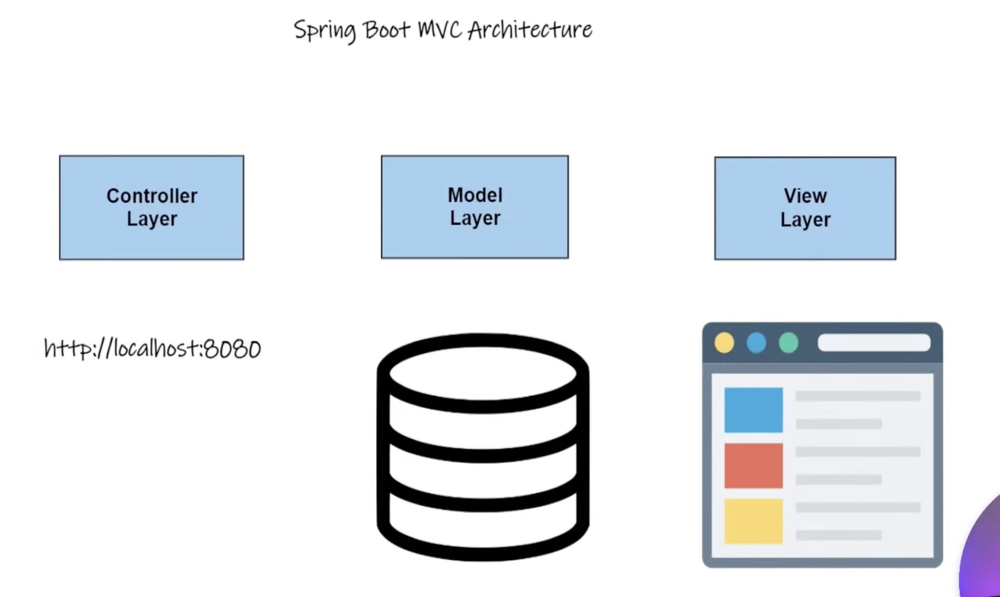
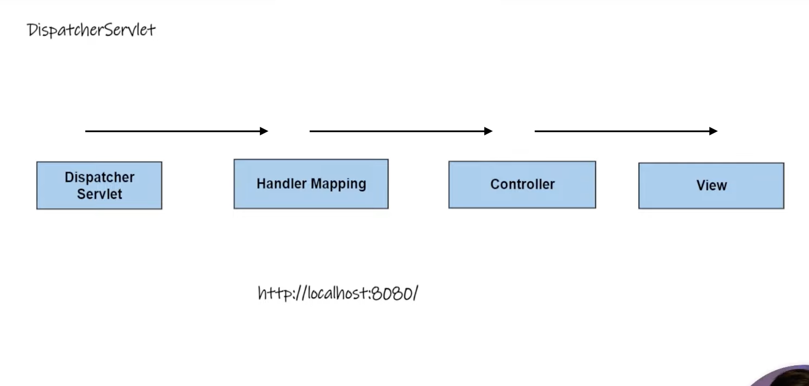

### Understanding Spring MVC in Detail

#### Definition

Spring MVC is an integral part of the Spring Framework designed to simplify the process of developing robust web applications. It achieves this by handling HTTP requests and responses more efficiently, providing a structured model for building web applications through the MVC (Model-View-Controller) pattern. This pattern is not unique to Spring but is a widely used design principle in software development, particularly useful in web application development for separating concerns, thereby making the code more modular, easier to maintain, and scalable.

#### MVC Explained

The MVC architecture divides an application into three interconnected components, each responsible for different aspects of the application's functionality, which helps in separating the internal representations of information from the ways that information is presented to and accepted from the user.

- **Controller**: The Controller acts as an intermediary between the View and the Model. It manages user interactions, interprets the inputs from the View, and then interacts with the Model to perform actions or retrieve data. In Spring MVC, controllers are defined by classes annotated with `@Controller` or `@RestController`, and they handle requests by mapping URLs to specific method calls. These methods then process the requests, prepare a model, and decide which view should be rendered, or return a response directly.

- **Model**: The Model represents the application's data and business logic. It encapsulates the core functionality and data of the application, manages the data, logic, and rules of the application. In Spring MVC, the model is represented by a map to add attributes, which is then passed to the view layer. This model can represent a single data object or a collection of data objects retrieved from the database.

- **View**: The View is responsible for rendering the model data and generating the UI, which is seen by the user. It displays the data from the model to the user and also sends user commands (e.g., button clicks) to the controller. In Spring MVC, the view layer is typically handled by view technologies like JSPs, Thymeleaf, or even templating engines like Freemarker.

### DispatcherServlet and Front Controller Pattern

#### DispatcherServlet

The DispatcherServlet plays a critical role in the Spring MVC framework. It acts as the central dispatcher for HTTP requests, delegating requests to the controllers for processing and ensuring that the appropriate response gets back to the user. When a request comes in, the DispatcherServlet consults a set of configurations (Handler Mappings) to dispatch the request to a specific controller. The DispatcherServlet is highly configurable through the web application context, allowing for sophisticated mappings, view resolution, and exception handling.

#### Front Controller Pattern

The Front Controller pattern is a common design pattern in web application development used by the DispatcherServlet in Spring MVC. This pattern suggests that instead of having multiple input points for requests, you have a single entry point. This centralizes common functionality such as security, routing, and view resolution, ensuring that every request goes through this controlled path.

In the context of Spring MVC, the DispatcherServlet serves as the Front Controller. It intercepts all the requests for the application and then routes them to the appropriate handlers. This setup simplifies the design and development of the web layer by:

- Centralizing request handling, which makes management and processing of requests easier.
- Providing a mechanism for request processing workflows, which can include logging, authorization, validation, and rendering logic.
- Allowing for a clear separation of roles within the application, which aligns well with the MVC architecture, thereby improving modularity and ease of maintenance.

The DispatcherServlet, combined with the MVC architecture, provides a powerful framework for developing web applications, making it easier for developers to focus on the application logic rather than the intricacies of handling HTTP requests and responses.
