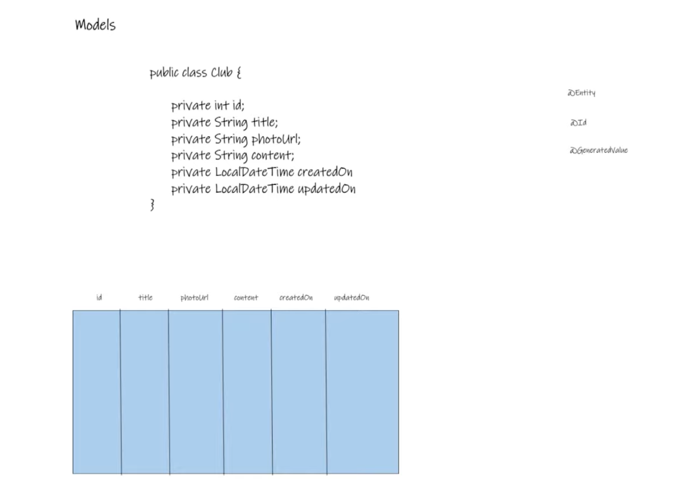
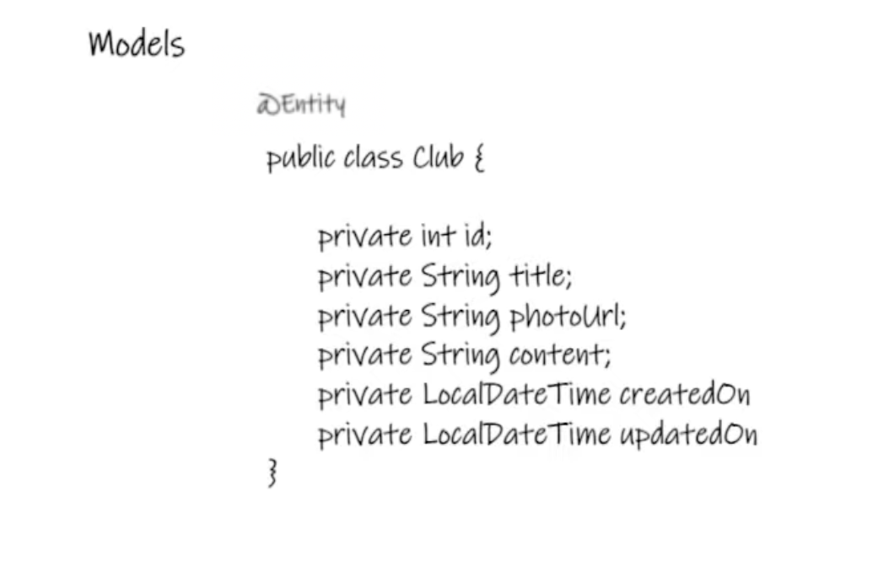
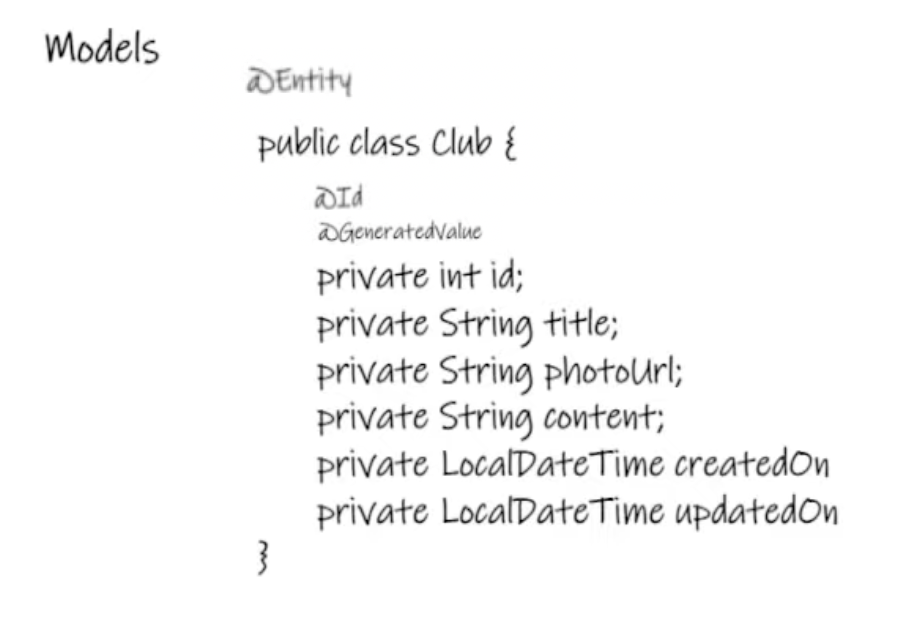
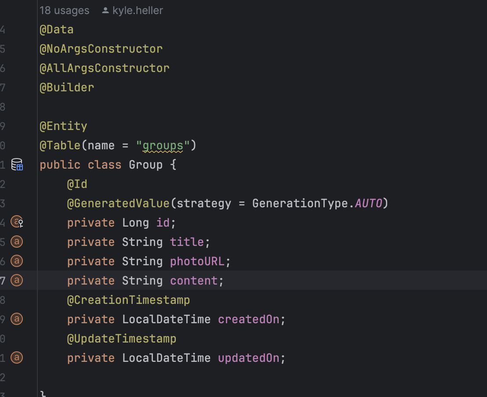

### Detailed Notes on Models in Spring MVC

#### Introduction to Models

- Models are a fundamental aspect of the MVC (Model-View-Controller) architecture in Spring MVC, representing the data layer of an application.
- Essentially, models are Plain Old Java Objects (POJOs) that contain fields corresponding to the data they represent. These objects are the simplest yet most crucial parts of an application, serving as the blueprint for data.

  

#### Models as Database Entities

- When appropriately annotated and configured, these POJO models become more than just classes; they get transformed into database tables by Spring Data.
- Each field within a model corresponds to a column in the database table, allowing for the straightforward mapping of application data to database records.
- The transformation of models into database tables is facilitated by Spring Data JPA (Java Persistence API), which automatically handles the conversion based on the model's structure and annotations.

#### Key Components of a Model

1. **Entity Annotation**: By annotating a model class with `@Entity`, you inform Spring Data JPA that this model should be treated as an entity and, therefore, a corresponding database table should be created for it.

   

2. **ID and GeneratedValue**:

   - The `@Id` annotation marks a field as the primary key of the entity, ensuring each record in the database table can be uniquely identified.
   - The `@GeneratedValue` annotation is used to specify how the primary key should be generated. Typically, it's set to auto-increment, so every new record automatically gets a unique identifier.

     

3. **Data and Constructor Annotations (Lombok)**:

   - Lombok annotations like `@Data`, `@NoArgsConstructor`, and `@AllArgsConstructor` are used to reduce boilerplate code in model classes by automatically generating getters, setters, and constructors.

4. **Timestamp Annotations**:
   - Annotations like `@CreationTimestamp` and `@UpdateTimestamp` are used to automatically manage the creation and update timestamps of entities, ensuring these values are automatically set when an entity is created or updated.

#### Practical Implementation

- The process begins with the organization of models within the project structure, usually by creating a package (a directory) specifically for models.
- A typical model class will include various fields representing the data structure, such as `id`, `title`, `photoUrl`, `content`, and timestamps for creation and updates.
- After defining the model with appropriate fields and annotations, running the application will lead Spring Data JPA to generate the corresponding database table automatically. This process is evident through logs in the console and can be verified by inspecting the database schema.

#### Creating a Database Table from a Model

- Upon the application's execution, Spring Data JPA interprets the annotated model and creates a database table that mirrors the model's structure. This table creation is visible in the integrated development environment (IDE) or database management tool being used.
- The automatic generation of database tables from models streamlines the development process, allowing developers to focus more on the business logic rather than the manual creation and management of database schemas.

#### Conclusion

- Models play a critical role in Spring MVC applications by serving as the data representation layer. Through the use of annotations and Spring Data JPA, these POJOs are seamlessly transformed into database tables, facilitating data management and persistence in web applications.
- Proper understanding and implementation of models are crucial for efficiently handling data within Spring MVC applications, making it easier to manage, retrieve, and store information in a structured and scalable manner.
