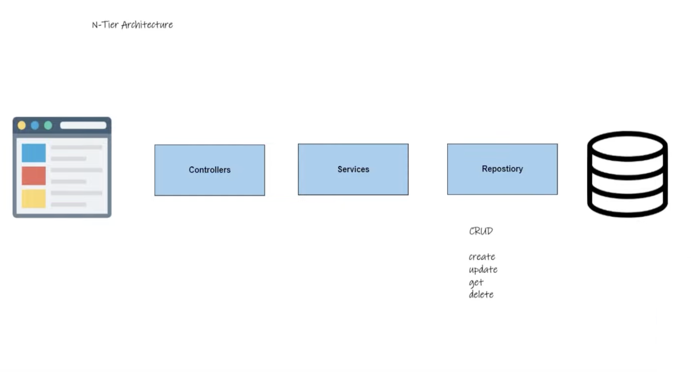
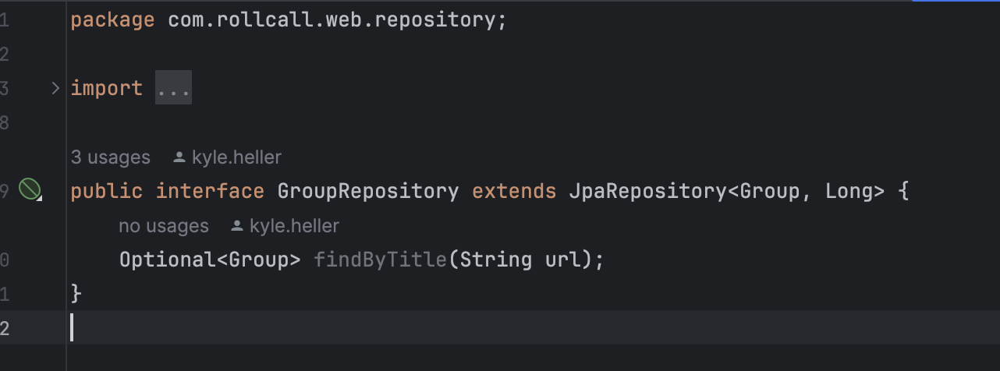
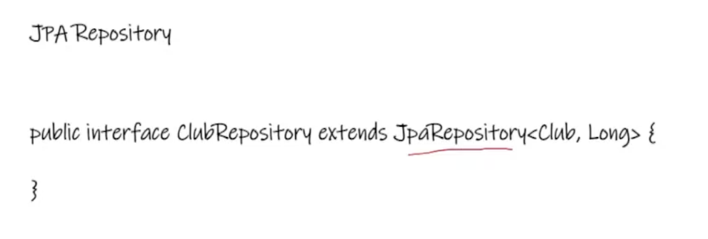
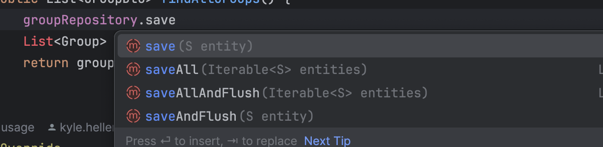
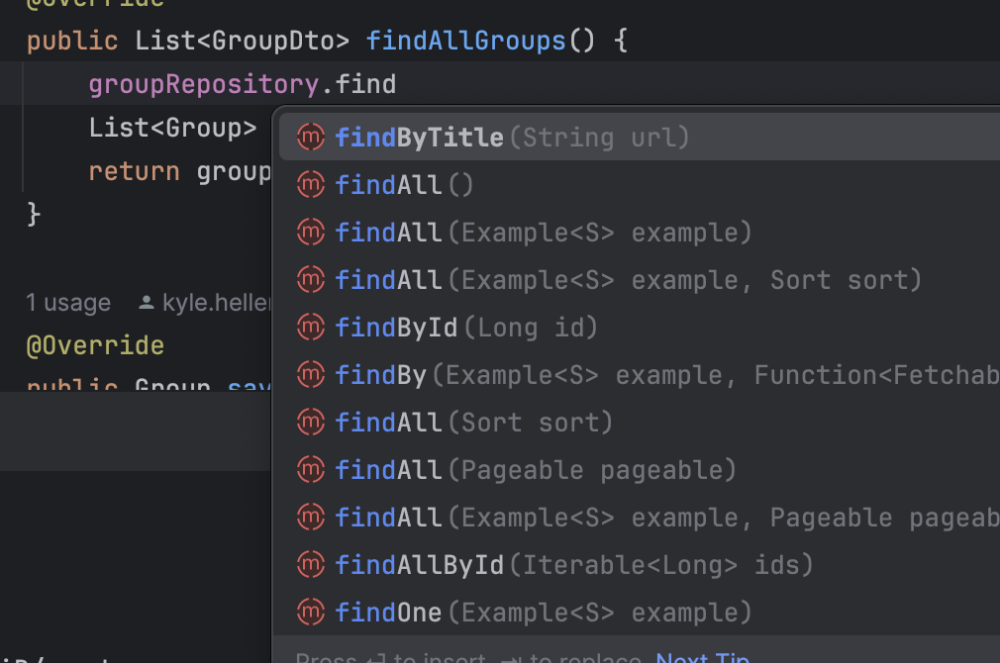
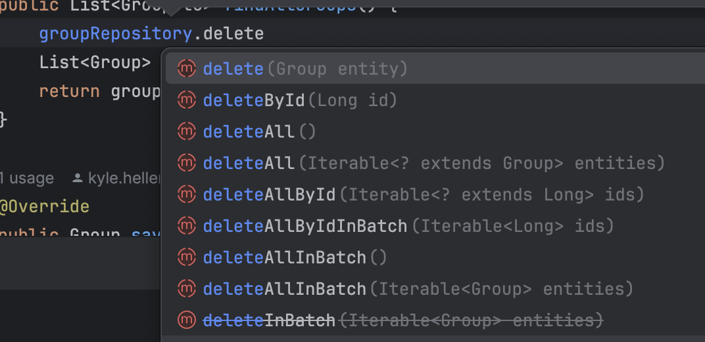
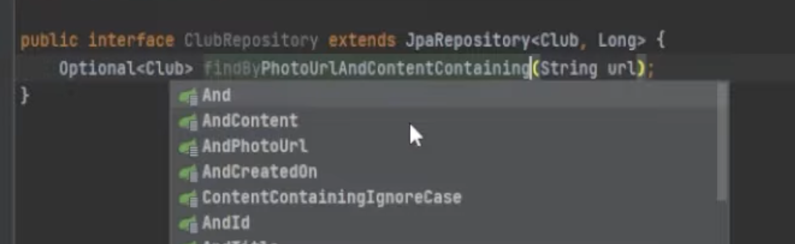
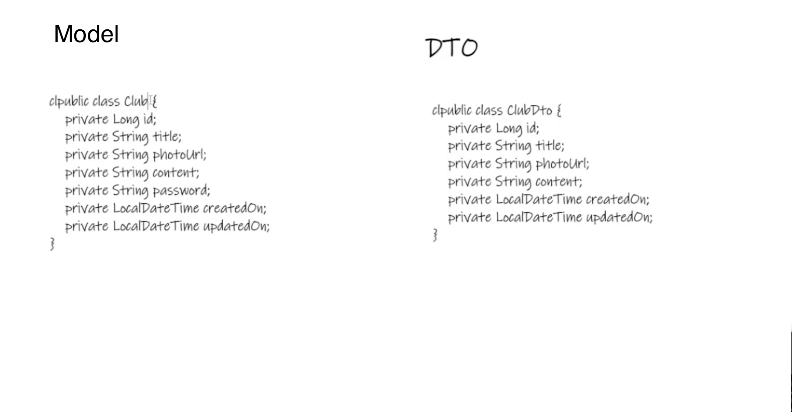

### Understanding Repositories in Spring MVC

#### Introduction to N-Tier Architecture

- In software engineering, the use of design patterns is selective, with a significant emphasis on N-Tier (or multi-tier) architecture for organizing code in a modular way. This architecture facilitates the separation of concerns across different layers of the application, enhancing maintainability and scalability.

#### Repository Pattern

- The repository pattern is central to the N-Tier architecture, playing a pivotal role in data access logic abstraction. It acts as a middleman between the application's business logic and data source, enabling a more decoupled architecture.

#### Purpose of the Repository

- **CRUD Operations**: The core purpose of the repository is to abstract the complexities of performing CRUD (Create, Read, Update, Delete) operations on database tables. It provides a simplified interface for data access and manipulation.
- **Data to Object Transformation**: Repositories are tasked with converting database tables into objects. This transformation is crucial for moving data seamlessly through different layers of the application—from services and controllers to the final presentation on a web page.
- **Simplification of Data Access**: By encapsulating the logic for data retrieval and manipulation, repositories make it easier for the rest of the application to interact with the data source without needing to know the intricacies of the underlying database or ORM (Object-Relational Mapping) framework.

  

#### Implementation in Java

- Java significantly eases the implementation of the repository pattern through the use of interfaces, particularly with Spring Data JPA (Java Persistence API).
- **Spring Data JPA Repositories**: Spring provides a powerful suite of repository interfaces that come equipped with common CRUD methods. This feature drastically reduces the boilerplate code needed for data access operations.

  

  Update will also use save. If the record exists, then it is updates. If however, the record with the id does not exist, then it adds a new record.

  

  

- **Custom Query Methods**: Beyond the standard CRUD operations, Spring Data JPA allows for the definition of custom query methods in repository interfaces. These methods enable the execution of specific queries based on method names, automatically translating method names into SQL queries. For instance, methods like `findByTitle(String title)` or `findByContentContaining(String content)` can be defined to fetch data based on specific criteria, leveraging the repository to handle these operations efficiently.

#### Advantages of Using Repositories

- **Decoupling**: Repositories promote a decoupled architecture, where changes to the database or the business logic layer have minimal impact on each other.
- **Maintainability**: By isolating the data access logic, repositories make the codebase more maintainable and easier to understand.
- **Reusability**: The abstraction provided by repositories means that the same data access logic can be reused across different parts of the application, reducing redundancy and facilitating consistency in data operations.

#### Introduction to Data Transfer Objects (DTOs)

- DTOs play a crucial role in the data flow within an application, especially in scenarios where you do not want to expose the entire domain model to the client or when the data structure sent to the client needs to be different from the database structure.

- **Security and Convenience**: DTOs provide a layer of security by allowing only specific fields to be sent to the client. For instance, sensitive information like passwords can be excluded. They also offer convenience by letting developers tailor the data structure that is sent to or received from the API.
- **Encapsulation and Customization**: DTOs help encapsulate data and provide a mechanism to customize what data should be transferred over the network. This is particularly useful in optimizing network traffic and enhancing the security of the application.

#### Conclusion

The repository pattern and DTOs are foundational concepts in the N-Tier architecture within Spring MVC, offering a structured approach to handling data access, manipulation, and transfer. Repositories abstract CRUD operations and convert database tables into objects for seamless data flow through the application's layers. Meanwhile, DTOs provide a flexible and secure way to transfer selected data between the client and the server. Together, these patterns contribute to a cleaner, more maintainable, and secure codebase.
