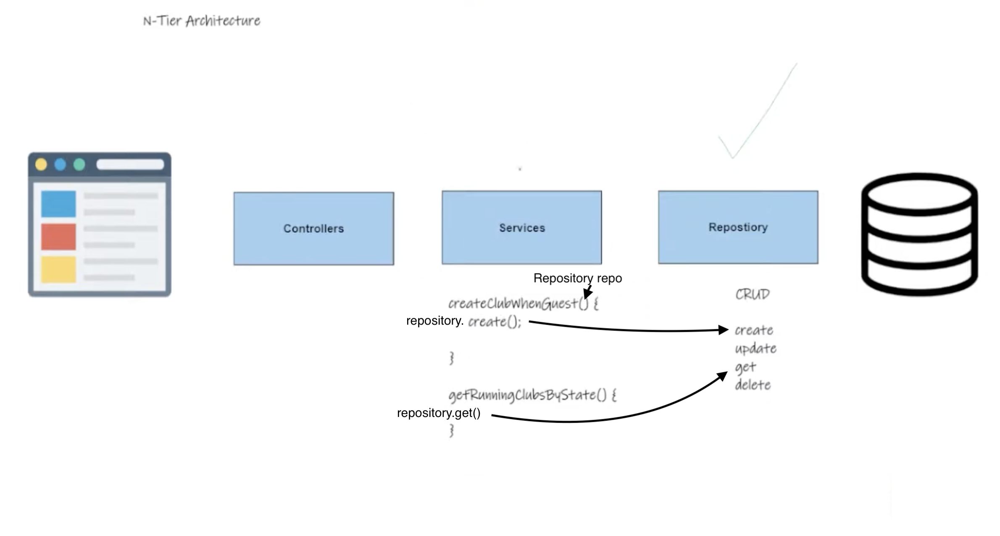

### Understanding Services in Spring MVC

#### Transition from Repositories to Services

After setting up the repository layer, which interacts directly with the database through CRUD operations, the next step in the N-Tier architecture is to develop the service layer. This layer serves as a crucial level of abstraction that orchestrates the application's business logic.

#### Role of the Service Layer

- **Abstraction**: Services abstract the complexity of interactions with repositories, providing a simplified interface for the rest of the application. This means developers can invoke service methods without needing to know the intricate details of the underlying database operations.
- **Business Logic Aggregation**: Service methods often aggregate multiple repository calls and other logic into single, reusable operations. This encapsulation of business logic makes the code cleaner and easier to maintain.

#### Implementing a Service in Spring MVC

- **Interface Creation**: The service layer in Spring MVC is typically implemented using interfaces. This approach enhances decoupling, making the system more modular and testable.
- **Service Implementation**: A concrete class then implements this interface, providing the actual business logic. This pattern allows for multiple implementations if needed, offering flexibility in how services are provided.

#### Example: Club Service

- **Service Interface**: A `ClubService` interface defines the operations related to "clubs" in the application. Initially, it may include simple methods like retrieving all clubs.
- **Service Implementation**: The `ClubServiceImpl` class implements the `ClubService` interface, utilizing the `ClubRepository` to access the database. It contains methods that use repository operations to fulfill specific business requirements, such as finding all clubs.

#### Service Layer and DTOs

- **Data Transformation**: One critical function of the service layer is to convert entities retrieved from the repository into Data Transfer Objects (DTOs). DTOs are tailored to fit the data requirements of the client, ensuring that sensitive or irrelevant information is not exposed.
- **Mapper Implementation**: A mapper transforms entities into DTOs. While automatic mapping tools exist, manually coding these transformations is often preferred for clarity and control, aligning with what developers typically encounter in production environments.

#### Practical Steps for Service Implementation

1. **Create a Service Interface**: Define an interface with the required business operations.
2. **Implement the Service**: Create a class that implements the interface, injecting the necessary repository through the constructor to access the database.
3. **Define Business Methods**: Implement methods that fulfill business requirements, using repository methods to interact with the database.
4. **Transform Entities to DTOs**: Utilize a mapper within service methods to convert entities into DTOs, preparing them for use in the controller layer and ultimately the view.

#### Conclusion

The service layer in Spring MVC plays a pivotal role in encapsulating the application's business logic. By abstracting repository operations and focusing on business requirements, services facilitate a clean separation of concerns. This layer ensures that the controller and view can remain focused on user interaction, relying on services to handle complex logic and data management. As we progress with our Spring MVC tutorial, the importance of well-defined services in building scalable and maintainable web applications becomes increasingly evident.
