### Building Controllers in Spring MVC

After establishing the repository and service layers in our Spring MVC application, the next critical step is constructing the controllers. Controllers are the backbone of the application's web layer, managing HTTP requests and determining how users interact with the application.

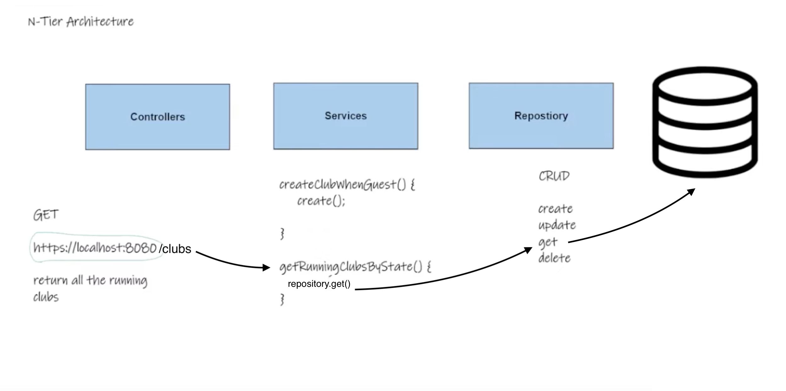

#### Understanding Controllers

- **URL Endpoints Management**: Controllers are responsible for handling URL endpoints, defining which HTTP methods (GET, POST, PUT, DELETE) the application can respond to.
- **HTTP Methods**: The choice of HTTP method is essential, as it reflects the action the application should take. For instance, a GET request is used to retrieve data, while a POST request might be used to create new data.

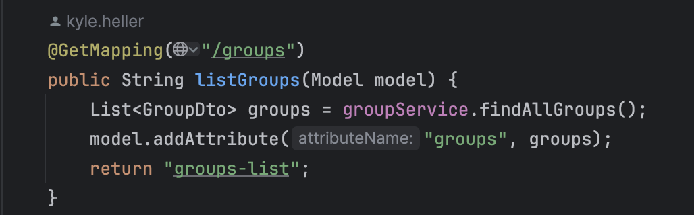

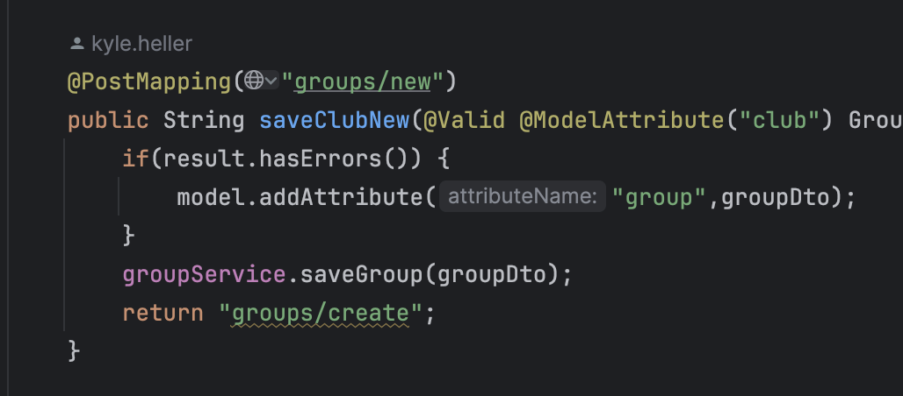

#### Implementing a Club Controller

The goal is to create a controller that manages interactions with the running clubs stored in our application.

1. **Setup**: Begin by creating a new package within your project to organize your controllers. This helps in maintaining a clean project structure.
2. **ClubController Class**: Within this package, create a class named `ClubController`. This class will define methods to handle various requests related to running clubs.

3. **Annotate the Controller**: Use the `@Controller` annotation at the class level to designate it as a controller within the Spring MVC framework. This annotation enables Spring's web capabilities for the class.

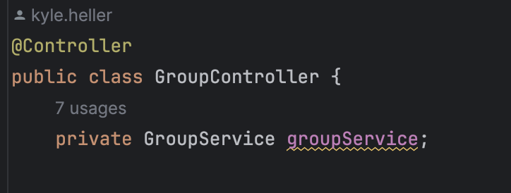

4. **Inject ClubService**: The controller should not contain complex business logic or direct database access. Instead, inject the `ClubService` to use the abstraction layer provided by services. This keeps the controller focused on handling HTTP requests and delegating the business logic to the service layer.

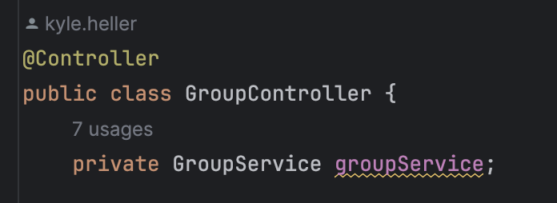

5. **Constructor Injection**: Use constructor injection to inject the `ClubService` into the controller. Although the `@Autowired` annotation is optional in recent Spring versions, it's good practice to include it for clarity.

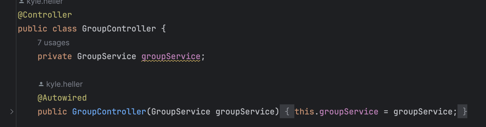

6. **Define Endpoint Methods**: Define methods within the controller to handle specific endpoints. For example, a method annotated with `@GetMapping("/clubs")` might retrieve and display all running clubs.

7. **Model and View**: When retrieving data to display, use the `Model` parameter in your endpoint methods to add attributes. These attributes are then accessible in the views. Return a view name from the method to direct Spring MVC to the appropriate template.
   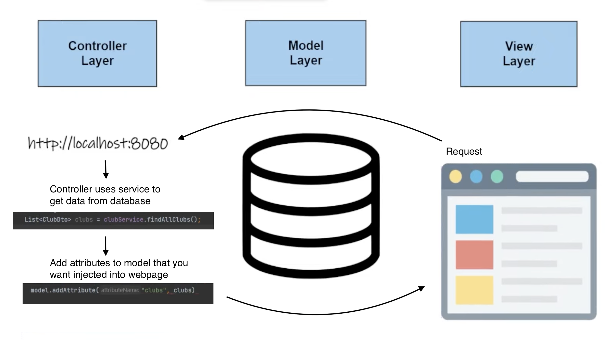

   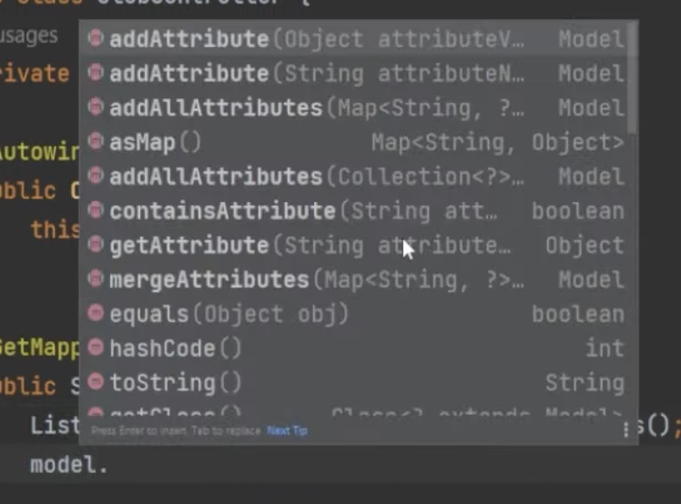

   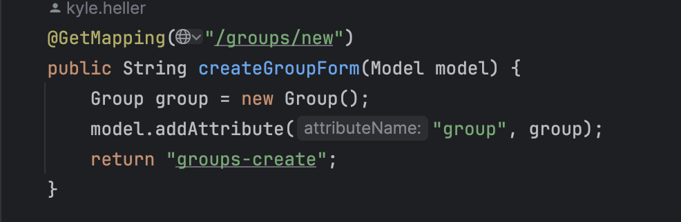

#### Creating the View

- **Template Files**: Ensure that you have a corresponding HTML template file for each view name returned by the controller methods. These should be located in the `src/main/resources/templates` directory.

  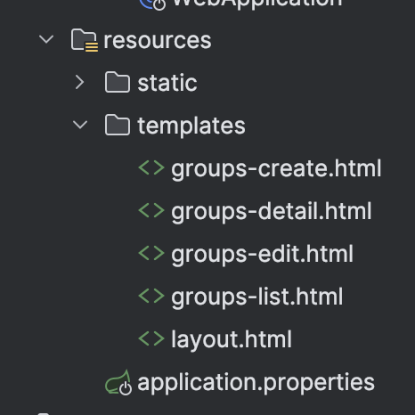

- **Thymeleaf Integration**: Utilize Thymeleaf, Spring MVC's preferred templating engine, to dynamically render data in your HTML files. Thymeleaf expressions (`th:text`, `th:each`, etc.) allow you to iterate over collections, display data, and construct URLs dynamically.

#### Static Content and Bootstrap

- **Static Resources**: Place static resources (CSS, JS, images) in the `src/main/resources/static` directory. Spring MVC automatically serves content from this directory as static web resources.

  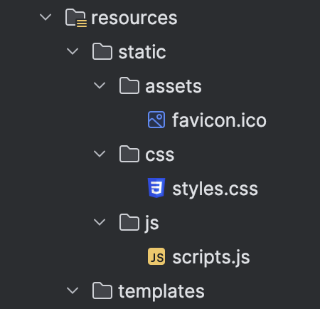

- **Bootstrap Template**: To improve the UI, consider integrating a Bootstrap template. Download a free template or use a CDN to include Bootstrap in your project. Adjust your HTML templates to utilize Bootstrap classes and components for styling.

#### Displaying Data

- **List All Clubs**: Implement a method in your controller to retrieve all clubs using the service layer, add them to the model, and return a view name corresponding to an HTML template that lists the clubs.
- **Thymeleaf for Loops**: Use Thymeleaf's `th:each` to iterate over the list of clubs in your HTML template, displaying each club's details.

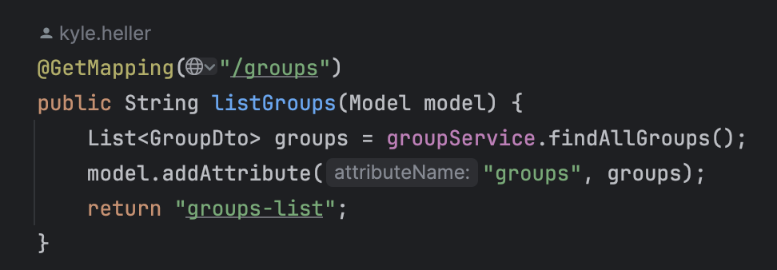

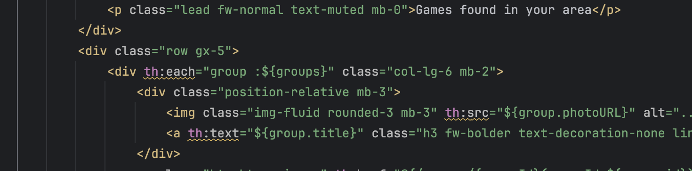

#### Testing and Debugging

- After implementing the controller and view, start the application and navigate to the configured endpoint (e.g., `/clubs`) to ensure that the list of running clubs is displayed correctly. Use the browser's developer tools and the application logs to troubleshoot any issues.

#### Conclusion

Controllers are a vital part of the Spring MVC application, serving as the entry point for HTTP requests. By correctly implementing controllers, services, and repositories, and leveraging Thymeleaf for views, you can effectively manage data flow within your application, creating a responsive and functional web interface.
