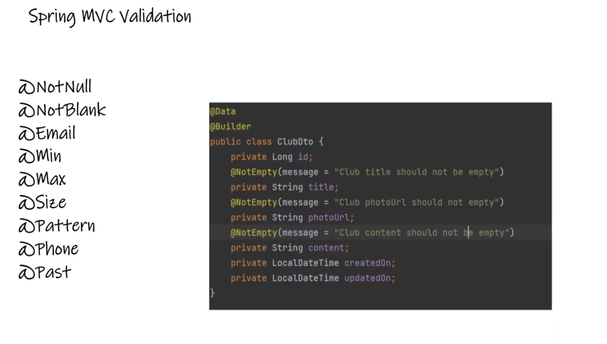
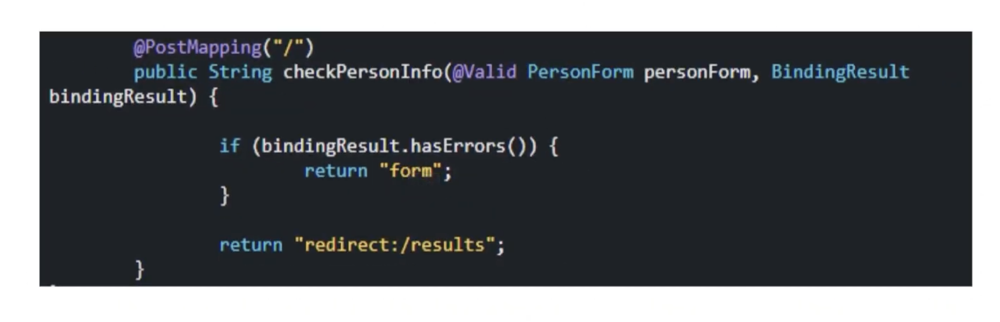
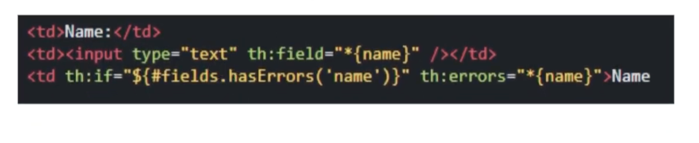
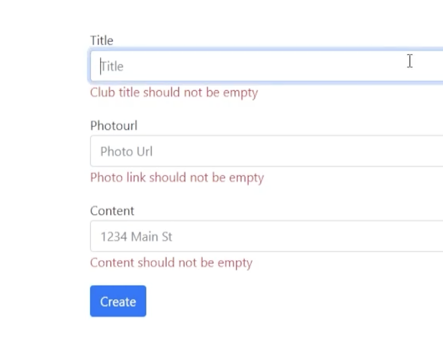

### Implementing Validation in Spring MVC

Validation in Spring MVC ensures that the data submitted by users meets specific criteria before it's processed by the application. This feature is crucial for maintaining data integrity and providing feedback to users about input errors. Spring MVC simplifies validation by offering a range of annotations and mechanisms to validate form data seamlessly.



#### Step 1: Set Up Validation Dependency
First, include the Spring Boot starter validation dependency in your `pom.xml` file to access the validation annotations and functionalities provided by Spring MVC.

```xml
<dependency>
    <groupId>org.springframework.boot</groupId>
    <artifactId>spring-boot-starter-validation</artifactId>
</dependency>
```

#### Step 2: Annotate DTOs for Validation
Data Transfer Objects (DTOs) are ideal for applying validation rules. Annotations are placed directly on the fields of the DTO to specify the validation constraints.

- **@NotEmpty**: Ensures a field is not empty.
- **@Email**: Validates that a field conforms to email format.
- **@Min**/**@Max**: Validates numerical values fall within a specific range.

```java
public class ClubDto {
    
    @NotEmpty(message = "Club title should not be empty")
    private String title;

    @NotEmpty(message = "Photo link should not be empty")
    private String photoUrl;

    @NotEmpty(message = "Content should not be empty")
    private String content;
    
    // Getters and setters
}
```


#### Step 3: Validate in Controller Methods
In your controller, use the `@Valid` annotation on the method parameter to trigger validation of the submitted DTO. Also, include a `BindingResult` parameter immediately after the validated parameter to check for validation errors.



```java
@PostMapping("/clubs/new")
public String saveClub(@Valid @ModelAttribute("club") ClubDto clubDto, BindingResult result, Model model) {
    if (result.hasErrors()) {
        model.addAttribute("club", clubDto);
        return "clubs/create";
    }
    clubService.save(clubDto);
    return "redirect:/clubs";
}
```

#### Step 4: Display Validation Errors in Views
Use Thymeleaf to display validation errors in the form view. Utilize `th:errors` to show specific field errors and `th:if` to conditionally display error messages.

```html
<form th:action="@{/clubs/new}" th:object="${club}" method="post">
    <input type="text" th:field="*{title}" />
    <div th:if="${#fields.hasErrors('title')}" th:errors="*{title}" class="validation-error"></div>

    <!-- Additional fields -->

    <button type="submit">Submit</button>
</form>
```





#### Conclusion
Validation in Spring MVC is a powerful feature that helps ensure data accuracy and integrity while providing immediate feedback to users. By following the above steps, developers can implement robust validation mechanisms in their Spring MVC applications, improving the overall quality and usability of web forms. Always test your validation logic thoroughly to ensure a smooth user experience.