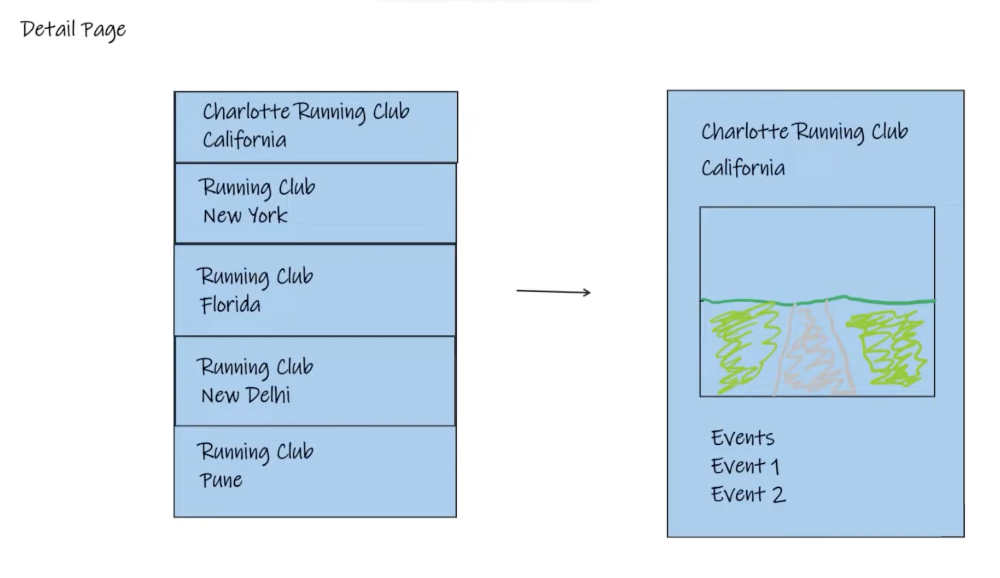

### Implementing the Detail Page in Spring MVC: The List-Detail Pattern

The list-detail pattern is prevalent in web applications, providing users with an overview of items and the ability to view more detailed information about a specific item. Implementing this pattern in Spring MVC involves creating a detail view for entities such as running clubs, and linking to these details from a list view.



#### Creating the Detail View

**1. Define a GET Endpoint for the Detail View**

Start by creating a GET mapping in your controller to handle requests to the detail page of an entity, such as a running club. Use a `@PathVariable` to capture the entity's ID from the URL.

```java
@GetMapping("/clubs/{id}")
public String clubDetail(@PathVariable("id") Long id, Model model) {
    ClubDto clubDto = clubService.findClubById(id);
    model.addAttribute("club", clubDto);
    return "clubs_detail";
}
```

**2. Service Layer**

Ensure there's a method in your service layer to fetch the specific club by its ID. This method should interact with the repository to retrieve the club entity and convert it to a DTO if necessary.

```java
public ClubDto findClubById(Long id) {
    return clubRepository.findById(id)
            .map(this::convertToDto)
            .orElseThrow(() -> new EntityNotFoundException("Club not found"));
}
```

**3. Detail View Template**

Create a Thymeleaf template (e.g., `clubs_detail.html`) for the detail view. This template should display the detailed information of the club, utilizing Thymeleaf expressions to bind data from the `club` model attribute.

#### Linking to the Detail View from the List

In your list view, where you display an overview of all clubs, include links to the detail page of each club. Utilize Thymeleaf to dynamically create these links based on the club's ID.

```html
<a th:href="@{/clubs/{id}(id=${club.id})}" th:text="${club.name}">Club Name</a>
```

#### Enhancing the Detail Page

- **Navigation Links**: Include navigation links in your layout for a cohesive user experience. Ensure that links to home, clubs list, and other sections of your application are correctly set up with `th:href` attributes.

- **Dynamic Content**: Populate the detail page with dynamic content from your club DTO. This includes the club's name, description, photo, and any associated events.

- **Styling**: Apply CSS styling to your detail page to match the overall look and feel of your application. Use Bootstrap or another CSS framework to help style the page efficiently.

#### Testing

After implementing the detail page and linking to it from the list view:

1. Start your Spring MVC application.
2. Navigate to the list view and click on a club to go to its detail page.
3. Verify that the detail page displays all the correct information.
4. Check that navigation links work as expected, ensuring users can easily move between different parts of the application.

#### Conclusion

Implementing the list-detail pattern in Spring MVC enhances the user experience by allowing detailed exploration of items listed on a summary page. By following the steps outlined above, developers can add this pattern to their Spring MVC applications, providing a detailed view of entities such as running clubs, products, or articles.