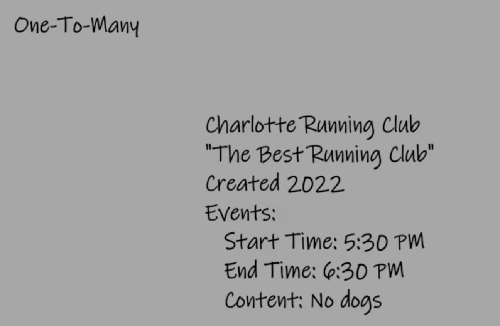
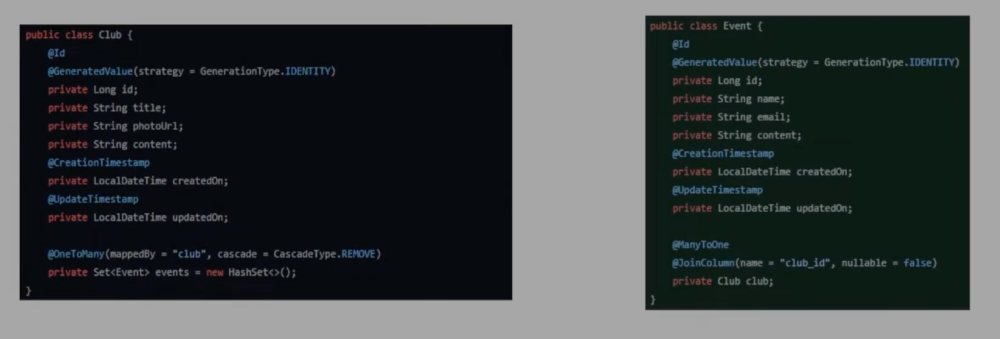

### Implementing One-to-Many Relationships and Adding Events to Running Clubs in Spring MVC

In this tutorial, we're expanding a Spring MVC application for managing running clubs by introducing event management functionality. This involves establishing a one-to-many relationship between running clubs (as the parent) and events (as the child entities), enabling clubs to have multiple associated events.



#### Steps to Implement Events Functionality

**1. Creating the Event Model:**

First, define an `Event` entity to represent the events associated with running clubs. This model should include fields like `name`, `startTime`, `endTime`, `eventType`, and a `photoUrl` for the event's image. Use Lombok annotations (`@Data`, `@NoArgsConstructor`, `@AllArgsConstructor`, `@Builder`) for boilerplate code reduction and `@Entity` for JPA integration.




```java
@Entity
@Data
@NoArgsConstructor
@AllArgsConstructor
@Builder
public class Event {
    @Id
    @GeneratedValue(strategy = GenerationType.IDENTITY)
    private Long id;
    private String name;
    private LocalDateTime startTime;
    private LocalDateTime endTime;
    private String type;
    private String photoUrl;
    
    // Relation to Club
    @ManyToOne
    @JoinColumn(name = "club_id", nullable = false)
    private Club club;
}
```

**2. Establishing the One-to-Many Relationship:**

On the `Club` entity, define a one-to-many relationship to `Event` using the `@OneToMany` annotation. Utilize `mappedBy` to point to the `club` field in the `Event` entity, and set a cascade type to manage the lifecycle of the child entities in relation to their parent.

```java
@Entity
public class Club {
    // Club fields...

    @OneToMany(mappedBy = "club", cascade = CascadeType.ALL, orphanRemoval = true)
    private Set<Event> events = new HashSet<>();
}
```

**3. Event Repository Interface:**

Create an `EventRepository` interface extending `JpaRepository<Event, Long>`. This provides CRUD operations for the `Event` entity without needing explicit implementation.

```java
public interface EventRepository extends JpaRepository<Event, Long> {
}
```

**4. Event DTO (Data Transfer Object):**

For data transfer between the application and its users, define an `EventDto` class. This DTO should mirror the `Event` entity but can exclude or add fields based on the API's exposure requirements.

```java
@Data
@NoArgsConstructor
@AllArgsConstructor
@Builder
public class EventDto {
    private Long id;
    private String name;
    private LocalDateTime startTime;
    private LocalDateTime endTime;
    private String type;
    private String photoUrl;
}
```

**5. Implementing Create Functionality for Events:**

Before displaying events, a functionality to create them is necessary. This involves defining controller endpoints to handle event creation forms, service layer methods to process the business logic, and repository interactions to persist the events.

#### Summary

By establishing a one-to-many relationship between clubs and events, the application can now support multiple events per running club, each with its own set of details. This expansion not only enhances the application's functionality but also demonstrates the power of Spring MVC and JPA in managing complex data relationships. The next tutorial will focus on creating endpoints and views to manage these events effectively.