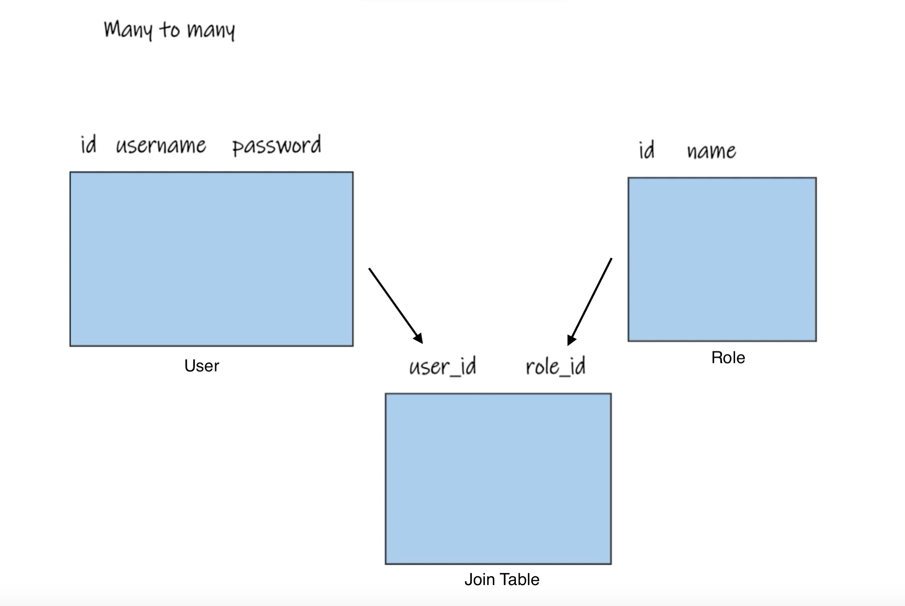
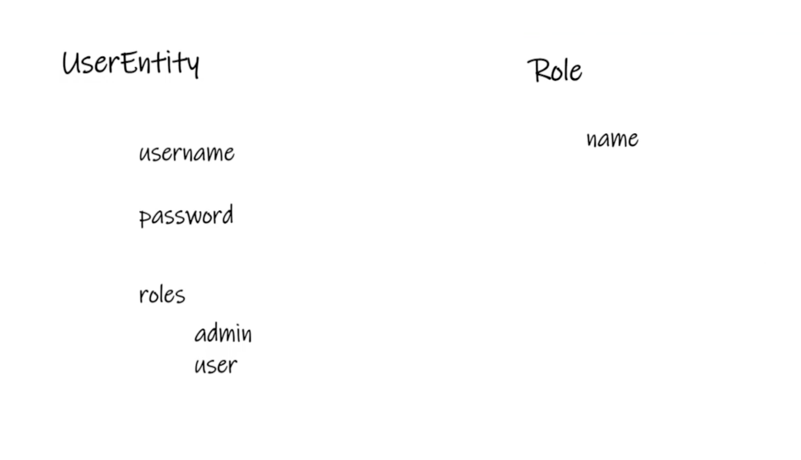

### Implementing Spring Security in MVC: User and Role Entities

#### Overview
Introducing Spring Security into the Running Club application entails the creation of User and Role entities to facilitate authentication and authorization. This process involves establishing a many-to-many relationship between these entities, leveraging Spring Data JPA for automatic join table generation.

#### Entities Overview
- **User Entity**: Represents the application's users, storing credentials and associated roles. To avoid naming conflicts with Java's default User class, it is named `UserEntity`.
- **Role Entity**: Defines various roles within the application, such as admin and user roles, allowing for differentiated access controls.

#### Many-to-Many Relationship
A many-to-many relationship is necessary due to the dynamic association between users and roles; a user can possess multiple roles, and a role can be assigned to multiple users. This relationship is realized through a join table, automatically generated by Spring Data JPA, without direct developer intervention.

#### Implementation Steps

1. **UserEntity Creation**:
    - Annotated with `@Entity` and named `users` to distinguish from Java's User class.
    - Includes basic attributes such as username, email, and password.
    - Utilizes a `@ManyToMany` relationship with fetch type set to `EAGER` to ensure roles are always loaded with the user.

2. **Role Entity Creation**:
    - Similar to UserEntity but with a simpler structure, mainly consisting of a role name.
    - Also marked with `@Entity` for persistence.

3. **Join Table Configuration**:
    - In the UserEntity, the `@JoinTable` annotation specifies the join column (user_id), inverse join column (role_id), and the table name (user_roles), facilitating the many-to-many relationship mapping.

4. **Repository and Service Layer**:
    - Both entities are supported by corresponding repositories, extending `JpaRepository`, to enable CRUD operations.
    - Service layers abstract the business logic, interacting with repositories to manage entities.

5. **Testing Entity Relations**:
    - Upon application startup, the presence of correctly configured entities and their relationship is verified by the successful generation of the user, role, and join tables in the database.
    - The roles table is populated with initial roles (e.g., admin, user) to establish the foundation for access control.

#### Conclusion
The introduction of User and Role entities with a many-to-many relationship is a critical step in implementing Spring Security. This setup not only allows for effective authentication and authorization within the Running Club application but also exemplifies the application of the Single Responsibility Principle by clearly separating concerns between user management and role-based access control. The automated handling of the join table by Spring Data JPA simplifies the complexity traditionally associated with many-to-many relationships, showcasing the power and efficiency of using Spring Framework in application development.