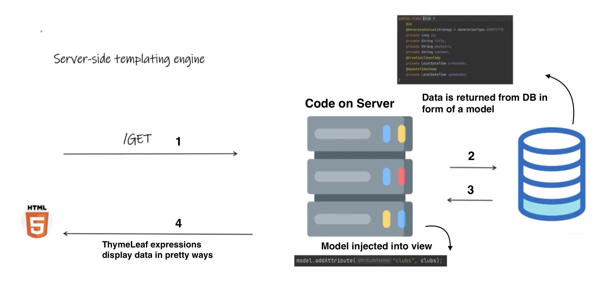
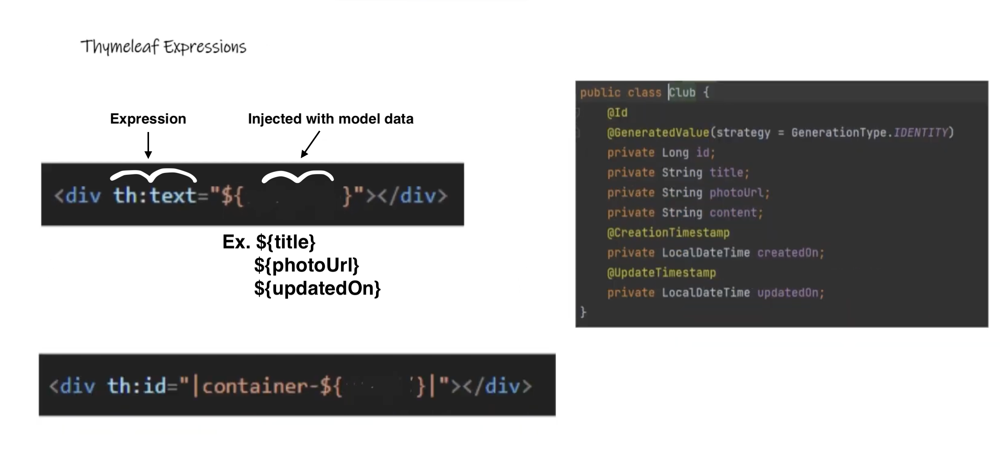
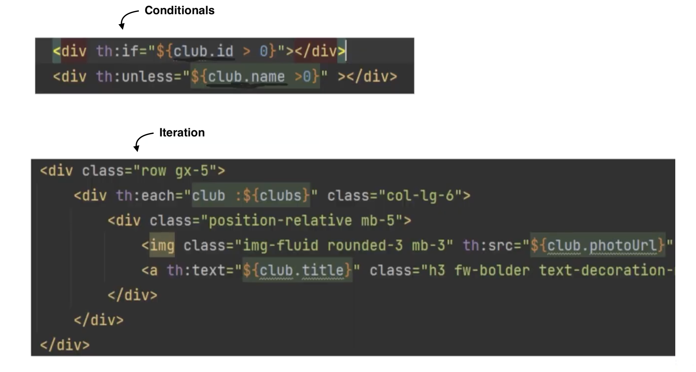
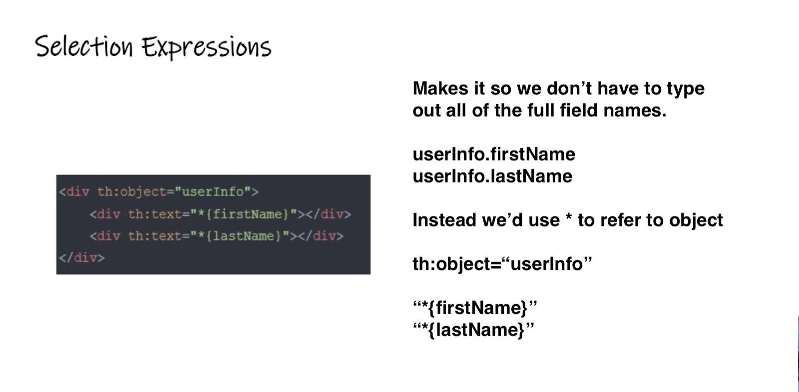
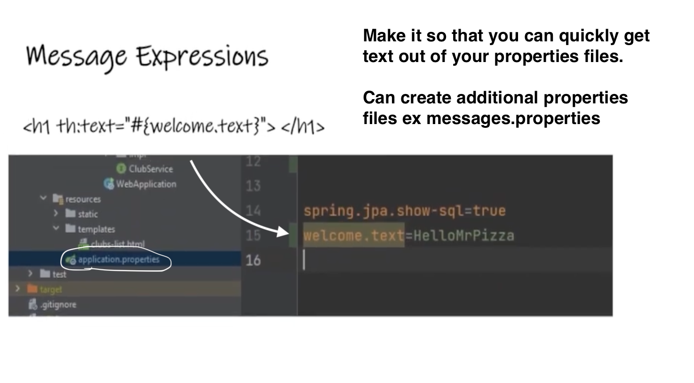
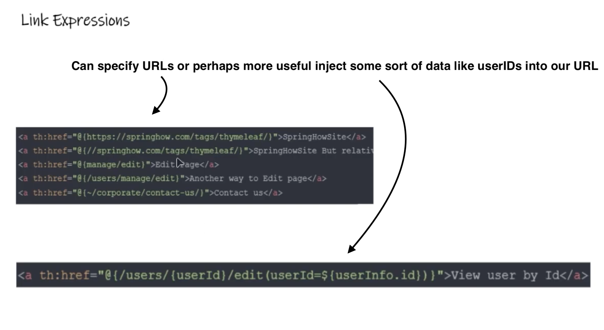
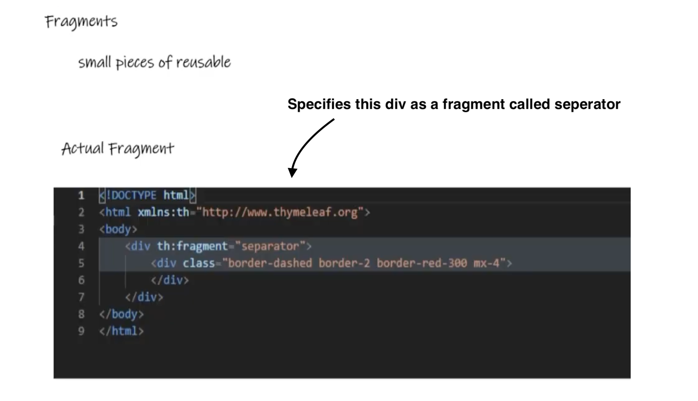
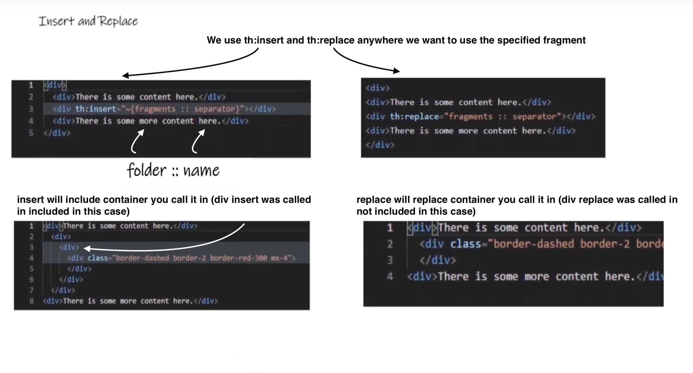

**Notes: Overview of Thymeleaf and its Integration with Spring Boot**

- **Introduction to Thymeleaf**:

  - Thymeleaf is a server-side templating engine.
  - Used with Spring Boot for server-side rendering of HTML pages.

- **Request Flow**:

  - User sends a GET request to the server.
  - Server interacts with code and fetches data from the database.
  - Data is returned in the form of a model.
  - Data is injected into the view (HTML).
  - User interacts with the HTML page containing the data.

  

- **Thymeleaf Expressions**:

  - Used to display data in HTML templates.
  - Denoted by "th" followed by a semicolon and text.

  

  - Includes properties like title, ID, etc.
  - Supports conditional logic and loops (for loops).

  

- **Selection Expressions**:

  - Simplify form field referencing.
  - Avoids typing out full field names.
  - Uses a star (\*) to reference fields.

  

- **Message Expressions**:

  - Retrieves text from application properties files.
  - Facilitates quick retrieval of text for display.

  

- **Link Expressions**:

  - Used for creating URLs.
  - Allows for dynamic URL generation.

  

- **Fragments**:

  - Facilitate code reuse in software development.
  - Defined with "th:fragment" tag.

  

  - Inserted or replaced using "th:insert" or "th:replace" directives.
  - Difference between insert and replace: insert retains the surrounding HTML element, while replace removes it.

  

- **Conclusion**:

  - Thymeleaf enhances server-side rendering capabilities in Spring Boot applications.
  - Encourages code reuse and simplifies HTML template development.

- **Credits**:
  Credit to teddysmithdev for his excellent youtube video
  https://www.youtube.com/watch?v=8miKAvf9UaI&list=PL82C6-O4XrHejlASdecIsroNEbZFYo_X1
